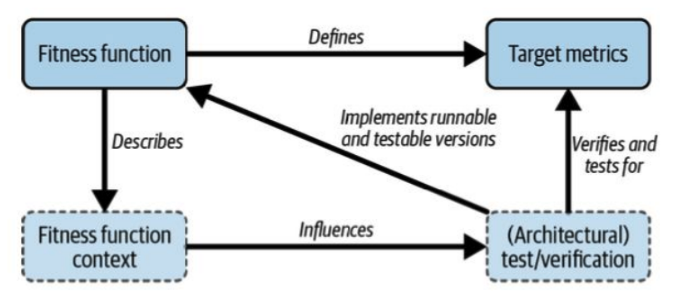

## Architecture
	- Postgres has a cheap queueing mechanism (`FOR UPDATE SKIP LOCK`)
	- ### Modular Monolith
	  collapsed:: true
		- Modular Monolith is a middle ground between Monoliths and Micro services. Separating domains but not going full microservice yet
		- Java Stack
			- Java 9 Package Module System ([JPMS](https://www.oracle.com/corporate/features/understanding-java-9-modules.html)) - uses `module-info.java`
			- [Spring Modulith](https://spring.io/projects/spring-modulith) - helps define application modules within a project
				- uses ArchUnit under the hood
				- [In-memory events](https://docs.spring.io/spring-modulith/docs/0.1.0-M1/reference/html/#events) across modules
				- [Moments - Passage of time events](https://docs.spring.io/spring-modulith/docs/0.1.0-M1/reference/html/#moments) - this implements a pattern to decouple cronjob and scheduled command based on this [blog](https://verraes.net/2019/05/patterns-for-decoupling-distsys-passage-of-time-event/) - separating "what" needs to happen and "when" it needs to happen. This pattern introduces the thinking of passage of time as domain events. Interested services can listen and react to it.
				- Automatically generate [C4 architecture diagrams](https://docs.spring.io/spring-modulith/docs/0.1.0-M1/reference/html/#documentation)
		- Python Stack
			- Python has a tool called [Poetry](https://python-poetry.org/) to enforce modularity
		- JS/TS Stack
			- [ts-stack](https://github.com/ts-arch/ts-arch) is like the ArchUnit for JS/TS stack
	- ### Measuring Architecture
	  collapsed:: true
		- Measure if it is worth migrating every app from Java 11 to 17
			- Default GC changed in 17 causing continuous pod restarts
		- Architecture characteristics (or NFRs) are infinite. You can come up with your own. e.g., ThoughtWork's Scotlandability
		- Business folks say "What the app should do?". Architects say "How good it should do?" (NFRs).
		- Agility is a composite architecture characteristic - synonymous to Velocity. `Agility = Deployability + Testability + Modularity`
		- **Instability vs. Abstractness**
			- https://www.odrotbohm.de/2024/09/the-instability-abstractness-relationsship-an-alternative-view/
			- **Instability** measures coupling.
				- $$Instability = \frac{C_e}{C_e + C_a}$$
				- where $C_e$ is Efferent coupling (outgoing dependencies), $C_a$ is Afferent coupling
					- `Instability = 0` means the component is Independent (no outgoing dependencies) but Responsible (all other components depend on it)
					- `Instability = 1` means the component is Dependent but Irresponsible
			- **Abstractness**
				- $$Abstractness = \frac{N_a}{N_a + N_c}$$
				- where $N_a$ is abstract component, $N_c$ is concrete implementation
					- `Abstractness = 0` means only concrete implementations present in the application
					- `Abstractness = 1` means only abstract implementations present in the application
				- More abstract something is, less volatile it should be. For example, any Domain is volatile. Code or Architecture is less volatile
				- Uncle Bob's "[Distance from main sequence line](https://oooops.dev/2021/02/21/visualising-distance-from-the-main-sequence-and-other-clean-architecture-metrics-in-java/)"
					- 
		- **Metrics**
			- background-color:: red
			  > When a measure becomes a target, it ceases to be a good measure - Charles Goodhart
			  $Target != Metric$
			- DIT - [Depth of Inheritance tree](https://learn.microsoft.com/en-us/visualstudio/code-quality/code-metrics-depth-of-inheritance?view=vs-2022)
			- [IntelliJ Metrics Tree](https://plugins.jetbrains.com/plugin/13959-metricstree) tool to measure code quality
			- DORA Metrics
				- Lead time = code merge to prod go-live (how to instrument?)
			- SonarQube
				- Removed cohesion metric (LCOM4) since it does not make sense anymore. e.g., A util class may have many methods that are not related at all leading to low cohesion score.
			- Fitness functions are about measuring metrics, NOT gating
				- 
				- Digital App Scorecard - single rating
					- Embed as part of CI pipeline with the instrumentation
					- Scorecard includes trend line - be aware of the weightage. e.g., Google changes the algorithm dropping small companies from the top of the search results
				- Survey metrics
					- Delta Airlines survey example with a single question: "*If you run a company, would you hire the person you spoke to in your customer service department?*"
					  background-color:: red
- ## AI
	- #[[Generative AI]]
		- Numpy uses "C" language behind the scenes for performance
			- [NumPy broadcasting](https://numpy.org/doc/stable/user/basics.broadcasting.html#module-numpy.doc.broadcasting)
		- N-gram - Compound words like "New York", "United States of America"
		- Vision - Each pixel is a 4D vector. [RGBA](https://en.wikipedia.org/wiki/RGBA_color_model) model - R, G, B colors and Alpha channel to represent the transparency of the pixel
		-
- ## Tools
	- Open ReWrite
		- OpenSource tool to migrate Java, Spring, etc.
		- https://docs.openrewrite.org/
		- https://github.com/openrewrite/rewrite
- ## Blogs
	- [DDD and Messaging Architecture Patterns](https://verraes.net/2019/05/ddd-msg-arch/)
	- Vector DB - [SingleStore](https://www.singlestore.com/blog/)
	-
- ## Books
	- Just Enough Software Architecture - George Fairbanks
	- Leadership books by Peter Drucker
- ## Whitepapers
	- [Retrieval-Augmented Generation for Large Language Models: A Survey](https://arxiv.org/pdf/2312.10997)