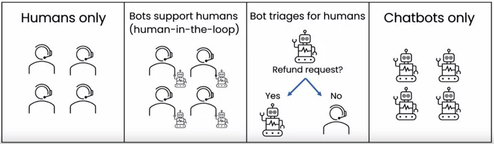

# Overview
background-color:: yellow
	- Definition: Any technique that allows computers to bring meaning to data in similar ways to a human.
	- **Types**
		- **Artificial Special Intelligence**:
			- AI focused on specific problem domains - e.g., natural language processing, computer vision, etc.
			- Also commonly referred to as "**Weak AI**".
		- **[Artificial General Intelligence](https://en.wikipedia.org/wiki/Artificial_general_intelligence)**:
			- having a machine perform any task a human could.
			- Also commonly referred to as "**Strong AI**")
	- Avoiding [*AI Winter*](https://en.wikipedia.org/wiki/AI_winter)
-
- # Chatbots
  background-color:: green
	- ## Learning Resources
		- Build your own chatbot https://apps.cognitiveclass.ai/learning/course/course-v1:IBMDeveloperSkillsNetwork+CB0101EN+v1/home
	- Spectrum of support systems
		- Humans only
		- Bots support humans - where humans evaluate the and accept or decline the responses from the bot.
		- Bot triages for humans - here bots respond to simple questions and triage the harder ones to humans. e.g., refund requests
		- Chatbots only
		- 
	- Advice for deploying chatbots
		- Start with an internal-facing chatbot
			- work with staff to assess behavior of chatbot
			- avoid public mistakes
		- Deploy with human-in-the-loop to check for mistakes
		- Only after deemed safe, allow bot to communicate directly with customers
- # References
	- O'Reilly What are ChatGPT and Its Friends?
	- {:height 414, :width 245}