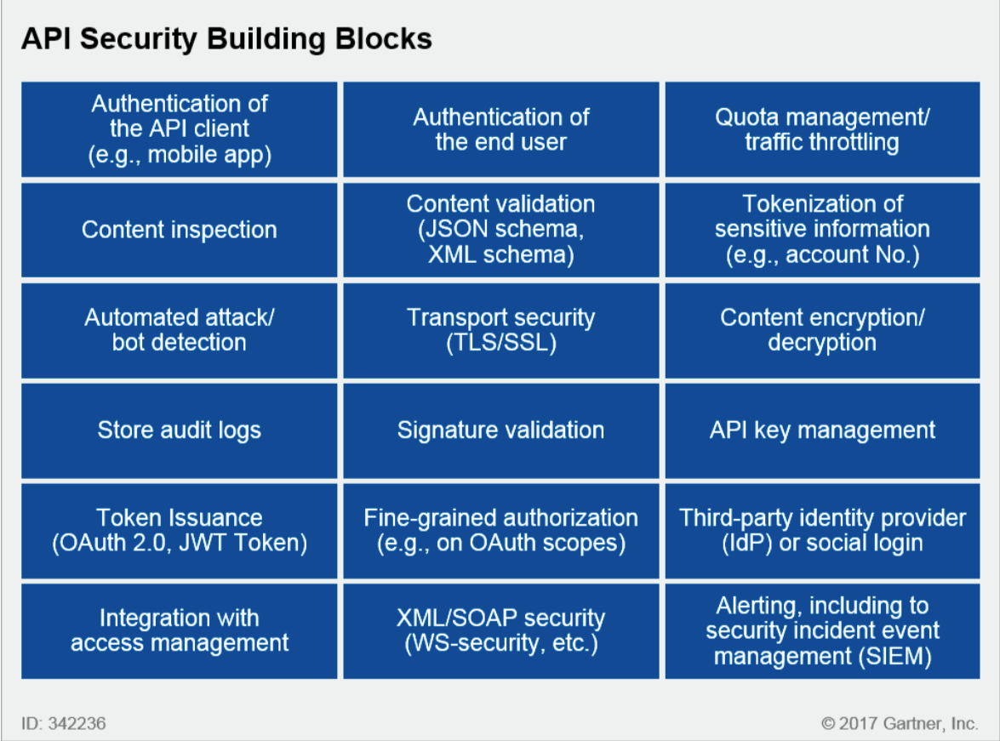
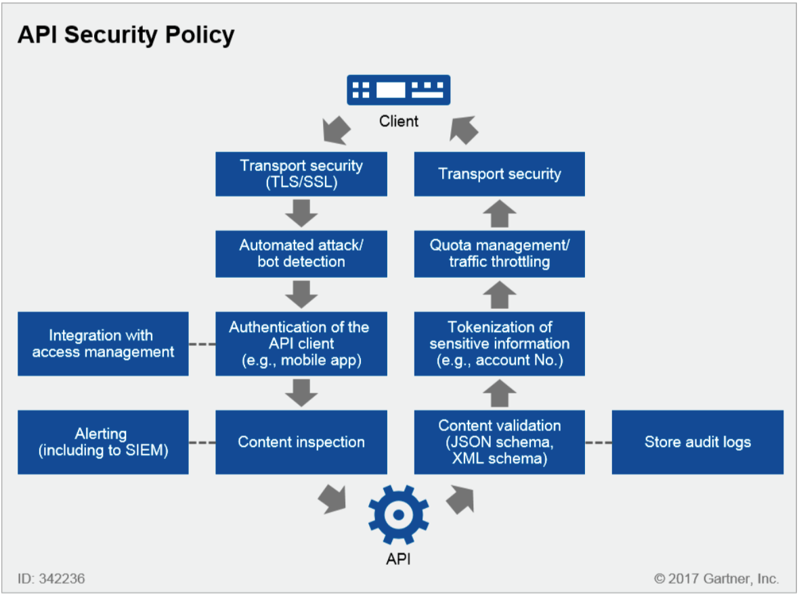
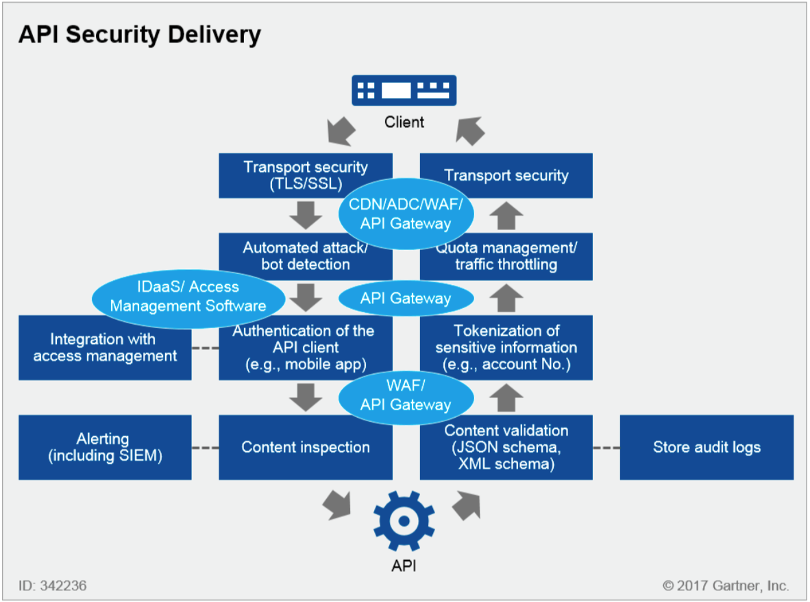
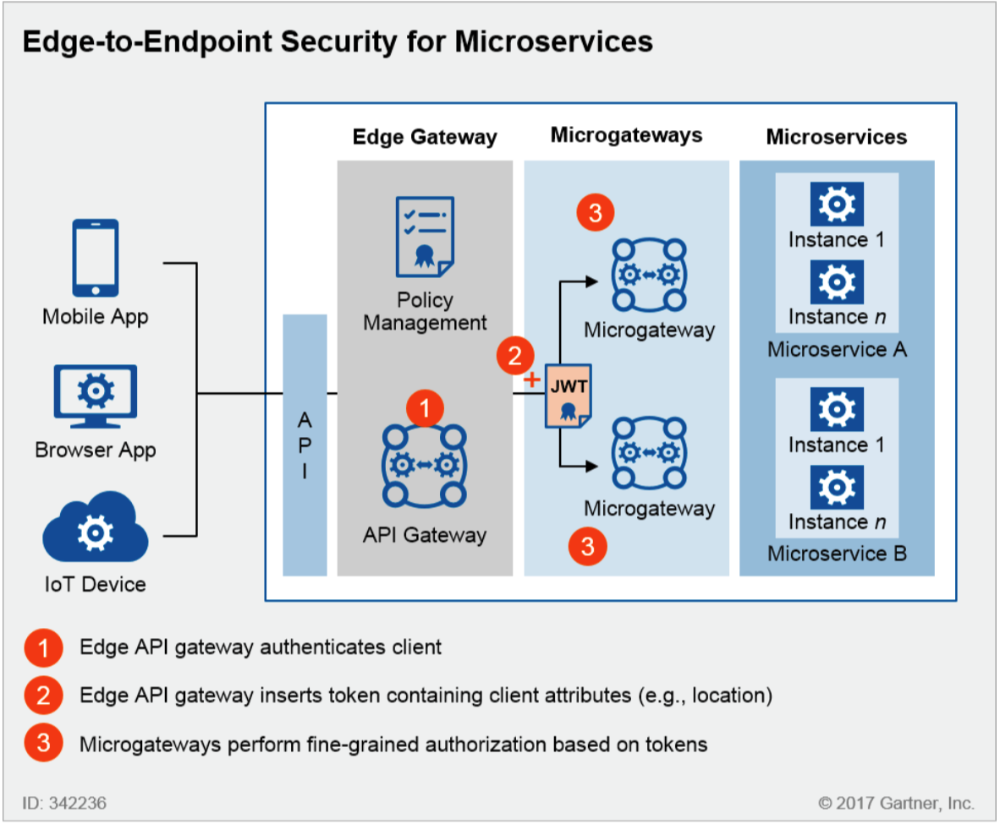
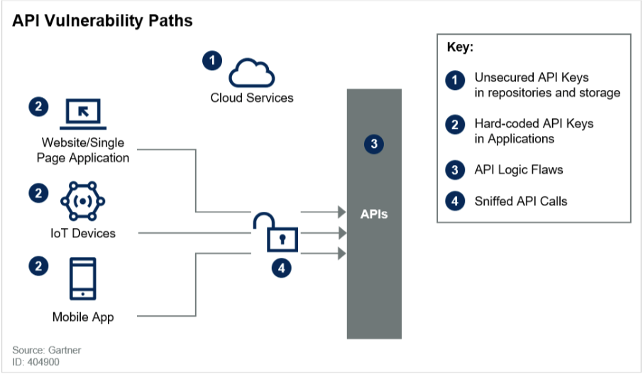
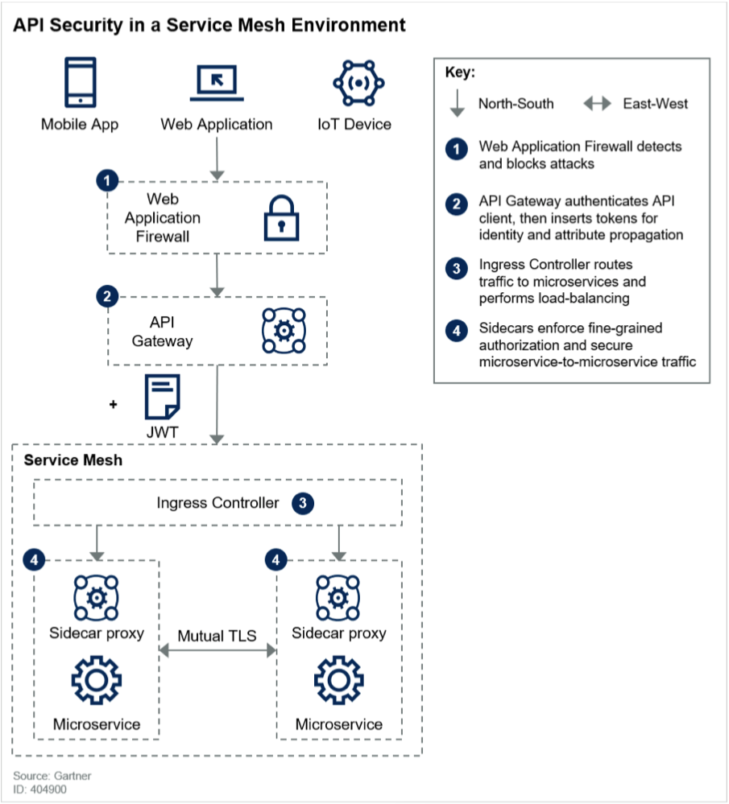

- [Basics of Security](/technology/security.html)
-
- **[https://www.pingidentity.com/en/resources/blog/post/complete-guide-to-api-security.html](https://www.pingidentity.com/en/resources/blog/post/complete-guide-to-api-security.html)**
-
-
- 
-
- 
-
- 
-
- 
- 
- 
-
- # Authentication
  background-color:: yellow
	- To enable authentication, modify the */WEB-INF/web.xml* file in the war file deployed.
	- Value of `<auth-method>` could be `BASIC`, 'DIGEST' or `CLIENT_CERT`
	- The `<login-config>` element doesn’t turn on authentication. To enforce authentication, you must specify a URL pattern you want to secure. e.g., `<url-pattern>/services/customers</url-pattern>`
	- The `<http-method>` element says that we only want to secure POST requests to this URL. If we leave out this element, all HTTP methods are secured.
	- `<auth-constraint>` specifies which roles are allowed to POST to `/services/customers`
	- `<role-name>` - If you set this to `*` then it means anybody who is able to log in can access the constrained URL. Authentication with a valid user would still be required, though.
	- *Limitation* - When declaring `<security-constraints>` for JAXRS resources, the `<url-pattern>` element does not have as rich an expression syntax as JAX-RS `@Path` annotation values. It supports only simple wildcard matches via the `*` character. No regular expressions like `/*`, `/foo/*` or `*.txt` are supported.
	- ```xml
	  <?xml version="1.0"?>
	  <web-app>
	    <security-constraint>
	      <web-resource-collection>
	        <web-resource-name>customer creation</web-resource-name>
	        <url-pattern>/services/customers</url-pattern>
	        <http-method>POST</http-method>
	      </web-resource-collection>
	      <auth-constraint>
	        <role-name>admin</role-name>
	      </auth-constraint>
	    </security-constraint>
	    <login-config>
	      <auth-method>BASIC</auth-method>
	      <realm-name>jaxrs</realm-name>
	    </login-config>
	    <security-role>
	      <role-name>admin</role-name>
	    </security-role>
	  </web-app>
	  ```
	- **Enforcing Encryptiong (HTTPS)** - To enforce HTTPS access for these constraints, specify a `<user-data-constraint>` as shown here. If a user tries to access the URL pattern with HTTP, she will be redirected to an HTTPS-based URL
	    
	  ```xml
	  <security-constraint>
	  ...
	  <user-data-constraint>
	    <transport-guarantee>CONFIDENTIAL</transport-guarantee>
	  </user-data-constraint>
	  </security-constraint>
	  ```
- # Authorization
  background-color:: yellow
	- The server and application know the permissions for each user and do not need to share this information over a communication protocol. This is why authorization is the domain of the server and application
	- JAX-RS relies on the servlet and Java EE specifications to define how authorization works. Authorization is performed in Java EE by associating one or more roles with a given user and then assigning permissions based on that role.
	- You do not assign access control on a per-user basis, but rather on a per-role basis.
	- Authorization can be enabled through XML or by applying annotations to JAX-RS resource classes
	- ### Authorization Annotations
		- Java EE defines a set of following annotations in package `javax.annotation.security` :
		- `@RolesAllowed` - defines the roles permitted to execute a specific method or defines the default ACL (Access Control List) for all HTTP operations.
		- `@DenyAll`
		- `@PermitAll`
		- `@RunAs`
		- **Pros**
			- Annotations allow to express fine-grained constraints that are not possible in *web.xml* because of the limited expression capabilities of `<url-pattern>`
			- Allows to apply constraints at method-level using these annotations.
		- **Cons**
			- Specify security related annotations within business logic code is a leakage of concern. To add or remove role constraints periodically, one has to recompile the whole application.
		- ```java
		  @Path("/customers")
		  @RolesAllowed({"ADMIN", "CUSTOMER"})
		  public class CustomerResource {
		  @GET
		  @Path("{id}")
		  @Produces("application/xml")
		  public Customer getCustomer(@PathParam("id") int id) {...}
		  
		  @RolesAllowed("ADMIN")
		  @POST
		  @Consumes("application/xml")
		  public void createCustomer(Customer cust) {...}
		  
		  @PermitAll
		  @GET
		  @Produces("application/xml")
		  public Customer[] getCustomers() {}
		  }
		  ```