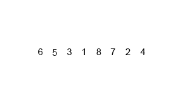
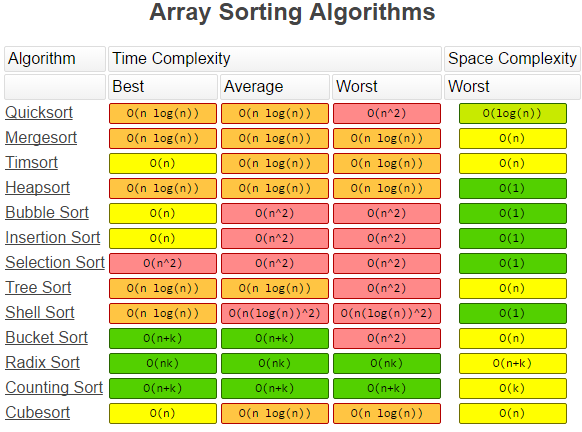

- Grokking Algorithms - http://adit.io/
- # Concepts
	- ## Big-O Notation
		- 
		- ### Types
			- collapsed:: true
			  * **O(1)/Constant Complexity**:
				- Constant.  Irrespective of the size of the data set the algorithm will always take a constant time.
				- Example: `HashMap.get()` operation
			- **O(log n)/Logarithmic Complexity**:
				- Not as good as constant, but still pretty good.  The time taken increases with the size of the data set, but not proportionately so. This means the algorithm takes longer per item on smaller datasets relative to larger ones.   1 item takes 1 second, 10 items takes 2 seconds, 100 items takes 3 seconds. This makes log n algorithms very scalable.
				- Example: Binary search
			- **O(n)/Linear Complexity**:
				- The larger the data set, the time taken grows proportionately.  1 item takes 1 second, 10 items takes 10 seconds, 100 items takes 100 seconds.
				- Example: To find an element T which is the last item in the `LinkedList`
			- **O(n log n)/Linearithmetic Complexity**:
				- A nice combination of the previous two.  Normally there’s 2 parts to the sort, the first loop is O(n), the second is O(log n), combining to form O(n log n) 1 item takes 2 seconds, 10 items takes 12 seconds, 100 items takes 103 seconds.
				- {:height 188, :width 300}
				- *Example*: MergeSort. To explain why this is `O(n log n)` is a bit more complex.  In the below example of 8 numbers, we have 3 levels of sorting:
				- 4 list sorts when the list sizes are 2
				- 2 list sorts when the list sizes are 4
				- 1 list sort when the list size is 8
				- Now consider if I were to double the number of elements to 16: this would only require one more level of sorting. This is a `log n` scale. However, on each level of sorting a total of `n` operations takes place (look at the red boxes in the diagram above).  this results in `(n * log n)` operations.
			- **O(n^2)/Polynomial or Quadratic Complexity**:
				- Things are getting extra slow. 1 item takes 1 second, 10 items takes 100, 100 items takes 10000.
				- Example: Bubble Sort. If you need a reminder; we go through the list and compare each element with the one next to it, swapping the elements if they are out of order. At the end of the first iteration, we then start again from the beginning, with the caveat that we now know the last element is correct.
			- **O(2^n)/Exponential Growth**:
				- The algorithm takes twice as long for every new element added.  1 item takes 1 second, 10 items takes 1024 seconds, 100 items takes 1267650600228229401496703205376 seconds.
				- Example: Take for example trying to find combinations; imagine a list of 150 people and to find every combination of groupings; everyone by themselves, all of the groups of 2 people, all of the groups of 3 people etc. Using a simple program which takes each person and loops through the combinations,  if I add one extra person then it’s going to increase the processing time exponentially. Every new element will double processing time.
		- [Informal Introduction to BigO notation](http://www.perlmonks.org/?node_id=227909)
		- ### How to find Big-O in interviews?
			- Break down the loops and processing.
				- Does it have to go through the entire list? There will be an `n` in there somewhere.
				- Does the algorithms processing time increase at a slower rate than the size of the data set? Then there’s probably a `log n` in there.
				- Are there nested loops? You’re probably looking at `n^2` or `n^3`.
				- Is access time constant irrelevant of the size of the dataset? Then, `O(1)`
	- ## Proof by induction and contradiction
		- ​An online algorithm that requires only constant space and runs in linear time is just about as good as possible.
- # Data Structures
  collapsed:: true
	- ## Arrays
	  collapsed:: true
		- Duplication in array - pg 34
		- Arbitrary kth number
		- [Find second highest number in an array](https://github.com/fizalihsan/FunPrograms/blob/master/src/main/java/com/algos/array/SecondHighestNumber.java)
		- [Majorities in an array](https://github.com/fizalihsan/FunPrograms/blob/master/src/main/java/com/algos/array/MajoritiesInArrays.java)
		- [Find the Turning number in an array](https://github.com/fizalihsan/FunPrograms/blob/master/src/main/java/com/algos/array/TurningNumber.java)
		- [Intersection of 2 sorted arrays](https://github.com/fizalihsan/FunPrograms/blob/master/src/main/java/com/algos/array/IntersectionOf2SortedArrays.java)
		- [Convert decimal to binary, octal or hexadecimal or vice-versa](https://github.com/fizalihsan/FunPrograms/blob/master/src/main/java/com/algos/numbers/BaseConversion.java)
		- [Convert excel column name to column index](https://github.com/fizalihsan/FunPrograms/blob/master/src/main/java/com/algos/numbers/BaseConversion.java)
		- [Bitwise Operations](https://github.com/fizalihsan/FunPrograms/blob/master/src/main/java/com/algos/numbers/BitwiseProblems.java)
		- [Max sub sum algorithm]()
		- Fibonacci
		- [Find nth fibonacci number](https://github.com/fizalihsan/FunPrograms/blob/master/src/main/java/com/algos/numbers/Fibonacci.java) (with and without recursion)
		- Frog jumpting stairs  - pg 81
		- Rectangle problem  - pg 81
		- Intersection of sorted array - pg 194
	- ## Strings
	  collapsed:: true
		- Regex matching - pg 50
		- Check if a string is a number or not - pg 51
		- Replacing %20 with spaces in a string - pg 47 - Left to right approach is `O(n^2)`. Right to left is `O(n)`
		- String compression (Input: aaaabbccc, Expected output: a4b2c3) *Asked in KPMG interview*
		- [Permutation Combination](https://github.com/fizalihsan/FunPrograms/blob/master/src/main/java/com/algos/string/PermutationCombination.java)
		- [Non repeated character detector](https://github.com/fizalihsan/FunPrograms/blob/master/src/main/java/com/algos/string/NonRepeatedCharDetector.java)
		- [Reverse order of the words in a sentence](https://github.com/fizalihsan/FunPrograms/blob/master/src/main/java/com/algos/string/ReverseWordsOrder.java)
		- [Remove given characters from the input string](https://github.com/fizalihsan/FunPrograms/blob/master/src/main/java/com/algos/string/RemoveChars.java)
	- ## Linked Lists
	  collapsed:: true
		- [Print list from tail to head](https://github.com/fizalihsan/FunPrograms/blob/master/src/main/java/com/algos/linkedlist/PrintFromTailToEnd.java) - pg 54
			- Reverse the list and print. However, the structure is modified
			- Add elements to stack and print. However, additional data structure is needed
			- Use recursion
		- [Reverse a singly linked list](https://github.com/fizalihsan/FunPrograms/blob/master/src/main/java/com/algos/linkedlist/ReverseSinglyLinkedList.java)
		- Check for loops
			- [Tortoise & Hare Method](https://github.com/fizalihsan/FunPrograms/blob/master/src/main/java/com/algos/linkedlist/LoopCheckTortoiseAndHareMethod.java)
			- [IdentityHashMap Method](https://github.com/fizalihsan/FunPrograms/blob/master/src/main/java/com/algos/linkedlist/LoopCheckIdentityHashMapMethod.java)
		- [Kth node from end](https://github.com/fizalihsan/FunPrograms/blob/master/src/main/java/com/algos/linkedlist/KthNodeFromEndFinder.java)
		- [Delete duplicate values in a sorted linked list](https://github.com/fizalihsan/FunPrograms/blob/master/src/main/java/com/algos/linkedlist/DeleteDuplicatesFromSortedList.java)
	- ## Trees
	  collapsed:: true
		- [Tree Traversals](https://github.com/fizalihsan/FunPrograms/blob/master/src/main/java/com/algos/binarytree/TreeTraversals.java)
			- Depth-First Traversal: Post-order, In-order, Pre-order
			- Breadth-First Traversal: Level-order
		- [Binary Search Tree - add, remove](https://github.com/fizalihsan/FunPrograms/blob/master/src/main/java/com/algos/binarytree/BinarySearchTree.java)
		- [Check if a given tree is a binary search tree](https://github.com/fizalihsan/FunPrograms/blob/master/src/main/java/com/algos/binarytree/BinarySearchTreeChecker.java)
		- [Convert a binary tree into a doubly-linked list - pg 174
	- ## Stacks
	  collapsed:: true
		- [Build a stack using 2 queues](https://github.com/fizalihsan/FunPrograms/blob/master/src/main/java/com/algos/stack/StackUsingQueues.java)
	- ## Queues
	  collapsed:: true
		- [Build a queue using 1 stack & 2 stacks](https://github.com/fizalihsan/FunPrograms/blob/master/src/main/java/com/algos/queue/QueueUsingStacks.java)
- # Algorithms
	- ## Searching
		- Binary Search
			- [Binary Search in an array](https://github.com/fizalihsan/FunPrograms/blob/master/src/main/java/com/algos/array/BinarySearch.java)
			- Binary search matrix - pg 37
			- Binary search in partially sorted array (HarryHe pg 89 - unable to follow)
			- Minimum k numbers in an array - pg 191
		-
	- ## Sorting
		- 
		- Array Sorting
			- [Quick sort](https://github.com/fizalihsan/FunPrograms/blob/master/src/main/java/com/algos/sort/QuickSort.java) - *from Sedgewick book*
			- [Selection sort](https://github.com/fizalihsan/FunPrograms/blob/master/src/main/java/com/algos/sort/SelectionSort.java)
			- Shell sort
			- Insertion sort
			- Merge sort
		- String sorting
			- Counting sort or key-index counting (Sedgewick pg 703)
		- List sorting
			- ....
		- > Heap sort visualization - http://www2.hawaii.edu/~copley/665/HSApplet.html
	- ## Backtracking
		- String paths
		- Permutations
		- [Simple recursive method](https://github.com/fizalihsan/FunPrograms/blob/master/src/main/java/com/algos/string/Permutations.java) (Sedgewick)
		- 8 queens problems - pg 175
	- ## Bitwise Operations
	  collapsed:: true
		- AND
			- `0 & 0 = 0`
			- `1 & 0 = 0`
			- `0 & 1 = 0`
			- `1 & 1 = 1`
		- OR
			- `0 | 0 = 0`
			- `1 | 0 = 1`
			- `0 | 1 = 1`
			- `1 | 1 = 1`
		- XOR
			- `0 ^ 0 = 0`
			- `1 ^ 0 = 1`
			- `0 ^ 1 = 1`
			- `1 ^ 1 = 0`
		- NOT
			- `~0 = 1`
			- `~0 = 0`
		- Left Shift
			- `00001010 << 2 = 00101000`
			- `10001010 << 3 = 01010000`
		- Right Shift
			- `00001010 >> 2 = 00000010`
			- `10001010 >> 3 = 11110001`
		- Unsigned Right Shift
			- `00001010 >>> 2 = 00000010`
			- `10001010 >>> 3 = 00010001`
	- ## Searching
	  collapsed:: true
		- Search types
			- exact search
			- range search
		- Search algorithm types
			- Sequential
			- Direct access (hashing)
			- Tree indexing methods
		- Binary Search
		- Dictionary/Interlpolation Search
		- Quadratic Binary Search
		- ## Hashing
		  collapsed:: true
			- Hashing Functions
				- Perfect hashing
				- Consistent Hashing or Hash Ring (used for building distributed caches, data sharding. Many NoSQL databases uses this including Voldemort, Amazon Dynamo, Couchdb, etc)
			- Collision Resolution Policy
				- Open Hashing/Separate Chaining
				- Closed Hashing / Open Addressing
				- Bucket Hashing
				- Linear Probing
			- **Drawbacks of hashing**
				- Not good for duplicate keys
				- Not good for Range searches
				- good only for in-memory and disk-based searching
			- [Guide - An Extensive Examination of Data Structures Using C# 2.0](http://msdn.microsoft.com/en-US/library/ms379570(v=vs.80).aspx)
			- [1](http://www.mpi-inf.mpg.de/~mehlhorn/Toolbox.html)
			- [2](http://www.cs.auckland.ac.nz/software/AlgAnim/ds_ToC.html)
	- ## Dynamic Programming
		- TBD
	- ## Greedy Algorithms
		- TBD
- # Reference
	- [Idiot's guide to BigO](http://www.corejavainterviewquestions.com/idiots-guide-big-o/)
	- [bigocheatsheet.com](http://bigocheatsheet.com/)
	- Books
	- Algorithms 4th Edition - Robert Sedgewick and Kevin Wayne
	- Algorithms in a Nutshell
	- ACE the programming interview
	- Coding Interview - Harry He
	- ​Data structures and algorithm analysis in Java