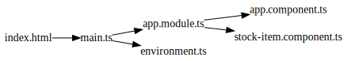
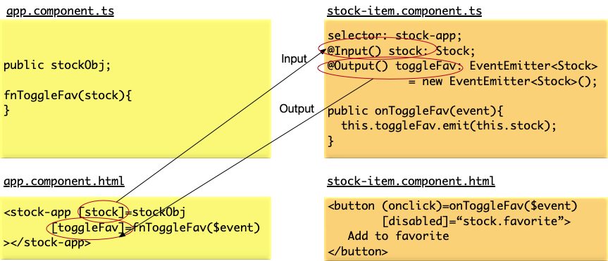

- * [Angular Docs](https://angular.io/docs)
- # Project Structure
	- ## Files
	  
	  * `main.js` - transpiled code that is specific to your application
	  * `vendor.js` - includes all the third-party libraries and frameworks you depend on (including Angular)
	  * `styles.js` - compilation of all the CSS styles that are needed for your application
	  * `polyfills.js` - includes all the polyfills needed for supporting some capabilities in older browsers (like advanced ECMAScript features not yet available in all browsers)
	  * `runtime.js` - includes webpack utilities and loaders that is needed for bootstrapping the application.
- ## Structure
  
  ```
  .
  ├── angular.json                     <-- Angular CLI config
  ├── browserslist                     <-- 
  ├── e2e                              <-- End-to-end test root directory
  │   ├── protractor.conf.js           <-- 
  │   ├── src
  │   │   ├── app.e2e-spec.ts          <-- 
  │   │   └── app.po.ts                <-- 
  │   └── tsconfig.json                <-- 
  ├── karma.conf.js                    <-- 
  ├── package-lock.json                <-- NPM dependencies lock file
  ├── package.json                     <-- NPM dependencies
  ├── src
  │   ├── app                          <-- A component directory
  │   │   ├── app.component.css        <-- 
  │   │   ├── app.component.html       <-- 
  │   │   ├── app.component.spec.ts    <-- 
  │   │   ├── app.component.ts         <-- Root component
  │   │   └── app.module.ts            <-- Main module. Application specific code starts from here
  │   ├── assets 
  │   ├── environments                 <-- 
  │   │   ├── environment.prod.ts
  │   │   └── environment.ts
  │   ├── favicon.ico
  │   ├── index.html                   <-- Root HTML
  │   ├── main.ts                      <-- Entrypoint: identifies which Angular module to be loaded when the app starts. Main objective of this file is to point the Angular framework at the core module of your application.
  │   ├── polyfills.ts                 <-- 
  │   ├── styles.css                   <-- 
  │   └── test.ts                      <-- 
  ├── tsconfig.app.json                <-- 
  ├── tsconfig.json                    <-- 
  ├── tsconfig.spec.json               <-- 
  └── tslint.json                      <-- 
  ```
  
  
- # Concepts
- ## Binding
    
  * Data binding
    * `<div class="name">Hello  {{name}}  </div>`. This is called _Interpolation_.
  * Property binding
    * `<div class="price" [class]="positiveChange ? 'plus' : 'minus'">$ {{price}}</div>`
    * Tells Angular to bind to the __class__ property of the DOM element to the value of the expression. 
    * Square-bracket notation refers to data flowing from the component to the UI.
    * When you bind to the class property, it overrides the existing value of the property. In the example above, `class="price"` has no effect. 
    * Angular data binding only works with DOM properties, and not with HTML attributes. (see section below)
  * Event binding
    * `<button (click)="toggleFavorite()" [disabled]="favorite">Add to Favorite</button>`
    * The parentheses notation refers to events.
    * Angular gives you access to the underlying DOM event by giving access to a special variable `$event`. You can access it or even pass it to your function as follows: `<button (click)="toggleFavorite($event)" [disabled]="favorite">Add to Favorite</button>`
  
  _HTML attribute vs. DOM property: What's the difference?_
  
  * In Angular, one-way binding binds to the DOM property, and not to the HTML attributes. 
  * Attributes are defined by HTML, while properties are defined by the DOM. Though some attributes (like `ID` and `class`) directly map to DOM properties, others may exist on one side but not the other.
  * The distinction between the two is that HTML attributes are generally used for initialization of a DOM element, but after that, they have no purpose or effect on the underlying element. Once the element is initialized, its behavior is controlled by the DOM properties from then on.
  * For example, consider the input HTML element. If we bootstrap our HTML with something like: `<input type="text" value="foo"/>` this initializes an input DOM element, with the initial value of the DOM property value to be set to foo. Now let’s assume we type something in the text box, say bar. At this point:
    * If we do input.getAttribute('value'), it would return foo, which was the attribute value we used to initialize the HTML.
    * If we do input.value, we will get the current value of the DOM property, which is bar.
  * That is, the attribute value is used to boostrap and set the initial value of the HTML DOM element, but after that, it is the DOM property that drives the behavior. If you inspect the HTML, you will see that it is still the initial HTML we provided, and does not update either.
- ## Components
  
  * A component in Angular is nothing but a TypeScript class, decorated with some attributes and metadata. The class encapsulates all the data and functionality of the component, while the decorator specifies how it translates into the HTML.
  * Components in Angular are our presentation layer, and should be involved in and focus on the presentation aspects of data.
  * Components are responsible for deciding what data to display and how to render and display it in the UI. We bind the data from the components to UI and bind events from the UI to methods in the components to allow and handle user interactions. 
  
  To some extent, you can consider an Angular application to be nothing but a tree of components
  
  * At its very simplest, a component is nothing but 
    * a _class_ that encapsulates behavior (what data to load, what data to render, and how to respond to user interactions) 
    * and a _template_ (how the data is rendered). 
  * 2 responsibilities of a component:
    * Load and hold all the data necessary for rendering the component
    * Handle and process any events that may arise from any element in the component
  * A component is defined using the Typescript annotation `@Component`
  * Any component needs the below 2 attributes - others are optional
    * a _selector_ (to tell Angular how to find instances of the component being used) 
    * and a _template_ (that Angular has to render when it finds the element). 
  
  __app.component.ts (Root Component)__
  ``` 
  import { Component } from '@angular/core';
  
  @Component({
  selector: 'app-root', // DOM selector that gets translated into an instance of this component
  templateUrl: './app.component.html', // The HTML template backing this component - in this case, the URL to it
  styleUrls: ['./app.component.css'] // Any component-specific styling
  })
  
  export class AppComponent { // The component class with its own members and functions
  title = 'stock-market';
  }
  ```
  
  In the example below, we have defined that the `StockItemComponent` is to be rendered whenever Angular encounters the `app-stock-item` selector, and to render the `stock-item.component.html` file when it encounters the element.
  
  __stock-item.component.ts__
  ``` 
  @Component({
  selector: 'app-stock-item',
  templateUrl: './stock-item.component.html',
  styleUrls: ['./stock-item.component.css']
  })
  export class StockItemComponent implements OnInit {
   // Code omitted here for clarity
  }
  ```
  
  * Every component has to be part of a module. If you create a new component, and do not add it to a module, Angular will complain that you have components that are not part of any modules.
  
  
  __app.module.ts__
  ``` 
  import { AppComponent } from './app.component';
  import { StockItemComponent } from './component/stock-item/stock-item.component';
  
  @NgModule({
  declarations: [ // ensures that components and directives are available to use within the scope of the module.
    AppComponent,
    StockItemComponent
  ],
  imports: [ // specify modules that you want imported and accessible within your module. 
    BrowserModule
  ],
  providers: [],
  bootstrap: [AppComponent]
  })
  export class AppModule { }
  ```
- ### Component Attributes
  
  * Selector
    * Few ways you could specify the _selector_ attribute and how you would use it in the HTML:
        * `selector: 'app-stock-item'` would result in the component being used as `<app-stock-item></app-stock-item>` in the HTML.
        * `selector: '.app-stock-item'` would result in the component being used as a CSS class like `<div class="app-stock-item"></div>` in the HTML.
        * `selector: '[app-stock-item]'` would result in the component being used as an attribute on an existing element like `<div app-stock-item></div>` in the HTML.
  * Template
    * `templateUrl` is relative to the path of the component. Using absolute urls will break the build.
    * Angular precompiles a build and ensures that the template is inlined as part of the build process.
  * Style
    * A component can have multiple styles attached to it.
    * One thing that Angular promotes out of the box is complete encapsulation and isolation of styles. That means by default, the styles you define and use in one component will not affect/impact any other parent or child component. This ensures that you can be confident that the CSS classes you define in any component will not unknowingly affect anything else, unless you explicitly pull in the necessary styles.
    * Angular will not pull in these styles at runtime, but rather precompile and create a bundle with the necessary styles.
- ### Component Input & Output
  
  * A component is truly useful when it is reusable. One of the ways we can make a component reusable (rather than having default, hardcoded values inside it) is by passing in different inputs depending on the use case. Similarly, there might be cases where we want hooks from a component when a certain activity happens within its context.
  * Input
    * `@Input` decorator on a member variable automatically allows you to pass in values to the component for that particular input via Angular’s data binding syntax. 
    * These inputs are data bound, so if you end up changing the value of the object in AppComponent, it will automatically be reflected in the child StockItemComponent.
  * Output
    * `@Output` decorator allows to register and listen to events emitted by a component.
    * We just added an event binding using Angular’s event-binding syntax to the output declared in the stock-item component.
  * Both `@Input` and `@Output` are class member variable level decorators.
  
  
  
- ### View and Content Projection
  
  TBD
- ### Component Lifecycle
  
  TBD
- ## Directives
  
  * A __directive__ in Angular allows you to attach some custom functionality to elements in your HTML. 
  * A directive allow us to change the behavior of an existing element or to change the structure of the template being rendered.
  * Angular only has directives. A __component__ is a direcive that provides both functionality and UI logic.
  * Types
    * Component directive
    * Non-component directive (work on and modify existing elements)
        * Attribute directive
            * Attribute directives change the look and feel, or the behavior, of an existing element or component that it is applied on. e.g, `ngClass`, `ngStyle`
        * Structural directive
            * Structural directives change the DOM layout by adding or removing elements from the view. e.g., `ngIf`, `ngFor`
  
  * __Attribute directives__
    * Definition
    * _NgClass_
        * The NgClass directive allows us to apply or remove multiple CSS classes simultaneously from an element in our HTML. For instance, when we have to apply multiple CSS classes to an element like `<div class="price positive large-change">`
        * NgClass directive takes a JavaScript object as input. For each key in the object that has a truthy value, Angular will add that key (the key itself, not the value of the key!) as a class to the element. Similarly, each key in the object that has a falsy value will be removed as a class from that element.
    * _NgStyle_
        * The NgStyle directive is the lower-level equivalent of the NgClass directive. It operates in a manner similar to the NgClass in that it takes a JSON object and applies it based on the values of the keys. But the NgStyle directive works at a CSS style/properties level. The keys and values it expects are CSS properties and attributes rather than class names.
    * _NgSwitch_
        * is an attribute directive
  * __Structural directives__
    * Definition
        * are responsible for changing the layout of the HTML by adding, removing, or modifying elements from the DOM. 
        * structural directives are applied on a pre-existing element, and the directive then operates on the content of that element.
        * All structural directives in Angular start with an asterisk (*)
    * _*ngIf_
        * `<div *ngIf="stock.favorite"></div>`
        * this directive allows you to conditionally hide or show elements in your UI. Technically, ngIf removes the element from the rendered DOM.
        * _Why does *ngIf remove the element, instead of hiding it via CSS?_
            * The reason comes down to performance and the implications thereof. Angular continues to listen and watch for events on all elements in the DOM. Removing the element from the DOM is a good way to ensure that it reduces any impact on performance, especially when the element being removed is a resource-intensive component (think a graph, or an autoupdating widget). This does mean that it is slightly less efficient when the condition toggles (since it involves a DOM addition/removal), but in the grand context of things, it is more efficient.
    * _*ngFor_
        * `*ngFor - trackBy`
            * Angular recognizes each element in an array based on their object references, by default. 
            * There are cases when the element reference might change, but you still want to continue using the same element. For example, when you fetch new data from the server, you don’t want to blow away your list and re-create it unless the data has fundamentally changed. This is where the `trackBy` capability of the NgFor directive comes into play.
            * Example: `<div class="stock-container" *ngFor="let stock of stocks; index as i; trackBy: trackStockByCode">`
            * `trackStockByCode` function implementation: `trackStockByCode(index, stock) { return stock.code; }`
            * This will ensure that Angular calls this function to figure out how to identify individual items, instead of using the object reference.
    * Angular does not allow to have more than one directive on the same element. e.g., `<div *ngFor="let stock of stocks" *ngIf="stock.active">` is invalid. 
  
  > __Truthy and Falsy in JavaScript__
  > Falsy: `undefined`, `null`, `NaN`,`0`, `""` (any empty string), `false` (the boolean value)
  > Truthy: Any nonzero number, Any nonempty string, Any nonnull object or array, `true` (the boolean value)
- ## Forms - Template-driven
  
  There are 2 primary mechanisms to create forms: Template-driven forms and Reactive forms.
  
  Both are part of the core `@angular/forms` library, but are part of two different modules, `FormsModule` and `ReactiveFormsModule`
  
  Template-driven forms allow you to drive the logic of your application via your template. The `FormsModule` adds the capability of using `ngModel`, which allows for two-way data binding in Angular.
- ### Type 1: Value and Event Binding
  
  * _UI --> Component binding_: The `value` binding is telling Angular to update the value property of the `input` element using the `stock.name` field in the component class. If and when it changes, Angular will be responsible for updating the property as well.
  * _Component --> UI binding_: The `input` event binding is instructing Angular to update the `value` of `stock.name` with the value from the event. The `$event` in this case is the underlying DOM `InputEvent`, through which we access the target and from it, the changed value.
  * Button on click resets the value of `stock.name` to `'test'`.
  * Cons
    * It is hard to remember exactly which property is used by each form field, and what are the various events and where the values would be available.
  
  ```html Form using value and event binding
  <div class="form-group">
  <form>
    <div class="stock-name">
      <input type="text"
             placeholder="Stock Name"
             [value]="stock.name"
             (input)="stock.name=$event.target.value">
    </div>
  </form>
  <button (click)="stock.name='test'">Reset stock name</button>
  </div>
  ```
- ### Type 2: ngModel directive (expanded form)
  
  * The `ngModel` directive and its special syntax abstracts away the internals of each and every input type from developers, making it easier to quickly develop form-based applications.
  * Added a `name` field to the input form element. This is necessary for the `ngModel` directive to work. If you remove this, you will see errors in the console.
  * We added two bindings. The first one is `ngModel` data binding. This does the work of the value binding we had previously, but abstracting out which property underneath needs to be bound. It points to the component member variable that it takes the value from.
  * The second binding we added is the `ngModelChange` event binding. In this, we update the underlying component member variable (`stock.name`) with the value of the `$event`, which is the changed value of the text field.
  
  ```html Form using ngModel binding
  <div class="form-group">
  <form>
    <div class="stock-name">
      <input type="text"
             placeholder="Stock Name"
             name="stockName"
             [ngModel]="stock.name"
             (ngModelChange)="stock.name=$event">
    </div>
  </form>
  <button (click)="stock.name='test'">Reset stock name</button>
  </div>
  ```
- ### Type 3: ngModel directive (simpler form)
  
  * `[(ngModel)]` banana-in-a-box syntax, as it is called. ( `()` looks like 2 bananas.)
  * Cons
    * The combined `ngModel` syntax only has the capability to set the data-bound property. If you need to do something more complicated (say convert the text into upper-case before setting the model variable), or set it in a different field itself (a calculated value maybe?), or do multiple things, then you might want to consider the expanded syntax.
  
  ```html Form using ngModel simpler version
  <div class="form-group">
  <form>
    <div class="stock-name">
      <input type="text"
             placeholder="Stock Name"
             name="stockName"
             [(ngModel)]="stock.name">
    </div>
  </form>
  <button (click)="stock.name='test'">Reset stock name</button>
  </div>
  ```
- ### Form group
  
  * We have removed the *banana-in-a-box* syntax from all the `ngModel` bindings, and just kept it as an attribute. When we use `ngModel` like this, Angular uses the name field on the form element as the model name and creates a model object corresponding to it on the form.
  * We have surrounded the form fields with another `div`, and used an Angular directive called `ngModelGroup` on it, providing it a name (`stock` in this case). This groups the form elements, thus creating the `name`, `price`, `code`, and `exchange` fields as models under the common name `stock`. This is visible in the component when we access this entire set of values through `form.value.stock`.
  * We can similarly create multiple form groups and use `ngModel` directly, and then finally copy over the entire values to a common field (or not copy it over at all) in our component on form submit. This is another way we can use `ngModel` and template-driven forms in our applications.
  
  ```html Form group example
  <div class="form-group">
  <form (ngSubmit)="createStock(stockForm)" #stockForm="ngForm" >
    <div ngModelGroup="stock">
      <div class="stock-name">
        <input type="text" placeholder="Stock Name" required name="name" ngModel>
      </div>
      <div class="stock-code">
        <input type="text" placeholder="Stock Code" required minlength="2" name="code" ngModel>
      </div>
      <div class="stock-price">
        <input type="number" placeholder="Stock Price" name="price" required ngModel>
      </div>
      <div class="stock-exchange">
        <div>
          <select name="exchange" ngModel>
            <option *ngFor="let exchange of exchanges" [ngValue]="exchange">{{exchange}}</option>
          </select>
        </div>
      </div>
    </div>
    <button type="submit">Create</button>
  </form>
  </div>
  
  <h4>Stock Name is {{stock | json}}</h4>
  <h4>Data has been confirmed: {{confirmed}}</h4>
  ```
- ### Form Validations
  
  * Angular form validation for template-driven forms relies and extends the [native form validation from HTML](https://developer.mozilla.org/en-US/docs/Web/Guide/HTML/HTML5/Constraint_validation)
  * Angular does the work of integrating these **control states** and **validations** with its own internal model (whether it is `ngModel` or `ngForm`), and it is up to us to use this internal model to then show the right kind of message to the user.
  * There are 2 aspects to this:
    * **The state** allows us to peek into the state of the form control, on 
        * whether the user has *visited* it, 
        * whether the user has *changed* it, and finally 
        * whether it is in a *valid state*.
    * **The validity**,  tells us whether a form control is valid or not, and if it is not valid, the underlying reason (or reasons) for which the form element is invalid.
  
  __Control State__
  
  *  The `ngModel` directive changes and adds CSS classes to the element it is on, based on the user’s interaction with it. There are 3 primary modes of interaction that it tracks, and 2 CSS classes per mode of interation associated with it.  
  * To use these control state classes, we actually don’t need to make any component class code changes. We only need to tweak the CSS a bit and then leverage that in the HTML template for the component.
  * Angular’s Form Module is responsible for reading it and applying the form control state classes accordingly, without any other work on our side.
  
  | **Control state** | **CSS class if True** | **CSS class if False** |
  | --- | --- | --- | 
  | Visited | `ng-touched` | `ng-untouched` | 
  | Changed | `ng-dirty` | `ng-pristine` | 
  | Valid | `ng-valid` | `ng-invalid` | 
  
  ```css
  .stock-name .ng-valid,
  .stock-code .ng-pristine,
  .stock-price .ng-untouched {
  background-color: green;
  }
  
  .stock-name .ng-invalid,
  .stock-code .ng-dirty,
  .stock-price .ng-touched {
  background-color: pink;
  }
  ```
  
  ```html Complete form example
  <div class="form-group">
  <form (ngSubmit)="createStock()">
    <div>
      The following element changes from green to red when it is invalid
    </div>
    <div class="stock-name">
      <input type="text" placeholder="Stock Name" required name="stockName" [(ngModel)]="stock.name">
    </div>
    <div>
      The following element changes from green to red when it has been modified
    </div>
    <div class="stock-code">
      <input type="text" placeholder="Stock Code" name="stockCode" [(ngModel)]="stock.code">
    </div>
    <div>
        The following element changes from green to red when it is visited by the user, regardless of change
      </div>
    <div class="stock-price">
      <input type="number" placeholder="Stock Price" name="stockPrice" [ngModel]="stock.price" (ngModelChange)="setStockPrice($event)">
    </div>
    <div class="stock-exchange">
      <div>
        <select name="stockExchange" [(ngModel)]="stock.exchange">
          <option *ngFor="let exchange of exchanges" [ngValue]="exchange">{{exchange}}</option>
        </select>
      </div>
    </div>
    <div class="stock-confirm">
      <input type="checkbox" name="stockConfirm" [(ngModel)]="confirmed">
      I confirm that the information provided above is accurate!
    </div>
    <button [disabled]="!confirmed" type="submit">Create</button>
  </form>
  </div>
  
  <h4>Stock Name is {{stock | json}}</h4>
  <h4>Data has been confirmed: {{confirmed}}</h4>
  ```
  
  __Control Validity__
  
  * Internally, Angular has its own set of validators. 
  * Once you add any validators to your form elements, Angular will take care of running them every time any of the form control changes. 
  * In the example below
    * a template reference variable is added at the form level, and at each control level. The form-level template reference variable (`stockForm`) gets the `NgForm` model object bound to it, which allows us to check on things like form and control validity and values through it.
    * template reference variables (`stockName`, `stockPrice`, `stockCode`) are added on each of the text boxes, and assigned the `NgModel` model object to it. This allows us to check the form field for all the control states that we were previously using through CSS classes (_dirty/pristine_, _valid/invalid_, and _touched/untouched_), in addition to errors.
    * On form submit the `stockForm` template reference variable is passed, which points to the form model, to the `createStock()` method. This is another capability of template reference variables: _you can pass them in as arguments to your component class_.
    * Notice that the error message for the stock name is displayed by default, but the error message that the price and code are required is only displayed after we touch the field. This is the advantage of wrapping the error message under the control state (dirty and invalid). Otherwise, the field is invalid by default (because it is empty).
    * Note that for the stock price, the minlength and required validators are not shown simultaneously. This is handled by the Angular built-in validators,
  
  ```html Form validation examle
  <div class="form-group">
  <form (ngSubmit)="createStock(stockForm)" #stockForm="ngForm">
    <div class="stock-name">
      <input type="text" placeholder="Stock Name" required name="stockName" #stockName="ngModel" [(ngModel)]="stock.name">
    </div>
    <div *ngIf="stockName.errors && stockName.errors.required">
        Stock Name is Mandatory
    </div>
    <div class="stock-code">
      <input type="text" placeholder="Stock Code" required minlength="2" name="stockCode" #stockCode="ngModel" [(ngModel)]="stock.code">
    </div>
    <div *ngIf="stockCode.dirty && stockCode.invalid">
      <div *ngIf="stockCode.errors.required"> Stock Code is Mandatory </div>
      <div *ngIf="stockCode.errors.minlength"> Stock Code must be atleast of length 2 </div>
    </div>
    <div class="stock-price">
      <input type="number" placeholder="Stock Price" name="stockPrice" required #stockPrice="ngModel" [ngModel]="stock.price" (ngModelChange)="setStockPrice($event)">
    </div>
    <div *ngIf="stockPrice.dirty && stockPrice.invalid">
      <div *ngIf="stockPrice.errors.required"> Stock Price is Mandatory </div>
    </div>
    <div class="stock-exchange">
      <div>
        <select name="stockExchange" [(ngModel)]="stock.exchange">
          <option *ngFor="let exchange of exchanges" [ngValue]="exchange">{{exchange}}</option>
        </select>
      </div>
    </div>
    <div class="stock-confirm">
      <input type="checkbox" name="stockConfirm" required [(ngModel)]="confirmed">
      I confirm that the information provided above is accurate!
    </div>
    <button type="submit">Create</button>
  </form>
  </div>
  
  <h4>Stock Name is {{stock | json}}</h4>
  <h4>Data has been confirmed: {{confirmed}}</h4>
  ```
  
  __Template Reference Variable__
  
  * A template reference variable in Angular allows us to get a temporary handle on a DOM element, component, or directive directly in the template. 
  * It is denoted by a standard syntax in the HTML, which is a prefix of `#`. For example, in the following HTML: `<input type="text" #myStockField name="stockName">`
  * The `#myStockField` is a template reference variable that gives us a reference to the input form field
  * When we don’t pass it any value, it will always refer to the HTML DOM element
- ## Forms - Reactive
  
  Unlike *template-driven* forms in Angular, with *reactive* forms, you define the entire tree of Angular form control objects in your component code, and then bind them to native form control elements in your template. Because the component has access to the form controls as well as the backing data model, it can push data model changes into the form control and vice versa, thus reacting to changes either way.
  
  **Template-driven vs. Reactive**
  
  * Both the approaches have their pros and cons.
  * *Template-driven forms* are nice and declarative, and easy to understand. Angular is responsible for the data model sync and pushes data to the model and reads and updates values in the UI via directives like `ngModel`. This also usually means less code in the component class.
  * *Reactive forms* are synchronous, and you as a developer have absolute control over how and when the data is synced from the UI to the model and vice versa. Because you create the entire form control tree in the component, you have access to it immediately and don’t have to deal with Angular’s asynchronous life-cycle.
  * Another slightly subtle advantage of using *reactive forms* over *template-driven forms* is that it forces developers to have a separation between what the user sees and interacts with (what we call the form model), and the persisted data model that drives our application. This is quite common in most applications, where the presented view is different from what the underlying data model is. Reactive forms make that distinction clear, while also keeping you cognizant of the data flow and giving you control over when and what flows from UI to the component and vice versa.
- ### Form Controls
  
  * The core of any reactive form is the `FormControl`, which directly represents an individual form element in the template. Thus, any reactive form is nothing but a set of grouped FormControls. 
  * It is at the `FormControl` level that we  assign initial values and validators (both sync and async). 
  * Everything that we did in the template with template-driven forms now happens at a `FormControl` level in the TypeScript code.
  
  ```html Form Controls
  <div class="form-group">
  
    <div class="stock-name">
      <input type="text"
             placeholder="Stock Name"
             name="stockName"
             [formControl]="nameControl">
    </div>
    <button (click)="onSubmit()">Submit</button>
  </div>
  
  <p>Form Control value: {{ nameControl.value | json }}</p>
  <p>Form Control status: {{ nameControl.status | json }}</p>
  ```
  
  * On the `onSubmit()` call, we simply print the current value of the nameControl control. 
  * Note that unlike traditional non-MVC frameworks, at no point is the control reaching out into the view to get the current value of the element. We rely on the Form`Control to provide a representative view of the input element, and keep it up to date.
  * `FormControl` constructor can also take the initial value along with a list of validators (both sync and async) as arguments.
  * it is helpful to think of `FormControl` when we need to track the *state* and *value* of any individual form element, like an input box or a checkbox.
  
  __Form Controls__
  ``` 
  import { Component, OnInit } from '@angular/core';
  import { FormControl } from '@angular/forms';
  
  @Component({
  selector: 'app-create-stock',
  templateUrl: './create-stock.component.html',
  styleUrls: ['./create-stock.component.css']
  })
  export class CreateStockComponent {
  
  public nameControl = new FormControl();
  constructor() {}
  
  onSubmit() {
    console.log('Name Control Value', this.nameControl.value);
  }
  }
  ```
- ### Form Groups
  
  * This gives us the convenience of whether we want to track the form controls individually, or as a group.
  * switched over from binding to `formControl` to a `formGroup`
  * for each form element, we mention a `formControlName`. Each of these will bind to an individual element within the `formGroup`.
  
  ```html Form groups
  <div class="form-group">
  <form [formGroup]="stockForm" (ngSubmit)="onSubmit()">
    <div class="stock-name">
      <input type="text" placeholder="Stock Name" name="stockName" formControlName="name">
    </div>
    <div class="stock-code">
        <input type="text" placeholder="Stock Code" formControlName="code">
    </div>
    <div class="stock-price">
        <input type="number" placeholder="Stock Price" formControlName="price">
    </div>
    <button type="submit">Submit</button>
  </form>
  </div>
  
  <p>Form Control value: {{ stockForm.value | json }}</p>
  <p>Form Control status: {{ stockForm.status | json }}</p>
  ```
  
  ```
  export class CreateStockComponent {
  
  public stockForm: FormGroup = new FormGroup({
    name: new FormControl(null, Validators.required),
    code: new FormControl(null, [Validators.required, Validators.minLength(2)]),
    price: new FormControl(0, [Validators.required, Validators.min(0)])
  });
  constructor() {}
  
  onSubmit() {
    console.log('Stock Form Value', this.stockForm.value);
  }
  }
  ```
- ### Form Builders
  
  * `FormBuilder` fundamentally is syntactic sugar to allow us to quickly create `FormGroup` and `FormControl` elements without manually calling new for each one
  * For any form with more than a few elements, it almost always makes sense to use the `FormBuilder` rather than the `FormGroup` method, as it reduces both the code and makes it a lot more concise and readable.
  
  __Form builders__
  ```
  export class CreateStockComponent {
  
  public stockForm: FormGroup;
  constructor(private fb: FormBuilder) {
    this.createForm();
  }
  
  createForm() {
    this.stockForm = this.fb.group({
      name: [null, Validators.required],
      code: [null, [Validators.required, Validators.minLength(2)]],
      price: [0, [Validators.required, Validators.min(0)]]
    });
  }
  
  onSubmit() {
    console.log('Stock Form Value', this.stockForm.value);
  }
  }
  ```
- ### Form Data
  
  * How to set the value back in the form
    * `setValue()`
        * this method takes a JSON model object that matches the form model exactly. That means for the `setValue` to work in this case, it needs an object with a `name`, `code`, and `price` key. It should not have more or fewer keys than this, as it would throw an error in this case. Based on the object, the form’s model object values would get updated and these values would be visible in the form in the UI. This is the reason why we delete all other keys from the model object before calling `setValue`.
    * `patchValue()`
        * `patchValue` is a more forgiving method that takes the fields it has available, and updates the form with them. It will ignore extra fields even if it has fewer fields
  * it is good practice to not directly assign the form model to our data model, but rather make a copy of it.
- ### Form Arrays
  
  * to capture multiple values as well as handle nested form elements cleanly
  
  __Form arrays__
  ```
  export class CreateStockComponent {
  
  public stockForm: FormGroup;
  constructor(private fb: FormBuilder) {
    this.createForm();
  }
  
  createForm() {
    this.stockForm = this.fb.group({
      name: [null, Validators.required],
      code: [null, [Validators.required, Validators.minLength(2)]],
      price: [0, [Validators.required, Validators.min(0)]],
      notablePeople: this.fb.array([])
    });
  }
  
  get notablePeople(): FormArray {
    return this.stockForm.get('notablePeople') as FormArray;
  }
  
  addNotablePerson() {
    this.notablePeople.push(this.fb.group({
      name: ['', Validators.required],
      title: ['', Validators.required]
    }))
  }
  
  removeNotablePerson(index: number) {
    this.notablePeople.removeAt(index);
  }
  
  resetForm() {
    this.stockForm.reset();
  }
  
  onSubmit() {
    console.log('Saving stock', this.stock);
  }
  }
  ```
  
  ```html
  <div class="form-group">
  <form [formGroup]="stockForm" (ngSubmit)="onSubmit()">
    <!-- No change until the end of price form element -->
    <!-- Omitted for brevity -->
    <div formArrayName="notablePeople">
      <div *ngFor="let person of notablePeople.controls; let i = index" [formGroupName]="i" class="notable-people">
        <div> Person {{i + 1}} </div>
        <div>
          <input type="text" placeholder="Person Name" formControlName="name">
        </div>
        <div>
          <input type="text" placeholder="Person Title" formControlName="title">
        </div>
        <button type="button" (click)="removeNotablePerson(i)"> Remove Person </button>
      </div>
    </div>
    <button type="button" (click)="addNotablePerson()"> Add Notable Person </button>
    <button type="submit">Submit</button>
    <button type="button" (click)="resetForm()">
      Reset
    </button>
  </form>
  </div>
  
  <p>Form Control value: {{ stockForm.value | json }}</p>
  <p>Form Control status: {{ stockForm.status | json }}</p>
  ```
- ## Services
  
  * Services are primarily meant for
    * Abstraction of the data-fetching aspects
    * Encapsulation of shared application logic
    * Sharing of data across components
  * Services are responsible for the data fetching and common business logic in an Angular application.
  * By default, services  are singletons across the application, which allows to store state and access them across various components.
  * Another simple way to think about Angular services is that it is the layer to abstract the “how” away from the component, so that the component can just focus on the “what”.
  * With the `Injectable` decorator, Angular will take care of injecting them into our service. 
  
  __Service Skeleton__
  ``` 
  import { Injectable } from '@angular/core';
  
  @Injectable()
  export class StockService {
  
  constructor() { }
  
  }
  ```
  
  * We define how the service will be provided and at what level - it could be at `AppModule` level, `AppComponent` level or your custom component level.
  * Every service that we create needs to be registered as a provider with an injector. Then any other class can ask for the service and the injector will be responsible for providing it. 
  * __Multiple Dependency Injectors__
    * Angular supports multiple dependency injectors within the same application. 
    * The ***root injector*** at the root `AppModule` level is where most services will be registered. This makes the instance available across the entire application.
    * In example 1 below, it is registered in the `providers` section of the `NgModule`, which means the service is in fact registered with the root injector and the service is a singleton for the entire application, and any class or component in the application can ask for the service and would be handed the very same instance of the service.
    * Then, when we made the change to add the providers at the `CreateStockComponent` level, we brought the injector at the component level into play. Angular will create a chain of injectors all the way down, depending on the need and declarations. And all child components will inherit that injector, which will take precedence over the root injector. When we registered our `MessageService` provider at the `CreateStockComponent` level, it created a child injector at that level, with its own instance of the MessageService. What we injected into the `CreateStockComponent` is in fact this new instance, which has nothing to do with the original root-level `MessageService`. So we, in fact, have two separate instances of `MessageService` with nothing in common.
    * Just like an Angular application is a tree of components, there is a parallel tree of injectors at play. For most components, these injectors might just be a reference or a proxy to the parent injector. But they may not, as we have just seen.
    * Whenever a component asks for a dependency, Angular will check the closest injector in the tree to see whether it can satisfy it. If it can (like in `CreateStockComponent`), it will provide it. If not, it will check with the parent injector, all the way to the root injector.
  
  __Example 1: Service defined at AppModule__
  ``` 
  import { StockService } from 'app/services/stock.service';
  
  @NgModule({
  declarations: [ AppComponent, StockItemComponent, CreateStockComponent, StockListComponent ],
  imports: [ BrowserModule, FormsModule, HttpModule ],
  providers: [
    StockService // <------------service added here
  ],
  bootstrap: [AppComponent]
  })
  export class AppModule { }
  ```
  
  __Example 2: Service defined at component level__
  ```
  @Component({
  selector: 'app-create-stock',
  templateUrl: './create-stock.component.html',
  styleUrls: ['./create-stock.component.css'],
  providers: [MessageService] // <----------service added as provider
  })
  export class CreateStockComponent {
  
  public stock: Stock;
  public confirmed = false;
  public exchanges = ['NYSE', 'NASDAQ', 'OTHER'];
  constructor(private stockService: StockService,        //<----------service injected
              public messageService: MessageService) {   //<----------service injected
    this.stock =  new Stock('', '', 0, 0, 'NASDAQ');
    this.messageService.message = 'Component Level: Hello Message Service';
  
  }
  }
  ```
  
  * We can inject any service we want into our component simply by listing it in our constructor. 
  * The variable name itself doesn’t matter; Angular uses the type definition to figure out what service to inject.
  * By adding the `private` or `public` keyword in front of a constructor argument, we can make it a member property of the class with the same name. Which is why we need to access the service through an instance variable and cannot access it directly (i.e., we need to call `this.stockService`, and cannot directly use `stockService`). This is a Typescript feature.
  
  __Service injection example__
  ```
  export class StockListComponent implements OnInit {
  
  public stocks: Stock[];
  constructor(private stockService: StockService) { } //<-----------service injection in constructor 
  
  ngOnInit() {
    this.stocks = this.stockService.getStocks(); 
  }
  }
  ```
- ## Observables
  
  * For asynchronous operations, ***callbacks*** were originally used. Later ***Promises*** were introduced in AngularJS which was better than callbacks in many ways. In recent versions, Angular switched to ***Observables***
  * Observables are a [ReactiveX](http://reactivex.io/intro.html) concept that allows us to deal with streams which emit data. Any interested party can then be an observer on this stream, and perform operations and transformations on the events emitted by the stream.
  
  
  | Promises | Observables | 
  | --- | --- | 
  | operate on a single asynchronous event | allow us to deal with a stream of zero or more async events |
  | a promise’s success or error handler will eventually be called, even if you are no longer interested in it | observables allow us to cancel a subscription and not process data if we don’t care about it. |
  | good for single event cases, and are still an option when you work with Angular. | An observable can be converted into a promise and then handled in Angular. But it is recommended to use observables, as Angular provides a lot of out-of-the-box support for RxJS and its extensions within its framework.|
  | not possible to create a chain of transformations | Observables allow us to compose and create a chain of transformations easily. The operators it provides out of the box allow for some strong and powerful compositions, and operations like retry and replay make handling some common use cases trivial. All of this while being able to reuse our subscription code.|
  
  __stock.service.ts__
  ```
  import { Injectable } from '@angular/core';
  
  import { Observable } from 'rxjs/Observable'; //<------- RxJS as a library is large, so import only what is needed
  import { _throw as ObservableThrow } from 'rxjs/observable/throw';
  import { of as ObservableOf } from 'rxjs/observable/of';
  import { Stock } from 'app/model/stock';
  
  @Injectable()
  export class StockService {
  
  private stocks: Stock[];
  constructor() {
    this.stocks = [
      new Stock('Test Stock Company', 'TSC', 85, 80, 'NASDAQ'),
      new Stock('Second Stock Company', 'SSC', 10, 20, 'NSE'),
      new Stock('Last Stock Company', 'LSC', 876, 765, 'NYSE')
    ];
   }
  
  getStocks() : Observable<Stock[]> { //<---------return observable instead of synchronous value
    return ObservableOf(this.stocks);
  }
  
  createStock(stock: Stock): Observable<any> { //<---------return observable instead of synchronous value
    let foundStock = this.stocks.find(each => each.code === stock.code);
    if (foundStock) {
      return ObservableThrow({msg: 'Stock with code ' + stock.code + ' already exists'});
    }
    this.stocks.push(stock);
    return ObservableOf({msg: 'Stock with code ' + stock.code + ' successfully created'});;
  }
  
  toggleFavorite(stock: Stock): Observable<Stock> {
    let foundStock = this.stocks.find(each => each.code === stock.code);
    foundStock.favorite = !foundStock.favorite;
    return ObservableOf(foundStock);
  }
  }
  ```
  
  __stock-list.component.ts__
  ```
  export class StockListComponent implements OnInit {
  
  public stocks: Stock[];
  constructor(private stockService: StockService) { }
  
  ngOnInit() {
    this.stockService.getStocks()
        .subscribe(stocks => {
          this.stocks = stocks;
    });
  }
  
  onToggleFavorite(stock: Stock) {
    this.stockService.toggleFavorite(stock);
  }
  }
  ```
  
  In a lot of cases, we simply want to make a call to our server, and display the return value in our UI. We don’t need to process the data, make any transformations, or anything else. In those cases, Angular gives us a slight shortcut that we can use.
  
  __Simplified version of stock-list.component.ts__
  ```
  export class StockListComponent implements OnInit {
  
  public stocks$: Observable<Stock[]>; //<--------- storing the observable as a member variable
  constructor(private stockService: StockService) { }
  
  ngOnInit() {
    this.stocks$ = this.stockService.getStocks();  //<--------- directly saving the observable returned by API, instead of its underlying return value
  }
  
  onToggleFavorite(stock: Stock) {
    this.stockService.toggleFavorite(stock);
  }
  }
  ```
  
  We use a `Pipe` in the `ngFor` expression. Angular provides a pipe called `async`, which allows us to bind to `Observable`. Angular would then be responsible for waiting for events to be emitted on the observable and displaying the resultant value directly. It saves us that one step of having to manually subscribe to the observable.
  
  ```html stock-list.component.html
  <app-stock-item *ngFor="let stock of stocks$ | async"
                [stock]="stock"
                (toggleFavorite)="onToggleFavorite($event)">
  </app-stock-item>
  ```
  
  __create-stock.component.ts__
  ```
  export class CreateStockComponent {
  
  createStock(stockForm) {
    if (stockForm.valid) {
      this.stockService.createStock(this.stock)
          .subscribe((result: any) => { 
            this.message = result.msg;
            this.stock =  new Stock('', '', 0, 0, 'NASDAQ');
          }, (err) => { //<-------exception handling
            this.message = err.msg;
          });
    } else {
      console.error('Stock form is in an invalid state');
    }
  }
  }
  ```
- # Tools
  
  * build - webpack, npm, ?
  * testing - karma, jasmine, protractor, ??
  * debug - augury
  * stylesheets - css, scss, sass, stylus
  * state management - ???
- # Questions
  
  * diff b/w unit test and e2e test?
  * Typescript - decorators
- # References 
  
  * Books
    * O'Reilly - Angular Up and Running - Shyam Seshadri - 2018