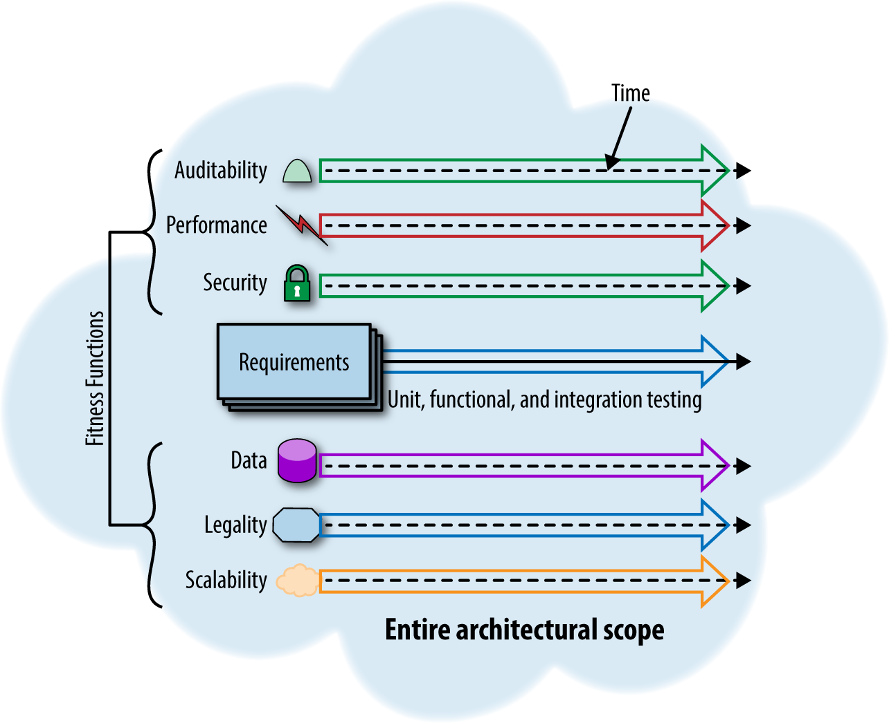

- > Ralph Johnson famously defined software architecture as “the important stuff (whatever that is).” The architect’s job is to understand and balance all of those important things (whatever they are).
- {{renderer :toc_6771442d-53ed-4749-ad25-ea5c68a6f7ea}}
- # Evolutionary Architecture
  background-color:: yellow
  collapsed:: true
	- the craft of software architecture manifests in the ability of architects to analyze business and domain requirements along with other important factors to find a solution that balances all concerns optimally.
	- **Unicyclist & Architect**
		- Visualize a unicyclist carrying boxes: _dynamic_ because she continues to adjust to stay upright and _equilibrium_ because she continues to maintain balance. In the software development ecosystem, each new innovation or practice may disrupt the status quo, forcing the establishment of a new equilibrium.
		- Metaphorically, we keep tossing more boxes onto the unicyclist’s load, forcing her to reestablish balance.
		- In many ways, architects resemble our hapless unicyclist, constantly both balancing and adapting to changing conditions.
		- The engineering practices of Continuous Delivery represent such a tectonic shift in the equilibrium
	- **Change is inevitable**
		- Consequently, we should architect our systems knowing the technical landscape will change.
		- Enterprise architects and other developers must learn to adapt. Part of the traditional reasoning behind making long-term plans was financial; software changes were expensive. However, modern engineering practices invalidate that premise by making change less expensive by automating formerly manual processes and other advances such as DevOps.
	- **Gradual degrade**
		- Even if the ecosystem doesn’t change, what about the gradual erosion of architectural characteristics that occurs? Architects design architectures, but then expose them to the messy real world of implementing things atop the architecture. How can architects protect the important parts they have defined?
		- How to prevent?
			- An unfortunate decay, often called _bit rot_, occurs in many organizations. Architects choose particular architectural patterns to handle the business requirements and “-ilities,” but those characteristics often accidentally degrade over time.
			- Once they have defined the important architectural characteristics, how can architects protect those characteristics to ensure they don’t erode?
			- For example, if an architect has designed an architecture for scalability, she doesn’t want that characteristic to degrade as the system evolves. Thus, __evolvability__ is a meta-characteristic, an architectural wrapper that protects all the other architectural characteristics.
			- a side effect of an evolutionary architecture is mechanisms to protect the important architecture characteristics. We call that __continual architecture__: building architectures that have no end state
	- **Incremental Change**
		- Incremental change describes two aspects of software architecture:
			- how teams build software incrementally
			- and how they deploy it.
		- Example of incremental change at the architectural level: the original service can run alongside the new one as long as other services need it. Teams can migrate to new behavior at their leisure (or as need dictates), and the old version is automatically garbage collected.
		- Making incremental change successful requires coordination of a handful of Continuous Delivery practices.
	- **Guided Change**
		- Once architects have chosen important characteristics, they want to guide changes to the architecture to protect those characteristics.
		- For that purpose, we borrow a concept from evolutionary computing called __fitness functions__. A fitness function is an objective function used to summarize how close a prospective design solution is to achieving the set aims.
		- as architecture evolves, we need mechanisms to evaluate how changes impact the important characteristics of the architecture and prevent degradation of those characteristics over time. The fitness function metaphor encompasses a variety of mechanisms to ensure architecture doesn’t change in undesirable ways, including metrics, tests, and other verification tools.
		- When an architect identifies an architectural characteristic they want to protect as things evolve, they define one or more fitness functions to protect that feature.
		- Architectural fitness functions allow decisions in the context of the organization’s needs and business functions, while making the basis for those decisions explicit and testable.
		- an approach that balances the need for rapid change and the need for rigor around systems and architectural characteristics.
		- 
	- **Architectural Dimensions**
		- enlightened architects have increasingly viewed software architecture as multidimensional. Continuous Delivery expanded that view to encompass operations. However, software architects often focus primarily on technical architecture, but that is only one dimension of a software project. If architects want to create an architecture that can evolve, they must consider all parts of the system that change affects.
		- To build evolvable software systems, architects must think beyond just the technical architecture.
		- Examples of _dimensions_ of architecture — the parts of architecture that fit together in often orthogonal ways. Some dimensions fit into what are often called _architectural concerns_ (the list of “-ilities”), but dimensions are actually broader, encapsulating things traditionally outside the purview of technical architecture.
		- To build an evolvable system, architects must think about how the system might evolve across all the important dimensions.
		- __Dimensions__
			- _Technical_: The implementation parts of the architecture: the frameworks, dependent libraries, and the implementation language(s).
			- _Data_: Database schemas, table layouts, optimization planning, etc. The database administrator generally handles this type of architecture.
			- _Security_: Defines security policies, guidelines, and specifies tools to help uncover deficiencies.
			- _Operational/System_: Concerns how the architecture maps to existing physical and/or virtual infrastructure: servers, machine clusters, switches, cloud resources, and so on.
		- __Partitioning Techniques__
			- A variety of partitioning techniques exist for conceptually carving up architectures. For example,
			- _the 4 + 1 architecture View Model_: focuses on different perspectives from different roles and was incorporated into the IEEE definition of software architecture, splits the ecosystem into logical, development, process, and physical views.
			- Simon Brown’s _C4 notation_ partitions concerns for aid in conceptual organization
	- **Conway's Law**
		- > Organizations which design systems … are constrained to produce designs which are copies of the communication structures of these organizations.
		- in a layered architecture where the team is separated by technical function (user interface, business logic, and so on), solving common problems that cut vertically across layers increases coordination overhead. People who have worked in startups and then have joined joined large multinational corporations have likely experienced the contrast between the nimble, adaptable culture of the former and the inflexible communication structures of the latter.
		- Conway was effectively warning software architects to pay attention not only to the architecture and design of the software, but also the delegation, assignment, and coordination of the work between teams.
		- Although each team may be good at their part of the design (e.g., building a screen, adding a back-end API or service, or developing a new storage mechanism), to release a new business capability or feature, all three teams must be involved in building the feature.
		- it’s hard for someone to change something if the thing she wants to change is owned by someone else. Software architects should pay attention to how work is divided and delegated to align architectural goals with team structure.
		- Many companies who build architectures such as microservices structure their teams around service boundaries rather than siloed technical architecture partitions (called [the Inverse Conway Maneuver](https://www.thoughtworks.com/radar/techniques/inverse-conway-maneuver:) ).
		- In microservices architecture, build cross-functional teams that matched the purview of the service: each service team consists of service owner, a few developers, a business analyst, a database administrator (DBA), a quality assurance (QA) person, and an operations person.
- # Enterprise Integration Approaches
  background-color:: yellow
  collapsed:: true
	- There have historically been four approaches to integration: file transfer, sharing a database, leveraging services, and asynchronous messaging. One way to look at these approaches is how they affect coupling in your architecture. Broadly, there are three types of coupling:
		- 1. **Spatial coupling (communication)**: Spatial coupling describes the requirement of a producer to know how to communicate with another and how to overcome error scenarios in the communication. A server side fault in an RPC operation, for example, is an example of spatial coupling.
		- 2. **Temporal coupling (buffering)**: Temporal coupling describes the requirement of a producer to be aware of, and available for, a consumer to share data. A decoupled system uses buffering so that a message may be sent, even if the consumer isn’t available to receive it.
		- 3. **Logical coupling (routing)**: Logical coupling describes the requirement of a producer to know how to connect with the consumer. One way to fix this is to introduce a central, shared location where both parties exchange data. Then, if a producer decides to move (change IP, put up a firewall, and so on) or decides to add extra steps before publishing messages, the client remains
- # Architecture Patterns
  background-color:: yellow
	- ## Domain Driven Design
	  background-color:: red
	  collapsed:: true
		- **Tutorial**
			- [Part 1: Domain-Driven Design and MVC Architectures](http://blog.fedecarg.com/2009/03/11/domain-driven-design-and-mvc-architectures/)
			- [Part 2: Domain-Driven Design: Data Access Strategies](http://blog.fedecarg.com/2009/03/12/domain-driven-design-and-data-access-strategies/)
			- [Part 3: Domain-Driven Design: The Repository](http://blog.fedecarg.com/2009/03/15/domain-driven-design-the-repository/)
			- [Part 4: Sample Application](http://blog.fedecarg.com/2009/03/22/domain-driven-design-sample-application/)
		- ### Domain Model
		  background-color:: pink
			-
			- Responsible only represent the concepts of the business, information about business situations and business rules
			- Named after the nouns in domain space
			- Should have both data and behaviour (basic idea of object oriented design)
			- well connected with other domain objects with relationship and structure
			- Examples of behaviour - validations, calculations, business rules
			- Only business logic - no persistence or presentation logic
			- Completely persistance ignorant (Mithra domain model breaks this)
		- ### Entities
		  background-color:: pink
			- something uniquely identifiable. Entities are the same if they have the same identity. e.g. Profile, Opteam
		- ### Value Objects
		  background-color:: pink
			- have no uniqueness
			- are the same if they have the same value
			- e.g., Number, Money, Address, Date, Duration, Color
			- 2 value objects are equal if all their fields are equal. Although all fields are equal, you don't need to compare all fields if a subset is unique - for example currency codes for currency objects are enough to test equality
			- Should be immutable
			- A value object should always override .equals() & .hashCode() in Java
			- [ValueObject](http://c2.com/cgi/wiki?ValueObject)
			- Diff between Value objects and Domain objects?
		- ### Data Transfer Object
		  background-color:: pink
			- Simply contain for a set of aggregated data that needs to be transfered across process or network boundary
			- holds only data - no business logic
			- Needs to be serializable to work with remote interfaces
			- Usually an assembler is used to transfer data between DTOs and Domain objects
		- ### Service Layer
		  background-color:: pink
			- Service layer on top of 'Behaviourally rich domain model' is recommended
			- Should be a thin layer
		- ### Anemic Domain Model (Anti-pattern)
		  background-color:: pink
			- Objects which has only data but no business logic.
			- All the business logic is implemented in a separate 'Service Layer' - Domain model is used only for data
			- Incurs all the cost of domain model - No benefits
			- Cost related to mapping to database
			- Martin Fowler - Service Layer, Model Layer
			- Eric Evans - Application Layer, Domain Layer
		- ### Aggregates
		  background-color:: pink
			- cluster of entities and value types
			- each aggregate is treated as one single unit
			- Each aggregate has one root entity known as the "Aggregate Root"
		- ### Repositories
		  background-color:: pink
			- responsible for domain objects persistence and retrieval
			- one respository per aggregate (not entities)
			- DDD uses repositories to create persistence ignorance
		- ### Domain Services
		  background-color:: pink
		- ### Specification
		  background-color:: pink
			- encapsulates a single rule. e.g., GoldCustomerSpec().is_satisfied_by(employee)
			- can also construct objects according to some specification
			- can also query objects that match some specification. e.g., repository.get_customers_satisfying(gold_customer_spec)
		- ### Factories
		  background-color:: pink
			- create complex domain objects especially useful for aggregates
		- ### BoundedContext
		  background-color:: pink
			- when you have multiple models, you should consider bounded context.
			- each BC is a self-contained mini application containing it's own model, persistence and code base
			- e.g., user, profiles, documents, data points, ACL
		- ### Context Map
		  background-color:: pink
			- To map between bounded contexts, you need Context map
	- ## Domain Specific Language (DSL)
	  background-color:: red
	  collapsed:: true
		- http://blog.jooq.org/2012/01/05/the-java-fluent-api-designer-crash-course/
		- http://www.infoq.com/articles/internal-dsls-java
		- http://weblogs.java.net/blog/carcassi/archive/2010/02/04/building-fluent-api-internal-dsl-java
	- ## Naked Objects Pattern
	  background-color:: red
	- ## MASA Architecture Pattern
	  background-color:: red
	  collapsed:: true
		- MASA (Mesh Application and Service Architecture) is a technical architectural pattern that describes how to design and structure modern applications. MASA applications are comprised of distributed app and service components.
		- MASA provides three architectural capabilities to power your digital business:
			- Multi-experience
			  logseq.order-list-type:: number
			- API mediation
			  logseq.order-list-type:: number
			- Multi-grained services
			  logseq.order-list-type:: number
		- A critical principle in MASA is ensuring that the individual parts of the application can change as needed without impacting other parts of the application. Because APIs can cause tight bindings between application components, all API interactions should be abstracted to ensure loose coupling and flexibility.
		- Pros
			- Supports , continuous improvement and agility.
			- Well-defined technical modularity of software.
		- Cons
			- Requires discipline to ensure components are loosely coupled and autonomous.
		- 
		- ### Multi-Experience
		  background-color:: pink
		  collapsed:: true
			- **Business Requirement**:  To provide a great user experience (UX) that extends beyond web and mobile interfaces to support voice, touch, wearables and immersive technologies.
			- Multi-experience design requires the backend (here it means the Experience API) to be flexible enough to support the different capabilities and workflows of every app in use. Because users don’t always use the same devices, and often switch from one device to another during their working day, the backend must offer a continuous experience.
			- To support this requirement, implement the backend functionality as *a mesh of services* - using **Backends for Frontends** (BFF) design pattern which offers customized, fit-for-purpose APIs to support the specific workflow required by the UX and orchestrate invocations of the generic backend services that implement shared application functionality.
				- A client app often interfaces to the backend via a BFF service. You may have a one-to-one mapping between frontend apps and BFF services, or a BFF service may support multiple
				  apps with similar experiences. A BFF service invokes or triggers the appropriate set of services to accomplish its tasks.
			- 
		- ### Multi-grained Services
		  background-color:: pink
		  collapsed:: true
			- The spectrum of granularity includes:
				- Large-grained **macroservices** that encapsulate and expose some or all of the capabilities of a monolithic application without refactoring.
				- Coarse-grained, independently deployable **miniservices** that implement domain-level functionality.
				- Fine-grained, independently deployable **microservices** that implement individual features.
			- 
		- ### API Mediation Layer
		  background-color:: pink
			- The API mediation layer intercepts communications between two application components (*app-to-service* or *service-to-service*) and enforces policies that apply to the communication.
			- A mediator can inject additional capabilities that can enrich and protect the interaction. e.g.,
				- **Monitoring traffic**: track API utilization for monetization purposes
				- **Securing interactions**: AuthN, AuthZ
				- **Managing traffic flow**: routing, load balancing, throttling, redirection, and auto-recovery of failed interactions
				- **Managing transformations**: filter out sensitive information, translate between different protocols
			- Technologies used to build this mediation layer include: API Gateway, Service Meshes, Event brokers, Network mediators, and homegrown, custom-built mediators.
				- typically you use an enterprise API gateway to mediate external inbound and outbound calls, and would use a service mesh to mediate service-to-service calls within a managed container cluster.
			- 
			- You can use **shared mediators** or in some cases use a dedicated mediator (such as a sidecar proxy) for an individual service.
			- {:height 748, :width 1267}
	- ## Composable Architecture Pattern
	  background-color:: red
	  collapsed:: true
		- Composable Architecture is a business-centric architectural pattern and software delivery approach that enables rapid delivery of new systems based on existing componentry.
		- Composability applies to business architecture and technology architecture levels.
			- At the **business architecture level**, composability refers to repurposing business capabilities and adjusting an organization’s operating model to deal with disruptions or to go after new business opportunities. It needs to implement new practices and processes to adjust the operating model.
			- At the **application software level**, composability refers to a two-stage delivery of application functionality.
				- In Stage 1, teams encapsulate or deliver modular application components that represent well-defined and encapsulated application capabilities. The components are registered and documented in a searchable catalog.
				- In Stage 2, teams compose and orchestrate the components to deliver new application products and experiences. In particular, composable architecture is designed to enable nonprofessional developers to build new applications using low-code and no-code tooling.
			- At the **technology level**, composability relies on MASA. Components must be loosely coupled, autonomous and shareable, and they must provide APIs that enable composition. Composable components tend to be coarse-grained and aligned with functional business domains. All three patterns, that is, MASA, middle platform and composable architecture, require disciplined modularity, but composable architecture adds the requirement to “package” components to ensure reusability. A component is not necessarily reusable just because it has an API. “Packaging” requires a deliberate effort to enable reuse.
		- Pros
			- Improves innovation, agility and business resilience.
			- Enables nonprofessional developers to deliver new products.
		- Cons
			- Significant effort and investment required to create a catalog of reusable components to provide tooling to nonprofessional developers.
	- ## Middle Platform Architecture Pattern
	  background-color:: red
		- Middle platform is a technical pattern that was introduced by Alibaba in China a decade ago to enable organizations to quickly implement digital business capabilities.
		- The key objectives of this pattern are to abstract the legacy systems, to support rapid innovation and to enable trial and error in the front office. It allows an organization to build new functionality without substantial changes to its core application systems. The abstraction layer enables teams to incrementally and iteratively refactor the back-office functionality into independent services as recommended by MASA.
		- Middle platform describes how to implement new functionality that extends and enhances core legacy applications. The new functionality is implemented as services that operate in a layer in front of the legacy systems — described as a middle platform between the front office and the back office.
		- Middle platform is one possible pattern that can be used to implement new functionality in a MASA application, and is also a candidate for composable components.
		- Data services in the middle platform aggregate data from both the new services and the core systems to create *data lakes* or a *data fabric* to enable business intelligence, analytics, and AI/ML capabilities.
		- 
	- ## MACH Architecture Pattern
	  background-color:: red
		- MACH (Microservices, API-First, Cloud-First, Headless Services) from https://machalliance.org/
			- `M` = Microservices: Business and technology services that are independently developed, deployed, and managed.
			  `A` = API-first: All functionality is exposed through APIs.
			  `C` = Cloud-native SaaS: All services are delivered as cloud services and include cloud characteristics such as elastic scaling and transparent updates.
			  `H` = Headless: Front-end presentation is decoupled from back-end logic.
		- MACH’s emphasis is on cloud-based domains implementing headless business services and APIs, and integrated by pro-code teams. Its architecture principles are related to Gartner’s MASA architecture based on the needs of its proponents in digital (e-)commerce.
		- ### Gartner Recommendations
		  background-color:: pink
			- Software engineering leaders considering MACH architecture for application development teams :
				- **Achieve specific design goals by using MACH**: Determine your architecture goals for each application domain, such as service replaceability, by comparing your application needs against the capabilities of MACH (as well as MASA).
				- **Improve maintainability and agility with MACH**: Use the MACH approach to modularity and composability, through analysis and build-versus-buy comparisons of your coarse-grained business services (the “Microservices” in MACH).
				- While MACH practices can benefit applications, avoid overadherence to MACH by limiting unwarranted investments in deploying multitenant SaaS for internal services that cannot be reused.
				- Explore MACH Alliance for its vendor-provided service catalog of MACH-compliant services. However, its MACH certification is primarily for marketing purposes by digital commerce vendors.
- # Agile Software Architecture
  background-color:: yellow
  collapsed:: true
	- Agile-centric or plan-centric development. Architecture before or refactoring later?
	- (-) academic style of writing.
	- attribute-driven design (ADD) method
	- business architecture process and organization
	- the Rationale Unified Process's 4+1 Views
	- Siemens' 4 Views
	- architectural separation of concerns
- # Software Architecture Documentation
  background-color:: yellow
	- ## Rationale Unified Process's 4+1 Views
	  background-color:: red
	  collapsed:: true
		- The 4+1 view model intends to describe an architecture using five concurrent views. Each of them addresses a specific set of concerns.
		- 1. **Logical view** denotes the partitions of the functional requirements onto the logical entities in an architecture. This view illustrates a design's object model in an object-oriented design approach.
		- 2. **Process view** is used to represent some types of ASRs, such as concurrency and performance. This view can be described at several levels of abstraction, each of which addresses an individual issue.
		- 3. **Development view** illustrates the organization of the actual software modules in the software development environment. This view also represents internal properties, such as reusability, ease of development, testability, and commonality. It is usually made up of subsystems, which are organized in a hierarchy of layers. This view also supports allocation of requirements and work division, cost assessment, planning, progress monitoring, and reasoning about reuse, portability and security.
		- 4. **Physical view** represents the mapping of the architectural elements captured in the logical, process, and development views onto networks of computers. This view takes into consideration the NFRs (e.g., availability, reliability (fault tolerance), performance (throughput), and scalability).
		- 5. **Scenarios** are used to demonstrate that the elements of other views can work together seamlessly.
- # Bibliography
  background-color:: yellow
	- Books
		- Patterns of Enterprise Application Architecture - Martin Fowler
		- Agile Software Architecture
		- Building Evolutionary Architecture - Rebecca Parsons, Neal Ford, Patrick Kua
	- http://martinfowler.com/bliki/ValueObject.html
	- http://martinfowler.com/eaaCatalog/dataTransferObject.html
	- http://java.sun.com/blueprints/patterns/TransferObject.html