# Apache HCatalog
collapsed:: true
	- provides one consistent data model for various Hadoop tools.
	- provides a shared schema.
	- allows users to see when shared data is available.
	- decouples tools like Pig and Hive from data location, data format, etc.
	- Based currently on Hive's metastore.
- # Apache Hive
  collapsed:: true
	- Hive is a data warehouse system layer build on Hadoop.
	- Allows you to define a structure for your unstructured Big Data.
	- Simplifies analysis and queries with an SQL-like scripting language called HiveQL for adhoc querying on HDFS data.
	- Hive is
		- not a relational database. It uses a database to store metadata, but the data that Hive processes is stored in HDFS.
		- not designed for online transaction processing. not suited for real-time queries and row-level updates.
	- Components
		- CLI, Web interface (Beeswax?), Micrsoft HDInsight
	- When to use Hive?
		- for adhoc querying; for analysts with SQL familiarity
	- HiveQL - SQL-like syntax. based on SQL-92 specification.
	- Hive Table
		- A Hive Table consists of (1) Data: typically a file or group of files in HDFS (2) Schema: in the form of metadata stored in a database
		- Schema and data are separate
		- A schema can be defined for existing data; Data can be added/removed independently; Before querying data in HDFS using Hive, a schema needs to be defined.
- # Apache Pig
  collapsed:: true
	- 3 components of Pig:
		- Pig Latin
		- Grunt
		- Piggybank
	- ## 1. Pig Latin
	  collapsed:: true
		- High level scripting language to describe data flow - statements translate into a series of MapReduce jobs - can invoke Java, JRuby or Jython programs and vice versa - User defined functions (UDF) can be written in Java and uploaded as jar.
		- Sample Pig Latin script
			- ```
			  a = LOAD 'nyse_stocks' using org.apache.hcatalog.pig.HCatLoader();
			  b = filter a by stock_symbol == 'IBM';
			  c = group b all;
			  d = foreach c generate AVG(b.stock_volume);
			  dump d;
			  ```
		- Pig Latin script describes a DAG (directed acyclic graph) - http://vkalavri.com/tag/apachepig/
		- Pig script is not converted to a MapReduce job unless a DUMP/STORE command is invoked.
			- ```
			  runs = foreach batting generate $0 as playerID, $1 as year, $8 as runs;
			  (playerID,yearID,R)
			  (john,2008,10)
			  (john,2009,22)
			  (john,2010,0)
			  (adam,2008,58)
			  (adam,2009,105)
			  (adam,2010,106)
			  (adam,2011,118)
			  
			  grp_data = group runs by (year);
			  (2008, [(john,2008,10), (adam,2008,58)])
			  (2009, [(john,2009,22), (adam,2009,105)])
			  (2010, [(john,2010,0),  (adam,2010,106)])
			  (2011, [(adam,2011,118)])
			  ```
	- ## 2) Grunt
	  Interactive command-line shell
	- ## 3) Piggybank
	  collapsed:: true
		- A repository to store the UDFs
		- When to use Pig?
			- for ETL purposes; for preparing data for easier analysis; when you have a long series of steps to perform.
		- Data Model difference b/w Pig and Hive
			- In Pig, data objects exist and are operated on in the script. They are deleted after the script completes. They can be stored explicitly for later use.
			- In Hive, data objects exist in Hadoop data store. After every line of execution, results are stored in Hadoop which can be useful for debugging.
- # Apache Storm
  collapsed:: true
	- 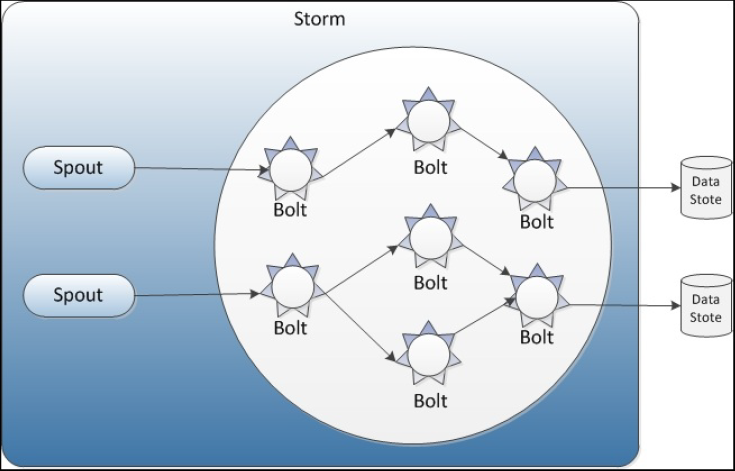
	- Storm is an open source, distributed, reliable, and fault-tolerant system for processing streams of large volumes of data in real-time. It supports many use cases, such as real-time analytics, online machine learning, continuous computation, and the Extract Transformation Load (ETL) paradigm.
	- **Features**
	  collapsed:: true
		- Easy to program
		- Supports multiple programming languages
		- Fault-tolerant - The Storm cluster takes care of workers going down,  reassigning tasks when necessary.
		- Scalable
		- Reliable - All messages are guaranteed to be processed at least once. If there are errors, messages might be processed more than once, but you’ll never lose any message.
		- Fast
		- Transactional - You can get exactly once messaging semantics for pretty much any computation.
	- ## Components
	  collapsed:: true
		- 
		- **Spout**:
			- The input stream of a Storm cluster is handled by a component called a spout.
			- This is a continuous stream of log data.
		- **Bolt**:
			- The spout passes the data to a component called a bolt, which transforms it in some way. A bolt either persists the data in some sort of storage, or passes it to some other bolt.
			- You can imagine a Storm cluster as a chain of bolt components that each make some kind of transformation on the data exposed by the spout.
			- For example, emitting a stream of trend analysis by processing a stream of tweets.
		- **Topology**
			- The arrangement of all the components (spouts and bolts) and their connections is called a topology.
			- A topology in Storm runs across many worker nodes on different machines.
			- All topology nodes should be able to run independently with no shared data between processes (i.e., no global or class variables) since these processes may run on different machines.
		- **Node**
			- In a Storm cluster, nodes are organized into a master node that runs continuously.
			- There are two kind of nodes in a Storm cluster: *master node- and *worker nodes-
		- **Nimbus**
			- Master node run a daemon called *Nimbus*, which is responsible for distributing code around the cluster, assigning tasks to each worker node, and monitoring for failures.
		- **Supervisor**
			- Worker nodes run a daemon called *Supervisor*, which executes a portion of a topology.
		- Since Storm keeps all cluster states either in Zookeeper or on local disk, the daemons are stateless and can fail or restart without affecting the health of the system
		- Underneath, Storm makes use of zeromq, an advanced, embeddable networking library that provides wonderful features that make Storm possible
	- ## Difference between Storm & Spark
	  collapsed:: true
		- | | **Storm*- | **Spark*- |
		  | **Type**| Task parallel Continuous Computation Engine | Data Parallel Batch Processing Engine |
		  | **Processing Model**| Microbatching is performed via Trident API, but cannot perform streaming in the strictest sense.| Stream processing engine that can do micro-batching. Continuous computation can be performed via Streaming API | 
		  | **Workflow**| Workflows as DAGs | MapReduce style workflows |
		  | **Cluster**| Zookeeper clustering, Master/minion | Has its own master/server processes; supports Hadoop, YARN, Mesos |
		  | **File System**| Can read/write HDFS | Requires shared FS like HDFS, S3, NFS |
		  | **Message Parsing*- | Netty (default), ZeroMQ | Netty & Akka|
	- ## Example: Word Counter
	  collapsed:: true
		- A simple topology which reads a file and counts word occurrence.
		- 
		- ### Main Program
		  collapsed:: true
			- `TopologyBuilder` tells Storm how the nodes are arranged and how they exchange data
			- The spout and the bolts are connected using `shuffleGroupings`. This type of grouping tells Storm to send messages from the source node to target nodes in randomly distributed fashion.
			- `Config` object containing the topology configuration, which is merged with the cluster configuration at run time and sent to all nodes with the `prepare` method.
			  
			  
			  ```java Main Program
			  public static void main(String[] args) throws InterruptedException {
			    //Topology definition
			    TopologyBuilder builder = new TopologyBuilder();
			    builder.setSpout("word-reader", new WordReader());
			    builder.setBolt("word-normalizer", new WordNormalizer())
			    .shuffleGrouping("word-reader"); //output of word-reader is fed into this bolt
			    builder.setBolt("word-counter", new WordCounter(),2)
			    .fieldsGrouping("word-normalizer", new Fields("word")); //output of word-normalizer is fed into this bolt
			  
			    //Configuration
			    Config conf = new Config();
			    conf.put("wordsFile", args[0]); //input file to process
			    conf.setDebug(false); // should print all messages exchanged between nodes?
			    conf.put(Config.TOPOLOGY_MAX_SPOUT_PENDING, 1);
			  
			    //Topology run
			    LocalCluster cluster = new LocalCluster(); // since we are running in local mode
			    cluster.submitTopology("Getting-Started-Toplogie", conf, builder.createTopology());
			    Thread.sleep(1000);
			    cluster.shutdown(); // in production environment, topology runs continuously
			  }
			  ```
		- ### Spout
		  collapsed:: true
			- `open` method is called first. In the example, it opens a file reader
			- `nextTuple` method is called continuously forever. This method emits values to be processed by bolts. In the example, it emits a value per line from the file.
			- A spout emits a list of defined fields. This architecture allows to have different kinds of bolts reading the same spout stream, which can then define fields for other bolts to consume and so on.
			- A tuple is a named list of values, which can be of any type of Java object (serializable object). By default, Storm can serialize common types like strings, byte arrays, `ArrayList`, `HashMap`, and `HashSet`.
			  
			  ```java Spout that reads the text file
			  public class WordReader implements IRichSpout {
			  private SpoutOutputCollector collector;
			  private FileReader fileReader;
			  private boolean completed = false;
			  private TopologyContext context;
			  
			  // We will create the file and get the collector object
			  public void open(
			  Map conf, // conf object created during topology definition
			  TopologyContext context, // contains topology data
			  SpoutOutputCollector collector //enables to emit the data for bolts to process
			  ) {
			  try {
			  this.context = context;
			  this.fileReader = new FileReader(conf.get("wordsFile").toString());
			  } catch (FileNotFoundException e) {
			  throw new RuntimeException("Error reading file	["+conf.get("wordFile")+"]");
			  }
			  this.collector = collector;
			  }
			  
			  // this method emits a tuple for each line in file
			  public void nextTuple() {
			  // The nextuple it is called forever, so if we have already completed reading the file ,we will wait and then return
			  if(completed){
			  try {
			  Thread.sleep(1000);
			  } catch (InterruptedException e) {
			  //Do nothing
			  }
			  return;
			  }
			  
			  //Open the reader
			  String str;
			  BufferedReader reader = new BufferedReader(fileReader);
			  try{
			  //Read all lines
			  while((str = reader.readLine()) != null){
			  this.collector.emit(new Values(str),str); // emit each line from file
			  }
			  }catch(Exception e){
			  throw new RuntimeException("Error reading tuple",e);
			  }finally{
			  completed = true;
			  }
			  }
			  
			  // declare the output field 
			  public void declareOutputFields(OutputFieldsDeclarer declarer) {
			  declarer.declare(new Fields("line"));
			  }
			  
			  public boolean isDistributed() {return false;}
			  public void close() {}
			  
			  public void ack(Object msgId) {
			  System.out.println("OK:"+msgId);
			  }
			  
			  public void fail(Object msgId) {
			  System.out.println("FAIL:"+msgId);
			  }
			  }
			  ```
		- ### Bolt
		  collapsed:: true
			- We now have a spout that reads from a file and emits one tuple per line. We need to
			  create two bolts to process these tuples
			- `execute` method is called once per typle received. A bolt can emit 0, 1 or many tuples for each tuple received.
			- After each tuple is processed, the collector’s `ack()` method is called to indicate that processing has completed successfully. If the tuple could not be processed, the collector’s `fail()` method should be called.
			  
			  ```java Bolt that normalizes the line
			  public class WordNormalizer implements IRichBolt {
			  private OutputCollector collector;
			  
			  public void execute(Tuple input) {
			  String sentence = input.getString(0);
			  String[] words = sentence.split(" ");
			  for(String word : words){
			  word = word.trim();
			  if(!word.isEmpty()){
			  word = word.toLowerCase();
			  collector.emit(Arrays.asList(input),new Values(word));
			  }
			  }
			  collector.ack(input); // acknowledgement indicates the tuple is processed successfully
			  }
			  
			  public void prepare(Map stormConf, TopologyContext context, OutputCollector collector) {
			  this.collector = collector;
			  }
			  
			  // The bolt will only emit the field "word"
			  public void declareOutputFields(OutputFieldsDeclarer declarer) {
			  declarer.declare(new Fields("word"));
			  }
			  
			  public void cleanup() {}
			  }
			  ```
			- The `execute` method in the next bolt uses a map to collect and count the words.
			- When the topology terminates, the `cleanup()` method is called and prints out the map. (This is just an example, but normally you should use the `cleanup()` method to close active connections and other resources when the topology shuts down.)
			  
			  ```java Bolt that counts the words
			  public class WordCounter implements IRichBolt {
			  Integer id;
			  String name;
			  Map<String, Integer> counters;
			  private OutputCollector collector;
			  
			  @Override
			  public void execute(Tuple input) {
			  String str = input.getString(0);
			  if(!counters.containsKey(str)){
			  counters.put(str, 1);
			  }else{
			  Integer c = counters.get(str) + 1;
			  counters.put(str, c);
			  }
			  collector.ack(input);
			  }
			  
			  @Override
			  public void cleanup() {
			  System.out.println("-- Word Counter ["+name+"-"+id+"] --");
			  for(Map.Entry<String, Integer> entry : counters.entrySet()){
			  System.out.println(entry.getKey()+": "+entry.getValue());
			  }
			  }
			  
			  @Override
			  public void prepare(Map stormConf, TopologyContext context, OutputCollector collector) {
			  this.counters = new HashMap<String, Integer>();
			  this.collector = collector;
			  this.name = context.getThisComponentId();
			  this.id = context.getThisTaskId();
			  }
			  
			  }
			  ```
			- - *
- # Apache Spark
	- TBD
- # Apache Kafka
  background-color:: yellow
  collapsed:: true
	- ## Overview
	  collapsed:: true
		- Apache Kafka is a publish/subscribe messaging system - often described as a *“distributed commit log”*. A filesystem or database commit log is designed to provide a durable record of all transactions so that they can be replayed to consistently build the state of a system. Similarly, data within Kafka is stored durably, in order, and can be read deterministically. In addition, the data can be distributed within the system to provide additional protections against failures, as well as significant opportunities for scaling performance.
		- Due to the overheads associated with JMS and its various implementations and limitations with the scaling architecture, LinkedIn decided to build Kafka to address its need for monitoring activity stream data and operational metrics such as CPU,
		  I/O usage, and request timings.
		- ### Characteristics
		  collapsed:: true
			- an open source, distributed, partitioned, and *replicated commit-log-based- publish-subscribe messaging system, mainly designed with the following characteristics:
			- **Persistent messaging**: To derive the real value from big data, any kind of information loss cannot be afforded. Apache Kafka is designed with `O(1)` disk structures that provide constant-time performance even with very large volumes of stored messages that are in the order of TBs. With Kafka, messages are persisted on disk as well as replicated within the cluster to prevent data loss.
			- **High throughput**: Keeping big data in mind, Kafka is designed to work on commodity hardware and to handle hundreds of MBs of reads and writes per second from large number of clients.
			- **Distributed**: Apache Kafka with its cluster-centric design explicitly supports message partitioning over Kafka servers and distributing consumption over a cluster of consumer machines while maintaining per-partition ordering semantics. Kafka cluster can grow elastically and transparently without any downtime.
			- **Multiple client support**: The Apache Kafka system supports easy integration of clients from different platforms such as Java, .NET, PHP, Ruby, and Python.
			- **Real time**: Messages produced by the producer threads should be immediately visible to consumer threads; this feature is critical to event-based systems such as ***Complex Event Processing (CEP)**- systems.
			- Kafka brokers and consumers use Zookeeper to get the state information and to track message offsets, respectively
		- ### Design Facts
		  collapsed:: true
			- The fundamental backbone of Kafka is message caching and storing on the fiesystem.
			- In Kafka, data is immediately written to the OS kernel page. Caching and flushing of data to the disk are configurable.
			- Kafka provides longer retention of messages even after consumption, allowing consumers to re-consume, if required.
			- Kafka uses a message set to group messages to allow lesser network overhead.
			- Unlike most messaging systems, where metadata of the consumed messages are kept at the server level, in Kafka the state of the consumed messages is maintained at the consumer level. This also addresses issues such as:
			- Losing messages due to failure
			- Multiple deliveries of the same message
			- In Kafka, producers and consumers work on the traditional push-and-pull model, where producers push the message to a Kafka broker and consumers pull the message 	from the broker.
			- Kafka does not have any concept of a master and treats all the brokers as peers. This approach facilitates addition and removal of a Kafka broker at any point, as the 	metadata of brokers are maintained in Zookeeper and shared with consumers.
			- Producers also have an option to choose between asynchronous or synchronous mode
			  to send messages to a broker.
			- Kafka can be compared with Scribe or Flume as it is useful for processing activity stream data; but from the architecture perspective, it is closer to traditional messaging systems such as ActiveMQ or RabitMQ.
		- ### Use cases
		  collapsed:: true
			- **Log Aggregation**: the process of collecting physical log files from servers and putting them in a central place (a file server or HDFS) for processing.
			- **Stream processing**: an example is raw data consumed from topics and enriched or transformed into new Kafka topics for further consumption. Hence, such processing is also called 'stream processing'.
			- **Commit logs**: Kafka can be used to represent external commit logs for any large scale distributed system. Replicated logs over Kafka cluster help failed nodes to recover their states.
			- **Click stream tracking**: data such as page views, searches, etc. are published to central topics with one topic per activity type as the volume is very high. These topic are available for subscription by many consumers for a wide range of apps.
			- **Messaging**: Message brokers are used for decoupling data processing from data producers. Kafka can replace many popular message brokers as it offers better throughput, built-in partitioning, replication, and fault-tolerance.
	- ## Messages
	  collapsed:: true
		- The unit of data within Kafka is called a message.
		- A message is simply an array of bytes, as far as Kafka is concerned, so the data contained within it does not have a specific format or meaning to Kafka.
		- **Message Key**:
			- Messages can have an optional bit of metadata which is referred to as a key. The key is also a byte array, and as with the message, has no specific meaning to Kafka.
			- Keys are used when messages are to be written to partitions in a more controlled manner.
			- The simplest such scheme is to treat partitions as a hash ring, and assure that messages with the same key are always written to the same partition.
		- **Message Batches**
			- For efficiency, messages are written into Kafka in batches.
			- A batch is just a collection of messages, all of which are being produced to the same topic and partition.
			- Batching, of course, presents a tradeoff between latency and throughput: the larger the batches, the more messages that can be handled per unit of time, but the longer it takes an individual message to propagate.
		- **Message Compression**
			- Batches can be compressed by producer using either *GZIP- or *Snappy- compression protocols, which provides for more efficient data transfer and storage at the cost of some processing power.
		- **Message Schema**
			- While messages are opaque byte arrays to Kafka itself, it is recommended that additional structure (schema) to be imposed on the message content so that it can be easily understood.
			- Many options available for message schema: JSON, XML. But Kafka users prefer Apache Avro since it provides a compact serialization format, schemas that are separate from the message payloads and that do not require generated code when they change, as well as strong data typing and schema evolution, with both backwards and forwards compatibility.
	- ## Topic & Partition
	  collapsed:: true
		- | 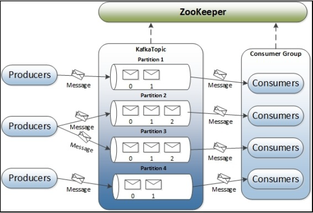 | 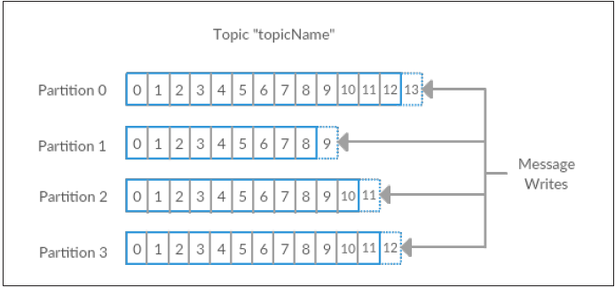 |
		- A topic is a category or feed name to which messages are published by the message producers. In Kafka, topics are partitioned and each partition is represented by the ordered immutable sequence of messages. A Kafka cluster maintains the partitioned log for each topic. Each message in the partition is assigned a unique sequential ID called the **offset**.
		- The term **stream** is often used when discussing data within systems like Kafka. Most
		  often, a stream is considered to be a single topic of data, regardless of the number of partitions. This represents a single stream of data moving from the producers to the consumers.
		- In Kafka topics, every partition is mapped to a logical log file that is represented as a set of segment files of equal sizes. Every partition is an ordered, immutable sequence of messages; each time a message is published to a partition, the broker appends the message to the last segment file.
		- These segment files are flushed to disk after configurable numbers of messages have been published or after a certain amount of time has elapsed. Once the segment file is flushed, messages are made available to the consumers for consumption.
		- Partitions are also the way that Kafka provides redundancy and scalability.
		- Each partition can be hosted on a different server, which means that a single topic can be scaled horizontally across multiple servers to provide for performance far beyond the ability of a single server.
		- All the message partitions are assigned a unique sequential number called the ***offset***, which is used to identify each message within the partition. Each partition is optionally replicated across a configurable number of servers for fault tolerance.
		- Each partition available on either of the servers acts as the leader and has zero or more servers acting as followers. Here the leader is responsible for handling all read and write requests for the partition while the followers asynchronously replicate data from the leader. Kafka dynamically maintains a set of ***in-sync replicas (ISR)*** that are caught-up to the leader and always persist the latest ISR set to ZooKeeper.
		- If the leader fails, one of the followers (in-sync replicas) will automatically become the new leader.
		- In a Kafka cluster, each server plays a dual role; it acts as a leader for some of its partitions and also a  follower for other partitions. This ensures the load balance within the Kafka cluster.
	- ## Broker & Cluster
	  collapsed:: true
		- 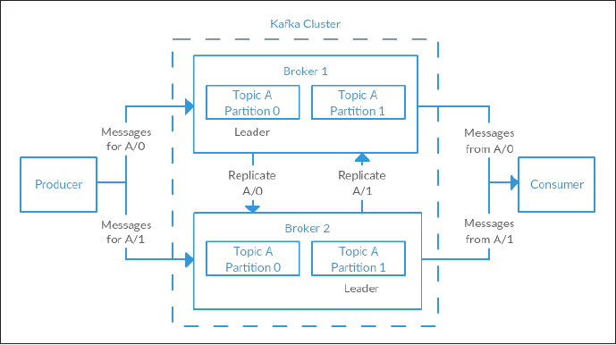
		- A single Kafka server is called a broker.
		- The broker receives messages from producers, assigns offsets to them, and commits the messages to storage on disk. It also services consumers, responding to fetch requests for partitions and responding with the messages that have been committed to disk.
		- **Throughput**: Depending on the specific hardware and its performance characteristics, a single broker can easily handle thousands of partitions and millions of messages per second. Kafka brokers are designed to operate as part of a cluster.
		- Within a cluster of brokers, one will also function as the ***cluster controller*** (elected automatically from the live members of the cluster). The controller is responsible for administrative operations, including assigning partitions to brokers and monitoring for broker failures.
		- A partition is owned by a single broker in the cluster, and that broker is called the **leader** for the partition. A partition may be assigned to multiple brokers, which will result in the partition being replicated. This provides redundancy of messages in the partition, such that another broker can take over leadership if there is a broker failure. However, all consumers and producers operating on that partition must connect to the leader.
		- Brokers are by design *stateless*. It does not maintain a record of what is consumed by whom. The message state of any consumed message is maintained within the message consumer.
		-
		- ### Message Retention
			- A key feature of Apache Kafka is that of retention, or the durable storage of messages for some period of time.
			- Kafka brokers are configured with a default retention setting for topics
				- **time-based**: retaining messages for some period of time (e.g. 7 days) or
				- **size-based**: until the topic reaches a certain size in bytes (e.g. 1 gigabyte). Once these limits are reached, messages are expired and deleted so that the retention configuration is a minimum amount of data available at any time.
				- **log-compact-based**: Topics may also be configured as ***log compacted***, which means that Kafka will retain only the last message produced with a specific key.
				- Log compaction ensures the following:
					- Ordering of messages is always maintained
					- The messages will have sequential offsets and the offset never changes
					- Reads progressing from offset 0, or the consumer progressing from the start of the log, will see at least the final state of all records in the order they were written
			- Individual topics can also be configured with their own retention settings, so messages can be stored for only as long as they are useful.
			- For example, a tracking topic may be retained for several days, while application metrics may be retained for only a few hours.
	- ## Zookeeper
	  collapsed:: true
		- 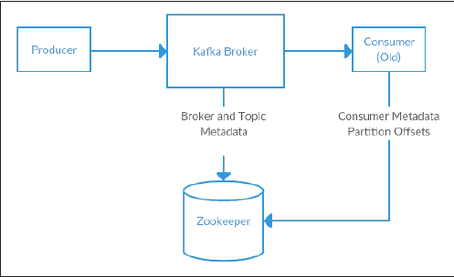
		- Apache Kafka uses Zookeeper to store metadata information about the Kafka cluster,
		  as well as consumer client details.
		- ZooKeeper serves as the coordination interface between the Kafka broker and consumers. ZooKeeper allows distributed processes to coordinate with each other through a shared hierarchical name space of data registers (we call these registers znodes), much like a file system.
		- The main differences between ZooKeeper and standard filesystems are that every *znode- can have data associated with it and znodes are limited to the amount of data that they can have.
		- ZooKeeper was designed to store coordination data: status information, configuration, location information, and so on.
		- While it is possible to run a Zookeeper server using scripts contained within the Kafka distribution, it is trivial to install a full version of Zookeeper from the distribution.
	- ## Producer
	  collapsed:: true
		- 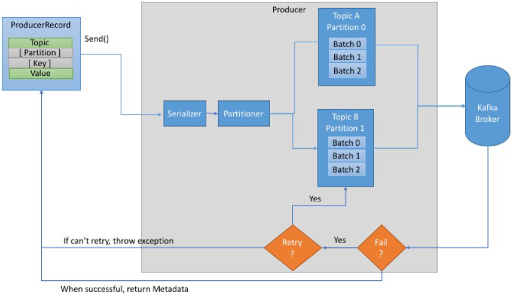
		- Producers publish data to the topics by choosing the appropriate partition within the topic. For load balancing, the allocation of messages to the topic partition can be done in a round-robin fashion or using a custom defined function.
		- Example of a producer: Web Application logs, page visits, clicks, social media activities, Web Analytics logs.
		- By default, the producer does not care what partition a specific message is written to and will balance messages over all partitions of a topic evenly. In some cases, the producer will direct messages to specific partitions. This is typically done using the message key and a partitioner that will generate a hash of the key and map it to a specific partition. This assures that all messages produced with a given key will get written to the same partition. The producer could also use a custom partitioner that follows other business rules for mapping messages to partitions
		- ### Message Delivery Semantics
			- There are multiple possible ways to deliver messages, such as:
				- Messages are never redelivered but may be lost
				- Messages may be redelivered but never lost
				- Messages are delivered once and only once
			- When publishing, a message is committed to the log. If a producer experiences a network error while publishing, it can never be sure if this error happened before or after the message was committed.
			- Once committed, the message will not be lost as long as either of the brokers that replicate the partition to which this message was written remains available. For guaranteed message publishing, configurations such as getting acknowledgements and the waiting time for messages being committed are provided at the producer’s end.
			- The producer connects to any of the alive nodes and requests metadata about the leaders for the partitions of a topic. This allows the producer to put the message directly to the lead broker for the partition.
			- The Kafka producer API exposes the interface for semantic partitioning by allowing the producer to specify a key to partition by and using this to hash to a partition. Thus, the producer can completely control which partition it publishes messages to
			- **Steps to send a message**
				- Create a `ProducerRecord`, which must include
					- the **topic** to send the record to
					- and a **value/content** being sent
					- optionally specify **a key** and / or **a partition**.
				- After sending the `ProducerRecord`, the producer will **serialize*- the *key- and *value- objects to `ByteArray`s, so they can be sent over the network.
				- Next, the data is sent to a **partitioner**. If a partition is specified in the `ProducerRecord`, then it doesn't do anything and simply returns the partition specified. If not, the *partitioner- will choose a partition for us, usually based on the `ProducerRecord` key.
				- Once a partition is selected, the producer knows which topic and partition the record will go to. It then adds the record to a batch of records that will also be sent to the same topic and partition.
				- A separate thread is responsible for sending those batches of records to the appropriate Kafka brokers. When the broker receives the messages, it sends back a response.
				- If the messages were successfully written to Kafka, it will return a `RecordMetadata` object with the topic, partition and the offset the record in the partition. If the broker failed to write the messages, it will return an error. When the producer receives an error, it may retry sending the message few more times before giving up and returning an error.
	- ## Consumer
	  collapsed:: true
		- 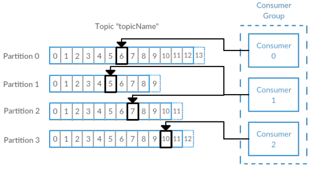
		- The consumer subscribes to one or more topics and reads the messages in the order they were produced. The consumer keeps track of which messages it has already consumed by keeping track of the offset of messages. The offset is another bit of metadata, an integer value that continually increases, that Kafka adds to each message as it is produced.
		- Each message within a given partition has a unique offset. By storing the offset of the last consumed message for each partition, either in Zookeeper or in Kafka itself, a consumer can stop and restart without losing its place.
		- Consumers work as part of a **consumer group**. This is one or more consumers that work together to consume a topic. The group assures that each partition is only consumed by one member.
		- In the figure here, there are three consumers in a single group consuming a topic. Two of the consumers are working from one partition each, while the third consumer is working from two partitions. The mapping of a consumer to a partition is often called *ownership- of the partition by the consumer.
		- In this way, consumers can horizontally scale to consume topics with a large number of messages. Additionally, if a single consumer fails, the remaining members of the group will rebalance the partitions being consumed to take over for the missing member.
		- A message within a topic is consumed by a single consumer within the consumer group and, if the requirement is such that a single message is to be consumed by multiple consumers, all these consumers need to be kept in different consumer groups.
		- Consumers always consume messages from a particular partition sequentially and also acknowledge the message offset. This acknowledgement implies that the consumer has consumed all prior messages. Consumers issue an asynchronous pull request containing the offset of the message to be consumed to the broker and get the buffer of bytes.
		- **Stateful Consumer**
		  collapsed:: true
			- The message state of any consumed message is maintained within the message consumer.
			- Consumers store the state in Zookeeper but Kafka also allows storing it within other storage systems used for OLTP applications as well.
			- If this is poorly implemented, the consumer ends up in reading the same message multiple times.
			- Message retention policy empowers consumers to deliberately rewind to an old offset and re-consume data although, as with traditional messaging systems, this is a violation of the queuing contract with consumers.
		- **Consumer Types**
		  collapsed:: true
			- **Offline consumers**: that are consuming messages and storing them in Hadoop or traditional data warehouse for offline analysis
			- **Near real-time consumers**:  that are consuming messages and storing them in any NoSQL datastore, such as HBase or Cassandra, for near real-time analytics
			- **Real-time consumers**: such as Spark or Storm, that filter messages in-memory and trigger alert events for related groups
		- For consumers, Kafka guarantees that the message will be delivered at least once by reading the messages, processing the messages, and finally saving their position. If the consumer process crashes after processing messages but before saving their position, another consumer process takes over the topic partition and may receive the first few messages, which are already processed by crashed consumer.
		- While subscribing, the consumer connects to any of the live nodes and requests metadata about the leaders for the partitions of a topic. This allows the consumer to communicate directly with the lead broker receiving the messages. Kafka topics are divided into a set of ordered partitions and each partition is consumed by one consumer only.
		- Once a partition is consumed, the consumer changes the message offset to the next partition to be consumed. This represents the states about what has been consumed and also provides the flexibility of deliberately rewinding back to an old offset and re-consuming the partition.
		- ***High-level Consumer API***
		  collapsed:: true
			- is used when only data is needed and the handling of message offsets is not required.
			- This API hides broker details from the consumer and allows effortless communication with the Kafka cluster by providing an abstraction over the low-level implementation.
			- The high-level consumer stores the last offset (the position within the message partition where the consumer left off consuming the message), read from a specific partition in Zookeeper.
			- This offset is stored based on the consumer group name provided to Kafka at the beginning of the process.
			- does not allow consumers to control interactions with brokers. Also known as *simple consumer API*.
		- ***Low-level Consumer API***
		  collapsed:: true
			- is stateless and provides fine grained control over the communication between Kafka broker and the consumer.
			- It allows consumers to set the message offset with every request raised to the broker and maintains the metadata at the consumer’s end.
			- This API can be used by both online as well as offline consumers such as Hadoop.
			- These types of consumers can also perform multiple reads for the same message or manage transactions to ensure the message is consumed only once.
		- **Number of Consumers and partitions**
		  collapsed:: true
			- - say `c` = # of consumers, `p` = # of partitions
			- | c < p | c==p | c>p |
			  |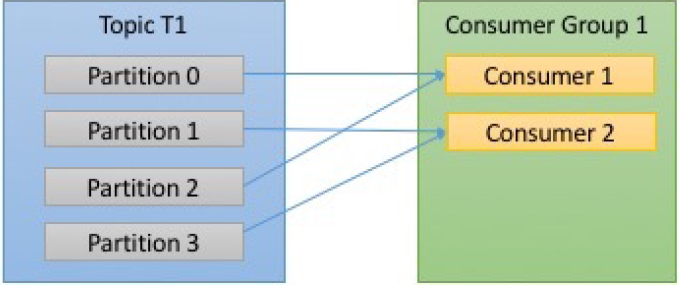||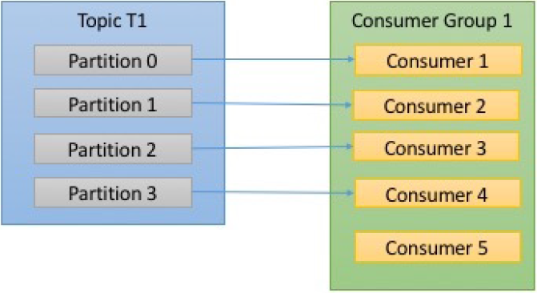|
			- As seen above, if a new consumer is added to the consumer group, Kafka automatically assigns it a partition to consume from.
			- A consumer can read from multiple partitions. However, one partition is not consumed by more than one consumer.
			- In the example above, if we add a new consumer group `g2` with a single consumer, this consumer will get all the messages in topic `t1` independently of what `g1` is doing.
			- If a consumer crashses or leaves the group, the partition it used to consume from is automatically reassigned to another consumer. Same thing happens when a new partition is added to the topic as well. The event in which partition ownership is moved from one consumer to another is called a ***rebalance***. This provides both high availability and scalability.
	- ## Clusters
	  collapsed:: true
		- **Types**
			- A single node—single broker cluster
			- A single node—multiple broker clusters
			- Multiple nodes—multiple broker clusters
			- | Single node - Singe Broker Cluster | Single node - Multiple Broker Cluster | Multiple node - Multiple Broker Cluster |
			  |  | 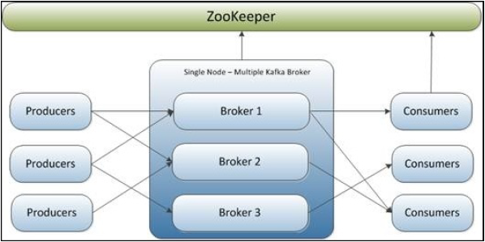 | 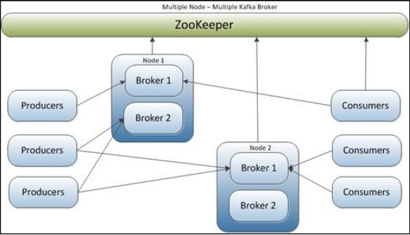 |
		- **Multiple Clusters**
		  collapsed:: true
			- 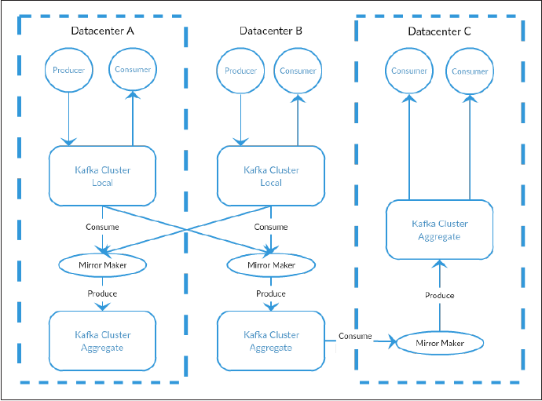
			- As Kafka deployments grow, it is often advantageous to have multiple clusters for the following reasons:
				- Segregation of types of data
				- Isolation for security requirements
				- Multiple datacenters (disaster recovery)
			- **Mirror Maker**
				- The replication mechanisms within the Kafka clusters are designed only to work within a single cluster, not between multiple clusters. For cross-cluster replication, Kafka provides a tool called *Mirror Maker*.
				- At it’s core, Mirror Maker is simply a Kafka consumer and producer, linked together with a queue. Messages are consumed from one Kafka cluster and produced to another.
	- ## Design
	  collapsed:: true
		- ### Message Compression
		  collapsed:: true
			- The lead broker is responsible for serving the messages for a partition by assigning unique logical offsets to every message before it is appended to the logs. In the case of compressed data, the lead broker has to decompress the message set in order to assign offsets to the messages inside the compressed message set. Once offsets are assigned, the leader again compresses the data and then appends it to the disk. The lead broker follows this process for every compressed message sets it receives, which causes CPU load on a Kafka broker.
			- Message compression techniques are very useful for mirroring data across datacenters using Kafka, where large amounts of data get transferred from active to passive datacenters in the compressed format.
		- ### Replication
		  collapsed:: true
			- In replication, each partition of a message has `n` replicas and can afford `n-1` failures to guarantee message delivery. Out of the n replicas, one replica acts as the lead replica for the rest of the replicas. Zookeeper keeps the information about the lead replica and the current follower **in-sync replicas (ISR)**. The lead replica maintains the list of all in-sync follower replicas
			- Both producers and consumers are replication-aware in Kafka.
			- **Replication Modes**
				- Synchronous replication: In synchronous replication, a producer first identifies the lead replica from ZooKeeper and publishes the message. As soon as the message is published, it is written to the log of the lead replica and all the followers of the lead start pulling the message; by using a single channel, the order of messages is ensured. Each follower replica sends an acknowledgement to the lead replica once the message is written to its respective logs. Once replications are complete and all expected acknowledgements are received, the lead replica sends an acknowledgement to the producer. On the consumer’s side, all the pulling of messages is done from the lead replica.
			- **Asynchronous replication**:
				- The only difference in this mode is that, as soon as a lead replica writes the message to its local log, it sends the acknowledgement to the message client and does not wait for acknowledgements from follower replicas. But, as a downside, this mode does not ensure message delivery in case of a broker failure.
			- Replication in Kafka ensures stronger durability and higher availability. It guarantees that any successfully published message will not be lost and will be consumed, even in the case of broker failures.
- # Apache Zookeeper
  background-color:: yellow
	- A Zookeeper cluster is called an **“ensemble”**. Due to the *consensus protocol- used, it is recommended that ensembles contain an odd number of servers (e.g. 3, 5, etc.) as a majority of ensemble members (a quorum) must be working for Zookeeper to respond to requests. This means in a 3-node ensemble, you can run with one node missing. With a 5-node ensemble, you can run with two nodes missing.
	- Consider running Zookeeper in a 5-node ensemble. In order to make configuration changes to the ensemble, including swapping a node, you will need to reload nodes one at a time. If your ensemble cannot tolerate more than one node being down, doing maintenance work introduces additional risk. It is also not recommended to run a Zookeeper ensemble larger than 7 nodes, as performance can start to degrade due to the nature of the consensus protocol.
- # Bibliography
	- Books
		- Learning Apache Kafka (2nd Edition) - Nishant Garg
		- Kafka - The Definitive Guide - O'Reilly
		- Getting Started with Storm - O'Reilly