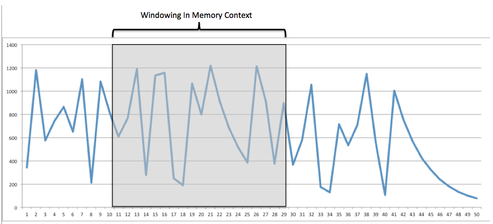

# Big Data Concepts
	- Why Big Data?
		- Old data mining systems were expensive and not easily scalable
		- Process large data with low latency
		- Process unstructured data
		- 3Vs of Big Data - Volume, Velocity and Variety
		- [7Vs of Big Data](http://fizalihsan.wordpress.com/2014/01/02/7vs-of-big-data-briefly/) - Volume, Velocity and Variety, Veracity, Variability, Visualization and Value
- # Processing Models
  collapsed:: true
	- ## Batch Processing
		- Batch processing is the familiar concept of processing data en masse. The batch size could be small or very large. E.g., Hadoop, Apache Spark
		- Batch processing excels at processing large amounts of stable, existing data. However, it generally incurs a high-latency and is completely unsuitable for incoming data.
	- ## Event-Stream Processing
		- Stream processing is a one-at-a-time processing model; a datum is processed as it arrives. E.g., Apache Storm.
		- Stream processing excels at computing transformations as data are ingested with sub-second latencies. However, with stream processing, it is incredibly difficult to process stable data efficiently.
	- ## Micro-Batching
		- Micro-batching is a special case of batch processing where the batch size is orders smaller.
		- E.g., Spark Streaming, Storm Trident API.
		- Micro-batching seems to be a nice mix between batching and streaming. However, micro-batching incurs a cost of latency. If sub-second latency is paramount, micro-batching will typically not suffice. On the other hand, micro-batching trivially gives stateful computation, making windowing an easy task.
		- **Windowing**
			- 
			- Windowing Analysis is looking at events over a finite timeframe (typically few seconds or minutes) or number of events.
			- Windowing can be used, for example, to detect stock price manipulation. At an atomic event level it is near impossible to identify whether these patterns are taking place, but if we are allowed to view the market in a windowing fashion, we see the events happening in order and with the context of all the events around the same time.
- # Programming Model
	- ## MapReduce
	  collapsed:: true
		- > Source: Hadoop Operations -OReilly
		- Designed to simplify the development of large-scale, distributed, fault-tolerant data processing applications
		- In MapReduce, developers write jobs that consist primarily of a map function and a reduce function, and the framework handles the gory details of parallelizing the work, scheduling parts of the job on worker machines, monitoring for and recovering from failures, and so forth.
		- User-provided code is invoked by the framework rather than the other way around.
		- **Features**
			- **Simplicity of development** - Developers use functional programming concepts to operate on one record at a time. Map functions operate on these records and produce intermediate key-value pairs. The reduce function then operates on the intermediate key-value pairs, processing all values that have the same key together and outputting the result. These primitives can be used to implement filtering, projection, grouping, aggregation, and other common data processing functions.
			- **Scalability** - MapReduce is designed to be a 'share-nothing' system. Since tasks are independent, they can run in parallel in one or more machines.
			- **Automatic parallelization and distribution of work** -  Developers focus on the map and reduce functions that process individual records (where “record” is an abstract concept—it could be a line of a file or a row from a relational database) in a dataset. The storage of the dataset is not prescribed by MapReduce, although it is extremely common, as we’ll see later, that files on a distributed filesystem are an excellent pairing. The framework is responsible for splitting a MapReduce job into tasks. Tasks are then executed on worker nodes or (less pleasantly) slaves.
			- **Fault Tolerance** - MapReduce treats failure as a first-class citizen and supports reexecution of failed tasks on healthy worker nodes in the cluster. Should a worker node fail, all tasks are assumed to be lost, in which case they are simply rescheduled elsewhere.
- # Clustering
	- What is Clustering
	- How clustering works
	- Why clustering
	- Quorum
	-
- # Bibliography
	- Hadoop
	- Hadoop Beginner's Guide
	- Clustering
	- http://publib.boulder.ibm.com/infocenter/iseries/v5r4/index.jsp?topic=%2Frzaig%2Frzaigconceptsbasiccluster.htm
	- http://www.slideshare.net/yashamwan/cluster-16097908?from_search=9
	- http://www.slideshare.net/itsec/clustering-and-high-availability