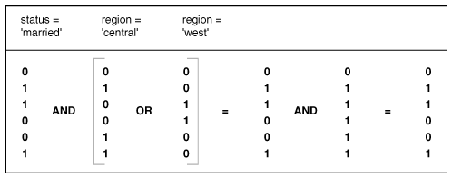
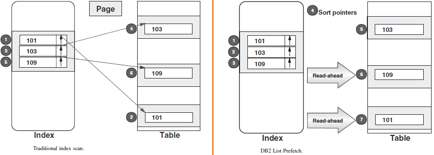

# Indexes
collapsed:: true
	- http://use-the-index-luke.com/sql/table-of-contents
	- http://www.sqlskills.com/blogs/kimberly/guids-as-primary-keys-andor-the-clustering-key/
	- http://www.micmin.com/Session320/Session%20320%20-%20Role%20of%20Indexes.htm
	- An index is an ordered set of pointers associated with a table, and is used for performance purposes.
	- ## How Indexes work?
	  collapsed:: true
		- Each index entry contains a search-key value and a pointer to the row containing that value.
		- If you specify the `ALLOW REVERSE SCANS` parameter while creating the index, the values can be searched in both ascending and descending order. It is therefore possible to bracket the search, given the right predicate.
		- An index can also be used to obtain rows in an ordered sequence, eliminating the need for the database manager to sort the rows after they are read from the table.
		- Although the optimizer decides whether to use an index to access table data, except in the following case, you must decide which indexes might improve performance and create these indexes. Exceptions are the dimension block indexes and the composite block index that are created automatically for each dimension that you specify when you create a multi-dimensional clustering (MDC) table.
		- In addition to the search-key value and row pointer, an index can contain include columns, which are non-indexed columns in the indexed row. Such columns might make it possible for the optimizer to get required information only from the index, without accessing the table itself.
		- ### Usability
			- Indexes are usable (default) or unusable.
			- An unusable index is not maintained by DML operations and is ignored by the optimizer.
			- An unusable index can improve the performance of bulk loads.
			- Instead of dropping an index and later re-creating it, you can make the index unusable and then rebuild it.
			- Unusable indexes and index partitions do not consume space.
			- When you make a usable index unusable, the database drops its index segment.
		- ### Visibility
			- Indexes are visible (default) or invisible.
			- An invisible index is maintained by DML operations and is not used by default by the optimizer.
			- Making an index invisible is an alternative to making it unusable or dropping it.
			- Invisible indexes are especially useful for testing the removal of an index before dropping it or using indexes temporarily without affecting the overall application.
	- ## Limitations of Indexes
	  collapsed:: true
		- Although indexes can reduce access time significantly, they can also have adverse effects on performance. Before you create indexes, consider the effects of multiple indexes on disk space and processing time:
		- Each index requires storage or disk space. The exact amount depends on the size of the table and the size and number of columns in the index.
		- Each INSERT or DELETE operation performed on a table requires additional updating of each index on that table. This is also true for each UPDATE operation that changes the value of an index key.
		- Each index potentially adds an alternative access path for a query for the optimizer to consider, which increases the compilation time.
	- ## Index usage criteria
	  collapsed:: true
		- The query contains a column in a join clause that matches at least the first column of the index. eg. `create index idx1 on emp (division, dep, emptype) `
		- All the below queries will make use of the above index.
			- `select - from emp where division='acct' `
			- `select - from emp where division='acct' and dept='fin' `
			- `select - from emp where division='acct' and emptype='exempt' `
		- However, this query would be NOT be able to use the index since it doesn't specify the first column of the index.
			- `select - from emp where emptype='exempt' `
	- ## Index Types
	  collapsed:: true
		- ### Clustered
		  collapsed:: true
			- Any index structure having the data accessed in the same way the index is organized so that data with similar or the same key values is stored (or clustered) together.
			- Clustering tends to greatly reduce input/output (I/O) time for queries and sorting.
			- There can be only one clustered index per table.
		- ### Non-clustered
		  collapsed:: true
			- There can be more than one non-clustered index per table.
		- ### B+ Tree
		  collapsed:: true
			- Basic table index based on one or more attributes, often used to enforce uniqueness of primary keys.
			- These indexes are the standard index type. They are excellent for primary key and highly-selective indexes. Used as concatenated indexes, B-tree indexes can retrieve data sorted by the indexed columns.
			- B-tree indexes have the following subtypes:
			- **Index-organized tables**: [For more details](/technology/rdbms.html#table-types)
			- **Reverse key indexes**
				- In this type of index, the bytes of the index key are reversed, for example, 103 is stored as 301. The reversal of bytes spreads out inserts into the index over many blocks. Reversing the key value is particularly useful for indexing data such as sequence numbers, where each new key value is greater than the prior value, i.e., values monotonically increase.
				- Reverse key indexes have become particularly important in high volume transaction processing systems because they reduce contention for index blocks.
				- Reverse index is used to correct the imbalance caused by continually adding increasing values to a standard B-tree index
			- **Descending indexes**: This type of index stores data on a particular column or columns in descending order.
			- B-tree cluster indexes
		- ### Hashtable index
		  collapsed:: true
			- An index that maps primary key values to block data addresses in the database for otherwise un-ordered data. Not good for range searches
		- ### Bitmapped index
		  collapsed:: true
			- 
			- Bitmap indexes consist of a bitmap (bit vector) for each distinct column value. Each bitmap has one bit for every row in the table. The bit is on if the related row has the value represented by the bitmap.
			- Bitmap indexes are widely used in data warehousing environments that have large amounts of data and ad hoc queries, but a low level of concurrent DML transactions
			- Pros
				- Bitmap indexes make it feasible to perform queries with complex and unpredictable compound predicates against a large table. This is because ANDing and ORing bitmap indexes is very fast, even when there are hundreds of millions of table rows. The corresponding operation with B-tree indexes requires collecting a large number of pointers and sorting large pointer sets.
				- Bitmap indexes are best used for columns in which the ratio of the number of distinct values to the number of rows in the table is small. (We refer to this ratio as the *degree of cardinality*). A gender column, which has only two distinct values (male and female), is optimal for a bitmap index.
				- Reduced response time for large classes of ad hoc queries. 'AND' and 'OR' conditions in the WHERE clause of a query can be resolved quickly by performing the corresponding Boolean operations directly on the bitmaps before converting the resulting bitmap to rowids.
				- Reduce storage requirements compare to other indexing techniques
				- Dramatic performance gains even on hardware with a relatively small number of CPUs or a small amount of memory.
				- Efficient maintenance during parallel DML and loads.
			- Cons
				- With a bitmap index, the table rows must be accessed unless the SELECT list contains only COUNTs. B-tree index eliminates table access.
			- Use bitmap indexes when the following conditions are true
				- The number of possible predicate combinations is so large that designing adequate B-tree indexes is not feasible.
				- The simple predicates have a high filter factor, but the compound predicate (WHERE clause) has a low filter factor or the SELECT list contains COUNTs only.
				- The updates are batched (no lock contention).
			- Bitmap and Bitmap join indexes
		- ### Covering Index
		  collapsed:: true
			- An index with enough information to satisfy certain queries by itself, in other words, the query can be satisfied merely by searching the index and not the database.
		- ### Composite Index
		  collapsed:: true
			- A composite index, also called a *concatenated index*, is an index on multiple columns in a table.
			- Columns in a composite index should appear in the order that makes the most sense for the queries that will retrieve data and need not be adjacent in the table. In the below example, this index will be used
			- by queries that access all three columns
			- by queries that access only the `last_name` column
			- by queries that access only the `last_name` and `job_id` columns use this index. In this example, queries that do not access the `last_name` column do not use the index.
			  
			  ```sql
			  CREATE INDEX employees_ix ON employees (last_name, job_id, salary);
			  ```
			- Multiple indexes can exist for the same table if the permutation of columns differs for each index. You can create multiple indexes using the same columns if you specify distinctly different permutations of the columns. For example, the following SQL statements specify valid permutations:
			  
			  ```sql
			  CREATE INDEX employee_idx1 ON employees (last_name, job_id);
			  CREATE INDEX employee_idx2 ON employees (job_id, last_name);
			  ```
		- ### Unique Index
		  collapsed:: true
			- Indexes can be unique or non-unique. Unique indexes guarantee that no two rows of a table have duplicate values in the key column or column. For example, no two employees can have the same employee ID. Thus, in a unique index, one rowid exists for each data value. The data in the leaf blocks is sorted only by key.
			- Non-unique indexes permit duplicates values in the indexed column or columns. For example, the first_name column of the employees table may contain multiple 'Mike's. For a non-unique index, the rowid is included in the key in sorted order, so non-unique indexes are sorted by the index key and rowid (ascending).
			- Oracle Database does not index table rows in which all key columns are null, except for bitmap indexes or when the cluster key column value is null.
		- ### Others
			- **Unique index**
			- **Composite index** - An index based on more than one attribute or key (i.e., a concatenated key).
			- **Dense Vs Sparse Index** - A dense index has a pointer to each row in the table; a sparse index has at most one pointer to each block or page in the table.
			- **Function-based indexes**
			- **Application Domain indexes**
			- **Bi-directional indexes**
	- ## When to use Clustered index?
	  collapsed:: true
		- **Range searches**
			- Clustered indexes can improve performance for range retrievals because it can be used to set the bounds of a search, even if the query involves the large percentage of the rows in the table. Because the data is in sorted order, the db can use it to find the starting and ending points of the range, and scan only the data pages within the range.
			- Without a clustered index, the rows could be randomly spread throughout the table, and the db would have to perform a table scan to find all rows within the range.
			- Columns containing number of duplicates - Same concept holds true for indexes on columns with a large number of duplicates. With a clustered index, the duplicate values are grouped together. This minimizes the no. of pages that would have to be read to retrieve them.
		- **Columns often referenced in an ORDER BY**
			- Most sorts require that the table be copied into a buffer pool(DB2) or work table in tempdb(Sybase). This incurs additional I/O overhead. However if you're performing an ORDER BY on clustered index columns on a table, you can avoid creating a work table even if a query contains no search arguments.
		- **Columns other than primary key reference in join clauses**
			- Clustered indexes can also be more efficient for joins that are non-clustered indexes, because clustered indexes usually are much smaller in size; typically they are atleast one level less in the B-tree.
		- **Single index table**
			- If you require only a single index on a table, it typically is advantageous to make it a clustered index, as the resulting overhead of maintaining clustered indexes during updates, inserts and deletes can be considerably less than the other one.
	- ## Index Covering 
	  collapsed:: true
		- Index covering is a mechanism for using the leaf level of a non-clustered index the way the data page of a clustered index would work. This occurs when all columns referenced in a query are contained in the index itself.
		- Because the non-clustered index contains a leaf row corresponding to every data row in the table, db can satisfy the query from the leaf rows of the non-clustered index without having to read the data pages.
		- Because all leaf index pages point to the next page in the leaf-page chain, the leaf level of the index can be scanned just like the data pages in a table.
		- Because the leaf index rows typically are much smaller than the data rows, a non-clustered index that covers a query will be faster than a clustered index on the same columns, due to the fewer number of pages that must be read.
		- **Covered Queries** - in a query, if all the columns mentioned in the conditions section are part of an index, then it's a covered query
	- ## Indexing Rules of Thumb
	  collapsed:: true
		- Index every primary key and most foreign keys in the database.
		- Attributes frequently referenced in SQL WHERE clauses are potentially good candidates for an index.
		- Use a B+tree index for both equality and range queries
		- Choose carefully one clustered index for each table
		- Avoid or remove redundant indexes
		- Add indexes only when absolutely necessary
		- Add or delete index columns for composite indexes to improve performance. Do not alter primary key columns
		- Use attributes for indexes with caution when they are frequently updated.
		- Keep up index maintenance on a regular basis; drop indexes only when they are clearly hurting performance
		- Avoid extremes in index cardinality and value distribution.
		- Covering indexes (index only) are useful, but often overused
		- Use bitmap indexes for high-volume data, especially in data warehouses.
	- ## Index Selection Decisions
	  collapsed:: true
		- Does this table require an index or not, and if so which search key should I build an index on?
		- When do I need multi-attribute (composite) search keys, and which ones should I choose?
		- Should I use a dense or sparse index?
		- When can I use a covering index?
		- Should I create a clustered index?
		- Is an index still preferred when updates are taken into account? What are the tradeoffs between queries and updates for each index chosen?
		- How do I know I made the right indexing choice?
- # Concurrency
  collapsed:: true
	- http://msdn2.microsoft.com/en-us/library/ms171845(SQL.90).aspx
	- ## Isolation levels 
	  collapsed:: true
		- Repeatable Read (RR)
		- Read Stability (RS)
		- Cursor Stability (CS)
		- Uncommitted Read (UR)
	- ## Locks
	  collapsed:: true
		- http://www.dbazine.com/db2/db2-disarticles/gulutzan6
		- ### Types
		  collapsed:: true
			- **Shared Locks or Read Locks**
				- Two or more transactions, each with a shared lock, can concurrently read the contents of a memory location without interfering with one another. As long as none of the transactions attempts to change the data at that location, all the transactions can proceed without delay. The lock manager portion of the DBMS can grant shared locks to all transactions that want to perform only read operations. Shared
				  locks are sometimes called *read locks*.
			- **Exclusive Locks or Write Locks**
				- To perform a write operation on a memory location, a transaction must acquire an exclusive lock, which grants to its holder the exclusive right to access the resource being locked. If one transaction holds an exclusive lock on a resource, no competing transaction may acquire either a shared lock or exclusive lock on that resource until the first transaction releases its lock. Exclusive locks are sometimes
				  called *write locks*.
			- **Update Lock**
				- ...
		- ### Granularity
		  collapsed:: true
			- The granularity of a lock determines the size of the resource being locked. Locks that are coarse-grained take rather large resources out of circulation. Fine-grained locks sequester relatively small resources. Course-grained locks deny access to big things, such as tables. Fine-grained locks protect smaller things, such as rows in a table.
			- **Database locks**: The database lock is the ultimate in coarse-grained locks. If a transaction puts an exclusive lock on a database, no other transaction can access the database at all until the lock is released. As you might imagine, database locks have a disastrous effect on overall productivity and should be avoided if at all possible. Sometimes, a database administrator must apply a database lock to prevent other transactions from corrupting the database while she is making alterations in the database structure.
			- **Table locks**: Table locks, by locking an entire database table, are not as restrictive as database locks but are still pretty coarse. Generally, you would impose a table lock only if you were altering  he structure of the table or if you were changing data in most or all of the rows in the table.
			- **Row locks**: Row locks are fine-grained in that they lock only a single row in a table. If you’re changing only a value in a single row, there is no point in locking any rows other than that one target row. The only transactions that are affected by a row lock are those that want to do something to the very same row of the very same table.
			- **Page locks**: A page lock — which has an intermediate granularity between a table lock and a row lock — locks an entire page in the page buffer. Because information gets transferred between the page  buffer and disk a page at a time, some DBMSs provide locks at the page level. As processing proceeds, requiring pages currently residing in the page buffer to be swapped out in favor of pages on disk that are currently needed, the DBMS will resist, if possible, the urge to swap out any page that is locked by an active transaction. Swapping it out and then swap
	- ### Lock Escalation
	  collapsed:: true
		- A lock escalation occurs when the number of locks held on rows and tables in the db equals the percentage of the locklist specified by the 'maxlocks' db config param. To reduce the no. of locks, db manager begins converting many fine-grained locks (row/block level) to table locks for all active tables, starting from any locks on LOBs or VARCHARs. Then the table with the next highest no. of locks and so on, until the no. of locks held is decreased to about half of the value specified by 'maxlocks'.
		- **Exclusive Lock Escalation** - An exclusive lock escalation is a lock escalation in which the table lock acquired is an 'exclusive lock'.
		- Lock escalations reduce concurrency. Conditions that might cause lock escalations should be avoided.
	- ## Concurrency Issues
	  collapsed:: true
		- **Deadlock**
			- Deadlock is a situation when two processes, each having a lock on one piece of data, attempt to acquire a lock on the other's piece. Each process would wait indefinitely for the other to release the lock, unless one of the user processes is terminated. SQL Server detects deadlocks and terminates one user's process.
			- How do you avoid deadlocks?
				- TBD
		- **Livelock**
			- A livelock is one, where a request for an exclusive lock is repeatedly denied because a series of overlapping shared locks keeps interfering. SQL Server detects the situation after four denials and refuses further shared locks. A livelock also occurs when read transactions monopolize a table or page, forcing a write transaction to wait indefinitely.
		- **Lock contention**
		- **Lock escalation**
- # Performance
  collapsed:: true
	- ## Buffer pools
	  collapsed:: true
		- Each dbms may have several pools according to the type, table or index and the page size.
		- Each pool will be large enough to hold many pages, perhaps hundreds of thousands of them.
		- The buffer pool managers will attempt to ensure that frequently used data remains in the pool to avoid the necessity of additional reads from disk.
		- The ideal place for an index or table page to be when it is requested is in the database buffer pool. If it is not there, the next best place is in the disk server read cache. If it is in neither of these, a slow read from disk will be necessary.
	- ## Prefetch 
	  collapsed:: true
		- reads can be performed before the pages are actually requested
		- **Dynamic prefetch**
			- The DBMS may notice that a SELECT statement is accessing the pages of an index or table sequentially, or almost sequentially, and starts to read several pages ahead. This is called *dynamic prefetch- (in DB2)
		- **List Prefetch**
			- Even if the data resulting from a query is not sequentially organized in the disk, DBMS like DB2 is able to create skip-sequential access. To do this, it has to access all the qualifying index rows and sort the pointers into table page sequence before accessing the table rows.
			- 
		- **Data Block Prefetch**
			- This feature is used by Oracle, again when the table rows being accessed are not in the same sequence as the index rows.
			- The pointers are collected from the index slice and multiple random I/Os are started to read the table rows in parallel.
		- **Disk Read Ahead**
			- When the DBMS requests a page, the disk system may read the next few pages as well into a disk cache (anticipating that these may soon be requested); this could be the rest of the stripe, the rest of the track, or even several stripes (striping is described shortly). This is called *Disk Read Ahead*
	- ## Query Optimization
	  collapsed:: true
		- When db processes the query, it performs the following steps:
		- Parses and normalizes the query, validating syntax and object references
		- Optimizes the query and generates the query plan
			- Phase 1 - Query Analysis
				- Find the search arguments (SARG)
				- Find the ORs c. Find the joins
			- Phase 2 - Index Selection
				- Choose the best index for each SARG
				- Choose the best method for ORs
				- Choose the best indexes for any join clauses
				- Choose the best index to use for each table
			- Phase 3 - Join Order Selection
				- Evaluate the join orders
				- Compute the costs
				- Evaluate other server options for resolving joins
			- Phase 4 - Plan Selection
		- Compiles the query plan
		- Executes the query plan and returns the results to the user.
		- How do you tune a SQL query? How do you use an access plan?
	- ## Query Execution Plan
	  collapsed:: true
		- An execution plan is basically a road map that graphically or textually shows the data retrieval methods chosen by the SQL server’s query optimizer for a stored procedure or ad hoc query. Execution plans are very useful for helping a developer understand and analyze the performance characteristics of a query or stored procedure, since the plan is used to execute the query or stored procedure.
		- In many SQL systems, a textual execution plan can be obtained using a keyword such as `EXPLAIN`, and visual representations can often be obtained as well. In Microsoft SQL Server, the Query Analyzer has an option called *Show Execution Plan- (located on the Query drop down menu). If this option is turned on, it will display query execution plans in a separate window when a query is run.
		- How to read a query execution plan?
		- Page Extent - Denotes the # of contiguous pages of data read from the hard disk at a time. SQL reads 8 pages(64K) at a time.
	- ## Data Dictionary
	  collapsed:: true
		- **Data dictionary**- stores statistics about columns, tables, clusters, indexes, and partitions for the CBO. DBMS_STATS statement is used to gather the statistics
		- **Cost-based Optimizers (CBO)** - uses the statistics stored in the Data Dictionary. This approach optimizes for best throughput.
		- **Rule-based Optimizers (RBO)** - This approach optimizes for best response time.
		- DB2
			- Execute `runstats` to collect statistics of the table and its indexes to help optimizer choose the best data-access plan
			- Execute this after creating an index, after hanging the prefetch size, after executing reorg. Also execute it at regular intervals to keep the statistics current. If reorg is run, then execute runstats also.
			  
			  ```sql
			  db2 runstats on table schema.table
			  db2 runstats on table schema.table with distribution and detailed indexes all
			  ```
		- Stores statistics in SYSSTAT schema, SYSCAT tables
		- `with distribution` - This tells DB2 to collect distribution statistics. Distribution statistics include two things:
			- *Frequent value statistics- – DB2 notes the most frequent values. By default, the 10 most frequent values. Using the above syntax, this is collected for every column. You can change the number of most frequent values using the NUM_FREQVALUES database configuration parameter, or the NUM_FREQVALUES clause on the runstats command
			- *Quantile statistics- – Divides the values into NUM_QUANTILES (default: 20) sections to describe the distribution of the data. The default means that the optimizer should be able to estimate the number of values that would meet any one-sided predicate within 2.5% of the actual value.
		- `and detailed indexes all` - Collecting index statistics helps DB2 decide which if any indexes to use to satisfy a particular query. Collecting detailed index statistics allows db2 to more accurately estimate the page fetches that will be required – allowing db2 to properly estimate the cost of accessing a table through an index. DB2 will use this data along with bufferpool information to determine how much (if any) synchronous page cleaning will have to occur.
		- How to find out if statistics on a table or schema is up-to-date?
			- If `CARD` is -1 or `STATS_TIME` is null or far in the past, then statistics needs to be updated. Non-negative number on CARD denotes the number of rows on the table.
			  
			  ``` sql
			  SELECT CARD, STATS_TIME FROM SYSCAT.TABLES WHERE TABNAME='MARGININFO'
			  ```
		- If `NLEAF`, `NLEVELS` & `FULLKEYCARD` is -1 or `STATS_TIME` is null or far in the past, then statistics needs to be updated on that index
		  
		  ``` sql
		  SELECT NLEAF, NLEVELS, FULLKEYCARD, STATS_TIME, i.- FROM SYSCAT.INDEXES i WHERE TABSCHEMA='CMDRPROD' and TABNAME='MARGININFO'
		  ```
		- Via DB2 Command - `reorgchk update statistics on SCHEMA CMDRPROD`
		- Sybase - `update statistics`
		- Oracle - `EXEC dbms_stats.gather_database_stats;`
			- http://download-west.oracle.com/docs/cd/A87860_01/doc/server.817/a76992/toc.htm
		- [Distribution statistics uses with the DB2 Optimizer](https://www.ibm.com/developerworks/data/library/techarticle/dm-0606fechner/)
- # DB Federation
  collapsed:: true
	- Database federated support in DB2 allows tables from multiple databases to be presented as local tables to a DB2 server. The databases may be local or remote; they can also belong to different.
	- DB2 uses NICKNAME, SERVER, WRAPPER, and USER MAPPING objects to implement federation.
- # Partitioning
  collapsed:: true
	- > Following points are MySQL specific at the time of the writing
	- partition expression must be an integer
	- no foreign key constraints
	- partitions can't be accessed directly
	- each partition can have its own index
	- each partition can live in a separate disk
	- indexing on columns not part of partition key leads to poor performance
	- max # of partitions possible = 1024. Optimal size is around 100
	- __Types__
		- range partitioning
			- each partition is defined to accept a specific range of values for some column or columns, or a function over those columns
			- cons: For every row inserted into the table that’s partitioned by range, the server has to scan the list of partitions to select the destination. As the number of partitions grow, this can be costly.
		- key, hash partitioning
			- pros: scales well with partition growth unlike range partitioning
		- list partitioning
		- Row-wide partitioning
		- Column-wide partitioning
	- __Cons__
		- Opening and locking partitions when a query accesses a partitioned table is another type of per-partition overhead
		- all partitions should use the same storage engine
- # Replication
	- HADR - High Availability Database Replication (from version 9.7)
- # References
	- Books
		- Dissecting SQL Server Execution Plans and SQL Tuning
		- Physical Database Design - Database Professional's Guide to Exploiting Indexes, Views, Storage & More
		- Relational Database Index Design and the Optimizers
		- Sybase - Performance and Tuning Guide
	- DB2
		- More details on : http://publib.boulder.ibm.com/infocenter/db2luw/v8/index.jsp?topic=/com.ibm.db2.udb.doc/core/r0010410.htm
		- Command line reference: ftp://ftp.software.ibm.com/ps/products/db2/info/vr8/pdf/letter/db2n0e80.pdf
		- DB2 System command: http://www3.software.ibm.com/ibmdl/pub/software/dw/dm/db2/dm-0406qi/systemCommands.pdf
	- Sybase
		- http://www.faqs.org/faqs/databases/sybase-faq/part1/
		- http://www.lcard.ru/~nail/sybase/perf/66.htm
		- http://www.benslade.com/tech/OldIntroToSybase/