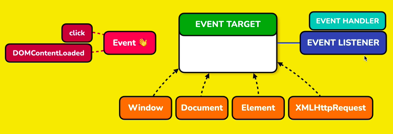
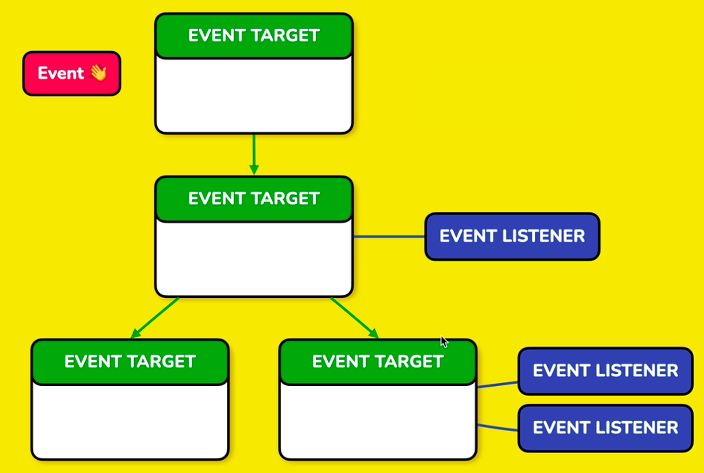
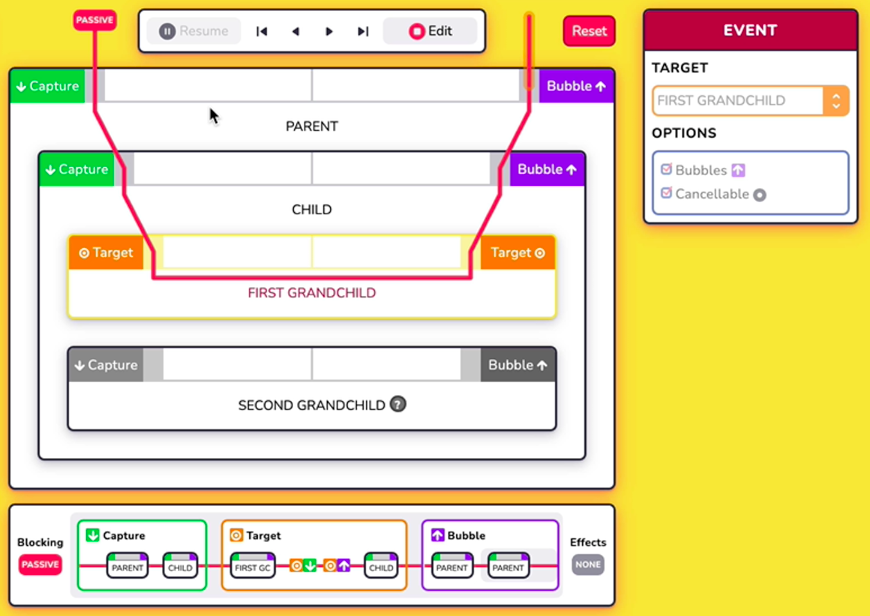
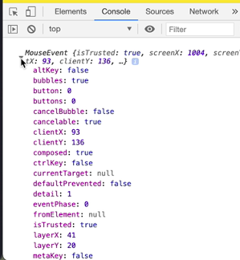

# DOM
	- DOM is an API.
	- DOM is not the source HTML or the code you write.
	- DOM is not what you see in the browser's DevTools
	- DOM tree can have 12 different types of nodes
	  collapsed:: true
		- Element
		- Text
		- Attr
		- CDATASection
		- EntityReference
		- Entity
		- Comment
		- ProcessingInstruction
		- Document
		- Notation
		- DocumentFragment
		- DocumentType
	- Javascript 
	  collapsed:: true
		- can interact with DOM and manipulate the DOM.
		- can change, add, or remove HTML elements and attributes
		- can change CSS styles
		- can create and react to HTML events like clicks or hovers
		- cannot target CSS pseudo-elements
			- if the code uses CSS pseudo-elements, the DOM does NOT include it in its tree because the DOM builds itself from the HTML document, not the styles applied to the elements (including CSS). Hence JS cannot target pseudo-elements because they are not part of the DOM.
			  
			  ```js Example of DOM manipulation
			  const button = document.querySelector('button');
			  
			  button.removeAttribute('onclick');
			  ```
	- ## DOM Events
	  collapsed:: true
		- > DOM Events Visualizer - [https://domevents.dev](https://domevents.dev)
		- > Events Reference: https://developer.mozilla.org/en-US/docs/Web/events
		- Event
		  collapsed:: true
			- An event is a signal that something has occurred in the browser.
			- An event is a message that is dispatched to event targets.
			- Types of events
				- *user events*, such as click, and
				- *system events*, such as `DOMContentLoaded`.
			- Events are dispatched to event targets.
		- Event Target
		  collapsed:: true
			- An event target is an object that implements the `EventTarget` interface. e.g., it is implemented by a number of foundational objects in the browser, such as `window`, `document`, `element` and `XMLHttpRequest`.
			- An event target can be the target of events and can have event listeners added and removed from them
			- When an object implements the `EventTarget` interface, it allows that object to be the target of events as well as enabling other pieces of code to listen for particular events that hit that object.
			- in the HTML code below, parent div, child and button are few event targets.
		- Event Listener 
		  collapsed:: true
			- Code that is registered to listen for events that hit an event target is known as an **event listener**. The term **event handler** is a name for a particular *method* of adding an event listener. In practice, it is common to see the term event handler used interchangeably with the term event listener.
			- Event targets can exist as their own objects, and they can also participate in a tree, such as when elements participate in a document.
		- Event Phases
		  collapsed:: true
			- Generally, events flow through event targets in three separate phases.
			- (1) *Capture Phase*:  In the first phase, the event travels down through the event targets towards the target of the event. This is known as the **capture phase**.
			- (2) *Target Phase*: When the event hits the event target, it then travels through the target. This is the second phase known as the **target phase**.
			- (3) *Bubble Phase*: After that's completed, then the event goes back up to the root event target in the **bubble phase**.
		- Event Options
		  collapsed:: true
			- An event's behaviour can be configured
				- **bubbles**: Conditionally allow the  Bubble phase.
				- **cancelable**: Conditionally allow an event to be canceled. Canceling an event prevents the events default behavior.
				  
				   
				   |
				  {:height 441, :width 702}
				  
				  ```html
				  <!DOCTYPE html>
				  <html lang="en">
				  <head>
				    <title>DOM events</title>
				  </head>
				  <body>
				    <div id="parent">
				        <h3>Parent element</h3>
				        <div id="child">
				            <h3>Child element</h3>
				            <button type="button">
				                Call to action
				            </button>
				        </div>
				    </div>
				  </body>
				  </html>
				  ```
	- ## DOM Zero or DOM-0 Event Handlers
	  collapsed:: true
		- ### HTML Attribute Event Handlers
		  collapsed:: true
			- It is possible to write code in HTML attributes that will be executed when a matching event occurs.
			- Different element types allow different event handler attributes to be set. e.g., `Window`, `document`, and all HTML elements implement the `GlobalEventHandlers` mixin which provides a common set of HTML event handler attributes like `onClick` and `onLoad`.
			- **HTML event handler attributes**
			  collapsed:: true
				- are a way to define an `EventListener` in the *bubble phase* of an event.
				- You CANNOT use these types of `EventListener` bindings to listen to events in the capture phase of an event.
				- This style of event binding is also known as a **DOM-zero event handler** and is referred to as *event handler content attributes* in formal specifications.
				- A HTML event handler attributes string can be any JavaScript function body. That is any code, you would normally be able to put inside of a function. e.g., `<button onclick="console.log('clicked');" type="button"/>`
				- There are some fairly magic values that you can use in your HTML event handler attributes string. For example,
					- `event` - which represents the ActiveEvent.
					- `this` - `this` runtime context of your function is set to the element that the event handler is bound to, which in our case, is the button element. 
					  
					  ```html Magic values in HTML event handler attributes
					  <button onclick="console.log(event, this);" type="button"/>
					  ```
				- Within HTML event handler attributes, you can execute any function body you like. However, it is common to execute a named function that you have defined somewhere else.
				- In order for this code to work, the function `myOnClick()` must be accessible on the **global scope**. If not found on the global scope, then a `ReferenceError` will be thrown when your attribute string is executed.
				  collapsed:: true
					- ```html Calling a named function
					  <button onclick="myOnClick();" type="button"/>
					  ```
					  
					  ```js app.js 
					  // a function defined on the global scope
					  function myOnClick(){
					  console.log('Inside myOnClick');
					  }
					  ```
		- ### Global functions and minifiers
		  collapsed:: true
			- However, a bug can occur with this approach of creating global functions when you *minify* your code. Code minifiers will commonly mangle function names to ensure the smallest amount of code is sent over the wire to your users. Unfortunately, this can break your attempts to use a named function in the global scope.
			- In this case, `myOnClick()` in the JS file can be mangled to say `a()`, however, the html still calls `myOnClick()`, which no longer exists. Because of the minifier, I've broken the link between my html and my JavaScript file.
			- Modern minifiers commonly won't mangle root level function names. Not mangling root level function names is not a guarantee for every minifier that will ever exist. Also, you might change an option for a minifier that can result in top-level function names being mangled without you realizing.
			- **Safer option** 
			  collapsed:: true
				- A safer option for defining functions in the global scope is to add a named property to the global `window` object directly.
				- Minifiers should not minify object properties. You can sidestep the function name mangling concern by using this approach.
				- Attaching functions to the window directly also lets you write your global functions inside of nested scopes, which is pretty commonplace in module systems.
				- ```js app.js - Safer option
				  // a function defined on the global window object
				  window.myOnClick = function myOnClick(){
				  console.log('Inside myOnClick');
				  }
				  
				  function foo(){
				  window.myOnClick2 = function(){
				  console.log('Inside myOnClick2');
				  } 
				  }
				  
				  //calling this method is important without which our custom function won't be set on the window object 
				  foo();
				  ```
				  
				  __Gotchas of HTML event handler attributes__
			- *Broken links from function name refactoring* - it is easy to accidently break the link between the HTML attribute string and any global functions that it is calling. e.g., when you refactor the function name in `apps.js`, the HTML attribute value is not changed, causing `ReferenceError` at runtime.
			- *Forgetting to call the function* - Another gotcha is forgetting to actually execute a global function that you're trying to call. While this code may look right, it's not actually executing the `myOnClick` function. e.g., `<button onclick="myOnClick" type="button"/>`
			- *Only a single event handler allowed* - you can only add a single event handler attribute of a particular event type. We can only have one `onClick` handler to listen for click events, which sucks at scale.
		- ### Object Property Event Handlers
		  collapsed:: true
			- 2 representations of HTML attributes: 
			  collapsed:: true
				- One representation is the *HTML attribute* itself and they are named **content attributes**.
				- The other representation of these HTML attributes is *properties* on corresponding JavaScript DOM objects. These object properties are named **IDL attributes** or *Interface Description Language* attributes.
			- Event handler attributes, such as `onclick`, also have a corresponding `onclick` object property.
			  collapsed:: true
				- ```js Example
				  const button = document.querySelector('button');
				  
				  button.onclick = function (event){
				    console.log.(this, event);
				  }
				  ```
			- Object property event handlers 
			  collapsed:: true
				- are a way to define an event listener in the *bubble phase* of an event.
				- are also classified as *DOM zero event handlers*.
				- An object property event handler function is provided with the `event` as the first and only argument to the function.
				- Like HTML attribute event handlers, you cannot use this type of binding to listen to events in the capture phase.
			- You can only use one binding mechanism - either HTML attribute event handler or the Object property event handler. Setting both will override one another.
			  collapsed:: true
				- ```html
				  <button onclick="console.log('html attribute');" type="button">
				  Call to action
				  </button>
				  ```
				  
				  ```js Example
				  const button = document.querySelector('button');
				  
				  button.onclick = function (event){
				    console.log.('object property');
				  }
				  ```
	- ## DOM2 or DOM2+ Event Listeners
	  collapsed:: true
		- Event targets such as `elements` have an `addEventListener` API, which allows you to add multiple event listeners to a single event target, as well as giving you a lot of control over the event listener binding.
		- Event listeners created with `addEventListener` are also known as **DOM2 event listeners** or **DOM2+ event listeners**.
		- Pros
			- multiple event listeners can be added for a single event like 'onclick'
			- Gives a lot of control over the event listener binding
		- The best practice is to always use `addEventListener` instead of HTML attribute or object property event listeners, since some events don't support them. e.g., `DOMContentLoaded`
		  collapsed:: true
			- ```js addEventListener example
			  const button = document.querySelector('button');
			  
			  function myOnClick(event){
			  console.log('clicked');
			  }
			  
			  //event listener added to bubble phase by default
			  button.addEventListener(
			  'click', // type of event to bind
			  myOnclick // event listener function or object
			  );
			  ```
			  
			  ```js Adding multiple listeners to same event type
			  button.addEventListener('click', () => console.log('click1');)
			  button.addEventListener('click', () => console.log('click2');)
			  ```
			  
			  There is a 3rd optional argument to `addEventListener` method which gives more control over binding.
			  
			  ```js Custom control over binding
			  button.addEventListener(
			  'click', // type of event to bind
			  myOnclick, // event listener function or object
			  {
			    capture: true, // makes the listener execute during capture phase
			    once: true, // makes the listener run only once
			  }
			  );
			  ```
		- **Remove Event Listener**
		  collapsed:: true
			- To remove an event listener from the target, the following 4 values must be correct: target, event type, listener, capture value.
			- The same reference to listener function must be passed to the `removeEventListener` method. Passing a similar but a different function won't work. 
			  It won't throw an error, but it won't remove either.
			- ```js Remove the event listener
			  button // 1. target
			  .removeEventListener(
			  'click', // 2. type of event to bind
			  myOnclick, // 3. event listener function or object
			  {
			    capture: true, // 4. capture phase
			  }
			  );
			  ```
	- ## Event Object
	  collapsed:: true
		- Event handlers and event listeners are provided with an event object.
		- The event constructor has four constants representing the different states that an event can be in.
		  
		  ```js Event states
		  console.log(Event.NONE); // 0 - when the event has not yet been dispatched or has finished dispatching.
		  console.log(Event.CAPTURING_PHASE); // 1 - when the event is in the capture phase
		  console.log(Event.AT_TARGET); // 2 - when we're in the target phase
		  console.log(Event.BUBBLING_PHASE); // 3 - when the event is in the bubbling phase 
		  ```
		  
		  * These properties map to integers, which I've logged out here in the console, so zero, one, two and three.
		- **Shared Event Object**
			- > Every event has a single shared event object.
			- Every HTML attribute event handler, element property event handler, and event listener on the event path will be provided with an event object that shares the exact same reference.
			- The shared event object will mutate as it flows through event listeners and event targets, as well as in response to side effects such as canceling an event.
		- **Event Object Properties**
		  collapsed:: true
			- `event.eventPhase`  - which matches the phase that the event is currently in. Return an integer which maps to the Event states above.
			- `event.eventType` - which matches the event type that the event listener was added for. e.g., 'type: click'
			- `event.target` - points at the event target in which the event is occurring and where the event is traveling to.
			- `event.currentTarget` - matches the event target that this event listener was added to. Here, I'm adding an event listener to the parent element.
				- To understand this better, take a look at the example below. A button inside nested div elements called parent and child. The `eventlistener` is added to parent.
				- When the button is clicked, `event.target` returns the button, and the `currentTarget` return `parent`, because that's what this event listener will be bound to.
				- When the parent element is clicked, both the `target` and `currentTarget` return parent.
				  collapsed:: true
					- ```html Example
					  <div id='parent'>
					  <h3>Parent element</h3>
					  <div id='child'>
					  <h3>Child element</h3>
					  <button type='button'> Click me </button>
					  </div>
					  </div>
					  ```
					  
					  ```js Example
					  const button = document.querySelector('button');
					  const parent = document.querySelector('.parent');
					  
					  function onClick(event){
					  console.log('target: ', event.target);
					  console.log('currentTarget: ', event.currentTarget);
					  }
					  
					  // as shown here, the listener is added to parent
					  parent.addEventListener('click', onClick);
					  ```
			- `event.bubbles` - returns true if the event will have a bubble phase
			- `event.cancelable` - true if the event can be cancelled
			- `event.composed` - boolean value that reflects whether an event will travel through the boundaries of a web component shadow DOM. If you're not working with web components, then this property isn't all that useful.
			- `event.isTrusted` - boolean value which reveals whether the event was created by the browser itself or whether it was manually created by another piece of code. e.g., `button.click()` mimicking user click.
			- `event.timestamp`
				- represents the time in milliseconds that the event was created. This value is relative to the time origin of the page so it will continue to grow bigger and bigger as the page gets older and older.
				- For events that are created by the browser, the creation time and dispatch time of the event are the same.
				- However, for manually created events, the creation of an event and the dispatching of that event might be separated by quite a long period of time.
				- The timestamp property is for when the event is created not when it's dispatched.
			- `event.defaultPrevented` - true when an event is cancelled.
			- `event.returnValue` - this is the inverse of `defaultPrevented`. false, when an event is canceled and true when an event is not cancelled.
		- **Event Object Methods**
			- `event.composedPath()` -  returns an array of event targets that an event will travel through during an event. The returned array starts with the target of the event and then works up the tree of event targets.
			  collapsed:: true
				- in the above example, when I click on the button to see the composedPath, I will see that the event started with button. This is in the target phase. Then it's going to go through the bubble phase up to the child, the parent, body, HTML element, document, and finally the window. There doesn't need to be any event listeners on an `eventTarget` for to be included in the event path.
				- The `composedPath` function or return the same event path regardless of which event target the `eventListener` is added to. In this case, my eventListener is added to the parent element, but the target of the event was the button. The composedPath function will only return the event path when the event is being dispatched. Once the event has finished or if it hasn't been dispatched yet, then composePath will just return an empty array.
			- **Log Events to console**
			  collapsed:: true
				- ```js Console log
				  function onClick(event){
				  console.log(event);
				  }
				  
				  parent.addEventListener('click', onClick, {capture: false});
				  ```
					- 
				- When you log an event to the browser console, you would notice some strange things.
				- As you see in the picture above, `eventPhase` is set to `event.NONE`, but we were expecting this event to be in the bubble phase because we're setting capture to false, and the `currentTarget` property is set to `null` even though it should have been the _parent_ element because that's the event target that this event listener was bound to.
				- The reason we're seeing these values is that both Chrome and Firefox evaluate the properties on an object that you've logged to the console when you first expand it. When I first expand this object, Chrome is looking up the values of this properties. Because the event has finished dispatching, the current target has been cleared and the eventPhase is .
				- In Chrome there is a little "i" icon here, and hover over it prints out, _"This value is evaluated upon first expanding, it may have changed since then."_ This is calling out that the properties in this object are evaluated by the browser when I expand it for the first time. In our case, that will happen after the event is finished.
				- To avoid this, print the event properties explicitly as follows:
					- ```js Console log
					  function onClick(event){
					  console.log(event);
					  console.log(event.currentTarget);
					  }
					  
					  parent.addEventListener('click', onClick, {capture: false});
					  ```
	- ## Cancel Events
	  collapsed:: true
		- If an event is cancellable, then it can be cancelled by event listeners.
		- Cancelling an event is a way to opt out of the default behavior associated with an event.
		- Events have an internal cancelled flag which can be obtained via `event.preventDefault` property. When an event is created, this is set to `false`. If an event is cancelled, then the internal cancelled flag is set to `true`.
		- The clearest way to cancel an event is using the `event.preventDefault` method.
		- You can't uncancel an event.
		- Calling `event.preventDefault` for an event that is not cancelable doesn't do anything. To check, call `event.cancelable`.
		- Often the main reason we want to cancel an event is to opt out of the default behavior associated with that event.