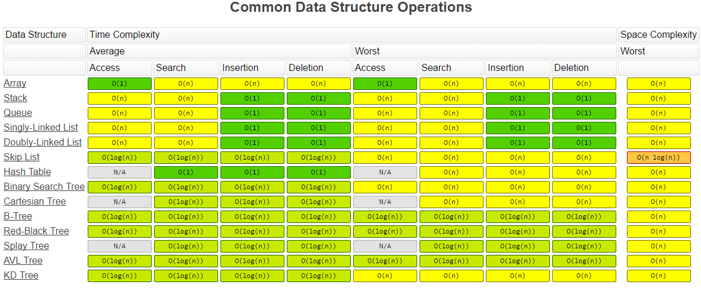
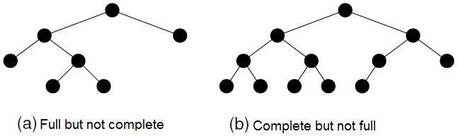
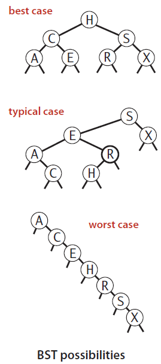
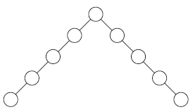
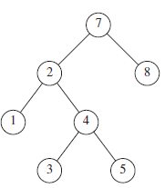
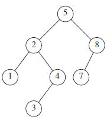
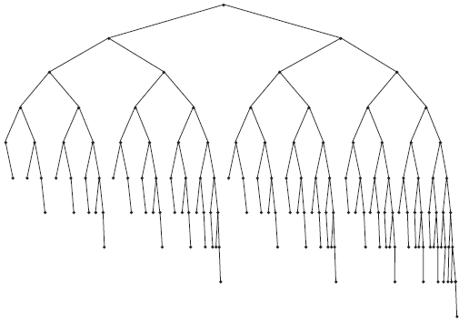
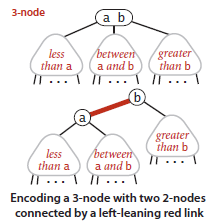
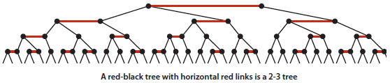
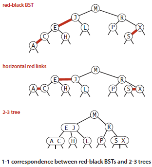

- 
- # Overview
	- [List of Data Structures (Wikipedia)](https://en.wikipedia.org/wiki/List_of_data_structures)
	- Abstract Data Types
		- List
		- Set
		- Map
		- Stack
		- Queue (Single-ended queue, Double-ended queue, Priority queue)
		- Tree
		- Graph
	- Linear Data Structures
		- Arrays
		- Lists
	- Trees
		- Binary Trees
		- B-Trees
		- Heaps
		- Trees
		- Multiway Trees
		- Space-partitioning Trees
	- Hashes
		- Hash table
		- Bloom filter
		- Distributed Hash table
	- Graphs
- # Lists
	- Array
	- LinkedList
	- [Basics](/technology/LinkedListBasics.pdf)
	- [Problems](/technology/LinkedListProblems.pdf)
	- Skiplist (invented by William Pugh - look paper on alternative to Binary Tree - learn the Java implementations - when to prefer this over Maps)
- # Trees
	- [Trees Basics](http://webdocs.cs.ualberta.ca/~holte/T26/top.realTop.html)
	- ## Binary Tree
		- > **Definition**: A binary search tree (BST) is a binary tree where each node has a `Comparable` key (and an associated value) and satisfies the restriction that the key in any node is larger than the keys in all nodes in that node’s left subtree and smaller than the keys in all nodes in that node’s right subtree
		- ​A property of a binary tree that is sometimes important is that the depth of an average binary tree is considerably smaller than `N`. An analysis shows that the average depth is `√O(N)`, and that for a special type of binary tree, namely the binary search tree, the average value of the depth is `O(log N)`. Unfortunately, the depth can be as large as `N − 1`
		- [Binary Tree Problems](/technology/BinaryTrees.pdf)
		- [Tree-List Recursion Problems](/technology/TreeListRecursion.pdf)
		- **Full Binary Tree** - Each node in a *full binary tree* is either (1) an internal node with exactly two non-empty children or (2) a leaf
		- **Complete Binary Tree** - has a restricted shape obtained by starting at the root and filling the tree by levels from left to right. In the complete binary tree of height *d*, all levels except possibly level *d-1* are completely full. The bottom level has its nodes filled in from the left side.
		- 
		- **Traversals**
			- Preorder traversal - Parent node, left child, right child*.
			- Inorder traversal - Left child, Parent node, right child* - An inorder traversal first visits the left child (including its entire subtree), then visits the node, and finally visits the right child (including its entire subtree).
			- Postorder traversal - Left child, right child, Parent node*
			- [Binary Tree Traversal - Java Code](https://gist.github.com/fizalihsan/cc21a12af3d751baf7ec8dac57ea8775)
	- ## Binary search tree (BST)
		- 
		- [Check if a given tree is a Binary Search Tree](https://gist.github.com/fizalihsan/73f5326f45b0f9f438496fc12634a1a0)
		- A BST is a binary tree that conforms to the following condition, known as the **Binary Search Tree Property**.
			- All nodes stored in the left subtree of a node whose key value is `K` have key values less than `K`.
			- All nodes stored in the right subtree of a node whose key value is `K` have key values greater than or equal to `K`.
		- If the BST nodes are printed using an inorder traversal, the resulting enumeration will be in sorted order from lowest to highest.
		- Analysis: The running times of algorithms on binary search trees depend on the shapes of the trees, which, in turn, depend on the order in which keys are inserted.
			- In the best case, a tree with `N` nodes could be perfectly balanced, with `~log N` nodes between the root and each null link.
			- In the worst case, there could be `N` nodes on the search path.
			- The balance in typical trees turns out to be much closer to the best case than the worst case.
	- ## Balanced tree
		- If a binary tree is balanced, then the height for a tree of `n` nodes is approximately `log n`. However, if the tree is completely unbalanced, then the height for a tree with `n` nodes can be as great as `n`.
		- a balanced BST will in the average case have operations costing `O(log n)`, while a badly unbalanced BST can have operations in the worst case costing `O(n)`.
		- While the BST is simple to implement and efficient when the tree is balanced, the possibility of its being unbalanced is a serious liability. There are techniques for organizing a BST to guarantee good performance: like AVL tree and the splay tree.
	- ## Height-balanced binary search tree (OR) AVL tree
		- > Source: Data Structures and Algorithm Analysis in Java, 3rd Edition by Mark Allen Weiss
		- | **Fig #1: Bad Binary Tree**  | **Fig #2: Binary Tree, not AVL Tree**  |
		- | **Fig #3: AVL tree**  | **Fig #4: Smallest AVL tree of height 9** |
		- An AVL (Adelson-Velskii and Landis) tree is a binary search tree with a balance condition.
		- The balance condition must be easy to maintain, and it ensures that the depth of the tree is `O(logN)`.
		- The simplest idea is to require that the left and right subtrees have the same height. As the above picture shows, this idea does not force the tree to be shallow.
		- Another balance condition would insist that every node must have left and right subtrees of the same height. If the height of an empty subtree is defined to be `−1` (as is usual), then only perfectly balanced trees of `2k − 1` nodes would satisfy this criterion. Thus, although this guarantees trees of small depth, the balance condition is too rigid to be useful and needs to be relaxed.
		- **An AVL tree is identical to a binary search tree, except that for every node in the tree, the height of the left and right subtrees can differ by at most `1`**. (The height of an empty tree is defined to be `−1`.) In above pictures, height information is kept for each node (in the node structure). It can be shown that the height of an AVL tree is at most roughly `1.44 log(N + 2) − 1.328`, but in practice it is only slightly more than `logN`.
		- As an example, the AVL tree of height 9 with the fewest nodes (143) is shown in Fig 4. This tree has as a left subtree an AVL tree of height 7 of minimum size. The right subtree is an AVL tree of height 8 of minimum size. This tells us that the minimum number of nodes, `S(h)`, in an AVL tree of height `h` is given by `S(h) = S(h−1) + S(h−2) + 1`.
			- For `h = 0, S(h) = 1`.
			- For `h = 1, S(h) = 2`.
			- The function `S(h)` is closely related to the Fibonacci numbers, from which the bound claimed above on the height of an AVL tree follows.
	- ## Self-balanced tree
		- TBD
	- ## Splay Trees
		- > Source: Data Structures and Algorithm Analysis in Java, 3rd Edition by Mark Allen Weiss
	- ## Balanced Search Trees
		- Binary tree and Binary search trees work well for a wide variety of applications, but they have poor worst-case performance. However, there are some types of binary search tree where costs are *guaranteed* to be logarithmic, no matter what sequence of keys is used to construct them.
		- ### 2-3 Search Tree
			- Ideally, we would like to keep our binary search trees **perfectly balanced*. In an `N`-node tree, we would like the height to be `~log N` so that we can guarantee that all searches can be completed in `~log N` compares, just as for binary search. But, maintaining perfect balance for dynamic insertions is too expensive.
			- 2-3 search tree slightly relaxes the perfect balance requirement to provide *guaranteed logarithmic* performance not just for the insert and search operations in our symbol-table API but also for all of
			- the ordered operations (except range search).
			- 
			- *Definition**
				- A *2-3 search tree* is a tree that is either empty or
				- A *2-node*, with one key (and associated value) and two links,
				- a left link to a 2-3 search tree with smaller keys, and
				- a right link to a 2-3 search tree with larger keys
				- A *3-node*, with two keys (and associated values) and three links,
				- a left link to a 2-3 search tree with smaller keys,
				- a middle link to a 2-3 search tree with keys between the node’s keys, and
				- a right link to a 2-3 search tree with larger keys
			- A **perfectly balanced 2-3 search tree* is one whose null links are all the same distance from the root. To be concise, we use the term 2-3 tree to refer to a perfectly balanced 2-3 search tree
		- ### Red-Black Tree
			- 
			- *Definition #1**
				- The basic idea behind red-black BSTs is to *encode 2-3 trees* by starting with standard BSTs (which are made up of 2-nodes) and adding extra information to encode 3-nodes.
				- We think of the links as being of two different types:
				- red links, which bind together two 2-nodes to represent 3-nodes, and
				- black links, which bind together the 2-3 tree.
				- Specifically, we represent 3-nodes as two 2-nodes connected by a single red link that leans left (one of the 2-nodes is the left child of the other).
			- *Definition #2**
				- Red-black BSTs as BSTs having red and black links and satisfying the following three restrictions:
				- A red-black tree storing `n` values has height at most `2logn`.
				- The `add(x)` and `remove(x)` operations on a red-black tree run in `O(logn)` worst-case time.
				- The amortized number of rotations performed during an `add(x)` or `remove(x)` operation is constant.
			- *1-1 Correspondence between Red-Black BST and 2-3 tree**
				- If we draw the red links horizontally in a red-black BST, all of the null links are the same distance from the root, and if we then collapse together the nodes connected by red links, the result is a 2-3 tree.
				- Conversely, if we draw 3-nodes in a 2-3 tree as two 2-nodes connected by a red link that leans left, then no node has two red links connected to it, and the tree has perfect black balance, since the black links correspond to the 2-3 tree links, which are perfectly balanced by definition.
				- Whichever way we choose to define them, *red-black BSTs are both BSTs and 2-3 trees*.
				- Thus, if we can implement the 2-3 tree insertion algorithm by maintaining the 1-1 correspondence, then we get the best of both worlds:
					- the simple and efficient search method from standard BSTs and
					- the efficient insertion- balancing method from 2-3 trees.
			- |  |  |
			- *Uses**
				- Used in `java.util.TreeMap`
				- C++ Standard Template Library
				- Linux Kernel
				- B+ tree & Balanced B+ tree - used in DB indexes
				- M-way trees
				- B trees: Perfectly Height-balanced M-way search trees
				- Tries
- # Hashes
	- ## Bloom Filter
	- [https://llimllib.github.io/bloomfilter-tutorial/](Simple Bloom Filter Tutorial)
	- [http://www.michaelnielsen.org/ddi/why-bloom-filters-work-the-way-they-do/](Why Bloom filters work the way they do - Mathematical analysis)
- # Graphs
	- ## Undirected Graphs
	- ## Directed Graphs
	- ## Minimum Spanning Trees
	- ## Shortest Paths