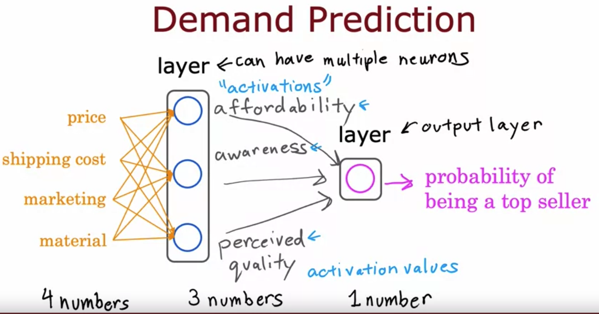

# Overview
background-color:: yellow
	- Deep Learning is a subset of AI that attempts to develop computer systems that learn using **neural networks** like those in the human brain.
	- Origins: Algorithms that try to mimic the brain. Used from 1980s and 1990s for character recognition but the resurgence happened around 2005.
	- While ML is mostly about optimization, deep learning is more focused on creating algorithms to simulate how the human brain's neurons work.
	- Typical use cases
		- Character recognition
		- Speech recognition
		- Image recognition/Computer vision
		- Text (NLP)
		- Online advertising, ....
	- Why Neural Networks are popular now? Big Data and faster CPU/GPUs made large neural networks possible
	  collapsed:: true
		- 
	- ## Neurons and the brain
	  background-color:: pink
	  collapsed:: true
		- Deep Learning algorithms are composed of interconnected web of nodes called **neurons** and the edges that join them together.
		- #+BEGIN_CAUTION
		  *Even though the origins were biologically motivated, don't take the biological motivation too seriously*
		  #+END_CAUTION
		- 
	- ## Anatomy of a neural network
	  background-color:: pink
	  collapsed:: true
		- Each neural network has a collection of neurons layered one after another
			- A **neuron** takes numbers as input, performs calculations (*typically a logistic regression function*), and then outputs a number (probability). The output of a neuron is a probability number and is called an **activation** (a neuroscience term)
				- {:height 348, :width 317}
			- A **layer** has one or more neurons performing different calculations on same set of features inputted.
				- All the input features are passed to each neuron in a layer for simplicity.
				- In the picture below, 4 input features is part of the **input layer** - represented by $\large\vec{x}$
				- The layer in the middle with 3 neuron is called the **hidden layer**.
				- The output of hidden layer is called **activations** – represented by $\large \vec{a}$ which is fed as input to the output layer.
				- The final layer is called **output layer** which outputs a single activation which is a a probability value.
				- 
		- background-color:: gray
		  #+BEGIN_TIP
		  One way to think of neural networks is, it is just another version logistic regression which can learn its own features that makes it easier to make accurate predications. You don't need to do manual feature engineering, it can learn its own features to make the learning problem easier for itself. This is what makes neural networks one of the most powerful learning algorithms in the world.
		  #+END_TIP
	- ## Neural Network Architecture
	  background-color:: pink
	  collapsed:: true
		- There can be multiple hidden layers in a network. One of the decisions you need to make when creating a neural network is, *how many layers are needed*, *how many neurons in each layer is needed?*. This is what determines the **Neural Network Architecture**.
		- A neural network with multiple layers like this is called a **multilayer perceptron**
		- Choosing the right architecture (number of layers and neurons) will have an impact on the performance of the algorithm.
			- 