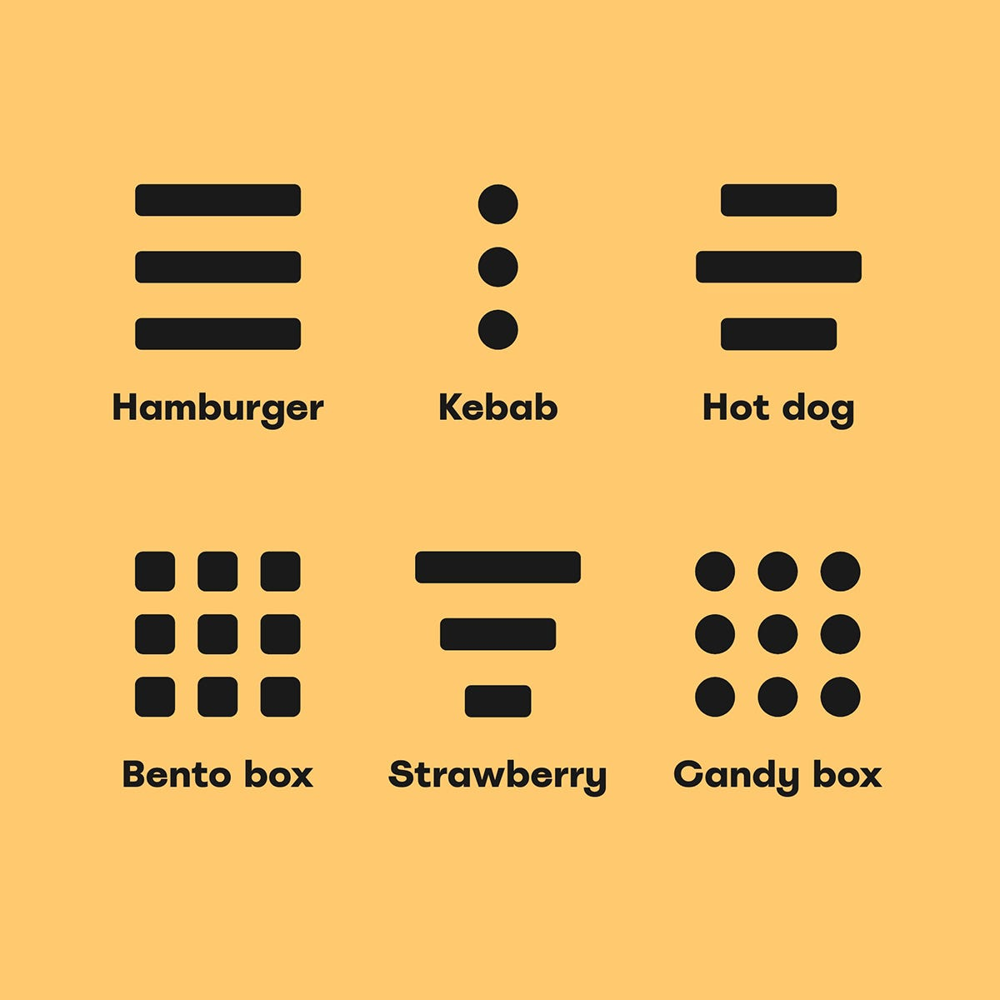

title:: Design Systems

-
- > 💵💵💵 *Software Engineering: A Practitioner’s Approach*: “For every dollar spent to resolve a problem during product design, $10 would be spent on the same problem during development, and multiply to $100 or more if the problem had to be solved after the product’s release.”
-
- A design system is a universal source of truth for the design team — a collection of design assets, guidelines, constraints and best practices to adhere to when embarking on a new design project.
-
- ## Overview
  background-color:: blue
	- [Free Book: Introducing Design Systems by Invisio](https://www.designbetter.co/design-systems-handbook/introducing-design-systems)
	- [Comprehensive guide to Design Systems](https://www.invisionapp.com/inside-design/guide-to-design-systems/)
	- What is a Design System?
		- Design System is a series of documented elements, components, and regions that include both design and front-end guidelines. The documentation contains live code examples, allowing cross-functional teams to easily reuse styles and components in several instances across an application.
		- A design system also includes underlying design principles, rules, and guidelines that help a team build one or multiple products.
		- Design systems are more than the latest fad; they are a natural evolution in the intersection between art, technology, and industry.
		- The rise of component-based architectures and the move to Agile software development has created a need for design systems.
	- Why Design Systems?
		- Design systems let teams move faster by reducing the layers of translation between design and implementation.
	- Diff b/w Design Systems vs. Component library and Style guides
		- Design system is a documented approach to systematic design.
		- Style guides and component libraries are assets to help get you there.
-
- ## 6 interlocking areas of a Design System
  background-color:: blue
	- **==1. Layout==**: Defined measures that make up your spacing and grid system.
	- **==2. Styles==**: Core aspects of your visual language like colors, iconography, and typography.
	- **==3. Components==**: Core elements of an interface like buttons and form fields.
	- **==4. Regions==**: Overarching design paradigms, such as navigation or search.
	- **==5. Content==**: Information regarding the voice and tone, as well as punctuation guidelines. Content can also include terminology if your product has a specific vocabulary.
	- **==6. Usability==**: Rules that define accessibility and internationalization.
		- How usable your product is will define its success. Users should be able to familiarize themselves with your user interface quickly and without too much prompting. They should be able to achieve their objectives directly and with as little friction as possible. Upon returning to your product, they should be able to recall how to navigate and perform familiar actions.
		- 2 common usability concerns include
			- *Accessibility* - various levels of accessibility, such as visual, hearing, and cognitive impairments, as well as motor disabilities.
				- Should your product work with screen readers?
				- Do your colors pass WCAG contrast ratio standards?
				- Do your touch points on mobile have large enough targets?
				- Is your font readable?
			- *Internationalization*
		- https://www.usability.gov/how-to-and-tools/methods/system-usability-scale.html
- ## Atomic Design
  background-color:: blue
	- > 📗 Free e-Book:  https://atomicdesign.bradfrost.com/table-of-contents/
	- > ℹ️ Reference: https://bradfrost.com/blog/post/atomic-web-design/
	- Atomic design is methodology for creating design systems. There are five distinct levels in atomic design:
		- Atoms
			- are our HTML tags, such as a form label, an input or a button. can also include more abstract elements like color palettes, fonts and even more invisible aspects of an interface like animations.
		- Molecules
			- relatively simple combinations of atoms built for reuse. e.g., label, input box and a search button combined together for search function
		- Organisms
			- e.g., a masthead on a site which consists of a logo, navigation, search form, social media links, etc.
			- Building up from molecules to organisms encourages creating standalone, portable, reusable components
		- Templates
			- Templates consist mostly of groups of organisms stitched together to form pages.
			- Templates begin their life as HTML wireframes.
		- Pages
			- Pages are specific instances of templates.
- ## Design Language
  background-color:: blue
	- > ℹ️ https://medium.com/thinking-design/what-is-a-design-language-really-cd1ef87be793
	- term used to describe the overall visual design of a digital product
	- 2 attributes of a language
		- ==Lexicon== - e.g., words in English vs. basic elements like button in a UI. When viewed in their simplest form, these fragments are meaningless.
		- ==Grammar== - usage and technical guidelines help define when and how individual components should be used
	- By thinking about design as a language system, we can create a lexicon comprised of elements and document a grammar, or series of guidelines, that govern their use.
	- Foundation of creating a design language is
	  collapsed:: true
		- **Clearly defined semantics** (and no, “error”, “warning”, “success”, and “info” aren’t nearly enough)
		- **Thorough and mature mapping** of core elements of design with clear purposes and meanings
		- **A solid family of UI components and patterns that effectively support the semantics**, and use design elements (based on *their* meanings) to support the meaning of the components
		- **Thorough, comprehensive documentation** about the visual communication system
	- Example
	  collapsed:: true
		- A simple framework is to fill in the blanks of this statement: ==**The ______ used in the ________ helps to communicate _________.**==
			- The first item of the statement is a specific ==*design element*==,
			- the second line is the ==*component or pattern*== you are analyzing,
			- and the final item is the ==*semantic*==.
		- Example: The ==**line thickness**== used in the ==**primary button component**== helps to communicate ==** important interactive elements**==.
	- Grammar: The Guidelines of your system
		- **A formal definition**: A brief overview of what you are documenting. What is a button? This may seem straightforward to you, but being explicit strengthens your language and the overall understanding that your team shares.
		- **Usage guidelines**: Explain the use of each component. Include behavioral rules. When should you use placeholder text within an input? How do alerts differ from toast notifications? These are questions that should be answered when reading your design system.
		- **Technical guidelines**: Work closely with your engineering team to include any technical guidelines that will aid in the creation and use of a component within your product. This could include class names, as well as other options passed via data attributes or JavaScript.
		- **Related components**: Link related components to help those navigating your system find what they are looking for more easily.
	- ### Design Tokens
		- https://uxdesign.cc/a-beginners-guide-to-design-tokens-191e90fac9c8
		- Useful for switching between light and dark modes
		- https://atlassian.design/tokens/design-tokens
-
- ## Design Thinking
  background-color:: blue
	- The design thinking process comprises 5 phases:
		- Empathise (with the user),
		- Define (the problem),
		- Ideate (potential solutions),
		- Prototype
		- Test.
	- Design thinking is used to address particularly tricky UI problems.
- ## Sample Design Systems
  background-color:: blue
	- https://www.designsystemsforfigma.com/
	- [Bolt Design System](https://boltdesignsystem.com/)
	- https://patternlab.io/ - to create design systems
	- [Material Design System](https://m3.material.io/get-started) by Google
	- https://atlassian.design/get-started by Atlassian
	- https://design.gs.com/home by Goldman Sachs
-
- ## Usability
  background-color:: blue
	- 3 facts about real world web use
		- We don't read pages. We scan them
		- We don't make optimal choices. We satisfice (*satisfy + suffice*)
		- We don’t figure out how things work. We muddle through
	- **Principles**
		- *If something requires a large investment of time—or looks like it will—it’s less likely to be used.*
		- *Don't make me think*
			- Every question mark in the user's head adds to the cognitive workload, distracting user's attention from the task at hand. The distractions may be slight but they add up, especially if it’s something we do all the time like deciding what to click on.
			- Most people are going to spend far less time looking at the pages we design than we’d like to imagine
		- *If you can’t make something self-evident, you at least need to make it self-explanatory*
		- Create effective visual hierarchies
			- *The more important something is, the more prominent it is*
			- *Things that are related logically are related visually*
			- *Things are “nested” visually to show what’s part of what*
-
- ## Design Tools
  background-color:: blue
	- Figma - interface design tool
	- Fluid UI - prototyping and wireframing tool used for mobile touch interfaces.
	- https://shortcuts.design/
- ## Glossary
  background-color:: blue
	- https://www.uxdesigninstitute.com/blog/ui-glossary/
	- Ascenders
	- Bento menu
		- {:height 265, :width 329}
	- [Gestalt principles](https://www.verywellmind.com/gestalt-laws-of-perceptual-organization-2795835)
	- Informational components
		- In UI design, informational components are elements that tell users what’s going on. While we go into more details of these elements elsewhere in the glossary, tooltips, icons, progress bar, notifications, message boxes and modal windows are all examples of informational components.
- ## Questions
  background-color:: blue
	- TODO What is Information Architecture?
	- What is Interaction Design?
	- Diff b/w UX design, UI design, interaction design?
	- Mobile Web View
-
- ## References
  background-color:: blue
	- [What is a Design System](https://rangle.io/blog/what-is-a-design-system)
	- [Figma - State of Design Systems 2018](https://www.figma.com/blog/state-of-design-systems-2018/)
	- [Design System Maturity Levels](https://millisecond-design.medium.com/design-system-maturity-levels-ef30772c02c5)
	- https://www.designinnovationglobal.com/
	- https://designopsusa.com
	- https://dribbble.com/
	- 📚 Building Design Systems by Sarrah Vesselov, Taurie Davis 
	  
	- 📚 Don't Make Me Think by Steve Krug