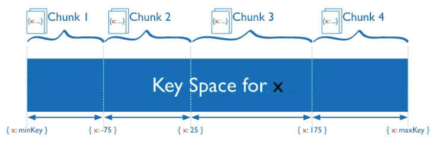
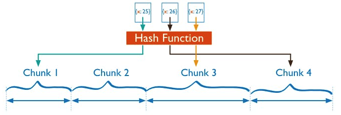
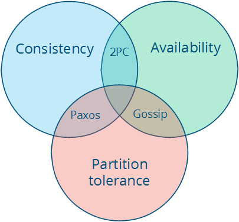

# Distributed Data
background-color:: yellow
collapsed:: true
	- **Why distribute data?**
		- There are various reasons to distribute a database across multiple machines:
			- **Scalability**: If your data volume, read load, or write load grows bigger than a single machine can handle, you can potentially spread the load across multiple machines.
			- **Increase availability or fault tolerance** : to allow the system to continue working even if some of its parts have failed
			- **Reduce Latency**: To keep data geographically close to your users.
	- There are two common ways to distribute data across multiple nodes:
		- **partition**
		- and **replication**.
	- 
- # Replication
  background-color:: yellow
	- Replication is making copies of the same data on multiple machines; this allows more servers to take part in the computation.
	- It can also be copied or cached on different nodes to reduce the distance between the client and the server and for greater fault tolerance.
	- improves performance by making additional computing power and bandwidth applicable to a new copy of the data
	- improves availability by creating additional copies of the data, increasing the number of nodes that need to fail before availability is sacrificed
	- is also the source of many of the problems, since there are now independent copies of the data that has to be kept in sync on multiple machines - this means ensuring that the replication follows a consistency model.
	- ***Strong consistency*** allows you to program as-if the underlying data was not replicated.
	- ***Weaker consistency*** models can provide lower latency and higher availability.
	- **Why replicate?**
		- to increase availability (by tolerating individual node failures)
		- to increase scalability (processing more requests than a single machine can handle)
		- to reduce latency (placing replicas geographically closer to the users)
	-
	- ## Replication Types
	  background-color:: pink
		- 
		  {{renderer :mermaid_luextzrw}}
			- ```mermaid
			  flowchart LR
			     A[Replication]-.->B1[Types];
			     A-.->B2[Algorithms];
			     B1-.->C1[Synchronous];
			     B1-.->C2[Asynchronous];
			     
			     B2-.->D1[Leader-based Replication];
			     
			     D1-.->E1[Single Leader Replication];
			     D1-.->E2[Multi Leader Replication];
			     B2-.->D3[Leaderless Replication];
			  ```
		- ### Leader-based Replication
		  background-color:: blue
		  collapsed:: true
			- **Leader-based replication** is also known as *active/passive* or *master/slave* replication
			- **Leader**/**Master**/**Primary**
				- One of the node is designated as the *leader* or *master* or *primary*. To write to the database, clients must send their requests to the leader which first writes the new data to its local storage
			- **Follower**/**Slave**/**Secondary**/**Read Replica**
				- After writing to the local storage, leader sends the data change to all its followers as part of a *replication log* or *change stream*
				- Each follower takes the log from the leader and updates its local copy of the database accordingly, by applying all writes in the same order as they were processed on the leader.
			- Leader-based replication is not restricted to only databases. It is also used by :
				- distributed message brokers such as Kafka and RabbitMQ highly available queues
				- network filesystems and replicated block devices such as DRBD
		- ### Synchronous vs. Asynchronous Replication
		  background-color:: blue
		  collapsed:: true
			- **Synchronous replication**
				- leader sends the message to 1 or more followers and waits for them to confirm that it received the write before reporting success to the user
				- **Pros**
					- follower is guaranteed to be in sync with the leader
					- if leader suddenly fails, we can be sure all the data is available
				- **Cons**
					- the writes cannot be processed even if one of the followers crashed or not responding for any reason.
				- **Variants of sync replication**
					- **Semi-synchronous replication**
						- Any node outage in a synch replication can bring the whole system to a halt. So in practice, only one of the follower is replicated synchronously, while the rest are synced in an asynchronous way. If the synchronous follower fails, one of the async followers is made a sync follower.
					- **Chain replication**
						- Used by Windows Azure Storage
						- https://medium.com/coinmonks/chain-replication-how-to-build-an-effective-kv-storage-part-1-2-b0ce10d5afc3
			- **Asynchronous Replication**
				- leader sends the message but doesn't wait for a response from the follower
				- **Pros**
				- **Cons**
					- writes are not guaranteed to be durable even if it has been confirmed to the client - if the leader fails and is not recoverable, any writes have not yet been replicated are lost
	- ## Handling Failures
	  background-color:: pink
	  collapsed:: true
		- 
		  {{renderer :mermaid_xbcbwuxh}}
			- ```mermaid
			  flowchart LR
			     A[Failures]-.->B1[Follower Failure];
			     A-.->B2[Leader Failure];
			     B2-.->C1[Auto Failover];
			     C1-.->D1[1. Detect leader failure];
			     C1-.->D2[2. Choose a new leader];
			     C1-.->D3[3. Reconfigure the system to use the new leader];
			     D2 -.-> E1[Election process/Consensus];
			     D2 -.-> E2[Controller Node];
			     D3 -.-> F1[Request Routing];
			  ```
		- ### Follower failure
		  background-color:: blue
			- Each follower keeps a log of the data changes it received from the leader in its local disk. If follower crashes and is restarted, it can recover quite easily from its logs.
		- ### Leader failure
		  background-color:: blue
			- **How Failover Process Works?**
				- When the leader fails
					- one of the followers need to be promoted to be the new leader
					- clients need to be reconfigured to send their writes to the new leader, and
					- the other followers need to start consuming data changes from the new leader.
			- **Automatic Failover Process Steps**
				- *Determining that the leader has failed*
					- most systems simply use a timeout to determine if a node is responding
				- *Choosing a new leader*
					- this could be done through an election process where the leader is chosen by a majority of the remaining replicas
					- or a new leader could be appointed by a previously elected *controller node*
				- *Reconfiguring the system to use the new leader*
					- Clients need to send their write requests to the new leader (Request Routing)
	- ## Implementation of Replication Logs
	  background-color:: pink
		- 
		  {{renderer :mermaid_qszrbewo}}
			- ```mermaid
			  flowchart LR
			     A[Implementation]-.->B1[Statement-based replication];
			     A-.->B2[Write-ahead log shipping ];
			     A-.->B3[Logical log replication];
			  
			  ```
		-
	-
- # Partitioning / Sharding
  background-color:: yellow
  collapsed:: true
	- ## What is Sharding?
	  background-color:: pink
	  collapsed:: true
		- Sharding is a form of scaling known as **horizontal scaling** or **scale-out**, as additional nodes are brought on to share the load.
		- **Sharding** is a method for distributing a single large dataset across multiple databases, which can then be stored on multiple machines. This allows for larger datasets to be split into smaller chunks and stored in multiple data nodes, increasing the total storage capacity of the system.
		- **Pros**
			- by distributing the data across multiple machines, a sharded database can handle more requests than a single machine can.
			- improves performance by limiting the amount of data to be examined and by locating related data in the same partition
			- improves availability by allowing partitions to fail independently, increasing the number of nodes that need to fail before availability is sacrificed
	- ## Sharding Strategy
	  background-color:: pink
	  collapsed:: true
		- ### Range-based sharding
		  background-color:: blue
			- **Ranged sharding** divides data into ranges based on the shard key values. Each chunk is then assigned a range based on the shard key values.
			- 
		- ### Simple hashed sharding
		  background-color:: blue
			- **Hashed Sharding** involves computing a hash of the shard key field’s value. Each chunk is then assigned a range based on the hashed shard key values.
			- 
		-
		- ### Consistent hashing or Hash Ring
		  background-color:: blue
			- is a special kind of hashing such that when a hash table is resized and consistent hashing is used, only `K/n` keys need to be remapped on average, where `K` is the number of keys, and `n` is the number of slots. In contrast, in most traditional hash tables, a change in the number of array slots causes nearly all keys to be remapped.
			- The advantage of Consistent Hashing with sharding is to reduce the number of rows affected (i.e., that need to be moved) as new physical shard servers are added or removed.
			- http://highscalability.com/blog/2023/2/22/consistent-hashing-algorithm.html
			- [Consistent Hashing Explained](http://michaelnielsen.org/blog/consistent-hashing/)
	- ## Sharding Types
	  background-color:: pink
	  collapsed:: true
		- ### Black-Box Sharding
		  background-color:: blue
			- The most common sharding technique in existence is black-box sharding, meaning that the shard distribution logic is controlled internally by the toolkit or product, and not exposed to the application.
			- The primary drawback for the black-box sharding approach is when you need to obtain related data, such as lists of items that have to do with a particular data element. This is often referred to as a *scatter-gather approach*: the data is scattered by key across the cluster, and must be gathered into meaningful lists of related data
		- ### Relational Sharding
		  background-color:: blue
			- With relational sharding, the application or database architect defines the sharding schema along the natural data relationships in the data model. The advantage is that related data is *co-located* in the same physical server, allowing more application queries to be resolved with a single invocation to a given shard server.
			- The sharding strategy for the relational approach also uses a hash function to partition the data, again typically using a modulus or consistent hash approach.
			- Allows easy join of related data unlike in black-box sharding.
	- ## Replication vs. Sharding
	  background-color:: pink
	  collapsed:: true
		- Replication is taking copies of a given DB as-is. However, sharding is splitting the large dataset into multiple smaller chunks stored across multiple nodes.
		- Replication is much simpler to setup than sharding.
		- **Read-focused vs. Write-focused load**:
			- Replication works well if your data workload is primarily read-focused. It increases availability and read performance by simply spinning up additional copies of the DB and through load balancing.
			- Sharding works well if your DB contains large amounts of data, requires high read and high write volume, and have specific availability requirements.
- # Scalability
  background-color:: yellow
	- Check [[Scalability]] page for more details
- # Fault tolerance
  background-color:: yellow
  collapsed:: true
	- ability of a system to behave in a well-defined manner once faults occur.
	- define what faults you expect and then design a system or an algorithm that is tolerant of them.
	- > [Byzantine fault tolerance](https://en.wikipedia.org/wiki/Byzantine_fault_tolerance)
	- **Constraints**
		- Distributed systems are constrained by two physical factors:
			- 1. the number of nodes (which increases with the required storage and computation capacity)
			- 2. the distance between nodes (information travels, at best, at the speed of light)
		- Working within those constraints:
			- a) an increase in the number of independent nodes increases the probability of failure in a system (reducing availability and increasing administrative costs)
			- b) an increase in the number of independent nodes may increase the need for communication between nodes (reducing performance as scale increases)
			- c) an increase in geographic distance increases the minimum latency for communication between distant nodes (reducing performance for certain operations)
		- Beyond these tendencies - which are a result of the physical constraints - is the world of system design options.
- # System Models
  background-color:: yellow
  collapsed:: true
	- In a distributed system :
		- each node executes a program concurrently
		- knowledge is local: nodes have fast access only to their local state, and any information about global state is potentially out of date
		- nodes can fail and recover from failure independently
		- messages can be delayed or lost (independent of node failure; it is not easy to distinguish network failure and node failure)
		- No shared memory or shared clock. Clocks may not synchronized across nodes (local timestamps do not correspond to the global real time order, which cannot be easily observed)
		- >    System Model is a set of assumptions about the environment and facilities on which a distributed system is implemented
	- System models vary in their assumptions about the environment and facilities. These assumptions include:
		- what capabilities the nodes have and how they may fail
		- how communication links operate and how they may fail and
		- properties of the overall system, such as assumptions about time and order
	- A robust system model is one that makes the weakest assumptions: any algorithm written for such a system is very tolerant of different environments, since it makes very few and very weak assumptions.
	- On the other hand, we can create a system model that is easy to reason about by making strong assumptions. For example, assuming that nodes do not fail means that our algorithm does not need to handle node failures. However, such a system model is unrealistic and hence hard to apply into practice.
	- There are 3 main factors/properties affecting the Distributed computing
		- 1. Nodes
		- 2. Communication Links (between nodes)
		- 3. Time & Order
	- ## Nodes
	  collapsed:: true
		- Nodes serve as hosts for computation and storage. They have:
			- the ability to execute a program
			- the ability to store data into volatile memory (which can be lost upon failure) and into stable state (which can be read after a failure)
			- a clock (which may or may not be assumed to be accurate)
		- Nodes execute deterministic algorithms: the local computation, the local state after the computation, and the messages sent are determined uniquely by the message received and local state when the message was received.
	- ## Communication Links
	  collapsed:: true
		- Communication links connect individual nodes to each other, and allow messages to be sent in either direction.
		- In general networks are considered to be unreliable and subject to message loss and delays. But some algorithms assume that the network is reliable (that messages are never lost and never delayed indefinitely). This may be a reasonable assumption for some real-world settings.
		- A ***network partition*** occurs when the network fails while the nodes themselves remain operational. When this occurs, messages may be lost or delayed until the network partition is repaired. Partitioned nodes may be accessible by some clients, and so must be treated differently from crashed nodes. The diagram below illustrates a node failure vs. a network partition:
		- 
	- ## Timing/Order
	  collapsed:: true
		- If nodes are at different distances from each other, then any messages sent from one node to the others will arrive at a different time and potentially in a different order at the other nodes.
		- **Timing Assumptions / Timing System Models**
		- ***Synchronous System Model***
			- Processes execute in lock-step; there is a known upper bound on message transmission delay; each process has an accurate clock
		- ***Asynchronous System Model***
			- No timing assumptions - e.g. processes execute at independent rates; there is no bound on message transmission delay; useful clocks do not exist
- # CAP Theorem
  background-color:: yellow
  collapsed:: true
	- (*Proposed by Eric Brewer in 2000, proved by Seth Gilbert and Nancy Lynch of MIT in 2002*)
	- The theorem states that in any distributed system, only 2 of these 3 properties can be satisfied simultaneously:
		- 1. **Consistency**: all nodes see the same data at the same time.
		- 2. **Availability**: node failures do not prevent survivors from continuing to operate.
		- 3. **Partition tolerance**: the system continues to operate despite message loss due to network and/or node failure
	- |  |  |
	- ## CA (Consistency + Availability)
	  collapsed:: true
		- All relational DBs are CA.
		- When a partition occurs, the system blocks.
		- Examples include *full strict quorum protocols*, such as *two-phase commit*.
		- Strong consistency model; *CANNOT- tolerate any node failures
		- A CA system does not distinguish between node failures and network failures, and so the only safe thing is to stop accepting writes everywhere to avoid introducing **divergence** (or multiple copies).
		- CA systems are not partition-aware, and often use the two-phase commit algorithm and are common in traditional distributed relational DBs.
	- ## CP (Consistency + Partition Tolerance)
	  collapsed:: true
		- Say you have three nodes and one node loses its link with the other two. You can create a rule that a result will be returned only when a majority of nodes agree. So, despite having a partition, the system will return a consistent result. However, since the separated node won’t be able to reach consensus it won’t be available even though it’s up.
		- Examples include majority quorum protocols in which minority partitions are unavailable such as *Paxos*.
		- Strong consistency model; *CAN- tolerate node failures
		- CP systems incorporate network partitions into their failure model and distinguish between a majority partition and a minority partition using an algorithm like [Paxos](http://harry.me/blog/2014/12/27/neat-algorithms-paxos/), [Raft](https://ramcloud.stanford.edu/raft.pdf) or viewstamped replication. ( [A primer on consensus](http://harry.me/blog/2013/07/07/id-like-to-have-an-argument-a-primer-on-consensus/))
		- in a non-Byzantine failure model, a CP system can tolerate the failure of a minority `n` nodes as long as majority `n+1` stays up in a system with`2n+1` nodes.
		- A CP system prevents divergence (e.g. maintains single-copy consistency) by forcing asymmetric behavior on the two sides of the partition. It only keeps the majority partition around, and requires the minority partition to become unavailable (e.g. stop accepting writes), which retains a degree of availability (the majority partition) and still ensures **single-copy consistency**.
	- ## AP (Availability + Partition Tolerance)
		- Say you have two nodes and the link between the two is severed. Since both nodes are up, you can design the system to accept requests on each of the nodes, which will make the system available despite the network being partitioned. However, each node will issue its own results, so by providing high availability and partition tolerance you’ll compromise consistency.
		- The system is still available under partitioning, but some returned data may be inaccurate, e.g., DNS, caches, Master/Slave replication.
		- Needs a conflict resolution strategy.
		- Examples include protocols using conflict resolution, such as *Dynamo*.
	-
	- In a distributed system, managing consistency(C), availability(A) and partition toleration(P) is important.
	- Eric Brewer put forth the CAP theorem which states that in any distributed system we can choose only two of consistency, availability or partition tolerance.
	- Consistency and availability are not really binary choices, unless you limit yourself to strong consistency. But strong consistency is just one consistency model: the one where you, by necessity, need to give up availability in order to prevent more than a single copy of the data from being active.
	- Many NoSQL DBs try to provide options where the developer has choices where they can tune the DB as per their needs.
	- For example if you consider a distributed DB, there are essentially three variables r, w, n where
		- `r` = number of nodes that should respond to a read request before its considered successful.
		- `w` = number of nodes that should respond to a write request before its considered successful.
		- `n` = number of nodes where the data is replicated aka replication factor.
	- In a cluster with 5 nodes,
		- we can tweak the `r`, `w`, `n` values to make the system very consistent by setting `r=5` and `w=5` but now we have made the cluster susceptible to network partitions since any write will not be considered successful when any node is not responding.
		- We can make the same cluster highly available for writes or reads by setting `r=1` and `w=1`  but now consistency can be compromised since some nodes may not have the latest copy of the data.
- # Consistency Models
  background-color:: yellow
  collapsed:: true
	- > Consistency Model is a contract between programmer and system, wherein the system guarantees that if the programmer follows some specific rules, the results of operations on the data store will be predictable
	- There are 2 types of consistency models:
		- 1. **Strong consistency model**:
			- guarantee that the apparent order and visibility of updates is equivalent to a non-replicated system
				- Strong consistency models allow a programmer to replace a single server with a cluster of distributed nodes and not run into any problems
		- 2. **Weak consistency model**: do not make such guarantees
	- > Below is not an exhaustive list
	- ## Strong consistency models
	  collapsed:: true
		- #+BEGIN_TIP
		  capable of maintaining a single copy
		  #+END_TIP
		- Linearizable consistency
		- Sequential consistency
	- ## Weak consistency models
	  collapsed:: true
		- #+BEGIN_TIP
		  Not Strong
		  #+END_TIP
		- Client-centric consistency models
		- Causal consistency: strongest model available
		- Eventual consistency models
			- Says that if you stop changing values, then after some undefined amount of time all replicas will agree on the same value. It is implied that before that time results between replicas are inconsistent in some undefined manner.
			- how long is "eventually"? It would be useful to have a strict lower bound, or at least some idea of how long it typically takes for the system to converge to the same value.
			- how do the replicas agree on a value? A system that always returns "42" is eventually consistent: all replicas agree on the same value. It just doesn't converge to a useful value since it just keeps returning the same fixed value. Instead, we'd like to have a better idea of the method. For example, one way to decide is to have the value with the largest timestamp always win.
			- So when vendors say "eventual consistency", what they mean is some more precise term, such as "eventually last-writer-wins, and read-the-latest-observed-value in the meantime" consistency. The "how?" matters, because a bad method can lead to writes being lost - for example, if the clock on one node is set incorrectly and timestamps are used.
- # References
	- Designing Data Intensive Applications
	- [Distributed Systems for fun and profit](http://book.mixu.net/distsys/single-page.html)
	- [Notes on Distributed Systems for young bloods](https://www.somethingsimilar.com/2013/01/14/notes-on-distributed-systems-for-young-bloods/)
	- **Blogs**
	- [highscalability.com](http://highscalability.com)
	- [allthingsdistributed.com](http://allthingsdistributed.com)