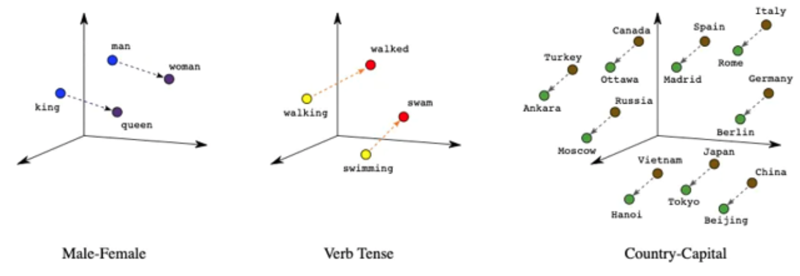
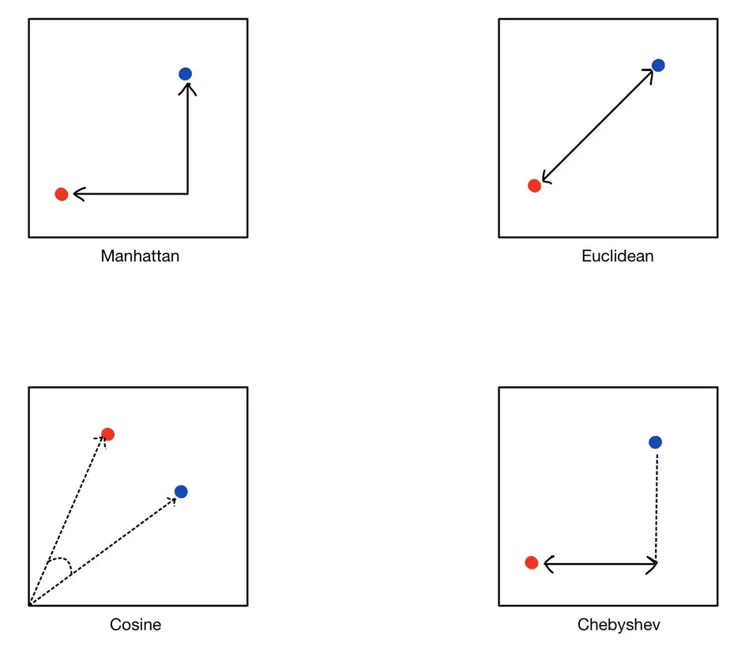

- {{renderer :tocgen2}}
- # Overview
  background-color:: yellow
  collapsed:: true
	- **Generative models** are a class of AI machine learning models that can generate new data based on training data. The generated content may be text, images, audio and video.
	- Building Generative AI is a highly empirical (experimental) process - we repeatedly find and fix mistakes. Here are some tools used to improve its performance
		- **Prompting**
		- **RAG** (Retrieval Augmented Generation): Gives LLM access to external data sources
		- **Fine-tune models**: Adapt LLM to your tasks
		- **Pre-train models**: Train LLM from scratch
	- Visuals here
	  collapsed:: true
		- {:height 518, :width 559}
		- {:height 687, :width 726}
		- {:height 492, :width 883}
	- ## Limitations of Generative AI
	  background-color:: red
	  collapsed:: true
		- Knowledge cutoff
			- cannot respond to events that happened after the cutoff data upto which the model is trained
		- Hallucinations
		- Context length
			- depending on the LLM used, there are limitations on the context length (which includes both input prompt and output generated)
		- Tabular data
			- Gen AI is well suited for unstructured data (text, audio, video, etc.) but not for the tabular data input
		- Bias and Toxicity
			- LLMs can reflect bias that exist in the text it learned from (generally from internet)
			- LLMs can also output toxic or harmful speech
			- 
	- ## Transformers
	  background-color:: red
	  collapsed:: true
		- Special type of neural network - enabling context-aware text generation
		- Transformers is a technology from Google Research and Google Brain from 2017.
		- Transformers are the building blocks for the AI models like GPT-4. Used in Generative AI, Computer vision.
		- Transformers are a machine learning model architecture, like Long Short Term Memory Neural Networks (LSTMs), and Convolutional Neural Networks (CNNs)
		- Before transformers, the older models were sequential in processing the text - one word at a time - which limited processing large text since it was compute intensive and time-taking
		- Transformers output only one word or token at a time which is then fed back into the model to generate the next word. Feeding the output back into the model is called **Auto Regressive Model**
		- {{renderer :mermaid_66ef66dd-2501-4b44-be03-d2033ebb387d, 3}}
			- ```mermaid
			  flowchart LR
			  	A0("Machine Learning Model Architectures") --> A1("LSTM (Long Short Term Memory neural networks)")
			      A0 --> A2("CNN (Convolutional neural networks)")
			      A0 --> A3("Transfomers")
			  ```
	- ## Embeddings
	  background-color:: red
		- Words -> Tokens -> Token IDs -> Vectors
		- {:height 440, :width 892}
		- {:height 296, :width 797}
		- Libraries
			- word2vec
			- [FastText](https://fasttext.cc/)
			- GloVe
			- BERT
			- [OpenAI Tiktoken](https://github.com/openai/tiktoken) - [How to count tokens with Tiktoken](https://cookbook.openai.com/examples/how_to_count_tokens_with_tiktoken)
		-
- # LLM - Large Language Models
  background-color:: yellow
  collapsed:: true
	- **What is a Language Model?**
		- Predicting the next word e.g., Gmail, Teams, Google Search, etc.
		- 3 ingredients to build a successful language model
			- large amount of training text
			- good word to vector embedding tools
			- and a deep learning neural network architecture
		- **Auto Regressive Models**: Models that take the last output and feed back into the model to generate the next word
		- LLMs are **stochastic** – there’s no guarantee that an LLM will give you the same output for the same input every time. You can force an LLM to give the same response by setting `temperature = 0`, which is, in general, a good practice.
		- https://huyenchip.com/2023/04/11/llm-engineering.html
	- ## What is a Large Language Model?
	  background-color:: red
		- Language Model trained on internet scale data
		- A large language model is a trained deep-learning model that understands and generates text in a human-like fashion.
		- Think of LLM as a **reasoning engine**. Typically, a database is used as a source of information, whereas LLM is used to process information.
		- LLM have a lot of general knowledge, but they don't know everything.
		- LLMs are much more than just a single model and there are many other techniques and models in the field of language AI that are worth exploring.
		- Behind the scene, it is a large transformer model that does all the magic.
		- https://machinelearningmastery.com/what-are-large-language-models/
		- 
	- ## Popular LLMs
	  background-color:: red
	  collapsed:: true
		- Developed by OpenAI. GPT-2 is open-source. GPT-3 & GPT-4 are not open-source.
		- Microsoft's Sydney is model based on GPT-4 used in Bing search engine.
		- Microsoft's Kosmos-1 is trained on image content.
		- Google's LaMDA. Google's Bard chat UI is based on this.
		- Google's PaLM has 3x more parameters than LaMDA. Multimodal model used for robots and image content.
		- Google's Chinchilla
		- Anthropic's Claude. Poe is the chat UI
		- Meta's LLaMA
		- BigScience's BLOOM - open-source multilingual model
		- Stability AI's Stable Diffusion - generates images from text.
		- Github's Copilot - model to generate code from text is based on OpenAI Codex which is based on GPT-3.
			- GPT-3 provides a base "understanding" of English and several other human languages.
			- Codex is trained on the contents of StackOverflow and Github.
	- ## What is a Foundational Model?
	  background-color:: red
	  collapsed:: true
		- The GPT-series LLMs are also called "foundation models."
		- Foundation models are a class of very powerful AI models that can be used as the basis for other models: they can be specialized, or retrained, or otherwise modified for specific applications.
		- While most of the foundation models people are talking about are LLMs, foundation models aren't limited to language: a generative art model like Stable Diffusion incorporates the ability to process language, but the ability to generate images belongs to an entirely different branch of AI.
	- ## LLM Types
	  background-color:: red
	  collapsed:: true
		- 
		- Text to text
		- Text to image
			- Generative Adversarial Networks
				- Discovered in 2014
				- Uses 2 neural networks "Generator" (to generate images) and "Discriminator" (to verify the image is real or fake)
				- This model is now replaced by Diffusion Model
				- 
			- Diffusion Model
				- In the forward diffusion process, a training image is fed into the neural network, which adds noise in each stage.
				- The output from each stage $x_1$ is fed into a denoising network (Reverse Diffusion Network) which tries to remove the noise and reconstruct the image
				- {:height 448, :width 713}
	- ## LLM Managed Services
	  background-color:: red
	  collapsed:: true
		- [Amazon Bedrock](https://aws.amazon.com/bedrock/)
			- Fully managed serverless service that offers foundational models
	- ## How to choose a model?
	  background-color:: red
	  collapsed:: true
		- Model Size
			- One way to estimate how capable an LLM is is to look at the model size
			- | **Model size** | **Typical use-case** | **Example** |
			  | ---- | ---- | ---- |
			  | 1B parameters | Pattern matching and basic knowledge of the world | Restaurant review sentiment |
			  | 10B parameters | Greater world knowledge. Can follow basic instructions. | Food order chatbot |
			  | 100B+ parameters | Rich world knowledge. Complex reasoning | Brainstorming partner |
		- Open source vs. Proprietary
			-
- # Advanced Techniques
  background-color:: yellow
  collapsed:: true
	- Both RAG and fine-tuning are cheaper options. Pre-training is expensive.
	- ## RAG
	  background-color:: red
		- RAG (Retrieval Augmented Generation) gives LLM access to external data sources
		- RAG, simply is modification of your prompt
		- Examples: Chat with PDF applications, Snapchat, etc.
	- ## Fine-tuning
	  background-color:: red
		- Why fine-tune?
			- To carry out a task that isn't easy to define in a prompt.
				- e.g., summarize a call center conversation in a certain style or structure
				- e.g., mimicking a writing or speaking style. How would you describe what someone's style of speech in a prompt?
			- To help LLM gain a specific knowledge
				- e.g., here is how a typical Doctor's medical note looks like for a patient with shortness of breath.
				- > Pt c/o SOB, DOE. PE: RRR, JVD absent, CTAB.
				  EKG: NSR. Tx: F/u w/ PCP, STAT CXR, cont. PRN 02.
				- Extract information from Legal documents like this
				- > Licensor grants to Licensee, per Section 2(a) (ili), a non-exclusive right to use the intellectual property, contingent upon compliance with fiduciary duties outlined in Section 8, paragraphs 1-4, and payment as specified in Schedule B, within 15 days hereof.
			- To get a smaller model to perform a task (e.g., 100B parameters to 1B parameters)
				- to lower the cost/latency to deploy
				- to run on mobile/laptop (edge devices)
		- 
	- ## Pre-train LLM
	  background-color:: red
	  collapsed:: true
		- Pre-training general purpose with specific knowledge to specialized domains e.g., Bloomberg has introduced BloombergGPT with 50-billion parameter LLM, purpose-built from scratch for finance.
		- This option can cost $10s of millions of dollars, many months and huge amount of data.
		- Some companies built such specialized LLMs and open-source it.
		- This should be the last resort.
	- ## RLHF
	  background-color:: red
	  collapsed:: true
		- We've been thinking of LLMs as having learned from a lot of texts on the Internet to predict the next word. But when you prompt an LLM, it doesn't just predict the next word on the Internet, it actually follows your instructions. How does it do that?
		- An LLM trained on data like this would be good at repeatedly predicting the next word based on what text on the Internet sounds like. If you were to prompt an LLM with a question like, "*what is the capital of France?*", it is quite possible that it will reply, "*what is the capital of Germany?*". But this isn't the answer you want. You wanted to say that the capital of France is Paris.
		- In order to get an LLM to follow instructions and not just predict the next word, there's a technique called **RLHF (Reinforcement Learning from Human Feedback)**, that can improve the quality of answers further.
		-
		- In RLHF, the model is given a number of prompts, and the results are evaluated by humans. This evaluation is converted into a score, which is then fed back into the training process. (In practice, humans are usually asked to compare the output from the model with no additional training to the current state of the trained model.)
		- Triple H framework: Helpful, Honest, Harmless
			- Many companies training LLMs want the LLM to give results that are helpful, honest, and harmless.
			- Steps
				- Step 1: First step is to train an answer quality (reward) model. In other words, making supervised learning to learn to rate the answers of LLM. e.g., Advise me how to apply for a job
					- 
				- Step 2: Have LLM generate a lot of answers. Further train it to generate more responses that get high scores.
				-
		- https://huggingface.co/blog/rlhf
		- 
- # Prompt Engineering
  background-color:: yellow
  collapsed:: true
	- > https://promptingguide.ai
	- Prompt Evaluation
	- Prompt Versioning
		- Small changes to a prompt can lead to very different results. It’s essential to version and track the performance of each prompt.
	- Prompt Optimization
		- Optimize the prompt for better results by using the techniques below or using a framework model.
	- ## Prompting Techniques
	  background-color:: red
		- **Few-shot prompting**
		  collapsed:: true
			- A common technique for prompt engineering is to provide in the prompt a few examples and hope that the LLM will generalize from these examples.
			- When doing fewshot learning, two questions to keep in mind:
				- **Whether the LLM understands the examples given in the prompt**. One way to evaluate this is to input the same examples and see if the model outputs the expected scores. If the model doesn’t perform well on the same examples given in the prompt, it is likely because the prompt isn’t clear – you might want to rewrite the prompt or break the task into smaller tasks.
				  logseq.order-list-type:: number
				- **Whether the LLM overfits to these fewshot examples.** You can evaluate your model on separate examples.
				  logseq.order-list-type:: number
		- **Zero-shot prompting**: Zero-shot prompting means that the prompt used to interact with the model won't contain examples or demonstrations.
		- **Chain-of-Thought prompting (COT)**: Prompt the model to explain or explain step-by-step how it arrives at an answer.
			- Cons: COT can increase both latency and cost due to the increased number of output tokens
		-
	- ## Prompting Frameworks
	  background-color:: red
		- ### CREATE framework
			- 
- # Vector Databases
  background-color:: yellow
	- ## Overview
	  background-color:: red
		- **Difference between Traditional and Vector Databases**
		  collapsed:: true
			- https://www.singlestore.com/blog/a-complete-guide-to-vector-databases/
			- | | **Data Type**| **Structure**|  **Optimized for**| **Search Method**| 
			  | **Traditional DB** | Scalar | Row/Columns | Transactional Data | SQL Queries (Lexical search)|
			  | **Vector DB** | Vector | Multi-dimensional space| AI & ML apps | Similarity search (Cosine, DOT, Euclidean Distance)|
			- | | **Traditional DB** | **Vector DB** |
			  | **Data Type**| Scalar | Vector |
			  | **Structure**| Rows/Columns| Multi-dimensional space|
			  |  **Optimized for**| Transactional data | AI & ML apps |
			  | **Search Method**| SQL Queries (Lexical search) | Similarity search (Cosine, DOT, Euclidean Distance)|
	- ## Similarity Search
	  background-color:: red
		- https://www.pinecone.io/learn/what-is-similarity-search/
		- ### What is Similarity Search?
		  background-color:: pink
		  collapsed:: true
			- Given a set of vectors and a query vector, finding the most similar items in our set for the query is called Similarity Search. We call this task **nearest neighbor search**.
			- #### Search Algorithms
			  background-color:: green
				- **K Nearest Neighbors or k-NN**: a very popular algorithm to find nearest vectors in a space for a given query vector. The `k` here denotes how many nearest neighbors we want to retrieve.
				  logseq.order-list-type:: number
					- Product Quantizers for k-NN - [Part 1](https://mccormickml.com/2017/10/13/product-quantizer-tutorial-part-1/), [Part 2](https://mccormickml.com/2017/10/22/product-quantizer-tutorial-part-2/)
					- {:height 595, :width 413}
				- **Approximate Nearest Neighbors or ANN**: To reduce the computation complexity added by an exhaustive search like kNN we can make use of approximate neighbor search.
				  logseq.order-list-type:: number
		- **Diff b/w Lexical and Semantic Search?**
		  collapsed:: true
			- **Lexical Search**: Finding similar items based on fixed numeric criteria is very straightforward using a query language in traditional databases. e.g., finding employees in a database within a fixed salary range.
			- **Semantic Search**
				- Example: “*Which objects in our inventory are similar to what a user searched for?*”, "*a user can search for something generic like “shoes”,“black shoes” or something more precise like “Nike AF-1 LV8”*"
				- To handle such queries we need a representation that captures the deeper **conceptual meaning** of the objects. With similarity search, we can work with semantic representations (as vector embeddings) of our data and find similar items fast.
				- When we represent images or pieces of text as vector embeddings, their semantic similarity is represented by how close their vectors are in the vector space. Hence, what we want to look at is the distance between vectors of the objects
		- ### Semantic Search Methods
		  background-color:: pink
			- [Importance of Distance Metrics in Machine Learning Modelling](https://towardsdatascience.com/importance-of-distance-metrics-in-machine-learning-modelling-e51395ffe60d)
			- We can calculate the distance between these vectors in the vectors space according to the distance metric that fits our problem the best. Some of the commonly used distance metrics in ML are Euclidean, Manhattan, Cosine, and Chebyshev.
			- {:height 654, :width 644}
			- **Cosine Similarity**
				- $cos \theta = 1$ means two vectors are identical
				- $cos \theta = 0$ means two vectors are orthogonal
			- **DOT Product**
			- **Manhattan & Euclidean Distance**
				- L1 Distance Similarity - Manhattan Distance
				- L2 Distance Similarity - Euclidean Distance
				- Manhattan distance is like walking around the blocks to reach from A to B. Euclidean distance is like a crow's fly between A to B.
				- 
	- ## Vector Compressions
	  background-color:: red
		- **Scalar Quantization**
		- **Product Quantization**
			- PQ approximates the distance/similarity calculation. PQ achieves this approximated similarity operation by compressing the vectors themselves, which consists of three steps.
				- We split the original vector into several subvectors.
				  logseq.order-list-type:: number
				- For each set of subvectors, we perform a clustering operation — creating multiple centroids for each sub-vector set.
				  logseq.order-list-type:: number
				- In our vector of sub-vectors, we replace each sub-vector with the ID of it’s nearest set-specific centroid.
				  logseq.order-list-type:: number
			- {:height 531, :width 666}
	- ## Indexing Methods
	  background-color:: red
		- k-Dimensional Tree Indexing
			- nearest vector search
		- Inverted File Indexing
		- HNSW (Hierarchical Navigable Small Worlds)
			- https://www.pinecone.io/learn/series/faiss/hnsw/
	- ## Search Tools
	  background-color:: red
		- [Faiss - Facebook AI Similarity Search](https://www.pinecone.io/learn/series/faiss/faiss-tutorial/) - a library developed by Facebook
	- ## List of Popular Vector Databases
	  background-color:: red
		- Pinecone
- # Appendix
  background-color:: yellow
  collapsed:: true
	- **OpenAI** is a research organization that aims to create safe and beneficial AI for humanity
	- **ChatGPT** is a large language model (LLM) that understands and generates natural language text
	- **GitHub Copilot** is an AI-powered pair programmer that suggests code snippets based on the context of your code
	- **Azure OpenAI** is  a cloud-based platform that offers access to OpenAI's cutting-edge language models and AI capabilities
	- **Amazon Bedrock**
	- **Amazon Titan**
	- **Huggingface** is like Github for AI/ML - open-source. Users can upload, create and share 3 types of resources
		- Models
		- Training data
		- Spaces (Environment/Infrastructure to run ML Models & demo)
	- **[Stability.ai](https://stability.ai)** - Open-source Gen AI company behind Stable Diffusion XL
	- **NLP Cloud** - Company behind [Dolphin AI](https://chat.nlpcloud.com/) -
	-
- # Links
  background-color:: yellow
  collapsed:: true
	- https://machinelearningmastery.com/what-are-large-language-models/
	- https://towardsai.net/p/machine-learning/introduction-to-neural-networks-and-their-key-elements-part-c-activation-functions-layers-ea8c915a9d9
	- https://lifearchitect.ai/
	- GPT
		- GPT Builder to create a custom GPT - https://chat.openai.com/create
		- GPT API https://platform.openai.com
		- API Playground https://platform.openai.com/playground
		- Tokenizer https://platform.openai.com/tokenizer
		- Cookbook - https://cookbook.openai.com/
	- Text to Text
		- Chat with PDF files
			- Panda chat
			- ChatPDF
			- AskYourPDF
			- PDF.ai
			- LightPDF
			- docAnalyzer.ai
			- Tactic
	- Text to Image
		- https://leonardo.ai/
		- https://ideogram.ai/
	- Text to Slides
		- https://www.beautiful.ai/
		- Canva with AI capability
	- AI Tools
		- Google Colab
		- Google NotebookLM
- # References
  background-color:: yellow
  collapsed:: true
	- Books
		- Packt's Introduction to Transformers for NLP: With the Hugging Face Library and Models to Solve Problems - Shashank Mohan Jain
		- OReilly's Hands-On Large Language Models - by Jay Alammar, Maarten Grootendorst 
		  {:height 362, :width 255}
	- Blogs
		- https://www.tensorops.ai/
		- https://www.promptingguide.ai/
		- https://jalammar.github.io/
		-
-