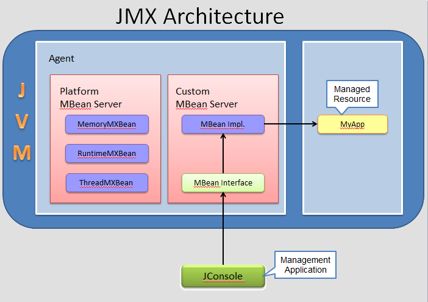

# Overview
collapsed:: true
	- JMX Spec implementors
		- Sun's reference implementation - `lib/jmxri.jar` (JMX reference implementation Java class package) and `lib/jmxtools.jar` (JMX toolkit)
		- Sun's Java Dynamic Management Kit
		- IBM Tivoli's JMX implementation
		- AdventNet Agent Toolkit
- # JMX Architecture
  collapsed:: true
	- > http://docs.oracle.com/javase/6/docs/technotes/guides/management/overview.html
	- 
- # Java VM Instrumentation
  collapsed:: true
	- Technology that enables to monitor and manage applications running in a JVM locally or remotely.
	- ## JMX Components
	  collapsed:: true
		- **Managemement Application**   - JConsole
		- **JMX API**   - The `java.lang.mangement` package provides the interface for monitoring and managing the VM.
		- **Managed Resource**   - your application to be instrumented
		- **MBean Interface**   - Interface to which management app connects to.
		- **MBean or Managed Bean**   - Implementation of the `MBean` interface. This object interacts with your app to get/set attributes or invoke methods.
		- **MBean Server**   - container where MBeans are registered using a unique name.
	- ## MBean
	  collapsed:: true
		- MBeans are Java objects that represent resources to be managed. An MBean has a management interface consisting of the following.
			- Named and typed attributes that can be read and written.
			- Named and typed operations that can be invoked.
			- Typed notifications that can be emitted by the MBean.
		- **Platform MBean**   - is an MBean for monitoring and managing the Java VM and other components of the Java Runtime Environment (JRE). Each MXBean encapsulates a part of VM functionality such as the class loading system, just-in-time (JIT) compilation system, garbage collector, and so on.
		- **Types of MBean**
		  collapsed:: true
			- Standard
			- Dynamic
			- Open
			- Model
			- MXBean
		- ### Standard MBean
		  collapsed:: true
			- Standard MBeans are the simplest MBeans. Here are what you need to do to manage a Java object using a standard MBean.
				- Create an interface named after your Java class plus the suffix `MBean`. For example, if the Java class whose objects you want to manage is called `Car`, the interface must be called `CarMBean`.
				- Modify your Java class so that it implements the interface you’ve created.
				- Create an agent. The agent class must contain an MBean server.
				- Create an ObjectName for your MBean.
				- Instantiate the MBean server.
				- Register your MBean with the MBean server.
			- Standard MBeans are easy to write, but they require that your classes be modified. While this is okay in some projects, in others (especially when there are many classes involved) this is not acceptable. Fortunately, other types of MBeans allow you to manage objects without modifying classes.
		- ### MXBean
		  collapsed:: true
			- The name of this interface must end with `MXBean` (as opposed to `MBean` with standard MBeans), however the prefix does not have to match the name of the manageable class. This is to say your manageable class may be called `Car` and your `MXBean` interface may be named `CarMXBean`.
			- Alternatively, if you don’t want to follow the naming convention for MXBeans, i.e. you don’t want your interface name to end with `MXBean`, you can simply apply the `@MXBean` annotation to your interface definition.[JavaDoc](http://docs.oracle.com/javase/6/docs/api/javax/management/MXBean.html)
			- **Why MXBean?**
				- provides a simple way to code an MBean that only references a predefined set of types. In this way, you can be sure that your MBean will be usable by any client, including remote clients, without any requirement that the client have access to model-specific classes representing the types of your MBeans. The platform MBeans introduced below are all MXBeans.
- # MBean Server or JMX Agent
  collapsed:: true
	- An MBean Server is a repository of MBeans. Each MBean is registered with a unique name within the MBean server. Usually the only access to the MBeans is through the MBean server. In other words, code does not access an MBean directly, but rather accesses the MBean by name through the MBean server.
	- ## Platform MBean Server
	  collapsed:: true
		- The platform MBean Server can be shared by different managed components running within the same Java VM. You can access the platform MBean Server with the method `ManagementFactory.getPlatformMBeanServer()`. The first call to this method, creates the platform MBean server and registers the platform MXBeans using their unique object names. Subsequently, it returns the initially created platform MBeanServer instance.
		- MXBeans that are created and destroyed dynamically (for example, memory pools and managers) will automatically be registered and unregistered in the platform MBean server. If the system property `javax.management.builder.initial` is set, the platform MBean server will be created by the specified `MBeanServerBuilder`.
		- You can use the platform MBean server to register other MBeans besides the platform MXBeans. This enables all MBeans to be published through the same MBean server and makes network publishing and discovery easier.
	- ## Creating & Registering MBean
	  collapsed:: true
		- There are 2 ways to do this
			- One is to construct a Java object that will be the MBean, then use the `registerMBean` method to register it in the MBean Server. This method is simpler for local use, but cannot be used remotely.
			- The other is to create and register the `MBean` in a single operation using one of the `createMBean` methods. This method can be used remotely, but sometimes requires attention to class loading issues.
			  An MBean can perform actions when it is registered in or unregistered from an MBean Server if it implements the `MBeanRegistration` interface.
		- ### Local
			- Before Java SE 6, JMX agent is enabled by passing the system property `-Dcom.sun.management.jmxremote`. Any application that is started on the Java SE 6 platform will support the Attach API, and so will automatically be made available for local monitoring and management when needed.
		- ### Remote
			- To enable a JVM for remote monitoring, pass in `-Dcom.sun.management.jmxremote.port=portNum`.
			- Password authentication for remote monitoring is enabled by default. To disable, `com.sun.management.jmxremote.authenticate=false`.
	- ## Attach API
	  collapsed:: true
		- **What if a VM is not enabled for monitoring?**
			- Attach API comes to rescue. It is an extension that provides a mechanism to attach to a VM and load its tool agent into that virtual machine. For example, a management console might have a management agent which it uses to obtain management information from instrumented objects in a virtual machine. If the management console is required to manage an application that is running in a virtual machine that does not include the management agent, then this API can be used to attach to the target virtual machine and load the agent.
			- http://docs.oracle.com/javase/6/docs/jdk/api/attach/spec/index.html - `com.sun.tools.attach`.
- # Management Tools
  collapsed:: true
	- ## JConsole
		- has plug-in support that allows you to build your own plug-ins to run with JConsole, for example, to add a custom tab for accessing your applications' MBeans.
		- Dynamic attach capability, allowing you to connect JConsole to any application that supports the Attach API, that was added to the Java SE platform, version 6.
		- The HotSpot Diagnostic MBean, which provides an API to request heap dump at runtime and also change the setting of certain VM options.
		  
		  ``` java To enable JMX in a VM
		  -Dcom.sun.management.jmxremote
		  -Dcom.sun.management.jmxremote.port=3333
		  -Dcom.sun.management.jmxremote.ssl=false
		  -Dcom.sun.management.jmxremote.authenticate=false
		  ```
- # Groovy & JMX
	- http://marxsoftware.blogspot.com/2013/03/monitoring-key-jvm-characteristics-groovy-jmx.html
- # Bibliography
	- Books
		- JMX in Action
	- http://docs.oracle.com/javase/6/docs/technotes/guides/management/overview.html
	- [Java theory and practice: Instrumenting applications with JMX - Brian Goetz](http://www.ibm.com/developerworks/java/library/j-jtp09196/index.html?ca=drs)
	- http://marxsoftware.blogspot.com/search/label/JMX
	- http://www.jolokia.org/
	- http://www.wilsonmar.com/jmx_java.htm
	- Examples on programmatic access of JMX - http://docs.oracle.com/cd/E19340-01/820-6766/index.html
	- http://www.javaworld.com/community/print/1186
	- https://weblogs.java.net/blog/emcmanus/archive/2006/02/what_is_an_mxbe.html
	- http://download.java.net/jdk8/docs/technotes/guides/jmx/tutorial/essential.html#wp1053098
	- http://rterp.wordpress.com/tag/mxbean/
	- http://www.adam-bien.com/roller/abien/entry/singleton_the_simplest_possible_jmx
	- https://weblogs.java.net/blog/emcmanus/archive/2005/10/adding_descript.html
	- [Platform MBean Server](http://www.ibm.com/developerworks/java/library/j-java6perfmon/) provided with J2SE 5 and Java SE 6, including all the useful JMX utility classes introduced with J2SE 5 and Java SE 6
	- [MXBeans](http://docs.oracle.com/javase/6/docs/technotes/guides/management/mxbeans.html)
	- Web Services Connector as defined by JSR-262
	- [Spring framework support for JMX](http://docs.spring.io/spring/docs/2.5.x/reference/jmx.html)
	- Ability for all types of MBeans, not just Model MBeans, to have Descriptors
	- [JMX best practices](http://marxsoftware.blogspot.com/2008/01/jmx-best-practices.html) and lessons learned are not as prevalent (though some are mentioned in these books) as they are now simply due to lack of time to learn these -lessons and observe and collect these best practices.
	- https://weblogs.java.net/blog/2006/05/04/mustang-jconsole