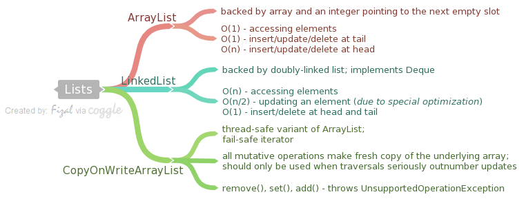
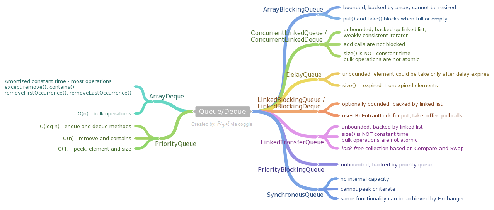
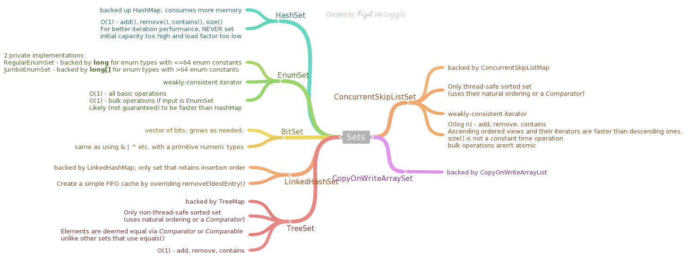
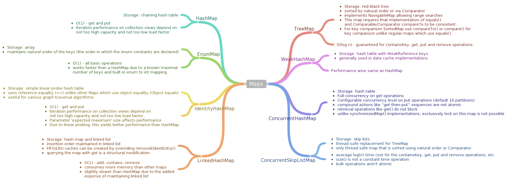
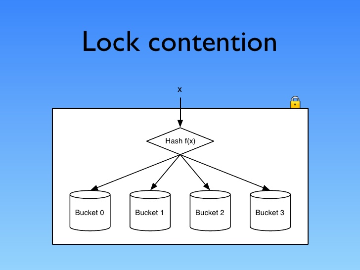

# Generics
background-color:: yellow
collapsed:: true
	- ## Types
	  collapsed:: true
		- | Type Parameters   | Description                                                                                  | 
		  | `<T>`               | Unbounded type; same as <T extends Object>                                                   | 
		  | `<T,P>`             | Unbounded types; <T extends Object> and <P extends Object>                                   | 
		  | `<T extends P>`     | Upper bounded type; a specific type T that is a subtype of type P                            | 
		  | `<T extends P & S>` | Upper bounded type; a specific type T that is a subtype of type P and that implements type S | 
		  | `<T super P >`      | Lower bounded type; a specific type T that is a supertype of type P                          | 
		  | `<?>`               | Unbounded wildcard; any object type, same as <? extends Object>                              | 
		  | `<? extends P>`     | Bounded wildcard; some unknown type that is a subtype of type P                              | 
		  | `<? extends P & S>` | Bounded wildcard; some unknown type that is a subtype of type P and that implements type S   | 
		  | `<? super P>`       | Lower bounded wildcard; some unknown type that is a supertype of type P                      |
	- ## The Get and Put Principle
	  collapsed:: true
		- The *Get and Put Principle* details the best usage of `extends` and `super` wildcards.
			- Use an `extends` wildcard when you **get**   only values out of a structure.
			- Use a `super` wildcard when you **put**   only values into a structure.
			- Do not use a wildcard when you place both **get**   and **put**   values into a structure.
			  
			  > Note: When wildcard is used, only get operation is allowed - no mutable operations like add/put.
			  
			  ```java #1 - Only get is allowed. 
			  List<?> nums = new ArrayList<Integer>(); 
			  nums.add(1); //not allowed 
			  nums.add(null); //allowed. This is an exceptional case
			  ```
			  
			  ```java #2 - Only get of any subtype of T is allowed 
			  List<? extends Number> nums = new ArrayList<Integer>();
			  nums.add(1); //not allowed
			  nums.add(null); //allowed. This is an exceptional case
			  ```
			  
			  ```java #3 - 
			  List<? super Integer> ints = Arrays.asList(1,2,3,4); 
			  Integer i = ints.get(1); //not allowed 
			  Object o = ints.get(1); //allowed
			  ```
	- ## Subtyping Principle
	  collapsed:: true
		- Integer is a subtype of Number
		- Integer[] is a subtype of Number[]
		- List<E> is a subtype of Collection<E>
		- List<Integer> is NOT a subtype of List<Number>
	- ## Variance
	  collapsed:: true
		- Types
		  collapsed:: true
			- **Covariant**: a `Cat[]` is an `Animal[]`. Java arrays are covariant.
			- **Contravariant**: an `Animal[]` is a `Cat[]`
			- **Invariant**: an `Animal[]` is not a `Cat[]` and a `Cat[]` is not an `Animal[]`?. Java generics are invariant.
		- ### Covariant
			- Java arrays are covariant, meaning that type `S[]` is considered to be a subtype of `T[]` whenever `S` is a subtype of `T`. Due to this nature, the following code throws exception at runtime. When an array is allocated (as on the first line), it is tagged with its reified type (a run-time representation of its component type, in this case, Integer), and every time an array is assigned into (as on the third line), an `ArrayStoreException` is raised if the reified type is not compatible with the assigned value (in this case, a double cannot be stored into an array of Integer).
			  
			  ```java
			  Integer[] ints = new Integer[] {1,2,3};
			  Number[] nums = ints;
			  nums[2] = 3.14; //ArrayStoreException at runtime since double is being assigned to an int
			  ```
		- ### Invariant
			- Java Generics are invariant, meaning that type `List<S>` is not considered to be a subtype of `List<T>`, except in the trivial case where `S` and `T` are identical.
			  
			  ```java
			  List<Integer> ints = Arrays.asList(1,2,3);
			  List<Number> nums = ints; // compile-time error
			  nums.set(2, 3.14);
			  ```
		- ### Contravariant
			- Wildcards also introduce contravariant subtyping for generics, in that type `List<S>` is considered to be a subtype of `List<? super T>` when `S` is a supertype of `T` (as opposed to a subtype). Arrays do not support contravariant subtyping.
		- **Points to remember**
			- Avoid mixing raw type and generic type.
			- `(T t = new T(); //not allowed, where T is a generic type`
			- Do not mix generics and varargs - http://www.javaspecialists.eu/archive/Issue140.html
	- ## Type Erasure
	  collapsed:: true
		- Example 1 is implemented using generics and no. 2 is not. However, the bytecode for both the programs are exactly the same. Java internally converts the generic representation into a code that looks like Example 2, by erasing the type details and adding casts. This is called ***type erasure***.
		- The reason behind such implementation is for backward compatibilty.
		- Java has *typed erased generics-  which loses type information at runtime. JetBrains' Kotlin language has *reified generics-  which retains the type information at runtime.
		- **Reification**   means *preserving type information at runtime*. Java Generics are **non-reifed.**
		  
		  
		  ```java Example 1
		  List<String> words = new ArrayList<String>();
		  words.add("Hello ");
		  words.add("world!");
		  String s = words.get(0)+words.get(1); 
		  assert s.equals("Hello world!");
		  ```
		  
		  ```java Example 2
		  List words = new ArrayList(); 
		  words.add("Hello "); 
		  words.add("world!"); 
		  String s = ((String)words.get(0))+((String)words.get(1));
		  assert s.equals("Hello world!");
		  ```
- # Collections Framework
  background-color:: yellow
	- ## Concurrent Collections
	  collapsed:: true
		- The latest concurrent collections achieve thread-safety by different mechanisms.
		- ### 1. Copy-On-Write
			- Classes that use copy-on-write store their values in an internal array, which is effectively immutable; any change to the value of the collection results in a new array being created to represent the new values.
			- Synchronization is used by these classes, though only briefly, during the creation of a new array; because read operations do not need to be synchronized, copy-on-write collections perform well in the situations for which they are designed—those in which reads greatly predominate over writes.
			- Used by : `CopyOnWriteArrayList`, `CopyOnWriteArraySet`.
		- ### 2. Compare-and-Swap (CAS)
			- A 2nd group of thread-safe collections relies on compare-and-swap (CAS), a fundamental improvement on traditional synchronization. To see how it works, consider a computation in which the value of a single variable is used as input to a long-running calculation whose eventual result is used to update the variable. Traditional synchronization makes the whole computation atomic, excluding any other thread from concurrently accessing the variable. This reduces opportunities for parallel execution and hurts throughput.
			- An algorithm based on CAS behaves differently: it makes a local copy of the variable and performs the calculation without getting exclusive access. Only when it is ready to update the variable does it call CAS, which in one atomic operation compares the variable’s value with its value at the start and, if they are the same, updates it with the new value. If they are not the same, the variable must have been modified by another thread; in this situation, the CAS thread can try the whole computation again using the new value, or give up, or—in some algorithms— continue, because the interference will have actually done its work for it!
			- This technique is caled [*Optimistic Concurrency Control*]({{ root_url }}/technology/transaction.html#optimistic) and is widely used in databases and HTTP protocol.
			- Used by: `ConcurrentLinkedQueue`, `ConcurrentSkipListMap`.
		- ### 3. Lock interface
			- The 3rd group uses implementations of `java.util.concurrent.locks.Lock` interface. Some of the collection classes in this group make use of these facilities to divide the collection into parts that can be separately locked, giving improved concurrency.
			- For example, `LinkedBlockingQueue` has separate locks for the head and tail ends of the queue, so that elements can be added and removed in parallel.
			- Other collections using these locks include `ConcurrentHashMap` and most of the implementations of `BlockingQueue`.
	- ## Iterators
	  collapsed:: true
		- The purpose of iterators is to provide a uniform way of accessing collection elements sequentially
		- Any class that implements `java.lang.Iterable` can be used in foreach statement. `Collection implements Iterable`.
		- ### Fail-fast iterators
		  collapsed:: true
			- Iterators throw `ConcurrentModificationException` whenever they detect that the collection from which they were derived has been structurally changed (i.e., elements have been added or removed).
			- Iterators are implemented as a view of their underlying collection so, if that collection is structurally changed, the iterator may well not be able to continue operating correctly when it reaches the changed part of the collection.
			- Instead of allowing the manifestation of failure to be delayed, making diagnosis difficult, the general-purpose Collections Framework iterators are fail-fast. The methods of a fail-fast iterator check that the underlying collection has not been structurally changed (by another iterator, or by the methods of the collection itself) since the last iterator method call. If they detect a change, they throw `ConcurrentModificationException`.
		- ### Fail-safe iterators
		  collapsed:: true
			- **Snapshot iterators**
				- Copy-on-write collections have snapshot iterators. These collections are backed by arrays which, once created, are never changed; if a value in the collection needs to be changed, a new array is created. So an iterator can read the values in one of these arrays (but never modify them) without danger of them being changed by another thread. Snapshot iterators do not throw `ConcurrentModificationException`.
			- **Weakly consistent iterators**
				- Collections which rely on CAS have weakly consistent iterators, which reflect some but not necessarily all of the changes that have been made to their backing collection since they were created. For example, if elements in the collection have been modified or removed before the iterator reaches them, it definitely will reflect these changes, but no such guarantee is made for insertions. Weakly consistent iterators also do not throw `ConcurrentModificationException`.
				- can tolerate concurrent modification, traverses elements as they existed when the iterator was constructed, and may (but is not guaranteed to) reflect modifications to the collection after the construction of the iterator. `ConcurrentHashMap` and other concurrent collections create such iterators.
				- Collections implemented using `Lock` interface also have weakly consistent iterators. In Java 6 this includes `DelayQueue` and `PriorityBlockingQueue`, which in Java 5 had fail-fast iterators. This means that you cannot iterate over the Java 5 version of these queues unless they are quiescent, at a time when no elements are being added or inserted; at other times you have to copy their elements into an array using `toArray()` and iterate over that instead.
		- ### ListIterator
		  collapsed:: true
			- `ListIterator` offers the following benefits over a regular Iterator. (*There is no `SetIterator`, since `Set` does not have the concept of a 'given point'.*)
			- iterate backwards
			- modify the list safely while iterating
	- ## Lists
	  collapsed:: true
		- > [Class Diagram](http://static.karambelkar.info/static/java_collections/Java-Collections_API-List-ImageMap.html)
		- 
		- ### ArrayList
		  collapsed:: true
			- Backed up array and an integer pointing to the next empty slot
			- By default, an arraylist is created with initial capacity as 10. The capacity grows as and when needed (as per Sun's implementation it grows by the order of `int newCapacity = (oldCapacity -  3)/2 + 1;` ).
			- An application can call `ArrayList.trimToSize()` method to trim the capacity of the ArrayList instance to be the list's current size to minimize the storage of an ArrayList instance.
			- BigO cost
				- Access elements has constant time
				- Insert/update/delete at the tail is cheap - constant complexity
				- Insert/update/delete  at the head is expensive - linear complexity (everything to the right from the update position must be moved to the right for insertions and to the left for removals)
		- ### LinkedList
		  collapsed:: true
			- Deque implementation – doubly-linked list.
			- BigO cost
				- Accessing elements has linear complexity
				- Updating an element has linear complexity (due to an optimization, these methods do not traverse more than a half of the list, so the most expensive elements are located in the middle of the list).
				- Insert/Delete elements - at head/tail - constant time
			- You need to use ListIterators if you want to try to write fast LinkedList code. If you want a Queue/Deque implementation (you need to access only first and last elements) – consider using ArrayDeque instead.
		- ### CopyOnWriteArrayList
		  collapsed:: true
			- A thread-safe variant of `ArrayList` in which all mutative operations (`add`, `set`, and so on) are implemented by making a fresh copy of the underlying array.
			- Copying is an expensive operation, so this class should be used only when traversals seriously outnumber updates. The usual use case for this collection is listeners/observers collection.
			- Element-changing operations on iterators themselves (`remove`, `set`, and `add`) are not supported. These methods throw `UnsupportedOperationException`.
			- Returns snapshot-style fail-safe iterator
	- ## Queues and Deques
	  collapsed:: true
		- > [Class Diagram](http://static.karambelkar.info/static/java_collections/Java-Collections_API-Queue-ImageMap.html)
		- 
		- ### ArrayDeque
		  collapsed:: true
			- Backed Data Structure: Deque implementation based on the array (circular buffer) with head/tail pointers. Unlike LinkedList, this class does not implement List interface, which means that you can not access anything except the first and the last elements.
			- BigO cost:
				- Most operations run in amortized constant time (except remove(), contains(), removeFirstOccurrence(), removeLastOccurrence())
				- Bulk operations run in linear time
			- Use case: This class is generally preferable to LinkedList for queues/deques due to a limited amount of garbage it generates (old array will be discarded on the extensions).
		- ### Stack
		  collapsed:: true
			- a LIFO queue. DO NOT use it in the production code. Use any Deque implementation instead (ArrayDeque is preferable).
		- ### PriorityQueue
		  collapsed:: true
			- Backed Data Structure: a queue based on the priority heap.
			- Uses either natural ordering or a provided Comparator. Its main property – poll/peek/remove/element methods always return the smallest remaining element in the queue. Despite that, this queue implements Iterable which does not iterate this queue in a sorted order (or any other particular order).
			- BigO cost
				- Enque and Dequeing method run in logarthmic time
				- remove(e) and contains(e) run in linear time
				- retrieval methods (peek, element, size) run in constant time.
			- Use Case: This queue is generally preferable to other sorted collections, like TreeSet if all you need is a smallest element in the queue.
		- ### ArrayBlockingQueue
		  collapsed:: true
			- a bounded blocking queue backed by an array. Can not be resized, so when you will try to add an element to a full queue, a method call will block until another thread will extract an element from the queue.
			- This class supports an optional fairness policy for ordering waiting producer and consumer threads. By default, this ordering is not guaranteed. However, a queue constructed with fairness set to true grants threads access in FIFO order. Fairness generally decreases throughput but reduces variability and avoids starvation.
		- ### ConcurrentLinkedQueue / ConcurrentLinkedDeque
		  collapsed:: true
			- an unbounded deque/queue based on the linked list.
			- Adding elements to this queue does not block, but this has an unfortunate requirement that a consumer for this collection must work at least as fast as a producer, otherwise you will run out of memory. Heavily relies on CAS (compare-and-set) operations.
			- This implementation employs an efficient "wait-free" algorithm based on one described in [Simple, Fast, and Practical Non-Blocking and Blocking Concurrent Queue Algorithms by Maged M. Michael and Michael L. Scott](http://www.cs.rochester.edu/~scott/papers/1996_PODC_queues.pdf).
			- Iterators are weakly-consistent.
			- BigO cost
				- size() is NOT a constant-time operation. Because of the asynchronous nature of these queues, determining the current number of elements requires a traversal of the elements, and so may report inaccurate results if this collection is modified during traversal.
				- Bulk operations addAll, removeAll, retainAll, containsAll, equals, and toArray are not guaranteed to be performed atomically.
		- ### DelayDeque
		  collapsed:: true
			- an unbounded blocking queue of Delayed elements. An element could be taken from a queue only after its delay has expired. The head of the queue is the element with the smallest remaining delay (including negative values – delay has already expired).
			- Use case: This queue could be useful, for example, when you want to implement a queue of delayed tasks (do not implement such queue manually – use ScheduledThreadPoolExecutor instead).
			- size() returns the count of both expired and unexpired elements
		- ### LinkedBlockingQueue / LinkedBlockingDeque
		  collapsed:: true
			- optionally bounded (could be created with specified maximal capacity or without it) queue/deque based on the linked list.
			- It uses ReentrantLocks for empty/full conditions.
			- BigO cost - Linked queues typically have higher throughput than array-based queues but less predictable performance in most concurrent applications.
		- ### LinkedTransferQueue
		  collapsed:: true
			- an unbounded queue based on the linked list. Besides ordinary queue operations, it has a group of transfer methods, which allow a producer to send a message straight to the waiting consumer, thus removing the need to store an element into a queue. This is a lock-free collection based on CAS(compare-and-swap) operations.
			- BigO cost
				- size is NOT a constant time operation
				- bulk operations are not atomic
		- ### PriorityBlockingQueue
		  collapsed:: true
			- an unbounded blocking queue version of PriorityQueue.
		- ### SynchronousQueue
		  collapsed:: true
			- A blocking queue in which each insert operation must wait for a corresponding remove operation by another thread, and vice versa. A synchronous queue does not have any internal capacity, not even a capacity of one.
			- You cannot peek at a synchronous queue because an element is only present when you try to remove it; you cannot insert an element (using any method) unless another thread is trying to remove it; you cannot iterate as there is nothing to iterate.
			- If you don’t need a Queue interface, then the same functionality could be achieved via Exchanger class.
			- Use case:
				- They are well suited for handoff designs, in which an object running in one thread must sync up with an object running in another thread in order to hand it some information, event, or task.
		- ### Queues Summary
		  collapsed:: true
			- Queue - Class Diagram
				- Methods react in 2 ways in case of a failure
					- Throws exception - add, remove, element
					- Special value - offer, poll, peek
				- JavaDoc "Queue implementations generally do not define element-based versions of methods equals and hashCode but instead inherit the identity based versions from class Object, because element-based equality is not always well-defined for queues with the same elements but different ordering properties." - it means that queues do not really care about what is inside them.
			- **BlockingQueue**
				- useful for producer-consumer problems
				- Blocking methods - put(e), take()
				- Time methods - offer(e, time, unit), poll(time, unit)
				- All queuing methods achieve their effects atomically using internal locks or other forms of concurrency control. However, the bulk Collection operations addAll, containsAll, retainAll and removeAll are not necessarily performed atomically unless specified otherwise in an implementation. So it is possible, for example, for addAll(c) to fail (throwing an exception) after adding only some of the elements in c.
				- Memory consistency effects: As with other concurrent collections, actions in a thread prior to placing an object into a BlockingQueue [happen-before](http://docs.oracle.com/javase/7/docs/api/java/util/concurrent/package-summary.html#MemoryVisibility) actions subsequent to the access or removal of that element from the BlockingQueue in another thread. happen-before
			- **TransferQueue**
				- A BlockingQueue in which producers may wait for consumers to receive elements. A TransferQueue may be useful for example in message passing applications in which producers sometimes (using method transfer(E)) await receipt of elements by consumers invoking take or poll, while at other times enqueue elements (via method put) without waiting for receipt. Non-blocking and time-out versions of tryTransfer are also available. A TransferQueue may also be queried, via hasWaitingConsumer(), whether there are any threads waiting for items, which is a converse analogy to a peek operation.
	- ## Sets
	  collapsed:: true
		- > [Class Diagram](http://static.karambelkar.info/static/java_collections/Java-Collections_API-Set-ImageMap.html)
		- 
		- ### HashSet
		  collapsed:: true
			- a set implementation based on a HashMap with dummy values (same Object is used for every value). Has the same properties as a HashMap. Due to such implementation, consumes more memory than actually required for this data structure.
			- BigO cost
				- constant time for add, remove, contains and size operations
				- For better iteration performance, never set initial capacity too high and load factor too low
		- ### BitSet
		  collapsed:: true
			- This class implements a vector of bits that grows as needed. Each component of the bit set has a boolean value. The bits of a BitSet are indexed by nonnegative integers. Individual indexed bits can be examined, set, or cleared. One BitSet may be used to modify the contents of another BitSet through logical AND, logical inclusive OR, and logical exclusive OR operations.
			- By default, all bits in the set initially have the value false.
			- same as using `& | ^` etc. with a primitive numeric type.
		- ### EnumSet
		  collapsed:: true
			- Enum sets are represented internally as bit vectors. This representation is extremely compact and efficient. The space and time performance of this class should be good enough to allow its use as a high-quality, typesafe alternative to traditional int-based "bit flags"
			- There are 2 private implementations –
				- `RegularEnumSet` backed up by a single long for enum types with 64 or fewer enum constants (which covers 99.9% use cases)
				- `JumboEnumSet` backed by a long[] for enum types with more than 64 enum constants.
			- Iterator is weakly-consistent; will never throw `ConcurrentModificationException`
			- BigO cost
				- All basic operations operate in constant time
				- Likely (not guaranteed) to be faster than HashMap
				- Bulk operations are constant time if input is also EnumSet
		- ### LinkedHashSet
		  collapsed:: true
			- backed by LinkedHashMap.
			- This is the only set which keeps its elements in the insertion order.
			- BigO cost
				- O(1) - add, remove, contains
				- Generally slower than HashSet exception the iteration
		- ### TreeSet
		  collapsed:: true
			- backed up a TreeMap instance.
			- Only non-thread-safe sorted set using their natural ordering or by a `Comparator` provided
			- Typically Set interface is defined in terms of the equals operation, but a TreeSet instance performs all element comparisons using its `compareTo` (or `compare`) method, so two elements that are deemed equal by this method are, from the standpoint of the set, equal.
			- BigO cost
				- O(1) - add, remove, contains
		- ### ConcurrentSkipListSet
		  collapsed:: true
			- backed by ConcurrentSkipListMap for storage.
			- Only thread-safe sorted set using their natural ordering or by a Comparator provided
			- iterators are weakly-consistent; never throws ConcurrentModificationException
			- Use case: when you need an thread-safe order set
			- BigO cost
				- O(log n) - add, remove, contains
				- Ascending ordered views and their iterators are faster than descending ones.
				- size() is not a constant time operation
				- bulk operations aren't atomic
			- Both the concurrent sets are based on [High Performance Dynamic Lock-Free Hash Tables and List-Based Sets by Maged Michael](http://www.research.ibm.com/people/m/michael/spaa-2002.pdf) from IBM
			- There's currently no [Red-Black tree](http://en.wikipedia.org/wiki/Red%E2%80%93black_tree) based concurrent Map/Set implementation in Java. I looked through the literature a bit and found a couple papers that showed concurrent RB trees outperforming skip lists, but a lot of these tests were done with [transactional memory](http://en.wikipedia.org/wiki/Transactional_memory), which isn't supported in hardware on any major architectures at the moment.
		- ### CopyOnWriteArraySet
			- backed up a `CopyOnWriteArrayList` and shares its properties
		- ### Sets Summary
			- Uses equals() method to check for duplication
			- Great care must be exercised if mutable objects are used as set elements. The behavior of a set is not specified if the value of an object is changed in a manner that affects equals comparisons while the object is an element in the set. A special case of this prohibition is that it is not permissible for a set to contain itself as an element.
			- SortedSet - TreeSet, ConcurrentSkipListSet
			- NavigableSet - TreeSet, ConcurrentSkipListSet
			- Creating a ConcurrentHashSet - `Collections.newSetFromMap(new ConcurrentHashMap<String, Boolean>);`
	- ## Maps
	  collapsed:: true
		- > [Class Diagram](http://static.karambelkar.info/static/java_collections/Java-Collections_Map-API-ImageMap.html)
		- 
		- ### HashMap
		  collapsed:: true
			- backed up chaining Hash table;
			- Collection view methods (keySet and values) retun fail-fast iterators
			- BigO Cost
				- O(1) - get and put; assuming the hash function disperses the elements properly among the buckets
				- Iteration: Iteration over collection views requires time proportional to the "capacity" of the HashMap instance (the number of buckets) plus its size (the number of key-value mappings). Thus, it's very important not to set the initial capacity too high (or the load factor too low) if iteration performance is important.
				- Iteration using entrySet is better in performance
				- The capacity is the number of buckets in the hash table, and the initial capacity is simply the capacity at the time the hash table is created.
				- The load factor is a measure of how full the hash table is allowed to get before its capacity is automatically increased. When the number of entries in the hash table exceeds the product of the load factor and the current capacity, the hash table is rehashed (that is, internal data structures are rebuilt) so that the hash table has approximately twice the number of buckets.
		- ### EnumMap
		  collapsed:: true
			- Enum maps are maintained in the natural order of their keys (the order in which the enum constants are declared). This is reflected in the iterators returned by the collections views (keySet(), entrySet(), and values()).
			- weakly-consistent iterators
			- BigO Cost
				- O(1) - all basic operations
				- Generally works faster than a HashMap due to a known maximal number of keys and built-in enum to int mapping (it is a fixed size array of values).
		- ### IdentityHashMap
		  collapsed:: true
			- backed up simple linear-probe hash table;
			- a very special version of a Map, violating the Map general contract: it compares references using reference-equality (==) instead of object-equality (Object.equals). In other words, in an IdentityHashMap, two keys k1 and k2 are considered equal if and only if (k1==k2). (In normal Map implementations (like HashMap) two keys k1 and k2 are considered equal if and only if (k1==null ? k2==null : k1.equals(k2)
			- Iterators are fail-fast
			- Use case: useful for various graph traversal algorithms – you may easily store already processed nodes in the IdentityHashMap along with some node-related data.
			- BigO Cost
				- O(1) - get and put; assuming the system identity hash function (System.identityHashCode(Object)) disperses elements properly among the buckets
				- iteration over collection views requires time proportional to the number of buckets in the hash table
				- one tuning parameter (which affects performance but not semantics): expected maximum size. This parameter is the maximum number of key-value mappings that the map is expected to hold. Internally, this parameter is used to determine the number of buckets initially comprising the hash table. The precise relationship between the expected maximum size and the number of buckets is unspecified.
				- this class will yield better performance than HashMap (which uses [chaining hash table](http://www.cs.rmit.edu.au/online/blackboard/chapter/05/documents/contribute/chapter/05/chaining.html) rather than [linear-probing](https://www.cs.auckland.ac.nz/software/AlgAnim/hash_tables.html))
					- **Linear-probing**: A simple re-hashing scheme in which the next slot in the table is checked on a collision.
					- chaining: uses a linked list to store the values. all the collision and retrieval functions are handled on the list.
		- ### LinkedHashMap
		  collapsed:: true
			- backed by a combination of a HashMap and a LinkedList
			- insertion order of all elements is stored inside a LinkedList. That’s why LinkedHashMap entries, keys and values are always iterated in the insertion order.
			- Use case: well-suited for LRU/FIFO caches by overriding removeEldestEntry; a simple FIFO cache.
				- `return size() > maximumCapacity) or LRU cache (return size() > maximumCapacity;`
			- fail-fast iterators
				- A structural modification is any operation that adds or deletes one or more mappings or, in the case of access-ordered linked hash maps, affects iteration order. In insertion-ordered linked hash maps, merely changing the value associated with a key that is already contained in the map is not a structural modification. In access-ordered linked hash maps, merely querying the map with get is a structural modification.
			- BigO Cost
				- O(1) - add, contains, remove
				- This is the most expensive JDK collection in terms of memory consumption per element.
				- Performance is likely to be just slightly below that of HashMap, due to the added expense of maintaining the linked list, with one exception: Iteration over the collection-views of a LinkedHashMap requires time proportional to the size of the map, regardless of its capacity
		- ### TreeMap
		  collapsed:: true
			- a red-black tree based sorted navigable Map.
			- It sorts all entries based on the natural order or a given Comparator of keys.
			- This map requires that implementation of equals and Comparable/Comparator.compareTo to be consistent.
			- implements a NavigableMap interface: it allows getting a map of all entries less than/more than given key; getting a prev/next entry (based on the key ordering); getting a map with a given range of keys (which roughly corresponds to SQL BETWEEN operator) and many variations of these methods.
			- Map interface is defined in terms of the equals operation, but a sorted map performs all key comparisons using its compareTo (or compare) method, so two keys that are deemed equal by this method are, from the standpoint of the sorted map, equal. The behavior of a sorted map is well-defined even if its ordering is inconsistent with equals; it just fails to obey the general contract of the Map interface.
			- fail-fast iterators
			- BigO Cost
				- O(log n) - guaranteed for containsKey, get, put and remove operations. (Algorithms are adaptations of those in Cormen, Leiserson, and Rivest's Introduction to Algorithms.)
		- ### WeakHashMap
		  collapsed:: true
			- hash table based implementation with weak keys.
			- Use case: generally used in data cache implementations.
			- It keeps all its keys with WeakReference, which means that these keys may be garbage collected if there are no strong references to the key objects. Values, on the other hand, are stored using strong references. Because of this, you should either ensure that there are no references from values to keys, or keep values inside weak references too: `m.put(key, new WeakReference(value))`.
			- fail-fast iterator
			- BigO Cost: same as HashMap
				- For the visual representation: How to write a simple yet “bullet-proof” object cache using WeakHashMap
		- ### ConcurrentHashMap
		  collapsed:: true
			- a hash table with full concurrency for get operations and configurable level of concurrency for put operations. This level is adjusted via concurrencyLevel constructor parameter (default 16), which defines a number of partitions inside this map. Only an updated partition is locked during put operation.
			- Remember that this map is not a thread-safe replacement for HashMap algorithms – any compound actions like “get-then-put” sequences of method calls on this map (or any other concurrent collection) should be externally synchronized.
			- Retrieval operations (like get) do not block;
			- iterators are fail-safe; but designed to be used only by one thread at a time.
			- The one feature offered by the synchronizedMap implementations but not by ConcurrentHashMap is the ability to lock the map for exclusive access. With Hashtable and synchronizedMap, acquiring the Map lock prevents any other thread from accessing it. This might be necessary in unusual cases such as adding several mappings atomically, or iterating the Map several times and needing to see the same elements in the same order.
		- ### ConcurrentSkipListMap
		  collapsed:: true
			- 
			- based on skip lists; this could serve as a thread-safe replacement for TreeMap.
			- Only thread-safe sorted Map using their natural ordering or by a Comparator provided
			- Insertion, removal, update, and access operations safely execute concurrently by multiple threads.
			- iterators are weakly-consistent; never throws ConcurrentModificationException
			- Use case: when you need an thread-safe ordered map
			- BigO cost
				- expected average log(n) time cost for the containsKey, get, put and remove operations and their variants.
				- size() is not a constant time operation
				- bulk operations aren't atomic
		- ### Maps Summary
		  collapsed:: true
			- `System.identityHashCode(Object);`
			- SortedMap - TreeMap, ConcurrentSkipListMap
			- NavigableMap (extends SortedMap) - allows range searches
			- Great care must be exercised if mutable objects are used as map keys. The behavior of a map is not specified if the value of an object is changed in a manner that affects equals comparisons while the object is a key in the map. A special case of this prohibition is that it is not permissible for a map to contain itself as a key. While it is permissible for a map to contain itself as a value, extreme caution is advised: the equals and hashCode methods are no longer well defined on such a map.
			- Many methods in Collections Framework interfaces are defined in terms of the equals method. For example, the specification for the containsKey(Object key) method says: "returns true if and only if this map contains a mapping for a key k such that `(key==null ? k==null : key.equals(k))`." This specification should not be construed to imply that invoking Map.containsKey with a non-null argument key will cause key.equals(k) to be invoked for any key k. Implementations are free to implement optimizations whereby the equals invocation is avoided, for example, by first comparing the hash codes of the two keys. (The Object.hashCode() specification guarantees that two objects with unequal hash codes cannot be equal.) More generally, implementations of the various Collections Framework interfaces are free to take advantage of the specified behavior of underlying Object methods wherever the implementor deems it appropriate.
			- [Unique hashCodes is not enough to avoid collisions](http://vanillajava.blogspot.com/2013/10/unique-hashcodes-is-not-enough-to-avoid.html)
			- **Best way to iterate a Map**   - 2 ways of iterating a Map via the entry set or the key set. In terms of performance, it seems to me that the approach of iterating over the entry set should be much faster. The iteration is O(n). However, if the HashMap is well balanced, then we should get O(1) performance on the lookup call to get(), thus the complexity of the two approaches is the same. There might be a small difference, but they both should scale linearly. This is not true with other types of maps, such as the TreeMap. The lookup complexity is O(log n), thus the complexity of the second loop would be O(n x log n).
			- SortedMap
				- All keys inserted into a sorted map must implement the Comparable interface (or be accepted by the specified comparator). Furthermore, all such keys must be mutually comparable: k1.compareTo(k2) (or comparator.compare(k1, k2)) must not throw a ClassCastException for any keys k1 and k2 in the sorted map. Attempts to violate this restriction will cause the offending method or constructor invocation to throw a ClassCastException.
				- Note that the ordering maintained by a sorted map (whether or not an explicit comparator is provided) must be consistent with equals if the sorted map is to correctly implement the Map interface. (See the Comparable interface or Comparator interface for a precise definition of consistent with equals.) This is so because the Map interface is defined in terms of the equals operation, but a sorted map performs all key comparisons using its compareTo (or compare) method, so two keys that are deemed equal by this method are, from the standpoint of the sorted map, equal. The behavior of a tree map is well-defined even if its ordering is inconsistent with equals; it just fails to obey the general contract of the Map interface.
	- ## Arrays & Collections
	  collapsed:: true
		- ### Arrays
			- ```java resulting list is modifiable, but not resizable
			  List<X> list = Arrays.asList(new X[desiredSize]); 
			  ```
	- ## Comparable & Comparator
	  collapsed:: true
		- | # | Comparable interface| Comparator interface | 
		  | - | -------------------- | -------------------- | 
		  | 1 | Used when the objects need to be compared in their natural order. | Used when the objects need to be compared in custom user-defined order (other than the natural order).| 
		  | 2 | You do not create a separate class just to implement the Comparable interface.| You create a separate class just to implement the Comparator interface.| 
		  | 3 | For a given class type, you have only that class (and that class alone) implementing the Comparable interface.| You can have many separate (i.e., independent) classes implementing the Comparator interface, with each class defining different ways to compare objects.| 
		  | 4 | The method in the Comparable interface is declared as `int compareTo(ClassType type);`| The method in the Comparator interface is declared as `int compare(ClassType type1, ClassType type2);`|
- # Bibliography
	- Oracle Certified Professional, Java SE 7 Programmer
	- Java Generics and Collection