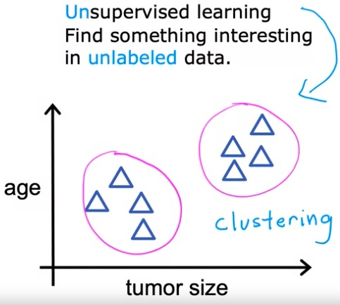
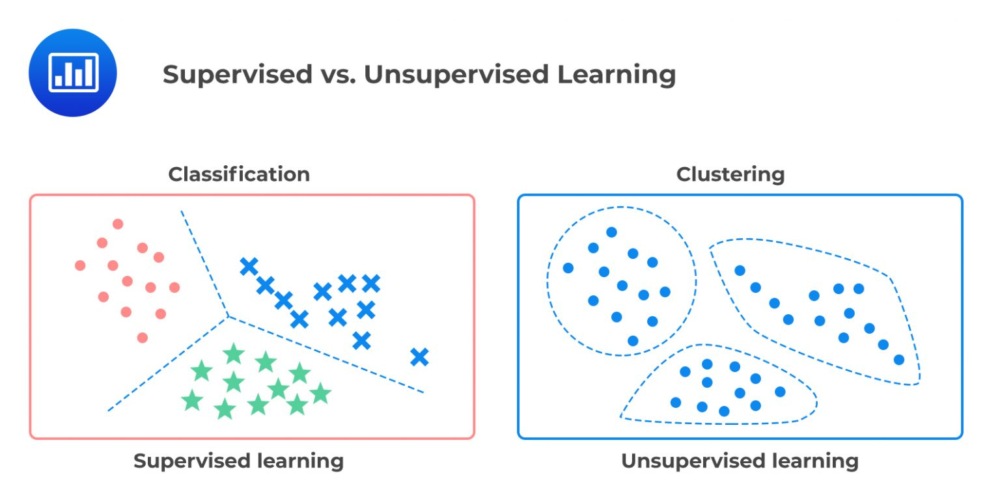

# Overview
background-color:: yellow
collapsed:: true
	- Unsupervised learning is also called as "Descriptive Learning"
	- Unsupervised learning is about finding something interesting in an unlabeled data.
	- While supervised learning relies on labeled or structured data, unsupervised learning trains on unlabeled or unstructured data (e.g., the text of a book) and try to find structure. Vast majority of data that enterprises need to process are unstructured data.
	- Naturally unsupervised learning is much harder than supervised learning as the data has no preexisting labels to assist the algorithms in understanding the data.
	- Widely used unsupervised learning algorithms are cluster analysis and market basket analysis.
	-
	- For example, using unsupervised learning for Cancer Tumor detection, the algorithm automatically groups the inputs in clusters, whereas in supervised it would output if the tumor is malignant or benign.
	- Here is another example of clustering in Google News where related news articles are clustered together.
	- |  | {:height 419, :width 557} |
	  |  |
- # Types of Unsupervised learning
  background-color:: yellow
  collapsed:: true
	- Clustering
		- Group similar data points together
		- e.g., Google News grouping
	- Anomaly Detection
		- Find unusual data points
		- e.g., Credit fraud detection
	- Dimensionality reduction
		- Take a big data-set and almost magically compress it to a much smaller data-set while losing as little information as possible.
- # Mathematical Definition
  background-color:: yellow
  collapsed:: true
	- Here we are only given inputs, and the goal is to find “interesting patterns” in the data. This is sometimes called __knowledge discovery__.
		- > $D = \\{ (x _{i}) \\} _{i=1}^N$
	- This is a much less well-defined problem, since we are not told what kinds of patterns to look for, and there is no obvious error metric to use (unlike supervised learning, where we can compare our prediction of $y$ for a given $x$ to the observed value).
- # Applications
  background-color:: yellow
  collapsed:: true
	- **Discovering clusters**
		- e.g., In e-commerce, it is common to cluster users into groups, based on their purchasing or web-surfing behavior, and then to send customized targeted advertising to each group
	- **Discovering graph structure**
		- Sometimes we measure a set of correlated variables, and we would like to discover which ones are most correlated with which others. This can be represented by a graph $G$, in which nodes represent variables, and edges represent direct dependence between variables.
		- e.g., predicting traffic jams in freeway
	- **Matrix completion**
		- Sometimes we have missing data, that is, variables whose values are unknown. For example, we might have conducted a survey, and some people might not have answered certain questions. Or we might have various sensors, some of which fail. The corresponding design matrix will then have “holes” in it; these missing entries are often represented by $NaN$, which stands for “not a number”. The goal of imputation is to infer plausible values for the missing entries. This is sometimes called matrix completion.
		- Image inpainting - The goal is to “fill in” holes (e.g., due to scratches or occlusions) in an image with realistic texture.
		- Collaborative filtering - Netflix predicting which movies a user is likely to watch based on his past view history.
	- Anomaly detection