- Machine Learning is the field of study that gives computers the ability to learn without being explicitly programmed.
- # Types of ML
  background-color:: purple
	- 
	  collapsed:: true
	  {{renderer :mermaid_gyuxvjw}}
		- ```mermaid
		  flowchart LR
		      Types --> Supervised("Supervised Learning")
		      Types --> Unsupervised("Unsupervised Learning")
		      Types --> Reinforcement("Reinforcement Learning")
		      
		      Supervised --> Classification
		      Supervised --> Regression
		      Unsupervised --> Clustering
		  ```
	-
	- {:height 585, :width 868}
	-
- # Supervised Learning
  background-color:: purple
	- ## Overview
	  background-color:: yellow
		- Supervised learning is also called as 'Predictive Learning'
		- In Supervised learning, the system learns from human-labeled examples. By looking at many labeled data points and examples of historical problems, supervised learning algorithms can help solve similar problems under new circumstances.
		- It trains on large volumes of historical data and then builds general rules to be applied to future problems. The better the training data, the better the output.
		- 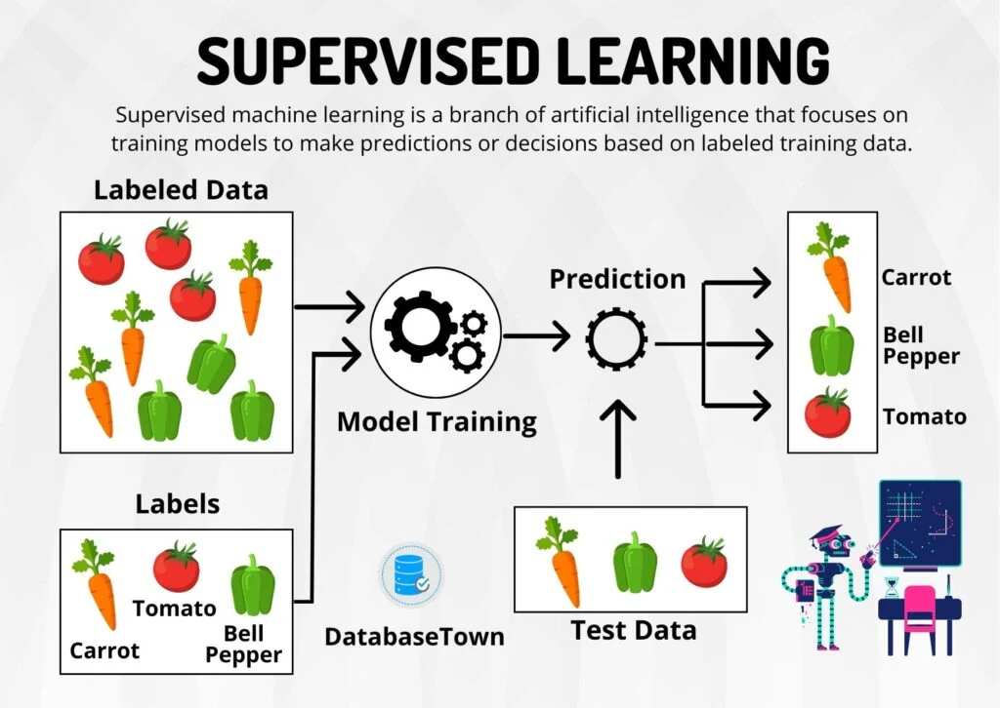{:height 440, :width 613}
		- ### Types of Supervised Learning
		  background-color:: green
			- **Classification**
				- For a given input, the output predicted is from a small, finite number of possible outputs (*output categories or output classes*). e.g., Email spam filtering has only 2 possible outputs - spam or not.
			- **Regression**
				- For a given input, the output predicted is from a infinite number of possible outputs. e.g., House price prediction
		- ### Benefits of Supervised Learning
		  background-color:: green
			- **Accurate predictions:** Supervised learning models can provide highly accurate predictions or classifications when trained on a diverse and representative dataset.
			- **Versatility:** It can be applied to a wide range of problem domains, making it a flexible approach for various industries and applications.
			- **Interpretable results:** Unlike some other machine learning approaches, supervised learning models often provide interpretable results, allowing users to understand the reasoning behind predictions.
		- ### Limitations of Supervised Learning
		  background-color:: green
			- **Dependency on labeled data:** Supervised learning relies heavily on labeled data, which can be expensive and time-consuming to collect, especially for complex problems.
			- **Limited generalization:** Models trained on specific datasets may struggle to generalize well to new or unseen data that differ significantly from the training data distribution.
			- **Overfitting:** If a model becomes overly complex or is trained on limited data, it may memorize the training examples instead of learning underlying patterns, leading to poor performance on unseen data.
	- ## Algorithms
	  background-color:: yellow
		- Here are some of the most commonly used supervised learning algorithms
		- ### Linear Regression
			- Linear regression is a popular algorithm used for predicting continuous output values. It establishes a linear relationship between the input features and the target variable, allowing us to make predictions based on this relationship.
		- ### Logistic Regression
			- Logistic regression is employed when the output variable is binary or categorical. It models the relationship between the input features and the probability of a particular outcome using a logistic function.
		- ### Decision Trees
			- Decision trees are tree-like models that use a hierarchical structure to make decisions. They split the data based on different features and create a tree-like structure, enabling classification or regression tasks.
		- ### Random Forests
			- Random forests are an ensemble learning method that combines multiple decision trees. They improve the predictive accuracy by aggregating predictions from multiple trees, reducing overfitting and increasing robustness.
		- ### Support Vector Machines (SVM)
			- Support Vector Machines are effective for both classification and regression tasks. They create hyperplanes or decision boundaries that maximize the margin between different classes, allowing for accurate predictions.
		- ### Naive Bayes
			- Naive Bayes algorithms are based on Bayes’ theorem and are commonly used for classification tasks. They assume that the input features are independent, making predictions based on the probability of each class.
		- ### K-Nearest Neighbors (KNN)
			- K-Nearest Neighbors is a non-parametric algorithm that classifies new instances based on their proximity to the labeled instances in the training data. It assigns a class label based on the majority vote of its k nearest neighbors.
		- ### Neural Networks
			- Neural networks are a powerful class of algorithms inspired by the human brain’s structure and functioning. They consist of interconnected nodes (neurons) organized in layers, enabling them to learn complex patterns and relationships.
		- ### Gradient Boosting Algorithms
			- Gradient boosting algorithms, such as Gradient Boosted Trees and XGBoost, are ensemble methods that sequentially build models, each focusing on the errors of the previous models. They are effective for classification and regression tasks, providing high predictive accuracy.
	- ## Mathematical Notation
	  background-color:: yellow
		- A labeled set of input-output pairs (inputs $x$ and outputs $y$) are fed as training data
		  collapsed:: true
		  > $$D = \\{ (x _{i}, y _{i}) \\} _{i=1}^N$$
			- Here
				- $D$ is called the ***training set***,
				- $x$ is the input variable or a **feature variable**.
					- In general, $x$ could be a complex structured object, such as an image, a sentence, an email message, a time series, a molecular shape, a graph, etc.
				- $y$ is the output variable or a **target variable**. The output variable can take 2 forms:
					- a finite set of outputs (e.g., male/female, spam/not spam, etc.). This is called the Classification type.
					- or an infinite set of outputs. This is called the Regression type.
				- $N$ is the number of training examples.
				- A single pair of a training example is denoted as $$(x,y)$$.
				- To denote the $i^\text{th}$ training example pair, use $$(x^\text{(i)},y^\text{(i)})$$. e.g., 8th training example pair is denoted as $$(x^\text{(8)},y^\text{(8)})$$
					- Note: here $$x^\text{(i)}$$ is called as "$x$ superstroke $i$" - this is not exponent.
		- #### Classification
			- When $y _{i}$ is a *categorical or nominal variable* from some finite set, $y _{i}$ ∈ {1, . . . , C} (such as male or female), the problem is known as **classification or pattern recognition**.
				- *Document classification* - e.g., email spam filtering, ad targeting
				- *Image classification* - e.g., photo is vertical or horizontal, detect the person in picture is male/female, face detection in Google street view
		- #### Regression
			- When $y _{i}$ is a *real-valued scalar* (such as income level) or *continuous*, the problem is known as **regression**. *Ordinal regression* occurs where label space Y has some natural ordering, such as grades A–F.
			  	* Predict tomorrow’s stock market price given current market conditions and other possible side information.
			  	* Predict the age of a viewer watching a given video on YouTube.
	- ## Regression
	  background-color:: yellow
		- ## Linear Regression
		  background-color:: red
			- ### Overview
			  background-color:: green
				- Training data (features $x$ and targets $y$) are fed into a learning algorithm which outputs a function $f$. This function is also called as a **model** or a **hypothesis**.
				  background-color:: green
					- Sample training set for house price prediction example
						- | Size in sq. ft $x$ (**Features**) | Price in $1000s $y$ (**Targets**) |
						  | 2104 | 460 |
						  | 1416 | 232 |
						  | 1534 | 315 |
						  | 852 | 178 |
				- The job of the function $f$ is to take an input $x$ and produce an output $\hat{y}$ (read as "**y-hat**"). In ML, $$\hat{y}$$ is called the **estimate or prediction** of $y$.
				  background-color:: green
					- Note: $y$ denotes the *target* in training data, and $$\hat{y}$$ denotes an **estimated** $y$ predicted by the model.
					- 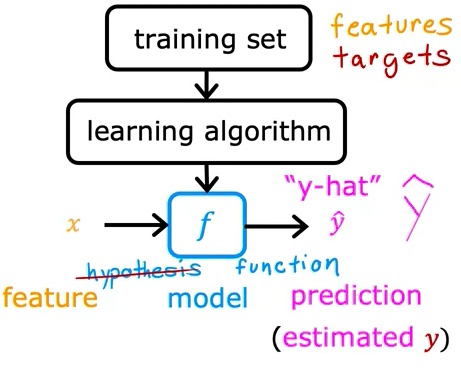
				- Math formula to compute an $f$ is as follows. Let's assume $f$ is a straight-line. What this function does is to predict the value of $y$ using a straight-line function of $x$.
				  background-color:: green
				  > $f_{w,b}(x) = wx + b$
				  
				  or simply
				  > $f(x) = wx + b$
				  > $\hat{y} = f(x)$
					- 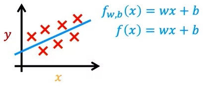
					- Here
						- $f$ is a **linear function** or a **linear model** which is just a fancy name for straight line.
						- $x$ is the treatment/input. This particular model is called **linear regression model**. Since this involves only one variable $x$, such single variable linear regression models are called **univariate linear regression**.
						- $w$, $b$: are called **parameters**.
							- In ML, parameters of a model are the variables you can adjust during training in order to improve the model. Sometimes, they are referred to as **coefficients** or **weights**.
							- Depending on the values you've chosen for $w$ & $b$, you get a different function $f(x)$ which generates a different line on the graph as shown here.
								- {:height 419, :width 791}
				- {:height 370, :width 1135}
				  background-color:: green
			- ### Cost Function
			  background-color:: green
				- Cost function is used to determine how well our model is. The closer it is to zero the better.
				- With linear regression, what you want to do is to choose values for the parameters $w$ and $b$ so that the straight line you get from the function $f$ somehow fits the data well. How do we pick the correct values for those parameters so that the model predicts the right $\hat{y}$ - without overfitting or under-fitting. That's where the cost function comes into play.
				  collapsed:: true
					- {:height 419, :width 791}
				- #### Formula for cost function
				  background-color:: purple
					- To calculate the cost function, take the prediction $\hat{y}$ and compare it to the target $y$ by taking 
					  $$\hat{y}-y$$.
						- This measure is called the **error**. We are measuring how far off is the prediction to the target.
					- Next, let's compute the square of this error. 
					  $$(\hat{y}-y)^2$$
					- Also, we are going to compute this for different training examples $i$ in the training set. Hence it is written as 
					  $$(\hat{y}^{(i)}-y^{(i)})^2$$
					- Finally, we want to measure the error across the entire training set, so we'll sum it up like this (where $m$ is the number of training examples)
					  $$ \sum_{i=1}^m (\hat{y}^{(i)}-y^{(i)})^2 $$
					- When $m$ is larger, then the cost function will calculate a bigger number. To build a cost function that doesn't automatically get bigger as the training set size gets larger, by convention, we will compute the *average squared error* instead of the total squared error and we do that by dividing by $m$ like this.
					  $$ \frac{1}{2m} \sum_{i=1}^m (\hat{y}^{(i)}-y^{(i)})^2 $$
					- Finally, the cost function is indicated using $$J (w,b)$$. This cost function is also called **Squared error cost function**.
					  $$ J(w,b) = \frac{1}{2m} \sum_{i=1}^m (\hat{y}^{(i)}-y^{(i)})^2 $$
					- One last detail - since $$\hat{y} = f_{w,b}(x)$$, the cost function formula can be written generically as follows
					  $$ J(w,b) = \frac{1}{2m} \sum_{i=1}^m (f_{w,b}(x^{(i)})-y^{(i)})^2 $$
					- In ML, different cost functions are used for different applications, but Squared error cost function is by far the most used one for linear regression.
				- #### Cost function intuition
				  background-color:: purple
					- Let's build some intuition about what the cost function is doing
					- > **Model**:  $f_{w,b}(x) = wx + b$
					  > 
					  > **Parameters**: $w,b$
					  > 
					  > **Cost function**: $J(w,b) = \frac{1}{2m} \sum_{i=1}^m (f_{w,b}(x^{(i)})-y^{(i)})^2$
					  > 
					  > **Goal**: $\underset{w, b}{\text{minimize}} \space J(w, b)$
					- In linear regression, we want to try to find values for $w$ and $b$ that makes the $J_{w,b}$ as small as possible. In math, we write it like this: 
					  $$\underset{w, b}{\text{minimize}} \space J(w, b)$$
					-
				- #### Visualizing Cost Function
				  background-color:: purple
					- To visualize the cost function $J(w,b)$, let's start with a simplified version of the linear function where $b=0$
					  $$f_{w}(x) = wx$$
					- Since $b=0$, the cost function $J(w,b)$ becomes just a function of $w$
					  $$J(w) = \frac{1}{2m} \sum_{i=1}^m (f_{w}(x^{(i)})-y^{(i)})^2$$
					- So, now the goal is to minimize $J(w)$
					  $$\underset{w}{\text{minimize}} \space J(w)$$
					- When we try to plot a graph for both $f(x)$ and $J(w,b), it looks something like the below
						- When $b=0$
							- the $f_w(x)$ would look something like the bottom left graph
							- and the cost function $J(w)$ would like a U-shaped graph (2D graph) where the $w$ ranges from -0.5 to 2.5. Here the goal is to find the value of $w$ for which the $J(w)$ is lowest (*close to zero*). When the cost if small, this means that the model fits the training set well.
						- {:height 529, :width 922}
						- When $b\neq0$
							- then we have both parameters $w$ and$b$, which makes a bowl-shaped graph (3D graph) as shown below. Here the goal is to find the value of $w$ & $b$ for which the $J(w, b)$ is the lowest.
							- In this bowl-shaped graph, finding the lowest value of $J(w, b)$ is performed through contours.
						- 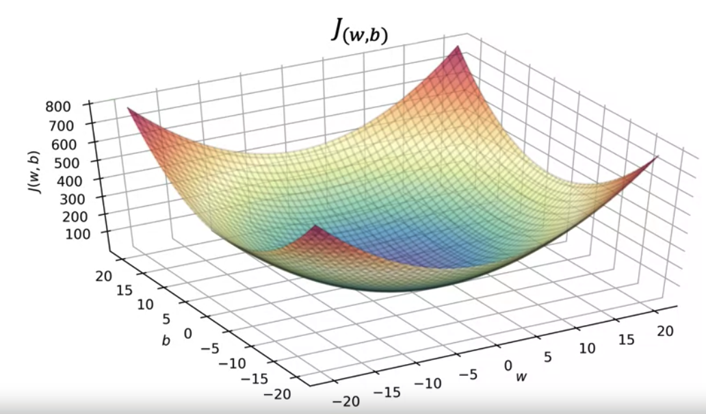
						- Contours in a topographical map like the Mount Fuji below are basically horizontal slices of the landscape. Imagine the above bowl-shaped graph as upside down version of this mountain.
						- By creating a contour plot with $w$ on x-axis and $b$ on y-axis, we get a graph as shown in the top-right corner of the image below. Basically a bunch of oval or ellipses - which is nothing but the horizontal slices of the 3D graph version of the cost function below.
						- By picking the values of $w$ and $b$ from the smallest ellipses, we will get the lowest $J(w,b)$ (*shortest height in the 3D graph*).
						- > Note: there can be more than one minimum values of $J$ for different values of $w$ and $b$ in the smallest ellipses.
						- | 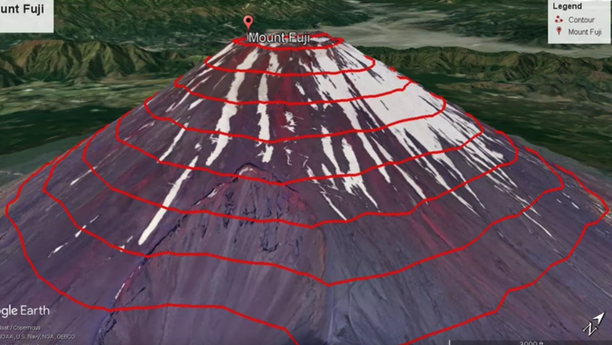{:height 400, :width 449} | 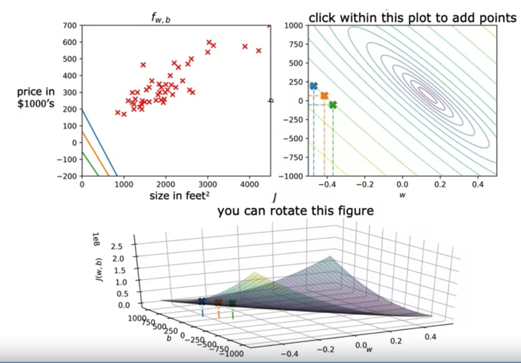 |
			- ### Gradient Descent
			  background-color:: green
				- As we saw above, the lower the cost function, the better the model fits the training data. In order to identify the lowest cost, we need to find the right $w$ and $b$ parameters. What if there is a systematic way to find the values of $w$ and $b$ that results in the smallest possible cost? That's where Gradient Descent comes in.
				- Gradient descent is an algorithm for finding values of parameters w and b that minimize the cost function $J$.
				- Gradient Descent is used all over ML, not just for linear regression. It can be applied for more general functions as well including the models that have more than 2 parameters.
					- For example if your cost function is $$J(w_1, w_2, w_3, ...., w_n, b)$$, then the goal is $$\underset{w}{\text{min}} \space J(w_1, w_2, w_3, ...., w_n, b)$$
				- Only for a linear regression model, the cost function looks like a U-shaped or a boat-shaped graph.
				- For a non-linear regression, the cost function graph may look something like below.
				- #### How Gradient descent works
				  background-color:: purple
					- Imagine a golf course with mounts and valleys where you have to find the lowest valley point.
					- From wherever you are (*which doesn't matter at all*), spin around 360 degrees and find in which direction to take the next step in order to reach the lowest point.
					- Keep repeating the previous step until the lowest point (J) is reached.
					- What you just did was go through multiple steps of Gradient Descent.
					- **Interesting property of Gradient Descent**
						- Remember that you can choose a starting point at the surface by choosing starting values for the parameters $w$ and $b$.
						- Now, imagine if you try gradient descent again, but this time you choose a different starting point by choosing parameters that place your starting point just a couple of steps to the right over here.
						- If you then repeat the gradient descent process, which means you look around, take a little step in the direction of steepest ascent so you end up here. Then you again look around, take another step, and so on.
						- If you were to run gradient descent this second time, starting just a couple steps in the right of where we did it the first time, then you *end up in a totally different valley*.
						- This different minimum over here on the right.
						- The bottoms of both the first and the second valleys are called **local minima**.
							- For a linear regression model, the squared error cost function results in a bowl-shaped graph and hence it can only have **one global minimum**.
							- {:height 253, :width 620}
							- Here is a cost function visualization using a 2d graph for a non-linear regression where there are 2 local minimums.
							- 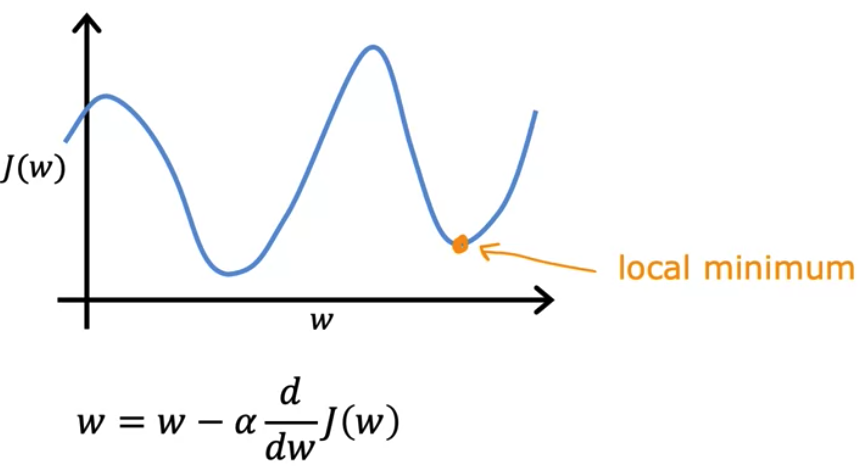{:height 234, :width 521}
						- Because if you start going down the first valley, gradient descent won't lead you to the second valley, and the same is true if you started going down the second valley, you stay in that second minimum and not find your way into the first local minimum. This is an interesting property of the gradient descent algorithm.
					- 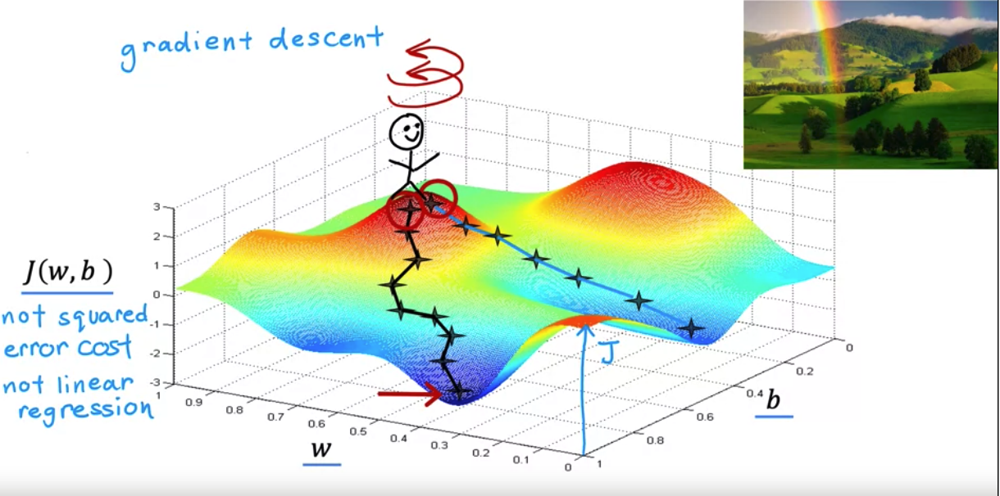
				- #### Implementing Gradient descent
				  background-color:: purple
				  collapsed:: true
					- To identify the lowest cost, the values of $w$ and $b$ are updated in tiny steps until the final convergence (min value is found).
					- For that, new value of $w$ is computed from the old value of $w$ minus $\alpha$ and the partial derivative of $J(w,b)$, as shown below. What this expression is saying is, take your current parameter value $w$ and adjust it by a small amount.
					- Since we have 2 parameters $w$ and $b$, repeat the same for $b$ also.
					- $$w = w - \alpha \frac{\partial }{\partial w} J(w,b)$$
					  $$b = b - \alpha \frac{\partial }{\partial b} J(w,b)$$
						- > The $=$ sign here is assignment operator, not the truth assertion in math.
						- Here $\alpha$ is called the **learning rate**.
							- The learning rate is usually a small positive number between 0 and 1 and it might be say, 0.01. What Alpha does is, it basically controls **how big of a step** you take downhill.
							- If the $\alpha$ is very large, then that corresponds to a very aggressive gradient descent where you you are taking huge steps downhill.
							- If the $\alpha$ is small, then that is like taking baby steps downhill.
						- The partial derivative term of the cost function $J$ controls **in which direction to take the steps** downhill.
						  $$\frac{\partial }{\partial w} J(w,b)$$
					- > Note: Both $w$ and $b$ must be updated simultaneously - like this.
						- ```
						  temp_w = compute_new_w()
						  temp_b = compute_new_b()
						  w = temp_w
						  b = temp_b
						  ```
					- 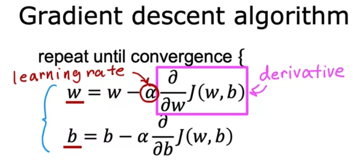{:height 288, :width 640}
		- ## Multiple Linear Regression
		  background-color:: red
			- ### Overview
			  background-color:: green
				- 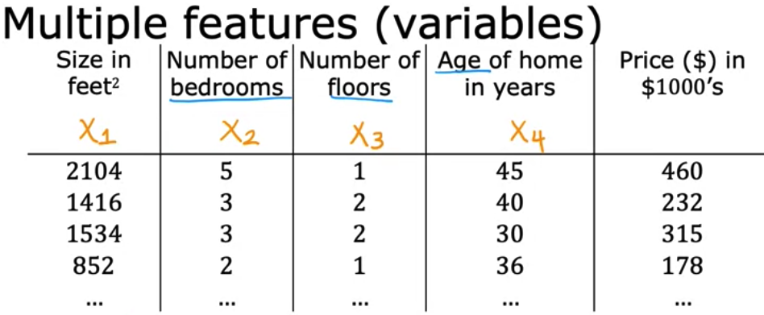{:height 327, :width 757}
				- The above example has multiple features $$x_1, x_2, x_3 x_4 $$, where $$j=1..4$$
				- > $x_j$ denotes the $$j^{th}$$ feature
				- > $m$ = number of rows in training dataset
				- > $n$ = number of features
				- > $\vec{x}^{(i)}$ = features of the $i^{th}$ training example which is a vector
					- e.g., $\vec{x}^{(2)} = [1416\space 3\space 2\space 40]$ from the above example. This is a **row vector**.
				- > $x_j^{(i)}$ denotes the $$j^{th}$$ feature on the $i^{th}$ training data set
					- $x_3^{(2} = 2$
			- ### Model
			  background-color:: green
			  collapsed:: true
				- Previously for univariate regression: $$f_{w,b}(x) = wx + b$$
				- For multiple features: 
				  $$f_{\vec{w},b}(\vec{x}) = w_1x_1 + w_2x_2 + ... + w_nx_n + b$$
					- where parameters $w$ of the model is represented as a **row vector** : (the arrow on top of w to indicate the vector is optional)
					  $$\vec{w} = [w_1\ w_2\ w_3\  ...\ w_n]$$
					- $b$ is a number
					- Input features are represented as vector also
					  $$\vec{x} = [x_1\ x_2\ x_3\  ...\ x_n]$$
					- The above formula can be simplified as follows
					  $$f_{\vec{w}, b}\vec{(x)} = \vec{w} \cdot \vec{x} + b$$
						- where $\vec{w} \cdot \vec{x}$ denotes the DOT product of the 2 vectors (linear algebra). This dot notation not only makes the formula simpler.
			- ### Vectorization
			  background-color:: green
			  collapsed:: true
				- Vectorization makes the formula/code simpler.
				- The code execution is also extremely faster because NumPy makes better use of available data parallelism in the underlying hardware. GPU's and modern CPU's implement Single Instruction, Multiple Data (SIMD) pipelines allowing multiple operations to be issued in parallel. This is critical in Machine Learning where the data sets are often very large..
				- ```python
				  w = np.array([1.0, 2.5, -3.3])
				  x = np.array([10, 20, 30])
				  b = 4
				  
				  # DOT product using NumPy
				  f_x = np.dot(w, x) + b
				  ```
				- Without vectorization, the code will take a long time to perform the computation since it is sequential. Whereas the vectorization implementation is concurrently processed and is way faster.
				- 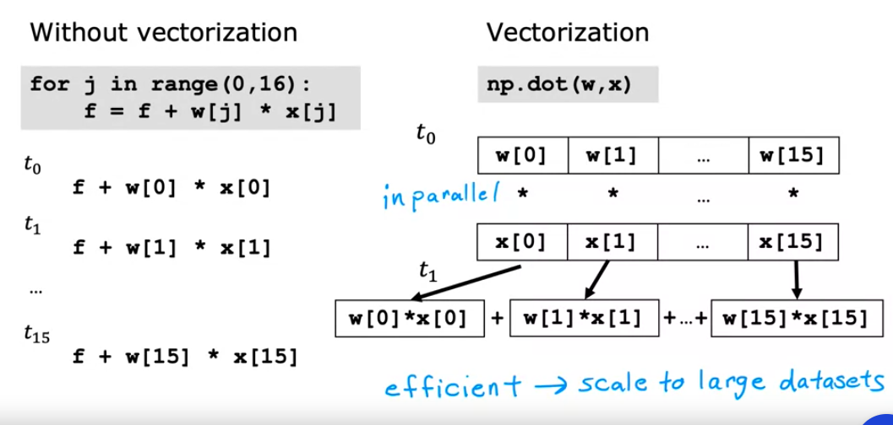{:height 412, :width 976}
				- 
				-
			- ### Gradient Descent
			  background-color:: green
				- repeat {
				   $w_j = w_j - \alpha \frac{\partial }{\partial w_j} J(\vec{w},b)$
				   $b = b - \alpha \frac{\partial }{\partial b} J(\vec{w},b)$
				  }
				- 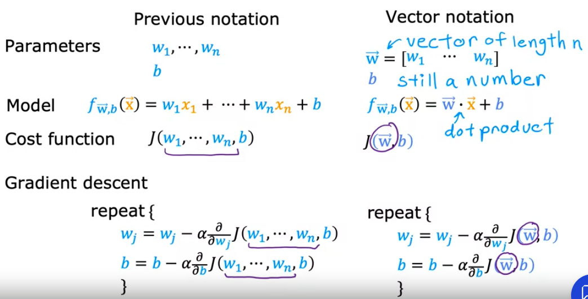
				- #### Checking Gradient Descent for Convergence
					- When running gradient descent, how can you tell if it is converging? That is, whether it's helping you to find parameters close to the global minimum of the cost function
					- **Learning Curve**
						- Draw a learning curve as follows - where x-axis is the number of iterations (for each time the parameters w and b are updated)
						- As shown in the chart below, the cost value should reduce after multiple iterations. If it increases, then it means the learning rate (\alpha) is chosen incorrectly - typically too large.
						- Around 400 iterations in the below chart, the cost value kind of flattens which indicates the gradient descent is converged.
							- Btw, the number of iterations to converge can vary from one app to another.
						- 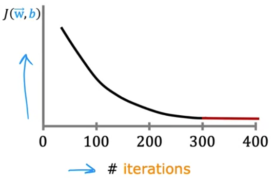
					- **Automatic Convergence Test**
						- Another way to decide if your model is done training is with an automatic convergence test.
						- Let's pick a small number say $10^{-3}$ and denote it with a variable named \epsilon (epsilon).
						- If the cost J decreases by less than this number epsilon on one iteration, then you're likely on this flattened part of the curve that you see on the left and you can declare convergence.
						- Usually choosing the right threshold epsilon is pretty difficult. Better to look at the learning curve chart rather than rely on automatic convergence tests.
				- #### Choosing the learning rate (\alpha)
					- 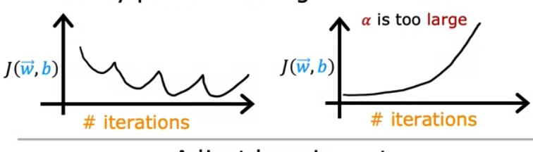
					- If the learning rate (\alpha) is too large or if there is a bug in the code, then the learning curve may look like the above.
					- So, use a smaller \alpha always.
					- 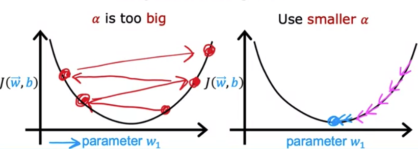
					-
			- ### Feature Scaling
			  background-color:: green
				- https://medium.com/analytics-vidhya/mean-normalization-and-feature-scaling-a-simple-explanation-3b9be7bfd3e8
				-
				- ### Why feature scaling is needed?
				  background-color:: purple
				  collapsed:: true
					- When you have different features that take on very different ranges of values, it can cause gradient descent to run slowly but re-scaling the different features so they all take on comparable range of values.
				- ### What is feature scaling?
				  background-color:: purple
				  collapsed:: true
					- Let's take an example of calculating home prices based on home size and number of bedrooms as 2 features.
						- $\hat{price} = w_1x_1 + w_2x_2 + b$
						- where $x_1$ is the home size whose values can range from 300 – 2000 sq.ft. (**large**)
						- and $x_2$ is the # of bedrooms whose values range from 0–5 (**small**)
					- 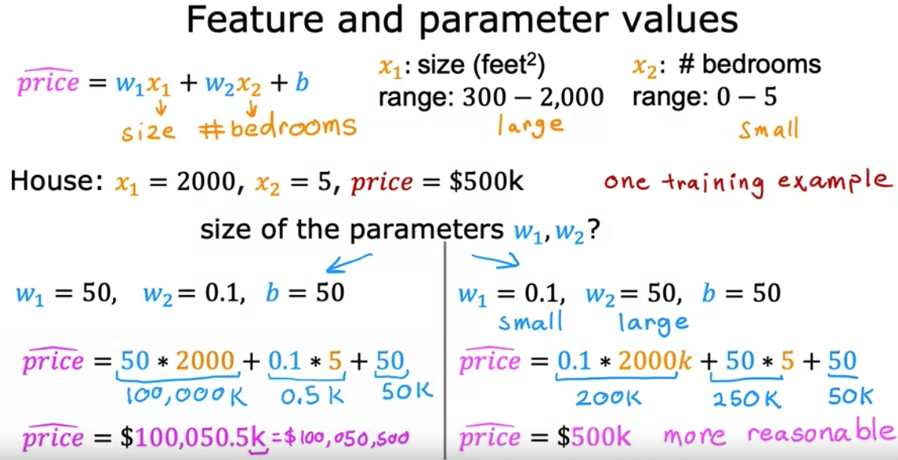{:height 408, :width 877}
					- **Problem**
						- When we plot the features and parameters with such values in differing scale (large vs. small) as is, then it would look like this.
						- In the scatter plot (features), all the plots are scattered at the bottom of the graph since the x-axis and y-axis scales are different.
						- In the contour plot (parameter & cost function), the ellipses are much narrower. Why is this a problem? The gradient descent will take longer to reach the local minimum.
					- **Solution**
						- To solve this problem, transform the training data so that both $x_1$ and $x_2$ now range from 0–1.
						- After this change, the data points are scattered broadly in the scatter plot and the contour plot if more circular in shape to reach the local minimum faster.
						- 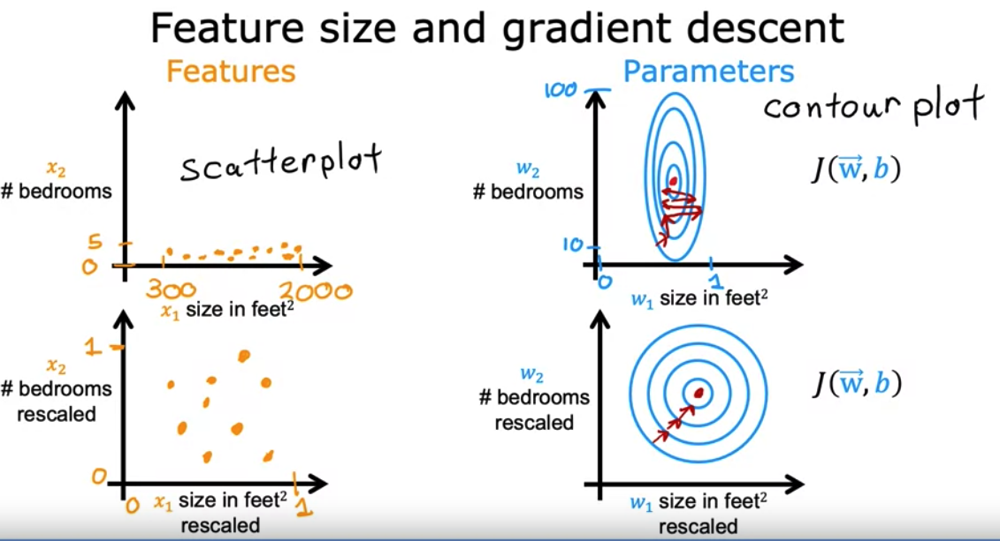{:height 406, :width 777}
						- 
				- ### How to perform feature scaling?
				  background-color:: purple
					- There are a couple of techniques to perform rescaling
					- #### Technique 1 - Divide by max
					  background-color:: pink
						- By dividing all values by the maximum, the new range will be 0 to 1 for all the features.
						- | | $x_1$ value range | $x_2$ value range |
						  | Before feature scaling  | $300 \leq x_1 \leq 2000$ | $0 \leq x_2 \leq 5$|
						  | Formula applied | $x_{1,scaled} = x_1/x_{1,max}$ | $x_{2,scaled} = x_2/x_{2,max}$ | 
						  | After feature scaling | $0.15 \leq x_1 \leq 1$ | $0 \leq x_2 \leq 1$ |
						  | Scatter plot | 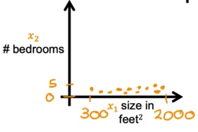 | 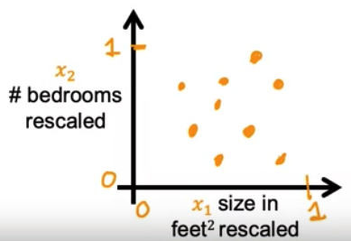 |
					- #### Technique 2 - Mean normalization
					  background-color:: pink
						- To calculate the mean normalization of a feature $x_1$, first find the average/mean of it and call it $\mu_1$
						  $$Mean\ \  \mu = \sum_{i=1}^{n}x_i$$
						- | | $x_1$ value range | $x_2$ value range |
						  | Before feature scaling  | $300 \leq x_1 \leq 2000$ | $0 \leq x_2 \leq 5$|
						  | Formula applied | $\LARGE x_{1,scaled} = \frac{x_1 - \mu_1}{x_{1,max}-x_{1,min}}$ | $\LARGE x_{2,scaled} = \frac{x_2 - \mu_2}{x_{2,max}-x_{2,min}}$ | 
						  | After feature scaling | $-0.18 \leq x_1 \leq 0.82$$ | $-0.46 \leq x_2 \leq 0.54$$ |
						  | Scatter plot |  | 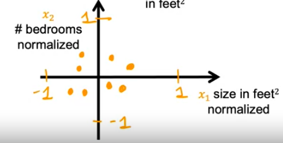 |
					- #### Technique 3 - Z-score normalization
					  background-color:: pink
						- To calculate the z-score normalization of a feature $x_1$, first find the standard deviation of it and call it $\large \sigma$
						  $$\sigma = \sqrt{\frac{1}{N} \sum_{i=1}^N (x_i - \mu)^2}$$
							- 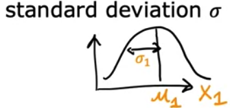{:height 144, :width 282}
						- | | $x_1$ value range | $x_2$ value range |
						  | Before feature scaling  | $300 \leq x_1 \leq 2000$ | $0 \leq x_2 \leq 5$|
						  | Formula applied | $\LARGE x_{1,scaled} = \frac{x_1 - \mu_1}{\sigma_1}$ | $\LARGE x_{2,scaled} = \frac{x_2 - \mu_2}{\sigma_2}$ | 
						  | After feature scaling | $-0.67 \leq x_1 \leq 3.1$ | $-1.6 \leq x_2 \leq 1.9$ |
						  | Scatter plot |  | 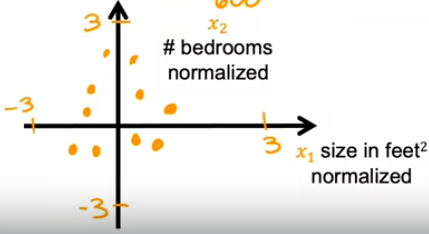 |
				- ### Best practices
				  background-color:: purple
					- As a rule of thumb, when performing feature scaling, you might want to aim for getting the features to range from maybe anywhere around -1 to +1 for each feature x.
						- aim for about  $$-1 \leq x_j \leq 1 $$ for each feature $x_j$
					- These values -1 and +1 can be little loose. For instance, these are acceptable ranges also
						- $-3 \leq x_j \leq 3$
						- $-0.3 \leq x_j \leq 0.3$
					- Ranges that require no rescaling
						- $0 \leq x_j \leq 3$
						- $-2 \leq x_j \leq 0.5$
					- Ranges that require rescaling
						- $-100 \leq x_j \leq 100$ -- values are too large
						- $98.6 \leq x_j \leq 105$ -- values are too large (body temperature samples)
						- $-0.001 \leq x_j \leq 0.001$ -- values are too small
					- When in doubt, perform rescaling, since there is no downside to it.
		- ## Polynomial Regression
		  background-color:: red
		  collapsed:: true
			- ### Feature Engineering
			  background-color:: green
				- The choice of features can have a huge impact on your learning algorithm's performance. In fact, for many practical applications, choosing or entering the right features is a critical step to making the algorithm work well.
				- Creating a new feature (*in addition to the provided ones, like the frontage and depth in the below example*) based on intuition, by transforming or combining original features is called **Feature Engineering**.
				- In the below example, *area* is called as the **engineered feature**.
				- 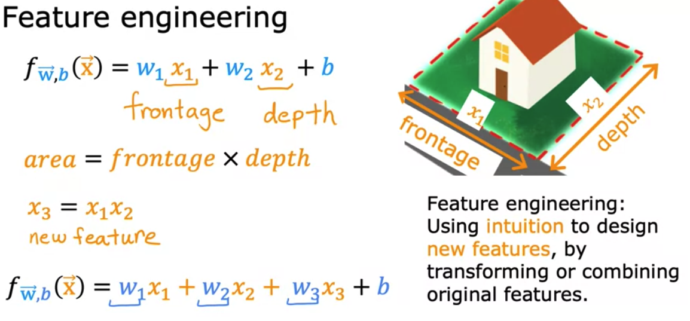
			- ### Polynomial functions
			  background-color:: green
				- Not all data will fit in a linear functions - there are cases which fit in curves as shown below - which requires non-linear functions.
				- Out of the box, linear regression provides a means of building models of the form:
				  $$f_{w,b} = w_0x_0 + w_1x_1 + ... + w_{n-1}x_{n-1} + b$$
				- What if your features/data are non-linear or are combinations of features?
					- For example, Housing prices do not tend to be linear with living area but penalize very small or very large houses resulting in the curves shown in the graphic above. How can we use the machinery of linear regression to fit this curve? Recall, the 'machinery' we have is the ability to modify the parameters $w$, $b$ in the above linear equation to 'fit' the equation to the training data. However, no amount of adjusting of $w$, $b$ in the above equation will achieve a fit to a non-linear curve.
				- 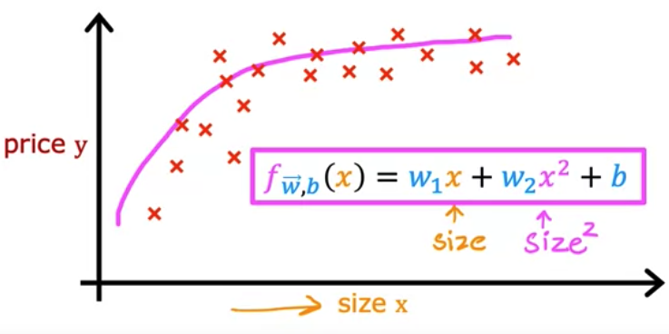
				- In such cases, you may decide to use a non-linear function like the ones below
					- quadratic function $$f_{w,b} = w_1x + w_2x^2 + b$$
					- or cubic function $$f_{w,b} = w_1x + w_2x^2 + w_3x^3 + b$$
				- > **Type of Polynomial Functions**
				  > | **Type** | **Example** |
				  > | Constant Polynomial Function: | $P(x) = a = ax0$ |
				  > | Zero Polynomial Function: | $P(x) = 0$; where all i’s are zero, $i = 0, 1, 2, 3, …, n$. |
				  > | Linear Polynomial Function: | $P(x) = ax + b$ |
				  > | Quadratic Polynomial Function: | $P(x) = ax2+bx+c$ |
				  > | Cubic Polynomial Function: | $ax3+bx2+cx+d$ |
				  > | Quartic Polynomial Function: | $ax4+bx3+cx2+dx+e$ |
				  
				  > https://byjus.com/maths/polynomial-functions
				- It is hard to decide whether to use square or cube or square root of a feature. After trial-and-error, say, the result comes out like this which fits the training data.
				  $$0.08𝑥+0.54𝑥2+0.03𝑥3+0.0106$$
					- where $w_1 = 0.08$, $w_2=0.54$, etc.
					- What this implies is that $x^2$ best fits our data, because the parameter values of $x$ and $x^3$ are very low which indicates those features are insignificant for the prediction.
				- Summary
					- Gradient descent is picking the 'correct' features for us by emphasizing its associated parameter
					- Less weight value (less $w, b$ values) implies less important/correct feature, and in extreme, when the weight becomes zero or very close to zero, the associated feature is not useful in fitting the model to the data.
					- In the above example, after fitting, the weight associated with the $𝑥^2$ feature is much larger than the weights for $𝑥$ or $𝑥^3$ as it is the most useful in fitting the data.
				- 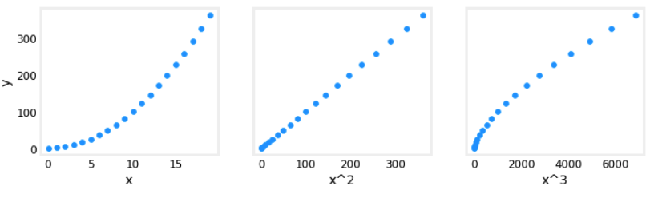
	- ## Classification
	  background-color:: yellow
		- Binary classification (e.g., true/false)
			- Examples
				- Email spam or not?
				- Transaction fraud or not?
			- Values
				- true/false
				- yes/no
				- 1/0 (negative class/positive class)
	- ## Applications
	  background-color:: yellow
	  collapsed:: true
		- In all of these applications, you will first train your model with examples of inputs $x$ and the right answers, that is the labels $y$.
		- After the model has learned from these input, output, or $x$ and $y$ pairs, they can then take a brand new input $x$, something it has never seen before, and try to produce the appropriate corresponding output $y$.
		- | **Application** | **Input** | **Output** | **Type** |
		  | ----- | ----- | ----- | ------ | ------ |
		  | Email spam filtering | Email | Spam or not | Document classification |
		  | Ad targeting | Ad, user info | user clicked or not | Document classification |
		  | Speech Recognition | Audio | Text transcript | ??? classification |
		  | Machine translation | English text | Spanish text | ??? classification |
		  | Self driving car | Image, radar info | Position of other cars | ??? classification |
		  | Product visual Inspection | Image of a product e.g., iphone | Has defect or not. e.g, scratch | ??? classification |
		  | Photo rotation | Image | Photo is vertical or horizontal | Image classification |
		  | Gender identification | Image | Detect the person is male/female | Image classification |
		  | Google Street view face detection | Image | is a human face or not | Image classification |
		  | House price prediction | House size in sq. ft | Predict the house price from an infinite number of possible prices| Regression |
- # Unsupervised learning
  background-color:: purple
  collapsed:: true
	- ### Definition
		- Unsupervised learning is also called as "Descriptive Learning"
		- Unsupervised learning is about finding something interesting in an unlabeled data.
		- While supervised learning relies on labeled or structured data, unsupervised learning trains on unlabeled or unstructured data (e.g., the text of a book) and try to find structure. Vast majority of data that enterprises need to process are unstructured data.
		- Naturally unsupervised learning is much harder than supervised learning as the data has no preexisting labels to assist the algorithms in understanding the data.
		- Widely used unsupervised learning algorithms are cluster analysis and market basket analysis.
		-
		- For example, using unsupervised learning for Cancer Tumor detection, the algorithm automatically groups the inputs in clusters, whereas in supervised it would output if the tumor is malignant or benign.
		- Here is another example of clustering in Google News where related news articles are clustered together.
		- | 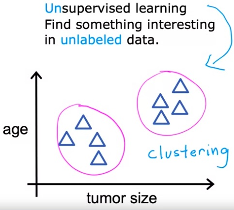 | {:height 419, :width 557} |
		  | 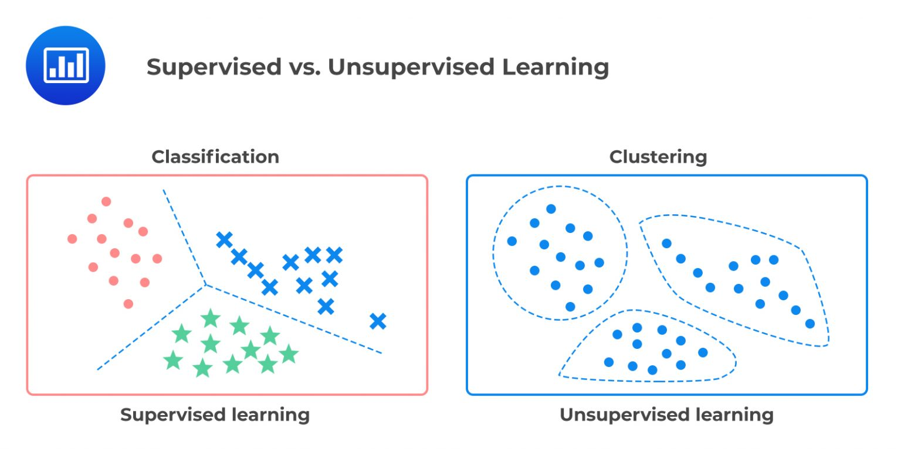 |
	- ### Types of Unsupervised learning
		- Clustering
			- Group similar data points together
			- e.g., Google News grouping
		- Anomaly Detection
			- Find unusual data points
			- e.g., Credit fraud detection
		- Dimensionality reduction
			- Take a big data-set and almost magically compress it to a much smaller data-set while losing as little information as possible.
	- ### Mathematical Definition
		- Here we are only given inputs, and the goal is to find “interesting patterns” in the data. This is sometimes called __knowledge discovery__.
			- > $D = \\{ (x _{i}) \\} _{i=1}^N$
		- This is a much less well-defined problem, since we are not told what kinds of patterns to look for, and there is no obvious error metric to use (unlike supervised learning, where we can compare our prediction of $y$ for a given $x$ to the observed value).
	- ### Applications
		- **Discovering clusters**
			- e.g., In e-commerce, it is common to cluster users into groups, based on their purchasing or web-surfing behavior, and then to send customized targeted advertising to each group
		- **Discovering graph structure**
			- Sometimes we measure a set of correlated variables, and we would like to discover which ones are most correlated with which others. This can be represented by a graph $G$, in which nodes represent variables, and edges represent direct dependence between variables.
			- e.g., predicting traffic jams in freeway
		- **Matrix completion**
			- Sometimes we have missing data, that is, variables whose values are unknown. For example, we might have conducted a survey, and some people might not have answered certain questions. Or we might have various sensors, some of which fail. The corresponding design matrix will then have “holes” in it; these missing entries are often represented by $NaN$, which stands for “not a number”. The goal of imputation is to infer plausible values for the missing entries. This is sometimes called matrix completion.
			- Image inpainting - The goal is to “fill in” holes (e.g., due to scratches or occlusions) in an image with realistic texture.
			- Collaborative filtering - Netflix predicting which movies a user is likely to watch based on his past view history.
		- Anomaly detection
- # Reinforcement Learning
  background-color:: purple
  collapsed:: true
	- ### Definition
		- Reinforcement Learning takes an approach similar to behavioral psychology. Instead of a training a model with predefined training sets (i.e., where you know the prescribed answers in advance) as in supervised learning, reinforcement learning rewards the algorithm when it performs the correct action (behavior).
		- is somewhat less commonly used. This is useful for learning how to act or behave when given occasional reward or punishment signals. (For example, consider how a baby learns to walk.)
		- Successful implementations: Google DeepMind's AlphaGo, self-driving cars
	-
- # Deep Learning
  background-color:: purple
  collapsed:: true
	- Deep Learning is a subset of AI that attempts to develop computer systems that learn using **neural networks** like those in the human brain.
	- While ML is mostly about optimization, deep learning is more focused on creating algorithms to simulate how the human brain's neurons work.
	- Deep Learning algorithms are composed of interconnected web of nodes called **neurons** and the edges that join them together.
	- Neural nets receive inputs, perform calculations, and then use this output to solve given problems.
	-
- # Data set Repositories
  background-color:: purple
	- [UCI Machine Learning Repository](http://archive.ics.uci.edu/datasets)
- # ML Algorithms
  background-color:: purple
	- 
- # Tools
  background-color:: purple
	- [Weka UI](https://www.cs.waikato.ac.nz/ml/weka/downloading.html)
	- R
	- Scikit-learn
	- Matplotlib
	- Numpy
	- Pandas
- # Learning Resources
	- Machine Learning with Python https://cognitiveclass.ai/courses/machine-learning-with-python/
	- Deep Learning 101 https://cognitiveclass.ai/courses/introduction-deep-learning/
	- Andrew Ng's ML course https://www.coursera.org/learn/machine-learning/home/week/1
	- https://DeepLearning.AI
	- https://numpy.org/doc/stable/
	- ## Books
		- O'Reilly Designing Machine Learning Systems
		- O'Reilly Machine Learning Design Patterns
		- O'Reilly Natural Language Processing with Transformers
		- The Cartoon Guide to Statistics
		- Approaching (Almost) any machine learning problem
		- An Introduction to Statistical Learning - James Witten
- # References
	- http://www.cs.ubc.ca/~murphyk/MLbook/pml-intro-22may12.pdf