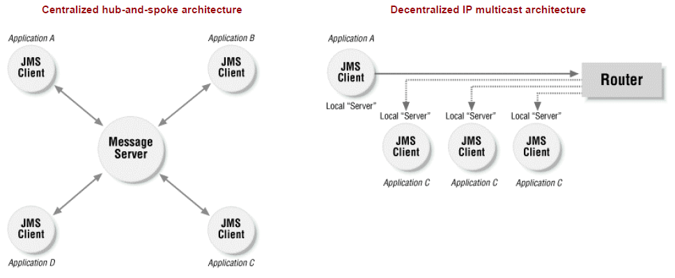
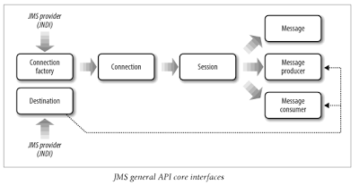

# Overview
collapsed:: true
	- Messaging is primarily used to solve scalibility & reliability issues
		- plays key role in heterogenous integration of system built on myriad of technologies like Java, .Net, Mainframe, etc.
		- can process requests asynchronously
		- provides high degree of decoupling between components, systems, etc.
	- Some of the messaging  techniques and technologies developed:
		- MDB(Message Driven Bean from EJB spec)
		- Spring Messaging Framework
		- EDA (Event Driven Architecture)
		- SOA (Service-Oriented Architecture)
		- RESTful JMS interfaces
		- ESB (Enterprise Service Bus)
	- Messaging middleware vendors
		- IBM's WebSphere MQ
		- TIBCO Rendezvous
		- SonicMQ
		- Microsoft Message Queuing (MSMQ)
		- Opensource ActiveMQ
	- Terminologies
		- Message Broker: responsible for delivering messages from one messaging client to other clients.
		- Queue Depth: number of messages in the queue
	- ## Advantages of Messaging
	  collapsed:: true
		- Heterogeneous system integration
		- Reduce system bottlenecks
		- Increase scalability
		- Architecture flexibility and agility
		- Enterprise middleware products ensure that messages are properly distributed among applications, provide fault tolerance, load balancing, scalability, and transactional support.
		- offer a degree of reliability, flexibility, extensibility and modularity that a traditional RPC or distributed object system simply cannot.
	- ## Messaging Architecture Styles
	  collapsed:: true
		- ### Service-Oriented Architecture (SOA)
		  collapsed:: true
			- an architecture style that defines business services that are abstracted from the corresponding enterprise service implementations. [Read more here:  [[SOA]] ]
		- ### Enterprise Service Bus (ESB)
		  collapsed:: true
			- SOA has given rise to a new breed of middleware called ESB.
			- In the early days of SOA, most ESBs were implemented as message brokers, whereby components within the messaging layer were used to perform some sort of intelligent routing or message transformation before delivering the message. These earlier message brokers have evolved into sophisticated commercial and open source ESB products that use messaging at their core. Although some ESB products support a traditional non-JMS HTTP transport (web services), most enterprise-wide production implementations still leverage messaging as the protocol for communication.
			- Messaging is an excellent means of building the abstraction layer within SOA needed to fully abstract a business service from its underlying implementation. Through messaging, the business service does not need to be concerned about where the corresponding implementation service is, what language it is written in, what platform it is deployed in, or even the name of the implementation service.
		- ### Event-Driven Architecture (EDA)
		  collapsed:: true
			- an architecture style that is built on the premise that the orchestration of processes and events is dynamic and very complex, and therefore not feasible to control or implement through a central orchestration component. When an action takes place in a system, that process sends an event to the entire system stating that an action took place (an event). That event may then kick off other processes, which in turn may kick off additional processes, all decoupled from each other.
			- Example of EDA include insurance domain and benefits domain. Getting married or changing jobs triggers events in the system that quality for certain changes to health and retirement benefits.
			- Messaging is at the heart of EDA systems. Not surprisingly, most architectures based on EDA leverage the pub/sub model as a means of broadcasting the events within a system.
			- Heterogeneous Platform Integration
			- Messaging plays a key role in being able to make these heterogeneous platforms communicate with one another, whether it be Java EE and Microsoft .NET, Java EE and CICS, or Java EE and Tuxedo C++.
			- Some platforms, such as .NET, may require an external messaging bridge to convert a JMS message into an MSMQ message (depending on the messaging provider you are using). For example, ActiveMQ provides a messaging bridge for converting MSMQ to JMS (and vice versa). This lower-level platform integration has given rise to a broader scope of integration, known as Enterprise Application Integration.
		- ### Enterprise Application Integration (EAI)
		  collapsed:: true
			- Organizations have a strong desire to integrate both legacy and new applications so that they can share information and cooperate in larger enterprise-wide operations. The integration of these applications is generally called Enterprise Application Integration (EAI).
			- Data and events can be exchanged in the form of messages via topics or queues, which provide an abstraction that decouples participating applications.
- # EMS (Enterprise Messaging System)
  collapsed:: true
	- 
	- EMS (Enterprise Message Systems) or MOM (Message Oriented Middleware): Application-to-application messaging systems, when used in business systems, are generally referred to as EMS or MOM.
	- Clients send messages to the messaging server, which then distributes them to one or more recipients. Client is the business app or component that uses the JMS API.
	- Key feature of messaging is delivering message asynchronously. Client app can send a message and forget about it.
	- **Message-Oriented Middleware** architectures
		- vary in their implementation from a centralized architecture that depends on a message server to perform routing, to a decentralized architecture that distributes the server processing out to client machines. Some models use a hybrid approach.
		- vary in the protocol used at the network transport layer including TCP/IP, HTTP, SSL, and IP multicast.
	- ## Architecture styles
	  collapsed:: true
		- **Centralized architecture**:
			- relies on message server or broker that is responsible for delivering messages from one client to other
			- decouples sender from receivers
			- clients only see the server and not other clients which allows to add/remove without affecting the whole system
			- central server may be a cluster of distributed servers operating as a single logical unit
			- Uses TCP/IP as protocol.
		- **Decentralized architecture**:
			- no centralized server
			- some of the server functionality (persistence, transactions, security) is embedded as part of the client while the message routing is delegated to the network layer
			- Uses IP multicast at network level
	- ## Messaging Models or Domains
	  collapsed:: true
		- | | Point-to-Point (p2p) | Publish-and-Subscribe (pub-sub) | 
		  | - | ------------- | -------------- |
		  | Virtual Channel | Queue | Topic | 
		  | Actors | Senders & Receivers | Publishers & Subscribers | 
		  | Message receivers | Durable and Non-durable | 
		  | Message notification | Pull-based or polling-based | Push-model. Clients are automatically notified when a message is available. |
		  | Message delivery | Supports both synchronous(request/reply) & asynchronous (fire-and-forget) | Supports both | 
		  | Coupling | More coupled with client | Decoupled from clients | 
		  | Used for | Load balancing	 |  |  
		  | Browser | Queue browser allows to view message in a queue before delivery. | Not available |
		- > P2P Message Receivers: Though many receivers may listen on a queue, only one receiver gets the same message.	 Same message can be sent to multiple subscribers (this is referred to as broadcasting).
		  > There are 2 types of subscribers :
		  > 1) **Non-durable** - temporary subscriptions that receive messages only when they are actively listening on the topic 
		  > 2) **Durable** - will receive a copy of every message published, even if they are offline when the message is published.
- # JMS
  collapsed:: true
	- JMS is a vendor-agnostic Java API that can be used with many different enterprise messaging vendors - Not a messaging system itself.
	- API Overview
	- can be broken down into 3 parts
		- General API - used to send/receive messages from either a queue or a topic
		- **Point-to-point API** - used solely for messaging with queues
		- **Publish-subscribe API** - used soleley for messaging with topics
	- `ConnectionFactory` & `Destination` must be obtained from the provider using JNDI (per the JMS spec). Other interfaces are created through factory methods. e.g., `ConnectionFactory --creates--> Connection --creates--> Session --creates--> Message, MessageProducer, MessageReceiver`
	- Unlike JDBC, in JMS, `Session` object holds the transactional unit of work for messaging instead of `Connection`.
	- JMS Client: business app that uses the JMS API
	- JMS Provider: 3rd party messaging vendor that implemented the JMS API
	- JMS Administered Objects: are JMS objects that are created and configured by the system administrator. It includes JMS ConnectionFactory and Destination objects such as topics and queues.
	- 
	- | General API | Point-to-Point API | Pub-Sub API | 
	  | ----------- | ------------------ | ----------- | 
	  | ConnectionFactory | QueueConnectionFactory | TopicConnectionFactory | 
	  | Destination | Queue | Topic |
	  | Connection | QueueConnection | TopicConnection | 
	  | Session | QueueSession | TopicSession | 
	  | Message | Message | Message | 
	  | MessageProducer | QueueSender | TopicPublisher | 
	  | MessageConsumer | QueueReceiver | TopicSubscriber |
	- ## JMS Programming Step-By-Step
	  collapsed:: true
		- ### Step 1: Define jndi.properties
		  collapsed:: true
			- ``` properties jndi.properties
			  java.naming.factory.initial = org.apache.activemq.jndi.ActiveMQInitialContextFactory
			  java.naming.provider.url = tcp://localhost:61616
			  java.naming.security.principal=system
			  java.naming.security.credentials=manager
			  - connectionFactoryNames = TopicCF
			  topic.topic1 = jms.topic1
			  ```
			- The `jndi.properties` file also contains the JNDI connection information for the JMS provider. You will need to set the initial context factory class, provider URL, username, and password needed to connect to the JMS server. Each vendor will have a different context factory class and URL name for connecting to the server. You will need to consult the documentation of your specific JMS provider or Java EE container to obtain
			  these values.
		- ### Step 2: Obtaining a JNDI connection
		  collapsed:: true
			- A directory service provides JMS clients with access to ConnectionFactory and Destination (topics and queues) objects. ConnectionFactory and Destination objects are the only things in JMS that cannot be obtained using the JMS API—unlike connections, sessions, producers, consumers, and messages, which are manufactured using the factory pattern within the JMS API. JNDI provides a convenient, location-transparent, configurable, and portable mechanism for obtaining ConnectionFactory and Destination objects, also called JMS-administered objects because they are established
			  and configured by a system administrator.
			- JMS servers will either work with a separate directory service like LDAP or provide their own directory service that supports the JNDI API.
			- Creating a connection to a JNDI naming service requires that a javax.naming.InitialContext object be created. An InitialContext is the starting point for any JNDI lookup—it’s similar in concept to the root of a filesystem. The InitialContext provides a network connection to the directory service that acts as a root for accessing JMS administered objects.
			- ``` java
			  // Obtain a JNDI connection using the jndi.properties file
			  InitialContext ctx = new InitialContext();
			  ```
			- Alternately, InitialContext can be initialized with properties object as follows:
			- ``` java
			  Properties env = new Properties();
			  env.put(Context.SECURITY_PRINCIPAL, "system");
			  env.put(Context.SECURITY_CREDENTIALS, "manager");
			  env.put(Context.INITIAL_CONTEXT_FACTORY, "org.apache.activemq.jndi.ActiveMQInitialContextFactory");
			  env.put(Context.PROVIDER_URL, "tcp://localhost:61616");
			  
			  InitialContext ctx = new InitialContext(env);
			  ```
- # Messaging Technologies
  collapsed:: true
	- ## RabbitMQ
		- RabbitMQ is one of the leading implementation of the AMQP protocol (along with Apache Qpid). Therefore, it implements a broker architecture, meaning that messages are queued on a central node before being sent to clients. This approach makes RabbitMQ very easy to use and deploy, because advanced scenarios like routing, load balancing or persistent message queuing are supported in just a few lines of code. However, it also makes it less scalable and “slower” because the central node adds latency and message envelopes are quite big.
	- ## ZeroMQ
		- ZeroMQ is a very lightweight messaging system specially designed for high throughput/low latency scenarios like the one you can find in the financial world. Zmq supports many advanced messaging scenarios but contrary to RabbitMQ, you’ll have to implement most of them yourself by combining various pieces of the framework (e.g : sockets and devices). Zmq is very flexible but you’ll have to study the 80 pages or so of the guide (which I recommend reading for anybody writing distributed system, even if you don’t use Zmq) before being able to do anything more complicated than sending messages between 2 peers.
	- ## ActiveMQ
		- ActiveMQ is in the middle ground. Like Zmq, it can be deployed with both broker and P2P topologies. Like RabbitMQ, it’s easier to implement advanced scenarios but usually at the cost of raw performance. It’s the Swiss army knife of messaging
	- ## Kafka
		- Check Kafka page
- # Bibliography
	- Java Message Service - O'Reilly