# General
background-color:: yellow
	- Micro Frontends are the technical representation of a business sub-domain, they allow independent implementations with same or different technology choices, finally they avoid sharing logic with other sub-domains and they are owned by a single team.
	- 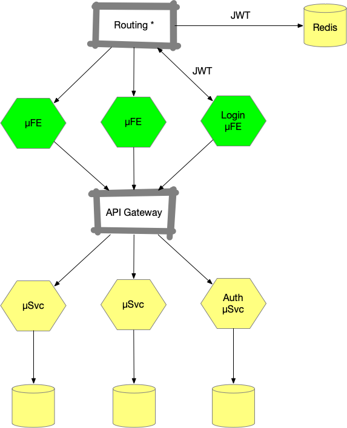
	- ## Advantages of Micro Frontends
		- Ease of innovation
		- Easy to manage
		- Easy to upgrade to new component or technology
		- Ease of deployment due to lack of inter-dependency
		- Quick time to market
		- Technology independence across frontends (but don't do this)
		- Each team has clear ownership
		- Promotes Domain-Driven Design
	- ## Challenges in Micro Frontends
		- first call takes a long time
		- difficult to be indexed by search engines, crawlers, etc.
		- Share nothing across front ends e.g., CSS stylesheets
		- Diamond anti-pattern
	- ## Why µFE?
		- Design your frontend to be evolutionary without committing to a single web technology choice - which may be considered a relic in 6 months.
		- Pros
			- Good encapsulation
			- Better time to market
			- Easy to scale
			- Builds strong engineering culture - everyone is responsible for their own domain
			- Helps achieve organizational agility
			- Improve architecture of an application in the long run or upgrading a tech stack is easy on a smaller app than a monolith
		- Cons
			- Investment and complexity in automation, observability, monitoring, network failures, security, etc.
			- Need to account for company’s structure, culture, developers’ skills, timeline, etc.
			- Wrong definition of MFE boundary, for instance, having a MFE that is too small for completing an action inside a system relying on other MFE, thereby causing a strong coupling between services and forcing them to be deployed together every time. When this phenomenon is extended across multiple services, we risk ending with a ***big ball of mud*** or a system that is hard to extend due to its complexity.
	- ## When to use µFE?
		- When multiple teams need to work on the same codebase where there is communication overhead and centralized decision-making happens - causing feature delivery slow down.
		- When you want to scale part of the application different than the other.
	- ## When not to use µFE?
		-
- # Overview
  background-color:: yellow
	- Monolith Frontend
	  collapsed:: true
		- Ref: https://micro-frontends.org/
		- 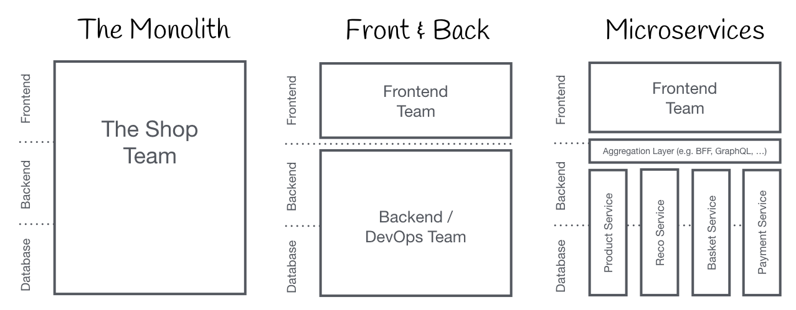{:height 394, :width 1004}
	- Organization in Verticals
	  collapsed:: true
		- Ref: https://micro-frontends.org/
		- 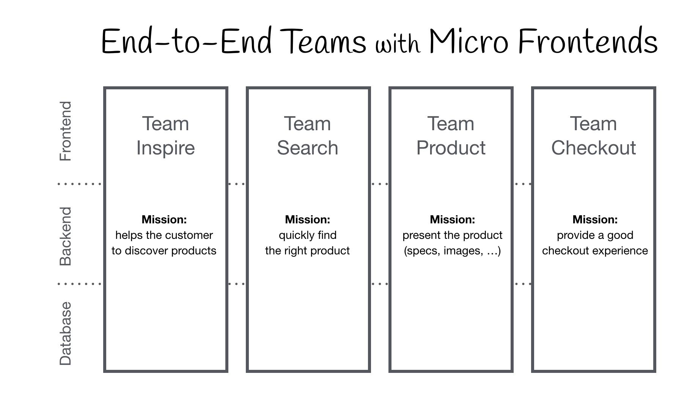{:height 454, :width 923}
	- Documents-to-App Continuum
	  collapsed:: true
		- Ref: https://ar.al/notes/the-documents-to-applications-continuum/
		- 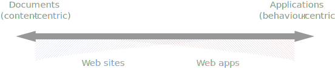{:height 163, :width 654}
- # Micro Frontend Principles
  background-color:: yellow
  collapsed:: true
	- 
	- Business domain representation
	- Autonomous codebase
	- Independent deployment
	- Single-team ownership
- # Micro-Frontends Decisions Framework
  background-color:: yellow
	- This framework is composed of 4 areas:
		- Defining what a micro-frontend is in your architecture
		  logseq.order-list-type:: number
		- Composing micro-frontends
		  logseq.order-list-type:: number
		- Routing micro-frontends
		  logseq.order-list-type:: number
		- Communicating between micro-frontends
		  logseq.order-list-type:: number
	-
	- 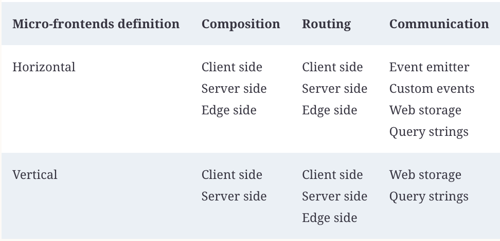{:height 343, :width 827}
	-
	- ## 1) Define Micro Frontends
	  background-color:: green
		- We can decide to have multiple micro-frontends in the same view or have only one micro-frontend per view.
		- The decision to pick horizontal instead of vertical depends on the type of project we have to build. In fact, horizontal split better serves static pages like catalogs or e-commerce instead of a more interactive project that would require a vertical split.
		- 
		- Horizontal split
		  background-color:: green
			- Multiple MFEs are on the same view
			- Multiple teams are responsible for parts of the view and will need to co-ordinate
			- Pros
				- high flexibility
			- Cons
				- more co-ordination and governance needed
		- Vertical split
		  background-color:: green
			- each team is responsible for a business domain, like the authentication or the catalog experience. This is where Domain-Driven Design (DDD) is applied for frontend architecture.
		- ## Domain-Driven Design in Micro Frontends
		  background-color:: pink
			- DDD subdomain types
				- ==Core subdomains==
					- These are the main reasons an application should exist. Core subdomains should be treated as premium citizens in our organizations because they are the ones that deliver value above everything else.
					- e.g., The video catalog would be a core subdomain for Netflix.
				- ==Supporting subdomains==
					- These subdomains are related to the core ones but are not key differentiators. They could support the core subdomains but aren’t essential for delivering real value to users.
					- e.g., the voting system on Netflix’s videos.
				- ==Generic subdomains==
					- These subdomains are used for completing the platform. Often companies decide to go with off-the-shelf software for them because they’re not strictly related to their domain.
					- e.g., With Netflix, for instance, the payments management is not related to the core subdomain (the catalog), but it is a key part of the platform because it has access to the authenticated section.
			- Bounded Context
				- a logical boundary that hides the implementation details, exposing an API contract to consume data from the model present in it.
				- bounded context defines the way different contexts communicate with each other by creating a contract between them, often represented by APIs. This allows teams to work simultaneously on different subdomains while respecting the contract defined up front.
				- Bounded context in a New project
					- Often in a new project, subdomains overlap bounded context because we have the freedom to design our system in the best way possible. Therefore, we can assign a specific subdomain to a team for delivering a certain business value defining the contract.
				- Bounded context in a Legacy project
					- However, in legacy software, the bounded context can accommodate multiple subdomains because often the design of those systems was not thought of with DDD in mind.
				- 
				- Below is a representation of a bounded context
				- 
		-
	- ## 2) Micro Frontends Composition
	  background-color:: green
		- 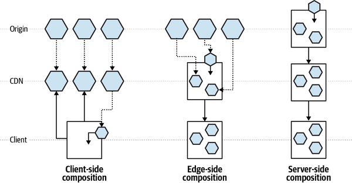{:height 320, :width 600}
		- Different approaches to compose a micro frontend
		- ==Client-side Composition==
		  logseq.order-list-type:: number
			- an application shell loads micro-frontends inside itself, the micro-frontends should have a JS or HTML file as an entry point so the application shell can dynamically append the DOM nodes (*in the case of an HTML file*) or initializing the JS application with a JS file.
			- It can be implemented using different methods
				- iFrames
				- Transclusion (or client-side includes)
					- we could use a *transclusion* mechanism on the client side via a technique called `client-side include`. Client-side include lazy-loads components, substituting empty placeholder tags with complex components. For example, a library called [`h-include`](https://github.com/gustafnk/h-include) uses placeholder tags that will create an Ajax request to a URL and replace the inner HTML of the element with the response of the request.
					- An example of transclusion is the placement of images in HTML. The server asks the client to load a resource at a particular location and insert it into a particular part of the DOM.
		- ==Edge-side Composition==
		  logseq.order-list-type:: number
			- assemble the view at the CDN level
			- Many CDN providers give us the option of using an XML-based markup language called ==Edge Side Includes== ([ESI](https://en.wikipedia.org/wiki/Edge_Side_Includes)).
			- About ESIs
			  collapsed:: true
				- What is ESI?
					- ESI is a small [markup language](https://en.wikipedia.org/wiki/Markup_language) for [edge](https://en.wikipedia.org/wiki/Edge_device) level [dynamic web content](https://en.wikipedia.org/wiki/Dynamic_web_content) assembly.
					- [ESI](https://www.w3.org/TR/esi-lang/) was proposed as a standard by Akamai and Oracle, among others, in 2001.
				- Why ESI?
					- The purpose of ESI is to tackle the problem of web infrastructure scaling. It is an application of [edge computing](https://en.wikipedia.org/wiki/Edge_computing).
					- ESI allows a web infrastructure to be scaled in order to exploit the large number of points of presence around the world provided by a CDN network, compared to the limited amount of data center capacity on which most software is normally hosted.
				- How ESI works?
					- the ESI processor would retrieve the `src` URL, or failing that the `alt` URL, or if that failed do nothing. The ESI system is usually a caching proxy server so it may have a local copy of these files which it can insert without going back to the server. Alternatively the whole page with the ESI tags may be cached, and only the ESI requests may be made to the origin server. This allows different caching times for different parts of the page, or different degrees of personalisation.
					- ```xml
					  <esi:include src="http://example.com/1.html" alt="http://bak.example.com/2.html" onerror="continue"/>
					  ```
				- Cons of ESI
					- ESI is implemented by CDNs (like Akamai) and Proxy Servers (like Varnish, Squid).
					- But ESI is not implemented in the same way by each CDN provider; therefore, a multi-CDN strategy, as well as porting our code from one provider to another, could result in a lot of refactors and potentially new logic to implement
		- ==Server-side Composition==
		  logseq.order-list-type:: number
			- In this case, the origin server composes the view by retrieving all the different micro-frontends and assembling the final page.
			- the server-side composition could happen at runtime or at compile time. If we decide to have a runtime composition, we must have a clear scalability strategy for our servers in order to avoid downtime for our users.
			- If the page is highly cacheable, the CDN will then serve it with a long time-to-live policy. However, if the page is personalized per user, serious consideration will be required about the scalability of the solution.
	- ## 3) Micro Frontends Routing
	  background-color:: green
		- 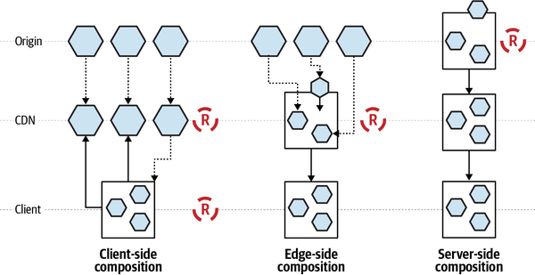
		- How to route the application views - we can decide to route the page requests in the origin, on the edge, or at client side.
		- This is linked to MFE composition decision.
		- Routing approaches are not mutually exclusive. You can combine those approaches using CDN and origin or client-side and CDN together.
		- ==Server-side routing==
		  logseq.order-list-type:: number
			- forced to route the requests at origin since the entire application logic lives in the application servers.
			- Cons
				- we need to consider that scaling an infrastructure could be nontrivial, especially when we have to manage burst traffic with many requests per second (RPS). Our servers need to be able to keep up with all the requests and scale horizontally very rapidly.
		- ==Edge-side routing==
		  logseq.order-list-type:: number
			- routing at the CDN level mitigates the app server load
			- the routing is based on the page URL, and the CDN serves the page requested by assembling the micro-frontends via transclusion at edge level.
			- Cons
				- when we have dynamic or personalized data, we won’t be able to rely extensively on the CDN serving our pages because the data would be outdated or not personalized.
				- smart routing isn't possible
		- ==Client-side routing==
		  logseq.order-list-type:: number
			- Smart routing is possible. For instance, load micro-frontends according to the user state, such as loading the authenticated area of the application when the user is already authenticated or loading just a landing page if the user is accessing our application for the first time.
			- For SPA apps
				- If we use an application shell that loads a micro-frontend as an SPA, the application shell is responsible for owning the routing logic, which means the application shell retrieves the routing configuration first and then decides which micro-frontend to load.
				- Complex/smart routing is possible. For instance, deciding when to load our micro-frontends based on authentication, geo-localization, or any other sophisticated logic.
			- For multipage apps
				- When we are using a multipage website, micro-frontends may be loaded via client-side transclusion. There is almost no routing logic that applies to this kind of architecture because the client relies completely on the URL typed by the user in the browser or the hyperlink chosen in another page, similar to what we have when we use the ESI approach.
			- Pros
				- No scalability issue. Highly recommended.
	- ## 4) Micro Frontends Communication
	  background-color:: green
		- When we have multiple µFEs in the same page, to make the µFEs talk to each, there are few techniques available.
		- No matter whether we have a horizontal or a vertical split of our micro-frontends, we need to decide how to pass data between views.
		- > Bear in mind that each micro-frontend should be unaware of the others on the same page; otherwise, we are breaking the principle of independent deployment.
		- ==Event Bus==
		  logseq.order-list-type:: number
			- Inject an eventbus in each micro-frontend, and notify the event to every micro-frontend. If some micro-frontends in the view are interested in the event, they can listen and react. This is a mechanism that allows decoupled components to communicate with each other via events sent via a bus.
			- To inject the eventbus, we need the micro-frontends container to instantiate the eventbus and inject it inside all of the page’s micro-frontends.
			- 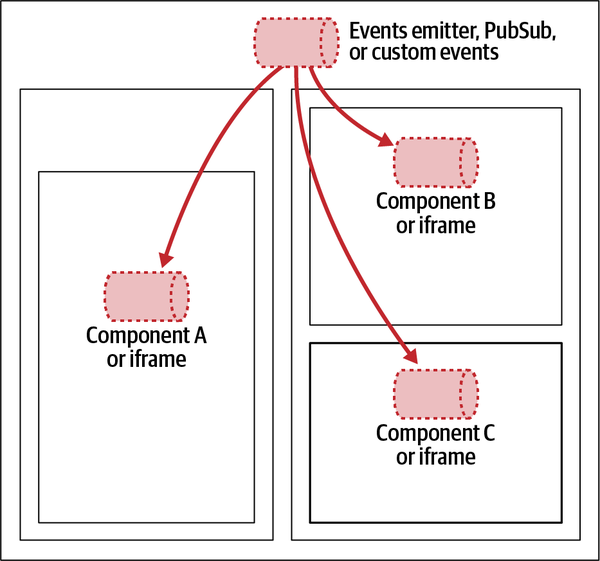{:height 429, :width 484}
		- ==Custom Events==
		  logseq.order-list-type:: number
			- https://developer.mozilla.org/en-US/docs/Web/Events/Creating_and_triggering_events
			- Custom events are normal events with a custom body, which allows us to define the string that identifies the event and an optional object custom for the event. Here’s an example:
			- ```
			  new CustomEvent('myCustomEvent', { detail:{someObj: "customData" }})
			  ```
			- The custom events should be dispatched via an object available to all the micro-frontends, such as the `window` object, which is the representation of a window in a browser.
			- Cons
				- If you decide to implement your micro-frontends with **iframes**, using an eventbus would allow you to avoid challenges like which `window` object to use from inside the iframe, because each iframe has its own `window` object.
		- ==Web Storage==
		  logseq.order-list-type:: number
			- Imagine we have one µFE for signing in a user and another for authenticating the user on our platform. After successfully authenticating, the sign-in micro-frontend has to pass a token to the authenticated area of our platform. How can we pass the token from one micro-frontend to another? We can use a web-storage-like session, local storage, or cookies.
			- In this situation, we might use the *local storage* to store and retrieve the token independently. The micro-frontend is loaded because the web storage is always available and accessible, as long as the micro-frontends live in the same subdomain.
			- 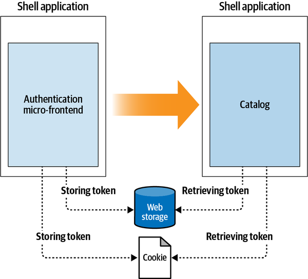{:height 421, :width 482}
		- ==Query String==
		  logseq.order-list-type:: number
			- Another option for the above authentication example is to pass the token via a query string. However, using query strings is not a safe way to pass sensitive data.
			- 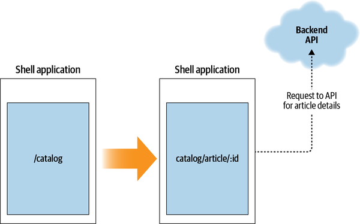
			-
- # References
  background-color:: yellow
  collapsed:: true
	- https://micro-frontends.org/
	- [Microservice Websites](https://microservice-websites.netlify.app/)
	- Book - Building Microservices - Luca Mezzalira
	- Zalando: Micro Frontends from Fragments to Renderers - [Part 1](https://engineering.zalando.com/posts/2021/03/micro-frontends-part1.html), [Part 2](https://engineering.zalando.com/posts/2021/03/micro-frontends-part@.html)
	- [SAP Luigi Micro Frontend Framework](https://luigi-project.io/)
	- OpenTable's [Open Components](https://github.com/opencomponents/oc) Project
	- {{video https://youtu.be/pU1gXA0rfwc}}
	- {{video https://youtu.be/fT-5RHTtFNg}}
-
- # Design
  background-color:: yellow
	- ## Domain Modeling (DDD)
		- Domains
		- Sub-domains
			- Core subdomain e.g., core business function like video streaming for Netflix
			- Generic subdomain e.g., payment processing
			- Supportive subdomain e.g., recommendation engine
		- A team can own more than one subdomain
	- ## Design Considerations
		- 4 things to consider in µFE architecture
		- ### 1.Definition
			- Use _APIs First Design Principle_
			    * APIs are the first user interface of your app
			    * APIs come first, then the implementation
		- ### 2.Composition
			- Client-side composition
			  * Edge-side composition
			  * Server-side composition
		- ### 3.Routing
			- Router is responsible for intercepting and validate JWTs before redirecting to a µFE page
		- ### 4.Communication
			- 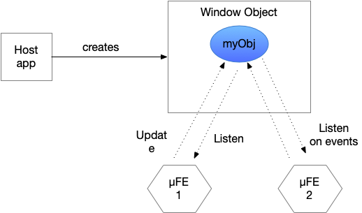
			- e.g., window object or redux
			- Window object is the centralized place where all the components in the page can access the data from. Kind of follows the [Redux data flow pattern](https://redux.js.org/basics/data-flow/).
			- Having a global object/variable in window object is against the µFE encapsulation?
- # Implementation
	- There are 3 things essential for any micro frontend application or framework.
	- Load component scripts onto the page e.g., ScriptJS, [SystemJS](https://github.com/systemjs/systemjs) (module/component loader)
		- Single SPA is layered on SystemJS
	- Instantiate the components and place them in the DOM. e.g., [SingleSPA](https://single-spa.js.org/)
	- Communication of data between the components
		- SingleSPA leaves it up to you
	- ## Types of Implementation
		- __iFrames__ - _used by Spotify_
		- __Shell as proxy__
			- Common logic like auth can be shared in shell
		- __Web Components__ - Polymer
		- Bootstrap
		- [Open Components](http://opencomponents.github.io) - _used by [OpenTable](https://opentable.com)_
		- Interface Framework - _Zalando uses mosaic9, tailor.js_
		- Edge Side Include (ESI) - _used by IKEA_
		- Reverse proxy
			- Auth logic must be duplicated in multiple places since Nginx can't have business logic
		- Using API gateway
			- e.g., Ambassador
		- __Micro frontend ownership__: a team must do all the below: develop, test, build, deploy, document, live-support
	- Tools
		- Webcomponents.org
		- Polymer-lit
		- Stencil js
		- Skate js (Netlify)
		- Module loader - SystemJS
		- [Open Table](http://opencomponents.github.io)
- # Open Questions
	- how authentication works? how session management is handled?
	- how communication between µFEs work?
	- how multiple µFEs are integrated to form an app? build time or runtime?