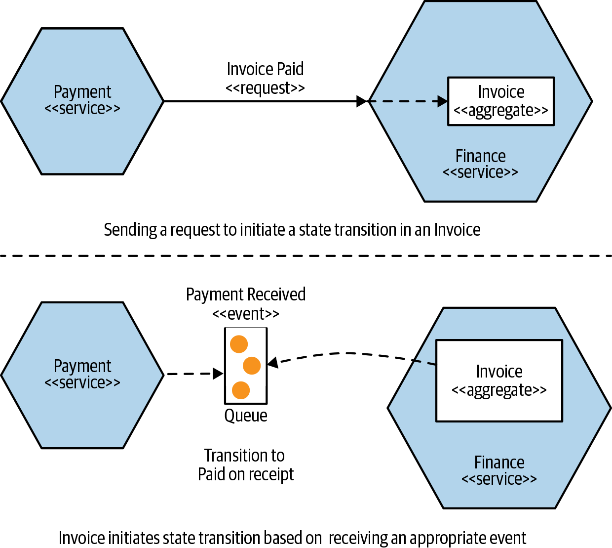
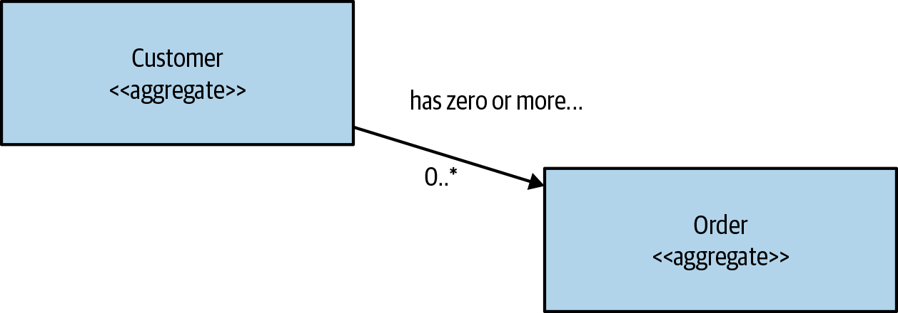
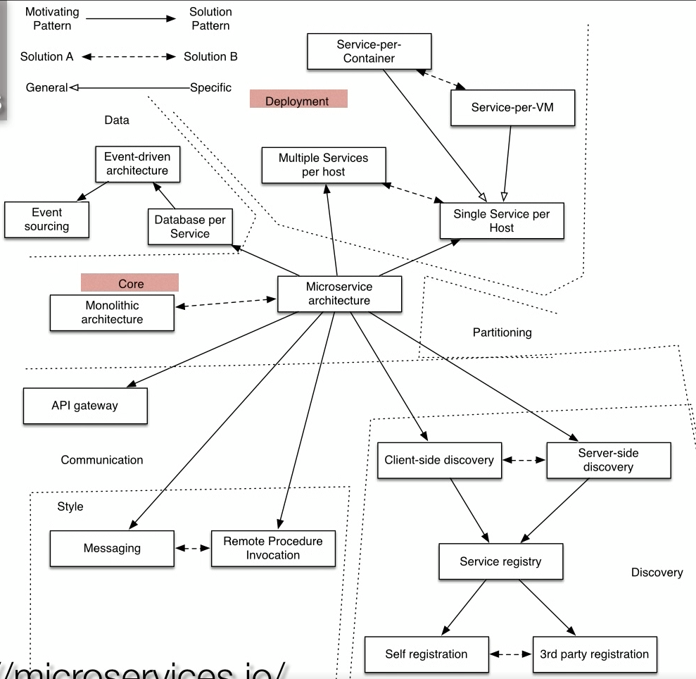
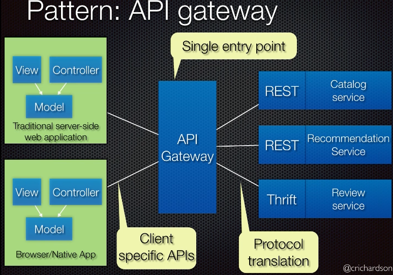
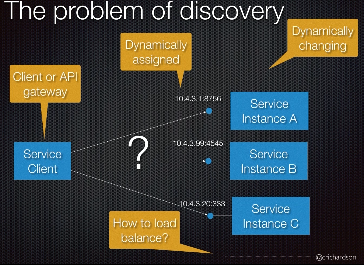
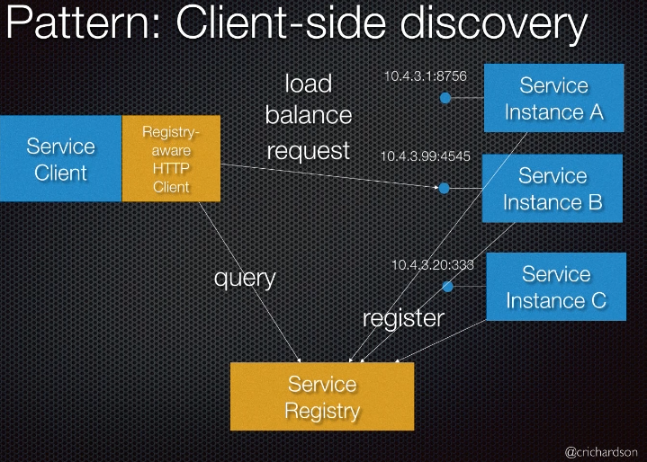
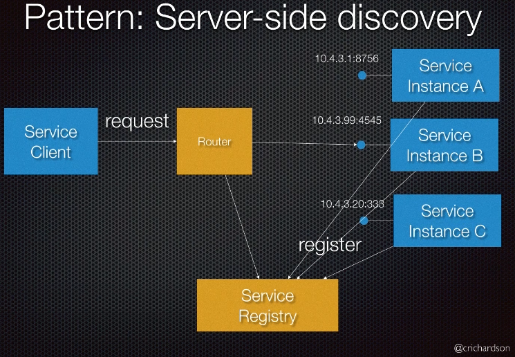
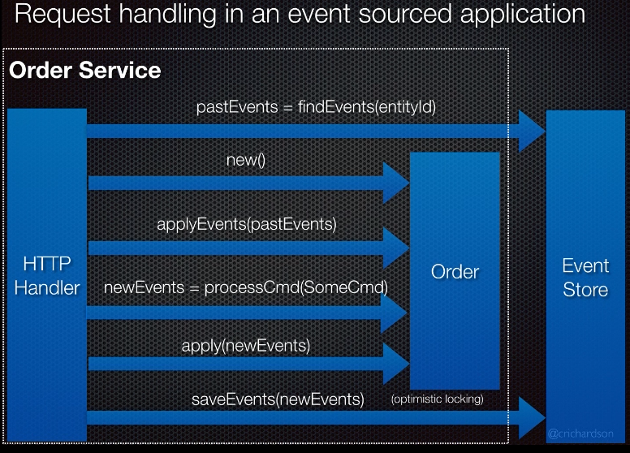
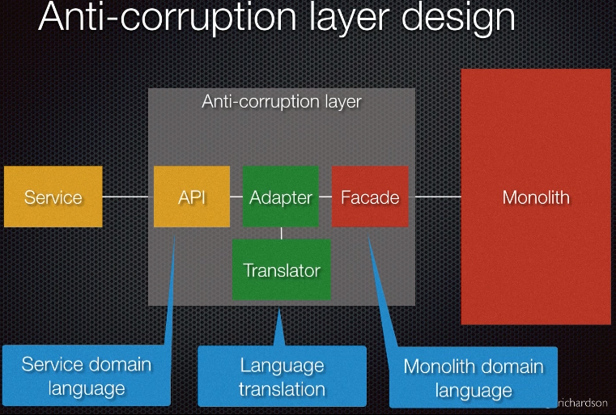

# Monolith Architecture
collapsed:: true
	- ## Downsides of monolith
	  collapsed:: true
		- Vulnerable to the perils of coupling—specifically, implementation and deployment coupling
		- __Delivery contention__: Different developers wanting to change the same piece of code, different teams wanting to push functionality live at different times (or delay deployments)
		- Agile development and deployment becomes impossible
		- Intimidates developers and becomes a monumental effort for new team members to learn the system
		- Some part of the app can be memory-intensive and other parts IO/CPU-intensive. (Cryptography/graphics) Challenging to find optimal hardware to run the system. (EC2 and other cloud providers provide t-shirt sized instances which are either good for memory/IO/CPU intensive cases.) Monoliths running on general-purpose is not optimal.
		- IDE and app start up time is slow
		- Requires front-end and back-end co-ordination before change or deployment
		- Requires lot term commitment to the technology stack - rewriting a part of the system to adapt a newer technology to solve a certain problem in a better way is impossible. If the system is built on a legacy technology that no one wants to work with, it becomes harder to find resources
	- ## Advantages of monolith
	  collapsed:: true
		- simpler deployment topology
		- simpler developer workflows; and monitoring, troubleshooting, and activities like end-to-end testing
		- simplify code reuse
		- > A monolithic architecture is a choice, and a valid one at that. It may not be the right choice in all circumstances, any more than microservices are—but it’s a choice nonetheless
	- ## Types of Monolith
	  collapsed:: true
		- __Single Process Monolith__
			- all of the code is deployed as a single process.
			- You may have multiple instances of this process for robustness or scaling reasons, but fundamentally all the code is packed into a single process.
		- __Modular Monolith__
			- As a subset of the single process monolith, the modular monolith is a variation. The single process consists of separate modules, each of which can be worked on independently, but which still need to be combined for deployment.
			- If the module boundaries are well defined, it can allow for a high degree of parallel working, but sidesteps the challenges of the more distributed microservice architecture along with much simpler deployment concerns.
			- One of the challenges of a modular monolith is that the database tends to lack the decomposition.
		- __Distributed Monolith__
			- _A distributed system is one in which the failure of a computer you didn’t even know existed can render your own computer unusable. - Leslie Lamport_
			- A distributed monolith is a system that consists of multiple services, but for whatever reason the entire system has to be deployed together.
			- Distributed monoliths have all the disadvantages of a distributed system, and the disadvantages of a single-process monolith, without having enough upsides of either.
			- Distributed monoliths typically emerge in an environment where not enough focus was placed on concepts like information hiding and cohesion of business functionality, leading instead to highly coupled architectures in which changes ripple across service boundaries, and seemingly innocent changes that appear to be local in scope break other parts of the system.
	- ## Coupling and Cohesion
	  collapsed:: true
		- > A structure is stable if cohesion is high, and coupling is low. -- Larry Constantine
		- Coupling speaks to how changing one thing requires a change in another;
		- Cohesion talks to how we group related code. These concepts are directly linked.
		- Cohesion and coupling are concerns regarding modular software, and what is microservice architecture other than modules that communicate via networks and can be independently deployed?
		- __Cohesion__: code that changes together, stays together. So the functionality must be grouped in such a way that we can make changes in as few places as possible.
		- __Coupling__: The more things are “coupled”, the more they have to change together.
			- __Implementation coupling__
				- A is coupled to B in terms of how B is implemented—when the implementation of B changes, A also changes.
				- Another helpful trick to use when it comes to defining a service interface is _“outside-in” thinking_. Drive the service interface by thinking of things from the point of the service consumers first, and then work out how to implement that service contract. With _“outside-in” thinking_, you instead first ask, “What do my service consumers need?”
			- __Temporal Coupling__
				- is primarily a runtime concern that generally speaks to one of the key challenges of synchronous calls in a distributed environment.
				- This could be avoided by using caches or by using an asynchronous transport to send the requests.
			- __Deployment Coupling__
				- When everything is expected to be deployed together, then we have deployment coupling.
				- There are several ways to reduce this risk: Change only what needs to be changed. Smaller releases make for less risk.
- # Microservices Architecture
  collapsed:: true
	- > Microservices are independently deployable services modeled around a business domain.
	- > _"Microservices buy you options.”_ They have a cost, and you have to decide if the cost is worth the options you want to take up
	- ## What are microservices?
		- collapsed:: true
		  *  __Independent deployability__
			- make a change to a microservice and deploy it into a production environment without having to deploy anything else. To guarantee this,
				-  Ensure the services are loosely-coupled.
				-  Define well-defined, stable contracts between services.
				-  Do not share databases.
		- collapsed:: true
		  *  __Modeled around a business domain__
			-  Make cross-service changes as infrequently as possible.
			-  Changes in functionality are primarily about changes in business functionality. But in Figure 1-1 (typical 3-tier architecture) our business functionality is in effect spread across all three tiers, increasing the chance that a change in functionality will cross layers. This is an architecture in which we have high cohesion of related technology, but low cohesion of business functionality. Instead change how we group code - choose cohesion of business functionality, rather than technology.
			-  Our business domain becomes the primary force driving our system architecture, hopefully making it easier to make changes, and making it easier for us to organize our teams around our business domain.
		- collapsed:: true
		  *  __Own their own data__
			-  If one service wants to access data held by another service, then it should go and ask that service for the data it needs. This gives the service the ability to decide what is shared and what is hidden. It also allows the service to map from internal implementation details, which can change for various arbitrary reasons, to a more stable public contract, ensuring stable service interfaces.
			- Having stable interfaces between services is essential if we want independent deployability—if the interface a service exposes keeps changing, this will have a ripple effect causing other services to need to change as well.
			- we want to think of our services as end-to-end slices of business functionality, that where appropriate encapsulate the UI, application logic, and data storage. This is because we want to reduce the effort needed to change business-related functionality. The encapsulation of data and behavior in this way gives us high cohesion of business functionality.
	- ## Definition of a Stateless Service
	  collapsed:: true
		- Not a cache or a database
		- only stores frequently accessed metadata/configuration
		- no instance affinity (i.e., a client request should be served by any instance)
		- loss of a node is a non-event
	- ## Advantages of microservices
	  collapsed:: true
		- independent nature of deployments
		- scale and robustness
		- mix and match technology
		- teams can work in parallel
	- ## Challenges of microservices
	  collapsed:: true
		- There are 4 categories of problems:
			- Dependency
			- Scale
			- Variance
			- Change
		- Activities that are relatively simple with a single-process monolith, like transactions, are much more difficult. So difficult, you will likely have to ditch transactions, and the safety they bring, in exchange for other sorts of techniques (which unfortunately have very different trade-offs).
		- These problems may not appear initially, but over time, as your system grows, you’ll likely hit most, if not all, of them.
		- ### Dependency
		  collapsed:: true
			- **Problem**
				- Distributed microservices over the network means multiple point of failures for the application
					- n/w latency, n/w failure, n/w congestion, h/w failure, bad deployment on dependency services
					- cascading failures
			- **Solution**
				- Use a tool like Netflix Hystrix that manages latency and fault tolerance
					- fallback option (e.g., when a service is down, return a static message)
					- circuit breaker (e.g., if the service is down, don't call it repeatedly)
				- Testing via FIT (Fault Injection Testing)
					- Synthetic transactions, test as if the service is down without taking it down, squeeze testing
				- eventual consistency
				- multi-region failover
		- ### 2. Scale
		  collapsed:: true
			- **Problem**
				- How to scale stateless services
			- **Solution**
				- Auto-scaling group
					- scales seamlessly during node failures or traffic spikes or DDoS attacks or performance bugs in code
					- cost effective
				- Caching
					- Using a distributed cache like EVCache (wrapper on memcached)
				- Redundancy (avoid SPoF)
				- Partitioned workloads
				- failure-driven design
				- Chaos under load
		- ### Variance
		  collapsed:: true
			- **Problem**
				- Variety in architecture. More varience = more challenges, due to the complexity of the environment to manage
				- Operation drift (unintentional but it does happen)
					- Drift over the time: Over time configuration settings like alert threshold can vary, and so is timeout, retry, throughput, etc.
					- Drift across microservices: best practices are not uniformly followed by all the services
				- Polyglot
					- Cost of variance.
						- Insight into CPU/memory usage inside a VM or container
						- VM base image fragmentation
						- Node management is complex
						- library/platform duplication (e.g., a piece of code is duplicated in different languages)
						- learning curve
			- **Solution**
				- Operation drift
					- continuous learning and automation
				- Polyglot (intentional) - polygot persistence, polygot programming
					- Raise awareness of costs
					- Constraint centralized support
					- allowing only a finite set of people to work on these
					- seek reusable solutions
		- ### Change
		  collapsed:: true
			- **Problem**
				- How to achieve velocity with confidence?
			- **Solution**
				- Using a global cloud management and delivery platform like Spinnaker
				- Integrating best practices and production ready checklists into the pipeline as and when needed.
					- red/black pipelines
					- automated canaries
					- staged deployments
					- squeeze tests, etc.
- # Domain Modeling
  collapsed:: true
	- Modeling services around a business domain has significant advantages for our microservice architecture. Domain-Driven Design (DDD) is one of the best ways to come up with that model.
	- ## Aggregates
	  collapsed:: true
		- {:height 501, :width 533}
		- {:height 272, :width 667}
		- Consider an aggregate as a representation of a real domain concept—think of something like an Order, Invoice, Stock Item, etc.
		- Aggregates typically have a life cycle around them, which opens them up to being implemented as a state machine.
		- We want to treat aggregates as self-contained units; we want to ensure that the code that handles the state transitions of an aggregate are grouped together, along with the state itself.
		- When thinking about aggregates and microservices, a single microservice will handle the life cycle and data storage of one or more different types of aggregates.
		- If functionality in another service wants to change one of these aggregates, it needs to either directly request a change in that aggregate, or else have the aggregate itself react to other things in the system to initiate its own state transitions.
		- The key thing to understand here is that if an outside party requests a state transition in an aggregate, the aggregate can say no. You ideally want to implement your aggregates in such a way that illegal state transitions are impossible.
		- Aggregates can have relationships with other aggregates.
	- ## Bounded Contexts
	  collapsed:: true
		- From an implementation point of view, bounded contexts contain one or more aggregates. Some aggregates may be exposed outside the bounded context; others may be hidden internally.
		- As with aggregates, bounded contexts may have relationships with other bounded contexts—when mapped to services, these dependencies become inter-service dependencies.
		- The aggregate is a self-contained state machine that focuses on a single domain concept in our system, with the bounded context representing a collection of associated aggregates, again with an explicit interface to the wider world.
		- Both can therefore work well as service boundaries. When starting out, reduce the number of services you work with. As a result, you should probably target services that encompass entire bounded contexts. As you find your feet, and decide to break these services into smaller services, look to split them around aggregate boundaries.
- # Microservices Patterns
  collapsed:: true
	- 
	- 3 axes of decomposition from “The Art of Scalability” book.
	- ## Decomposition Patterns
	  collapsed:: true
		- ### Functional decomposition
		  collapsed:: true
			- **Pros** of decomposing/partitioning to separate services
				- Change to one service can happen independently and does not impact other services
				- Development and deployment can happen more frequently
				- Different components with conflicting resource requirements can scale easily (in-memory databases that require lot of memory can run on its own machine, while the cryptography/graphics like CPU-intensive modules can run separately)
				- Improved fault isolation - e.g., a memory-leak in one of the components does not impact the entire application
				- Eliminates long term commitment to a single tech stack - leading to modular system, polyglot and multi-framework system
			- **Cons**
				- Complexity of developing a distributed system - inter process communication (RPC, REST, gRPC…), partial failures (other services is slow in responding)
				- Multiple databases and transaction management e.g., eventual consistency
				- Complexity of testing a distributed system  - end-to-end testing (https://martinfowler.com/articles/microservice-testing )
				- Complexity of testing a distributed system - need a lot of automation, virtualized/containerized infrastructure, continuous deployment
				- Co-ordinating feature development that span across services
				- Potential risk of excessive network hops
				- Runtime overhead (nano-service anti-pattern) - e.g., overhead of running JVM which contains only 100 lines of code
				- Tracing requests and performance measurement
		- ### Partitioning Strategies
		  collapsed:: true
			- Goals of partitioning: parallelize development and deployment
			- Strategies
				- Partition by noun e.g., Catalog service for products
				- Partition by verb e.g., Check out
				- Single Responsibility Principle
				- Subdomain
			- Anti-pattern: Distributed monolith
				- Partition your app so that most changes only impact a single service.
				- Common Closure Principle - Components that change for the same reason should be packaged together
			- Anti-pattern: Nano-services
	- ## Deployment Patterns
	  collapsed:: true
		- collapsed:: true
		  * __Multiple services per host__
			- Cons
				- Less isolation
				- Difficult to limit resource utilization
				- Risk of dependency version conflict
		- __Single service per host__
		- __Service per VM__
			- Pros
				- Leverage cloud infrastructure to auto scale and load balance
			- Cons
				- Less efficient resource utilization
				- Slow build and deployment: due to image size and start up time
			- http://packer.io, http://boxfuse.com - for automation of VM image creation
		- __Service per container__
	- ## Communication Patterns
	  collapsed:: true
		- Issues
			- How do clients interact with the services?
			- How do services within the system interact with each other?
		- ### API Gateway
		  collapsed:: true
			- 
			- Forces
				- Different clients (UI, Mobile) need different data
				- The number of service instances and their locations changes dynamically
				- Web unfriendly protocols e.g., Thrift, Protocol Buffer
			- API Gateway is responsible for tasks such as load balancing, caching, access control, API metering, monitoring, etc.
			- Pros
				- Single point of entry
				- Provides optimal API for client specific (UI, Android, iOS, TV)
				- Protocol translation (http > thrift)
				- Insulates clients from partition and discovery
			- Cons
				- Increased complexity - the API gateway is yet another highly available component that must developed, deployed and managed
				- Increased response time due to additional network hop
		- ### Inter Process Communication
		  collapsed:: true
			- Netflix approach for Partial failures - when one of the service is slow or not responding. How to deal with it? (Netflix https://medium.com/netflix-techblog/fault-tolerance-in-a-high-volume-distributed-system-91ab4faae74a )
				- Network timeouts: never wait for response indefinitely
				- Invoke remote services via a bounded thread pool
				- Use the circuit breaker pattern e.g., 5 failures in a row indicates the service is down
				- Netflix Hystrix addresses all this
		- ## Service Discovery
		  collapsed:: true
			- 
			- Forces
				- Client or API gateway needs to know where the service is running
				- The destination host and IP are dynamically assigned and bound to change
				- How to load balance
			- ### Client-service discovery
			  collapsed:: true
				- When a service comes up, it publishes its location to a central Service Registry. Client queries the registry and load balances the request to appropriate service. e.g., Netflix Eureka (Service Registry) and Ribbon
				- Pros
					- Less network hop since client talks to service directly
				- Cons
					- couples the client to the service registry
					- Need to implement client-side load balancing and routing logic in multiple languages and frameworks
					- Service Registry is another moving part which must be highly available
				- 
			- ### Server-side discovery
			  collapsed:: true
				- 
				- Same as client-side, however the client calls a router instead of Service registry. Router talks to Service Registry and then load balances the requests to service instances. e.g., AWS Load Balancer, Nginx, Kubernetes
				- Pros
					- Simple client code
					- Built-in to cloud/container environments
				- Cons
					- Limited to load balancing algorithms provided by router
					- Other cons as client-side
			- ### Service Registration
			  collapsed:: true
				- Forces
					- Service instances must be registered in the registry during start up and unregistered during shutdown
					- Service instances that crash must be unregistered from the registry
					- Service instances that are running but incapable of serving must be unregistered from the registry
					- Who registers the service in the registry - service or 3rd-party?
				- Service Registries: Netflix Eureka, Apache Zookeeper, Hashicorp Consul, CoreOS etcd
				- **Self Registration**
					- Service registers and unregisters itself. e.g., Netflix Eureka Java client, Zookeeper Java client
					- Pros
						- Simple
					- Cons
						- Couples services to the registry
						- Must implement registration logic in multiple languages/framework
						- Service might lack the self awareness to unregister itself
				- **3rd party Registration**
					- Registrar detects somehow the service is up, registers to the Service Registry, periodically performs health check on the service and sends heartbeat to service registry,
					- Examples
						- AWS Autoscaling groups - automatically register/unregister EC2 instances with ELB
						- Kubernetes/Marathon
						- Netflix Eureka Prana
						- Container Buddy - runs as services’ parent process in docker container, registers services with Consul or etcd
		- ## Cross-cutting concerns
		  collapsed:: true
			- ### Microservice Chassis Framework
			  collapsed:: true
				- **Cross-cutting concerns**
					- External configuration
						- N/w location of external services, credentials, etc.
						- Different for different environments
					- Logging
					- Service discovery
					- Circuit breaker
					- Health checks - e.g., health check URL
					- Metrics - e.g., reporting to metrics collection service
				- **Chassis Framework**
					- Unlike monolith, all the above needs to be repeated multiple times
					- Microservice Chassis is a framework that actually takes care of the above e.g., Spring Boot + Spring Cloud, DropWizard
	- ## Data Management
	  collapsed:: true
		- Problem of Data Consistency
			- What is the database architecture for a micro service architecture - shared db or db per service?
			- Each microservices has its own data store in order to ensure loose coupling. However, this makes it difficult to maintain consistency across multiple services. You can't, for example, use distributed transactions (2PC).
		- Forces
			- Some business transactions must update data owned by other services
			- Some queries must join data owned by other services
			- Different services have different storage requirements
			- Database must sometimes be sharded or replicated for scalability
			- Services must be loosely coupled so that they can be developed and deployed independently
		- ### Pattern: Shared Database
		  collapsed:: true
			- Pros
				- Simple
				- Local transactions only
			- Cons
				- Services are tightly coupled
				- lack of encapsulation
				- Single db may not satisfy the data access requirements of multiple services
		- ### Pattern: Database per service
		  collapsed:: true
			- Private tables: services owns a set of tables that are private to that service
			- Private schema: services owns a schema that are private to that service
			- Private server: services owns a db server that are private to that service
			- Pros
				- Escapes the constraints of relational databases
				- Services are loosely coupled
			- Cons
				- Implementing transactions and queries that spans multiple services is challenging
				- More complex to operate
			- Problem of 2-phase commit
				- Guaranteed atomicity but
					- Need a distributed transaction manager
					- DB and message broker must support 2PC
					- Impacts reliability
		- ### Pattern: Transaction log tailing
		  collapsed:: true
			- After a record is written to db, other services can read/tail off of it
			- [LinkedIn Databus](https://github.com/linkedin/databus), Mongodb (Oplog), AWS Dynamodb supports streaming of CRUD operations
			- Pros
				- No 2PC
				- No app changes needed
				- Guaranteed to be accurate
			- Cons
				- Immature
				- Specific to a database solution
				- Low level DB changes rather than business level events = need to reverse-engineer domain events
		- ### Pattern: Event Sourcing
		  collapsed:: true
			- 
			- Radically different approach in storing business entities and writing business logic. Most notably, the way in which business entities are stored in a data store is not by storing the current state but by storing the sequence of state-changing events (immutable events). Whenever the current state is needed, you reload past events and compute them.
			- For each business entity (aggregate)
				- Identify (state changing) domain events
				- Define Event classes
			- > Event Store = database + message broker
				- Store entities as a series of state changing immutable events, and reconstruct the current state by replaying them.
				- Functionality of event store
					- Save aggregate events
					- Get aggregate events
					- Subscribe to events
				- Implementations: Greg Young’s https://eventstore.org and https://eventuate.io
			- Pros
				- Solves data consistency issues in a microservice/nosql based architecture
				- Reliable event publishing
				- Eliminate O/R mapping problem
				- Enables temporal querying, audit logs
			- Cons
				- Requires application rewrite
				- Must detect and handle duplicate events
					- Idempotent event handlers
					- Or track most recent event and ignore older ones
				- Querying the event store can be challenging
					- Some queries can be complex or inefficient e.g., accounts with balance > X
					- Event store might support only look up of events by entity id
					- Must use CQRS to handle queries => app must handle eventual consistent data. CQRS subscribes to events and stores a denormalized view of the event data that is easier to query
			- #### Event Sourcing Design
			  collapsed:: true
				- There are 3 types of components in an event sourcing design
					- Data model
					- Domain events
					- Commands
				- **1) Designing data model**
					- DDD vocabulary
						- Entities - something that is identified by an id and persisted in db. e.g., Order, Product, Account
						- Value Object - e.g., Money, Date
						- Service
						- Repository
						- Aggregates
							- A transaction can update only a single aggregate. Scope of a transaction is really one aggregate. This fits well for NoSQL databases as well where you can update only one thing/document/aggregate at a time. Hence NoSQL databases are also called as aggregate-oriented databases.
							- Aggregate granularity
								- if you want you could combine Customer, Order and Product as a single aggregate, it will be work and be more consistent, but won’t scale well.
								- however, if they are treated as separate aggregates, then scalability and user experience improves since they can be stored and worked on in parallel.
				- **2) Designing Domain Events**
					- Domain events store the information about the following
						- Event Metadata e.g., time of the event, sender Id, etc.
						- Required by aggregate e.g., productId,
						- Enrichment - useful for consumers e.g., price, product name
				- **3) Designing Commands**
					- Created by a service from incoming request
					- Processed by an aggregate
					- Immutable
			- __CQRS (Command-Query Responsibility Seggregation) pattern__
			- 
			- In relational databases, query a customer and his order details is joining those 2 tables. However, event store only supports primary key look ups.
			- Rather a single component performing both command and query operation, handle them separately.
			- Command side would handle HTTP POST, DELETE, PUT methods.
			- Query side would handle GET methods. Query side stores only more materialized or denormalized views of the data.
			- View Store could be MongoDb, GraphDb, ElasticSearch, AWS DynamoDb etc. depending on the data needs
			- Pros
				- Necessary in an event sourcing architecture
				- Separation of concerns
				- Supports multiple denormalized views either as documents or graphs
				- Improved scalability and performance
			- Cons
				- Complexity
				- Code duplication
				- Replication lag/eventually consistent views
- # Monolith to Microservices Strategies
	- Following are some of the strategies to refactor monoliths to microservices
	- Strangler Application (Martin Fowler)
	- ## 1: Stop digging
	  collapsed:: true
		- If you find yourself in a hole, stop digging. https://en.wikipedia.org/wiki/Law_of_holes
		- Stop adding new features to the monolith, and create a new service.
		- Router routes the traffic to old / new service
		- Build an anti-corruption layer to bridge/glue between monolith and new service
	- ## 2: Split front-end and back-end
	- ## 3: Extract services
	  collapsed:: true
		- Extract a service, introduce anti-corruption layer and repeat
		- What to extract?
			- Have the ideal partitioned architecture in mind: Partition by noun/verb?
			- Start with modules that gives the highest ROI
				- Velocity -> frequently updated
				- Scalability -> Conflicting resource requirements e.g., cryptograph code that requires more CPU
			- Look for components that interact with each only via messaging. Since they are loosely coupled they could live in separate services.
	- ## 4: Anti-corruption layer
	  collapsed:: true
		- First appeared in DDD book by Eric Evans
		- Goal is to prevent your legacy system from polluting the pristine new code
		- 
- # References
	- Chris Richardson's talk on "Event-Driven Microservices" in Safari
	- Book: Monolith to Microservices by Sam Newman