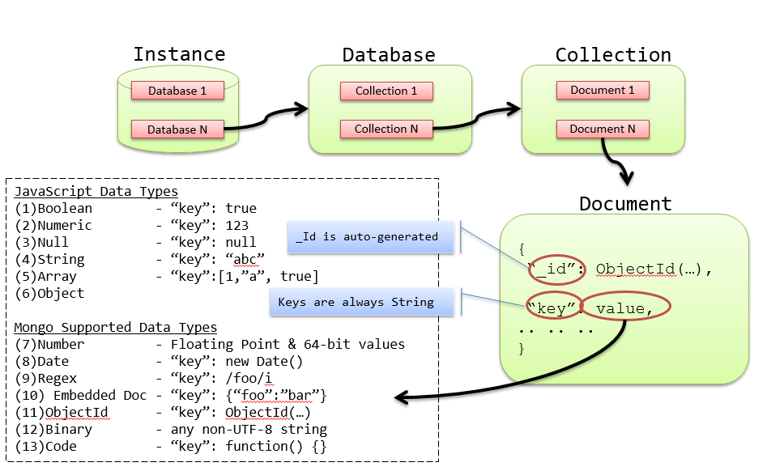

# Overview
collapsed:: true
	- 
	- Max BSON document size = 16MB
	- Mongo Shell is a Node.js REPL
	- `updateMany` operation is NOT atomic, nor isolated.
	- `findAndModify` operation returns the modified record (before update snapshot by default)
	- Connection string: `mongodb+srv://fizalmohamed:<password>@cluster0.wuo7uim.mongodb.net/?retryWrites=true&w=majority`
	-
	- supports consistency. Supports ACID properties at single-document level only.
	- offers atomic read-write operations such as incrementing a value and deep querying of nested document structures.
	- Using JavaScript for its query language, MongoDB supports both simple queries and complex mapreduce jobs.
	- It is a document database, which allows data to persist in a nested state, and importantly, it can query that nested data in an ad hoc fashion. It enforces no schema.
	- Mongo is a JSON document database (though technically data is stored in a binary form of JSON known as BSON).
	- Every object/document has a unique incrementing numeric primary key called ObjectId. The ObjectId is always 12 bytes, composed of a timestamp, client machine ID, client process ID, and a 3-byte incremented counter.
	- In Mongo you can construct ad hoc queries by field values, ranges, or a combination of criteria.
	- MongoDB provides several of the best data structures for indexing, such as the classic B-tree, and other additions such as two-dimensional and spherical GeoSpatial indexes.
	- What makes Mongo special in the realm of document stores is its ability to scale across several servers, by replicating (copying data to other servers) or sharding collections (splitting a collection into pieces) and performing queries in parallel. Both promote availability.
	- A Namespace in Mongo is a combination of database name and collection name. e.g., `db.plans`
	- GridFS
- # Index
  collapsed:: true
	- By default, MongoDB creates an index on the document’s _id primary key field.
	- All user-defined indexes are secondary indexes. Any field can be used for a secondary index, including fields within
	  arrays
	- Order of columns on the compound index matters
	- Use `explain()` to analyze the performance of a query. `db.plans.find({"clientId" : "014222"}).explain()`
	- Use the `hint()` method to tell Mongo which index to use.
	- ## Index Types
	  collapsed:: true
		- **Unique indexes**
		- **Array indexes** - For fields that contain an array, each array value is stored as a separate index entry. There is no special syntax for array indexes though.
		- **Sparse Indexes** - Sparse indexes only contain entries for documents that contain the specified field. Because MongoDB’s allows the data model to vary from one document to another, it is common for some fields to be present only in a subset of all documents. Sparse indexes allow for smaller, more efficient indexes when fields are not present in all documents.
		- **Hash Indexes** - Hash indexes compute a hash of the value of a field and index the hashed value. The primary use of this index is to enable hash-based sharding, a simple and uniform distribution of documents across shards
		- **Capped collection** - max size of the collection is defined at the time of creation and cannot be altered; an existing regular collection can be converted to capped collection, but not vice versa. It behaves like a circular queue and maintains the insertion order; cannot be sharded.
		- **Tailable cursors** - like `tail -f` command, tailable cursors can be defined on capped collections.
		- **TTL indexes** - Time-to-Live indexes are customizable capped collections where time-out for each document is defined by the user. A common use is in applications that maintain a rolling window of history (e.g., most recent 100 days) for user actions such as clickstreams.
		- **Full-text indexes** - give you the ability to search text quickly, as well as provide built-in support for multi-language stemming and stop words; only index string data; allows searching multiple fields with custom weightage specified (from default 1 to 1 billion); You can create a full-text index on all string fields in a document by creating an index on `$**`
		- **Geo-spatial indexes**
			- Types of Geospatial queries : *intersection*, *within*, and *nearness*; Geospatial queries using *intersection* and *within* functions do not require an index, whereas *near* function does.
			- **2dsphere index** - for surface-of-the-earth-type maps; allows you to specify points, lines, and polygons in GeoJSON format. A point is given by a two-element array, representing [longitude, latitude]; A line by an array of Points; A polygon in the same way as lines but with different 'type'; Sample queries: restaurants in given coordinates, restaurants near given coordinates.
			- **2d index** - for flat maps, video game maps and time series data; "2d" indexes assume a perfectly flat surface, instead of a sphere; can only store points;
	- ## Rules of Index Design
	  collapsed:: true
		- Any fields that will be queried by *equality- should occur first in the index definition.
		- Fields used to sort should occur next in the index definition. If multiple fields are being sorted (such as (last_name, first_name), then they should occur in the same order in the index definition.
		- Fields that are queried by range should occur last in the index definition.
- # Profiling
  collapsed:: true
	- MongoDB provides a range of logging and monitoring tools to ensure collections are appropriately indexed and queries are tuned.
	- The MongoDB Database Profiler is most commonly used during load testing and debugging, logging all database operations or only those events whose duration exceeds a configurable threshold (the default is 100ms).
	- Profiling data is stored in a capped collection
- # Data modelling
	- **One-to-Many**
	  collapsed:: true
		- 2 choices
			- Embed or reference
			- choose b/w "one" and "many"
				- Embed on the side of the most queried collection
		- Prefer embedding over referencing (*in spite of duplicates*)
			- for simplicity
			- or when there is a small number of referenced documents as all related information is kept together
		- Prefer referencing when the associated documents are not always needed with the most often queried documents
	- **Tips**
	  collapsed:: true
		- Embed for speed, reference for integrity
		- Embed "point-in-time" data. E.g., the address fields in an order document. You don’t want a user’s past orders to change if he updates his profile.
		- Do not embed fields that have unbound growth. e.g, comments on a blog article.
		- Store embedded information in arrays for anonymous access. Subdocument should be used only when you know and will always know the name of the field that you are accessing.
	- ## Embedded document model
	  collapsed:: true
		- **Pros**
			- Locality. Less disk seeks and hence faster.
			- Atomicity & Isolation during mutant operations.
		- **Cons**
			- Querying for all sub-documents with a matching condition would return the sub-document along with parent as well. Major drawback of this approach is that we get back much more data than we actually need.
			- For example, in a document like below, querying for all the comments by John would return all the books where John has commented, not just the comments. Also it is not possible to sort or limit the comments returned.
			- ``` json
			  {
			    "book": "Head First Java",
			    "text": "This is a book",
			    "comments": [
			      {"author": "John", "text": "..."},
			      {"author": "Jack", "text": "..."},
			      {"author": "John", "text": "..."},
			    ]
			  }
			  ```
		- Embedding carries significant penalties with it:
			- The larger a document is, the more RAM it uses.
			- Growing documents must eventually be copied to larger spaces. As you append to the large document, eventually MongoDB is  going to need to move the document to an area with more space available. This movement, when it happens, significantly  slows update performance
			- MongoDB documents have a hard size limit of 16 MB.
		- When to use
			- If your application’s query pattern is well-known and data tends to be accessed in only one way, an embedded approach works well.
	- ## Referenced document model
	  collapsed:: true
		- Pros
			- Flexibility
			- Best fit for many-to-many relationships.
		- Cons
			- No joins hence needs multiple network calls to retrieve complete data.
		- There is no multi-document transaction in Mongodb. In other words, unlike SQL you cannot edit/delete multiple documents in a single transaction. If a business entity spans across multiple collections, you cannot alter that entity from different collections atomically.
		- When to use
			- If your application may query data in many different ways, or you are not able to anticipate the patterns in which data may be queried, a more “normalized” approach may be better.
			- Another factor that may weigh in favor of a more normalized model using document references is when you have one-to-many relationships with very high or unpredictable *arity*.
- # Transaction Management
  collapsed:: true
	- MongoDB write operations are atomic at the document level – including the ability to update embedded arrays and sub-documents atomically
	- Document-level atomicity in MongoDB ensures complete isolation as a document is updated
	- Multi-document transaction
	  collapsed:: true
		- `findAndModify()` command that allows a document to be updated atomically and returned in the same round trip. Will this work for multiple documents?
		- For situations that require multi-document transactions, you can implement two-phase commit in your application to provide support for these kinds of multi-document updates. Using [2 Phase Commit](https://docs.mongodb.com/manual/tutorial/perform-two-phase-commits/) ensures that data is consistent and, in case of an error, the state that preceded the transaction is recoverable. During the procedure, however, documents can represent pending data and states.
	- Maintaining Strong Consistency - By default, MongoDB directs all read operations to primary servers, ensuring strong consistency. Also, by default any reads from secondary servers within a MongoDB replica set will be eventually consistent – much like master / slave replication in relational databases.
	- Write concerns - The write concern is configured in the driver and is highly granular – it can be set per-operation, per-collection or for the entire database.
	- Journals
		- Before applying a change to the database – whether it is a write operation or an index modification – MongoDB writes the change operation to the journal. If a server failure occurs or MongoDB encounters an error before it can write the changes from the journal to the database, the journaled operation can be reapplied, thereby maintaining a consistent state when the server is recovered.
	- #### Why no transactions?
	  collapsed:: true
		- MongoDB was designed from the ground up to be easy to scale to multiple distributed servers. Two of the biggest problems in distributed database design are distributed join operations and distributed transactions.
		- Both of these operations are complex to implement, and can yield poor performance or even downtime in the event that a server becomes unreachable. By “punting” on these problems and not supporting
	- #### Write concern
	  collapsed:: true
		- MongoDB has a configurable write concern. This capability allows you to balance the importance of guaranteeing that all writes are fully recorded in the database with the speed of the insert.
		- For example, if you issue writes to MongoDB and do not require that the database issue any response, the write operations will return very fast (since the application needs to wait for a response from the database) but you cannot be certain that all writes succeeded. Conversely, if you require that MongoDB acknowledge every write operation, the database will not return as quickly but you can be certain that every item will be present in the database.
		- The proper write concern is often an application-specific decision, and depends on the reporting requirements and uses of your analytics application.
		- **Insert acknowledgement**
			- By setting w=0, you do not require that MongoDB acknowledge receipt of the insert. `db.events.insert(event, w=0)`
		- **Journal write acknowledgement**
			- If you want to ensure that MongoDB not only acknowledges receipt of a write operation but also commits the write operation to the on-disk journal before returning successfully to the application, you can use the j=True option: `db.events.insert(event, j=True)`.
			- MongoDB uses an on-disk journal file to persist data before writing the updates back to the “regular” data files. Since journal writes are significantly slower than in-memory updates (which are, in turn, much slower than “regular” data file updates), MongoDB batches up journal writes into “group commits” that occur every 100 ms unless overridden in your server settings. What this means for the application developer is that, on average, any individual writes with j=True will take around 50 ms to complete, which is generally even more time than it would take to replicate the data to another server.
		- **Replication acknowledgement**
			- To acknowledge that the data has replicated to two members of the replica set before returning: `db.events.insert(event, w=2)`.
- # Aggregation Framework
  collapsed:: true
	- a pipeline that processes a stream of documents through several building blocks: filtering, projecting, grouping, sorting, limiting, and skipping.
	- `aggregate()` function returns an array of result documents; cannot write to a collection;
	- **Pipeline Operations** - Each operator receives a stream of documents, does some type of transformation on these documents, and then passes on the results of the transformation. If it is the last pipeline operator, these results are returned to the client. Otherwise, the results are streamed to the next operator as input.
- # Sharding
  collapsed:: true
	- One of the central reasons for Mongo to exist is to safely and quickly handle very large datasets. The clearest method of achieving this is through horizontal sharding by value ranges—or just sharding for brevity. Rather than a single server hosting all values in a collection, some range of values are split (or in other words, sharded) onto other servers. For example, in our phone numbers collection, we may put all phone numbers less than 1-500-000-0000 onto Mongo server A and put numbers greater than or equal to 1-500-000-0001 onto a server B. Mongo makes this easier by autosharding, managing this division for you.
	- Diff b/w sharding and replication? Replication copies the exact copy of a data in multiple servers. Sharding stores different subset of data across multiple servers.
	- Shard - server participating in a sharded cluster.
	- mongos - routing process which sits in front of all the shards. Apps connect to this process.
	- Sharding is enabled at database level.
	- Shard key - when you enable sharding you choose a field or two that MongoDb uses to break up data. To even create a shard key, the field(s) must be indexed. Before sharding, the collection is essentially a single chunk. Sharding splits this into smaller chunks based on the shard key
	- **Shard**
	  collapsed:: true
		- A shard is one or more servers in a cluster that are responsible for some subset of the data. For instance, if we had a cluster that contained 1,000,000 documents representing a website’s users, one shard might contain information about 200,000 of the users.
		- A shard can consist of many servers. If there is more than one server in a shard, each server has an identical copy of the subset of data (Figure 2-1). In production, a shard will usually be a replica set.
		- Single range shards will lead to cascade effect and lot of data movement when rebalancing is required. Mongo uses multi-range shards to avoid this.
	- **Chunk**
	  collapsed:: true
		- A range of data is called a **chunk**. When we split a chunk’s range into two ranges, it becomes two chunks.
		- 200MB is the max size of a chunk by default. This is because moving data is expensive: it takes a lot of time, uses system resources, and can add a significant amount of network traffic.
	- **Shard Key**
	  collapsed:: true
		- You also cannot change the value of a shard key (with, for example, a $set). The only way to give a document a new shard key is to remove the document, change the shard key’s value on the client side, and reinsert it.
		- A document belongs in a chunk if and only if its shard key value is in that chunk’s range.
	- **mongos**
	  collapsed:: true
		- `mongos` is a special routing process that sits in front of your cluster and looks like an ordinary `mongod` server to anything that connects to it. It forwards requests to the correct server or servers in the cluster, then assembles their responses and sends them back to the client. This makes it so that, in general, a client does not need to know that they’re talking to a cluster rather than a single server.
		- *Targeted Query* - While querying, if the query has the shard key, mongos determines which shard/shards contains the data and hits those directly. This is called a targeted query.
		- *Spewed Query* - If the shard key is absent in the query, mongos must send the query to all of the shards. This can be less efficient than targeted queries, but not necessarily. A “spewed” query that accesses a few indexed documents in RAM will perform much better than a targeted query that has to access data from disk across many shards (a targeted query could hit every shard, too)
	- Anatomy of a cluster
	  collapsed:: true
		- A MongoDB cluster basically consists of three types of processes:
			- the shards for actually storing data,
			- the mongos processes for routing requests to the correct data, and
			- the config servers, for keeping track of the cluster’s state
	- Replica Sets
	  collapsed:: true
		- Mongo was built to scale out, not to run stand-alone. It was built for data consistency and partition tolerance, but sharding data has a cost: if one part of a collection is lost, the whole thing is compromised. What good is querying against a collection of countries that contains only the western hemisphere? Mongo deals with this implicit sharding weakness in a simple manner: duplication. You should rarely run a single Mongo instance in production but rather replicate the stored data across multiple services.
	- Partition
		- Cluster has 1 or more shards
		- Shard has 1 or more servers
		- Shard has 1 or more chunks
		- Chunk has 1 range
	- Replica set
	- #### Setup
	  collapsed:: true
		- To add configuration servers to router - `$mongos --configdb cfg-server1,cfg-server2,cfg-server3`
			- All administration on a cluster is done through mongos
			- Configuration servers can be 1, 2 or 3 max. They only have configuration information and no data.
		- To add a shard - `db.runCommand({"addShard" : "server:port", "name": "shardName"})`
			- Run this from the admin db
		- To enable sharding at database level - `db.adminCommand({"enableSharding" : "dbname"})`
		- To enable sharding at collection level - `db.adminCommand({"shardCollection" : "dbname.collectionName", key : {"field1" : 1, "field2" : 1}}`
			- If we are sharding a collection with data in it, the data must have an index on the shard key.
			- All documents must have a value for the shard key, too (and the value cannot be null). After you’ve sharded the collection, you can insert documents with a null shard key value.
		- To remove a shard out of the cluster - `db.runCommand({removeShard : "shardName"})`
			- Moves all of the information that was on this shard to other shards before it can remove this shard.
			- Moving data from shard to shard is pretty slow.
	- #### Shard Keys
		- Bad shard keys
		  collapsed:: true
			- Low cardinality keys
				- e.g., by continent names, by country names, etc.
				- When the volume increases in one of these shards, there is no way to horizontally scale because there are only limited number of key values.
				- If you are tempted to use low-cardinality shard key because you query on that field a lot, use a compound shard key (a shard key with two fields) and make sure that the second field has lots of different values MongoDB can use for splitting.
				- If a key has N values in a collection, you can only have N chunks and, therefore, N shards.
			- Ascending Shard key
				- e.g., timestamps, ObjectIds, auto-incrementing primary keys
				- Everything will always be added to the “last” chunk, meaning everything will be added to one shard. This shard key gives you a single, undistributable hot spot.
				- If the key’s values trend towards infinity, you will have this problem.
			- Random Shard Key
		- Good shard keys - Ideally, your shard key should have two characteristics:
		  collapsed:: true
			- Insertions are *balanced- between shards
			- Most queries can be *routed- to a subset of the shards to be satisfied
	- #### Sharding concerns
	  collapsed:: true
		- In a sharded environment, the limitations on the maximum insertion rate are:
			- The number of shards in the cluster
			- The shard key you choose
		- Limitations
			- Cannot guarantee uniqueness on any key other than the shard key
			- count of collection may return incorrect numbers
- # Query samples
	- Query to count documents
		- ```js
		  db.movies.find().countDocuments()
		  db.movies.find().countDocuments({runtime: {$gt:10}})
		  ```
	- Query movies longer than 10 mins in genres Action or Drama. Return only movie title, length, genres and award details. Sort them by title, limit to 3 movies
		- ```js
		  db.movies
		    .find({runtime: {$gt: 10}, genres: {$in: ['Action', 'Drama']}})
		    .projection({title:1, runtime:1, genres:1, "awards.text": 1})
		    .sort({title:1})
		    .limit(3)
		  ```
		- or combine `find` and `projection` like this
		- ```js
		  db.movies
		    .find({runtime: {$gt: 10}, genres: {$in: ['Action', 'Drama']}}, {title:1, runtime:1, genres:1, "awards.text": 1})
		    .sort({title:1})
		    .limit(3)
		  ```
	- Aggregate
		- ```js
		  db.planets.aggregate( 
		    [
		      { $match: { 'orderFromSun': {$gt: 1} } } , 
		      { $group: { 
		         _id: 'hasRings', 
		         count: { $sum: 1 }
		      } }
		    ]
		  )
		  ```
	- Aggregate by array values
		- `$project` determines the output document shape. In the example below, only `_id` and`genres` are picked from the original document. (*`0` excludes the field, `1` includes*). You can also create a new field using $project
		- ```js
		  # find top 5 genres with most movies released after 1979, sorted in descending order
		  [
		    {
		      $match:{ year: { $gte: 1979 }},
		    },
		    {
		      $project: { _id: 0, genres: 1},
		    },
		    {
		      $unwind: { path: "$genres"},
		    },
		    {
		      $group:
		        {
		          _id: "$genres",
		          totalMovies: { $sum: 1},
		        },
		    },
		    {
		      $sort: { totalMovies: 1}
		    },
		    { 
		      $limit: 5
		    }
		  ]
		  ```
	- Aggregate using `$set`
		- adds a new field '*commentLength*' in the query output along with the original document fields
		- ```js
		  $set{
		    {
		    	commentLength: {$strLenBytes : "$text"}
		    }
		  }
		  ```
	- Transactions
		- ```js
		  const session = db.getMongo().startSession()
		  
		  session.startTransaction()
		  
		  const account = session.getDatabase('< add database name here>').getCollection('<add collection name here>')
		  
		  //Add database operations like .updateOne() here
		  
		  session.commitTransaction()
		  ```
- # Resources
	- [Atlas Home](https://cloud.mongodb.com/v2#/org/63f0e1f0f207e452b3b3e605/)
	- [Mongo Playground](https://mongoplayground.net/)
	- [MongoDB Documentation](https://www.mongodb.com/docs/)
		- [Bulk data import](https://www.mongodb.com/developer/products/mongodb/mongoimport-guide/)
		- [Building with Patterns - Summary](https://www.mongodb.com/blog/post/building-with-patterns-a-summary)
		- [Schema design anti-patterns](https://www.mongodb.com/developer/products/mongodb/schema-design-anti-pattern-summary/?_ga=2.262460684.1454884607.1676679069-513362065.1674664669)
		  :LOGBOOK:
		  CLOCK: [2023-02-21 Tue 16:02:23]--[2023-02-21 Tue 18:06:00] =>  02:03:37
		  :END:
		- [M320 MongoDB Data Modeling](https://learn.mongodb.com/courses/m320-mongodb-data-modeling)
		  :LOGBOOK:
		  CLOCK: [2023-02-21 Tue 18:51:30]
		  :END:
		- [Indexes](https://www.mongodb.com/docs/manual/indexes/)
		- [Schema Validation](https://docs.mongodb.com/manual/core/schema-validation)
		  :LOGBOOK:
		  CLOCK: [2023-02-21 Tue 16:13:35]
		  :END:
		- [Join queries](https://www.mongodb.com/docs/manual/reference/operator/aggregation/lookup)
		  :LOGBOOK:
		  CLOCK: [2023-02-21 Tue 16:02:21]--[2023-02-21 Tue 16:07:08] =>  00:04:47
		  :END:
		- TODO [Performance Best Practices](https://www.mongodb.com/blog/post/performance-best-practices-mongodb-data-modeling-and-memory-sizing?_ga=2.35967648.1454884607.1676679069-513362065.1674664669)
	- [MongoDB Java Developer Certification](https://learn.mongodb.com/learning-paths/mongodb-java-developer-path)
		- [MongoDB Associate Developer Exam Java](https://learn.mongodb.com/courses/mongodb-associate-developer-exam-java)
			- ✔️ MongoDB Overview and document model
			- CRUD
			- ✔️ Indexes
			- ✔️ Data Modelling
			- Tools
			- ✔️ Drivers
		- [Associate Developer Exam Guide](https://learn.mongodb.com/learn/course/mongodb-associate-developer-exam-study-guide/main/associate-dba-exam-study-guide?client=customer)
		- [Associate Developer Exam Practice Questions](https://learn.mongodb.com/courses/associate-developer-java-practice-questions)
- **Open questions**
	- how CI/CD works for DB changes? e.g., creating indices, etc.
	- Collibra - metadata modeling tool
	- Learn more on these topics by playing practically
		- edgeGram tokenization (search index mappings - autocomplete index)
		- topN in aggregate query
		- Play with `$out` in aggregate query
		- json schema for collection document validation?
		- if collection has a nested doc `obj.a`, will the index on field `obj` scan `obj.a` also?