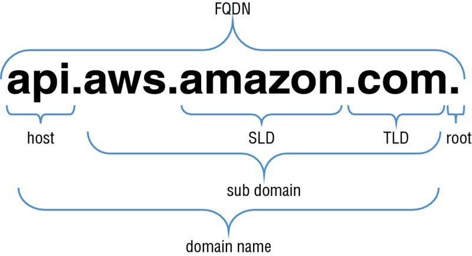
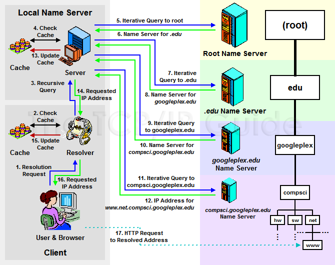
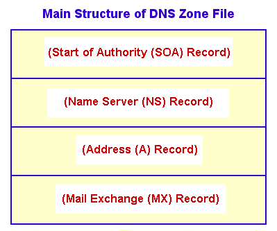

# ACLs
	- TBD
- # DHCP (Dynamic Host Configuration Protocol)
	- TBD
- # DNS servers
  id:: 6524bbc1-06a1-493f-a89d-7da276bc7bfa
  collapsed:: true
	- 
	- DNS is a globally-distributed service used to translate human-readable names (e.g., www.amazon.com) into the IP addresses
	- DNS uses a hierarchical name structure, and different levels in the hierarchy are each separated with a dot (.).
	- Consider the domain names `www.amazon.com` and `aws.amazon.com`. `com` is the Top-Level Domain (TLD) and `amazon` is the Second-Level Domain (SLD). There can be any number of lower levels (e.g., `www` and `aws`) below the SLD.
	- collapsed:: true
	  * __Top-Level Domains (TLDs)__
		- A TLD is the most general part of the domain. The TLD is the farthest portion to the right (as separated by a dot).
		- Common TLDs are .com, .net, .org, .gov, .edu, and .io.
		- TLDs are at the top of the hierarchy in terms of domain names.
		- Certain parties are given management control over TLDs by the ___Internet Corporation for Assigned Names and Numbers (ICANN)___. These parties can then distribute domain names under the TLD, usually through a domain registrar. These domains are registered with the ___Network Information Center (InterNIC)___, a service of ICANN, which enforces the uniqueness of domain names across the Internet.
		- Each domain name becomes registered in a central database, known as the ___WhoIS___ database.
	- collapsed:: true
	  * __IP Addresses__
		- IPv4 addresses consist of 4 sets of numbers separated by a dot, with each set having up to three digits.
		- IPv6 has an address space of 128 bits, which allows for 340,282,366,920,938,463,463,374,607,431,768,211,456, or 340 undecillion, unique addresses. For human beings, this number is difficult to imagine, so consider this: If each IPv4 address were one grain of sand, you would have enough addresses to fill approximately one dump truck with sand. If each IPv6 address were one grain of sand, you would have enough sand to equal the approximate size of the sun.
	- collapsed:: true
	  * __Hosts__
		- Within a domain, the domain owner can define individual hosts, which refer to separate computers or services accessible through a domain. For instance, API access through an API host `api.example.com` or FTP access with a host definition `ftp.example.com`.
		- The host names can be arbitrary if they are unique for the domain.
	- collapsed:: true
	  * __Fully Qualified Domain Name (FQDN)__
		- Domain locations in a DNS can be relative to one another and, as such, can be somewhat ambiguous.
		- A FQDN, also referred to as an absolute domain name, specifies a domain’s location in relation to the absolute root of the DNS. This means that the FQDN specifies each parent domain including the TLD.
		- A proper FQDN ends with a dot, indicating the root of the DNS hierarchy. For example, `mail.amazon.com.` is an FQDN. Sometimes, software that calls for an FQDN does not require the ending dot, but it is required to conform to ICANN standards.
	- collapsed:: true
	  * __Name Servers__
		- A name server is a computer designated to translate domain names into IP addresses.
		- Because the total number of domain translations is too much for any one server, each server may redirect requests to other name servers or delegate responsibility for the subset of subdomains for which they are responsible.
		- Name servers can be authoritative, meaning that they give answers to queries about domains under their control. Otherwise, they may point to other servers or serve cached copies of other name servers’ data.
	- collapsed:: true
	  * __Root Servers__
		- At the top of the DNS system are root servers.
		- Root servers handle requests for information about TLDs.
		- ICANN delegates the control of these servers to various organizations. (_As of this writing, there are 13 root servers in operation_).
		- In order to handle the incredible volume of resolutions that happen every day, these root servers are mirrored and replicated. When requests are made to a certain root server, the request will be routed to the nearest mirror of that root server.
		- The root servers won’t actually know where the domain is hosted. They will, however, be able to direct the requester to the name servers that handle the specifically-requested TLD.
	- collapsed:: true
	  * __Resolving Name Servers__
		- Resolving Name Server acts as an intermediary for a user, caching previous query results to improve speed and providing the addresses of appropriate root servers to resolve new requests.
		- A user will usually have a few resolving name servers configured on their computer system.
		- The resolving name servers are typically provided by an Internet Service Provider (ISP) or other organization.
		- There are several public resolving DNS servers that you can query. These can be configured in your computer either automatically or manually.
	- collapsed:: true
	  * __Zone Files__
		- A zone file is a simple text file that contains the mappings between domain names and IP addresses.
		- Zone files reside in name servers and generally define the resources available under a specific domain, or the place where one can go to get that information.
		- The more zone files that a name server has, the more requests it will be able to answer authoritatively.
		- Most requests to the average name server, however, are for domains that are not in the local zone file.
		- A zone file describes a DNS zone, which is a subset of the entire DNS.
		- Zone files are generally used to configure a single domain, and they can contain a number of records that define where resources are for the domain in question.
		- `$ORIGIN` directive
			- this parameter defines what authoritative records the zone governs.
			- is a parameter equal to the zone’s highest level of authority by default. If a zone file is used to configure the `example.com` domain, the `$ORIGIN` would be set to `example.com`.
			- is either configured at the top of the zone file or defined in the DNS server’s configuration file that references the zone file.
		- `$TTL` directive
			- configures the default Time to Live (TTL) value for resource records in the zone.
			- This value defines the length of time that previously queried results are available to a caching name server before they expire.
	- collapsed:: true
	  * __TLD Name Registrars__
		- Domain name registrars ensure the domain names are unique.
		- A domain name registrar is an organization or commercial entity that manages the reservation of Internet domain names.
		- A domain name registrar must be accredited by a ___generic TLD (gTLD) registry___ and/or a ___country code TLD (ccTLD) registry___. The management is done in accordance with the guidelines of the designated domain name registries.
	- ## DNS Resolution Steps
	  collapsed:: true
		- 
		- When you type a domain name into your browser, your computer first checks its ___host file___ to see if it has that domain name stored locally.
		- If it does not, it will check its ___DNS cache___ to see if you have visited the site before.
		- If it does not, it will contact the ___Resolution Name Server (RNS)___ to see if you have visited the site before.
		- If it still does not, it will contact a ___DNS root server___.
		- Root server will check its zone files for a listing that matches the domain name, say `www.wikipedia.org`, but it will not find one in its records. It will instead find a record for the `.org` TLD and give the requesting entity (RNS) the address of the ___name server___ responsible for `.org` addresses.
		- _TLD Servers_: After a root server returns the IP address of the appropriate name server that is responsible for the TLD of a request, the requester then sends a new request to that address. The name server searches its zone files for a `www.wikipedia.org` listing, it will not find one in its records. However, it will find a listing for the IP address of the name server responsible for `wikipedia.org`. This is getting much closer to the correct IP address.
		- _Domain-Level Name Servers_:
			- At this point, the requester has the IP address of the name server that is responsible for knowing the actual IP address of the resource.
			- It sends a new request to the name server asking, once again, if it can resolve `www.wikipedia.org`.
			- The name server checks its zone files, and it finds a zone file associated with `wikipedia.org`.
			- Inside of this file, there is a record that contains the IP address for the `.www` host. The name server returns the final address to the requester.
	- ## Record Types
	  collapsed:: true
		- {:height 479, :width 530}
		  
		- Each zone file contains records which is a single mapping between a resource and a name.
		- These can map a domain name to an IP address or define resources for the domain, such as name servers or mail servers.
		- __Start of Authority (SOA) Record__
			- A SOA record is mandatory in all zone files, and it identifies the base DNS information about the domain.
			- Each zone contains a single SOA record.
			- The SOA record stores information about the following:
				- The name of the DNS server for that zone
				- The administrator of the zone
				- The current version of the data file
				- The number of seconds that a secondary name server should wait
					- before checking for updates
					- before retrying a failed zone transfer
				- The maximum number of seconds that a secondary name server can use data before it must either be refreshed or expire
				- The default TTL value (in seconds) for resource records in the zone
		- __A and AAAA__
			- Both types of address records map a host to an IP address.
			- The _A_ record is used to map a host to an IPv4 IP address, while _AAAA_ records are used to map a host to an IPv6 address.
		- __Canonical Name (CNAME)__
			- A CNAME record is a type of resource record in the DNS that defines an alias for the CNAME for your server (the domain name defined in an A or AAAA record).
		- __Mail Exchange (MX)__
			- MX records are used to define the mail servers used for a domain and ensure that email messages are routed correctly.
			- The MX record should point to a host defined by an A or AAAA record and not one defined by a CNAME.
		- __Name Server (NS)__
			- Name Server (NS) records are used by TLD servers to direct traffic to the DNS server that contains the authoritative DNS records.
		- __Pointer (PTR)__
			- A Pointer (PTR) record is essentially the reverse of an _A record_.
			- PTR records map an IP address to a DNS name, and they are mainly used to check if the server name is associated with the IP address from where the connection was initiated.
		- __Sender Policy Framework (SPF)__
			- SPF records are used by mail servers to combat spam.
			- An SPF record tells a mail server what IP addresses are authorized to send an email from your domain name. For example, if you wanted to ensure that only your mail server sends emails from your company’s domain, such as `example.com`, you would create an SPF record with the IP address of your mail server. That way, an email sent from your domain, such as `marketing@example.com`, would need to have an originating IP address of your company mail server in order to be accepted. This prevents people from spoofing emails from your domain name.
		- __Text (TXT)__
			- TXT records are used to hold text information. This record provides the ability to associate some arbitrary and unformatted text with a host or other name, such as human readable information about a server, network, data center, and other accounting information.
		- __Service (SRV)__
			- A SRV record is a specification of data in the DNS defining the location (the host name and port number) of servers for specified services.
			- The idea behind SRV is that, given a domain name (e.g., example.com) and a service name (e.g., HTTP), a DNS query may be issued to find the host name that provides such a service for the domain, which may or may not be within the domain.
	- ## CNAME record
	  collapsed:: true
		- CNAME stands for Canonical Name. CNAME records can be used to alias one name to another.
		- For example, if you have a server where you keep all of your documents online, it might normally be accessed through `docs.example.com`. You may also want to access it through `documents.example.com`. One way to make this possible is to add a CNAME record that points `documents.example.com` to `docs.example.com`. When someone visits `documents.example.com` they will see the exact same content as `docs.example.com`.
- # Subnet
  collapsed:: true
	- ## Why Subnet?
	  collapsed:: true
		- Why not just use separate IP addresses and not worry so much about splitting things into smaller chunks. Unfortunately, we quickly run into problems when an IP address in NY needs to talk to another IP address in Sydney. It’s practically impossible for the Internet routers to maintain an entire table of everyone’s individual IP address; the lookup process would be painfully slow, and the amount of memory needed to maintain such a massive list would be impractical.
		- Instead, most routers have a much smaller table that contains groups of networks, or _subnets_. These network routing tables provide routers with the information they need to pass the packets along in the right direction.
		- _Telephone Switch_: This is similar to old-school telephone systems. The entire county is split into “area codes,” and we have individual “exchanges” within a single area code. If 212-555-1212 needs to call 305-555-1212, the telephone switches in the 212 area code simply pass the request to the telephone switches in the 305 area code. The 212 phone switches don’t have a list of every possible phone number in the 305 area, and they don’t need to. The 305 phone switches transfer the call to the local 555 exchange, which then can direct the phone call to the local 1212 number.
		- One of the address ranges RFC 1918 provides is `10.0.0.0/8`, which means practically over a 16 million different IP addresses are available in a single network. It is not practical for any network to manage this, so the network must be split up into smaller chunks called _subnets_
		- ### Subnet Masks
			- A subnet mask of `255.255.255.0` means 255 IP addresses are available for the private network.
			- Subnet mask `255.255.0.0` means `255 * 255 = 65,025` addresses are available.
			- Unlike IP addresses, the subnet mask isn’t transmitted in the traffic flow between devices. The subnet mask is only used by the local computer, and it’s only used to help the computer determine which network it belongs to.
			  * In the below example, the combination of our computer’s IP address of 10.25.6.25 with our subnet mask of 255.255.255.0 means that the computer knows to send local network traffic directly to devices in the IP address range of 10.25.6.1 through 10.25.6.255. If the IP address of a destination computer is ever anything different, the computer knows that the traffic needs to leave the local network and it will send the packet to the default gateway of 10.25.6.1. The default gateway is IP address of the local router, and the router has the all of the information it needs to send packets from the local network to other networks (and perhaps the Internet).
			- ```http
			  IP address: 10.25.6.55
			  Subnet mask: 255.255.255.0
			  Default gateway: 10.25.6.1
			  ```
			- Why not just use separate IP addresses and not worry so much about splitting things into smaller chunks. Unfortunately, we quickly run into problems when an IP address in NY needs to talk to another IP address in Sydney. It’s practically impossible for the Internet routers to maintain an entire table of everyone’s individual IP address; the lookup process would be painfully slow, and the amount of memory needed to maintain such a massive list would be impractical.
	- ## CIDR (Classless Inter-Domain Routing)
		- An IPV4 address is a combination of 4 octets _XX.XX.XX.XX_ where XX is a number between 0 and 255 (2 ^ 8 = 256). A combination 8 x 4 = 32 bits.
		- To express a range of addresses between 10.0.0.0 and 10.0.0.255 in CIDR format is _10.0.0.0/24_.  This denotes that the first 24 of the 32 bits remain constant, but the last 8 can be incremented.
		- In early days of Internet, subnets were classified as Class A, B and C. This practice has been antiquated since 1993.
		- As the Internet grew, we realized that we would need a more precise way to split our networks apart. Hence the move from class-based addressing to a more flexible addressing scheme called _Classless Inter-Domain Routing_ (pronounced cider)
		- CIDR makes it easy to store IP ranges in routers and DNS servers
	- ## NAT (Network Address Translation)
		- When you get Internet connection for first from your ISP, they provide you with a single IP address.
		- Internally, you can create a private network with multiple private IP addresses. Practically the private network can have as many IPs as they'd like.
		- RFC 1918 provides blocks of private IPs that can be used for internal or private networks. These private IP addresses are not routable over the Internet. Even if you tried, the Internet routers would drop your packets immediately.
		- One of the address ranges RFC 1918 provides is `10.0.0.0/8`, which means practically over a 16 million different IP addresses are available in a single network. It is not practical
		- NAT is used to translate internal IP addresses to a single public IP address.
- # Network Interfaces
	- NIC - Network Interface Card
- # NTP (Network Time Protocol) Servers
- # NetBIOS Name Servers
- # References
  
  * [CIDR Explained](http://software77.net/cidr-101.html)
  * [What's with all this Subnet stuff](http://www.professormesser.com/after-class/whats-with-all-this-subnet-stuff/)