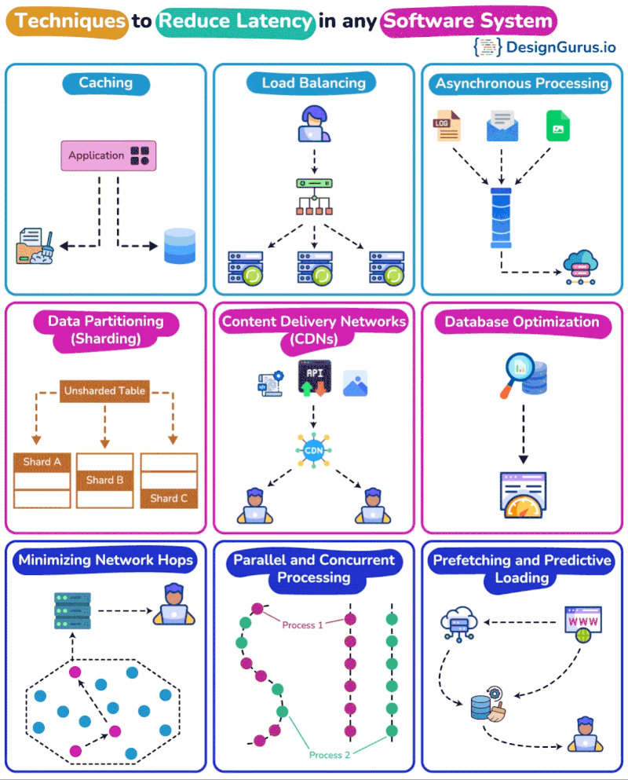
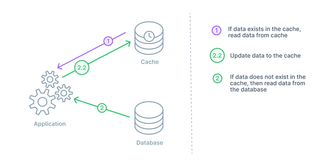
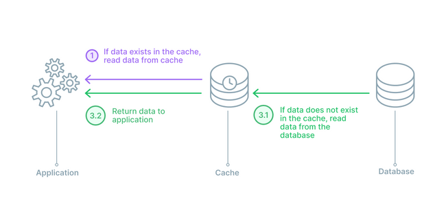
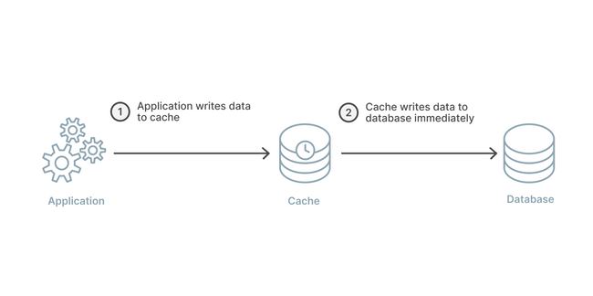
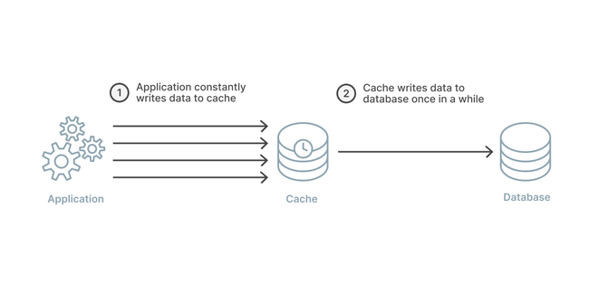
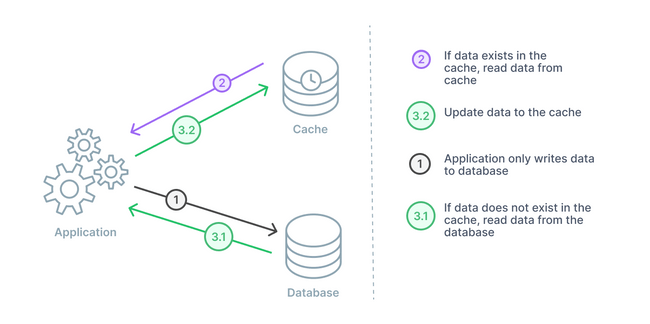

- {:height 732, :width 581}
- # Caching
  background-color:: yellow
	- ## Locality of References
	  background-color:: pink
		- ### Principle of Locality
		  background-color:: blue
			- Programs tend to reuse data and instructions near those they have used recently, or that were recently referenced themselves
			- ```java Locality Example
			  int sum = 0;
			  
			  for(int i=0; i < a.length; i++){
			  sum += a[i];
			  }
			  
			  return sum;
			  ```
		- ### Temporal Locality
		  background-color:: blue
			- The concept that a resource that is referenced at one point in time will be  referenced again sometime in the near future.
			- In code above, referencing `sum` in each iteration is an example of temporal locality
		- ### Spatial Locality
		  background-color:: blue
			- The concept that likelihood of referencing a resource is higher if a resource near it was just referenced.
			- In code above, referencing array elements in succession is an example of spatial locality
	- ## Caching Solutions
		- Ehcache
		- Guava Caching library
		- JCache (specification?)
		- Distributed Caches
		- Aerospike
		- Coherence (Oracle)
		- Gemfire
		- Gigaspaces
		- Hazelcast
		- HBase with BlockCache
		- Memcached
		- Redis
		- Riak (key-value database)
	-
	- For the remote cache layer, there are two possibilities:
		- A distributed memory caching solution, such as Memcached, to distribute the data across a cluster of nodes.
		- Setting up HBase so that all needed records can be found in the block cache. The block cache keeps data blocks in memory, where they can be quickly accessed.
	- ## Distributed memory caching
		- A distributed memory solution like Memcached or Redis simplifies the work of developing a caching layer. In terms of performance, though, it still requires a network call, which can add a small amount of latency to requests. Request times should be in the 1- to 4-millisecond range. The advantage of this solution over the partitioning solution is that we won’t have downtime when nodes fail, since we can set up the caching solution with multiple replicas of the data.
		- The only downside of the distributed memory caching solution is you need enough memory to hold everything. If you can’t hold everything, you need an additional persistence store backed by disk, which means an additional call when data is not in memory. As we’ll see shortly, if we’re utilizing HBase, there is little reason why you need to also use a distributed caching solution.
	- ## Caching Strategies
		- https://www.prisma.io/dataguide/managing-databases/introduction-database-caching
		- **Cache-aside pattern**
		  logseq.order-list-type:: number
			- Cache-aside is a caching architecture that positions the cache outside of the regular path between application and database. In this arrangement, the application will fetch data from the cache if it is available there. If the data is not in the cache, the application will issue a separate query to the original data source to fetch the data and then write that data to the cache for subsequent queries. The minimal crossover between the cache and backing data source allows this architecture to be resilient against unavailable caches. Cache-aside is well-suited for read-heavy workloads.
			- 
		- **Read-through pattern**
		  logseq.order-list-type:: number
			- Read-through caching is a caching strategy where the cache is deployed in the path to the backing data source. The application sends all read queries directly to the cache. If the cache contains the requested item, it is returned immediately. It the cache request misses, the cache fetches the data from the backing database in order to return the items to the client and add it to the cache for future queries. In this architecture, the application continues to send all write queries directly to the backing database.
			- 
		- **Write-through pattern**
		  logseq.order-list-type:: number
			- Write-around caching is a caching pattern where write queries are sent to the backing database directly rather than written to the cache first. Because any items in the cache related to the update will be now be stale, this method requires a way to invalidate the cache results for those items for subsequent reads. This technique is almost always combined with a policy for cache reads to control read behavior. This approach is best for data that is read infrequently once written or updated.
			- 
		- **Write-back pattern**
		  logseq.order-list-type:: number
			- Write-back caching is a caching method where write queries are sent to the cache instead of the backing database. The cache then periodically bundles the write operations and sends them to the backing database for persistence. This is a modification of the write-through caching approach to reduce strain caused by high throughput write operations at the cost of less durability in the event of a crash. This ensures that all recently written data is immediately available to applications without additional operations, but can result in data loss if the cache crashes before it's able to persist writes to the database.
			- 
		- **Writer-around pattern**
		  logseq.order-list-type:: number
			- Write-through caching is a caching pattern where the application writes changes directly to the cache instead of the backing database. The cache then immediately forwards the new data to the backing database for persistence. This strategy minimizes the risk of data loss in the event of a cache crash while ensuring that read operations have access to all new data. In high write scenarios, it may make sense to transition to write-back caching to prevent straining the backing database.
			- 
			-