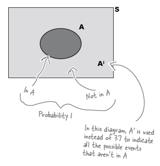
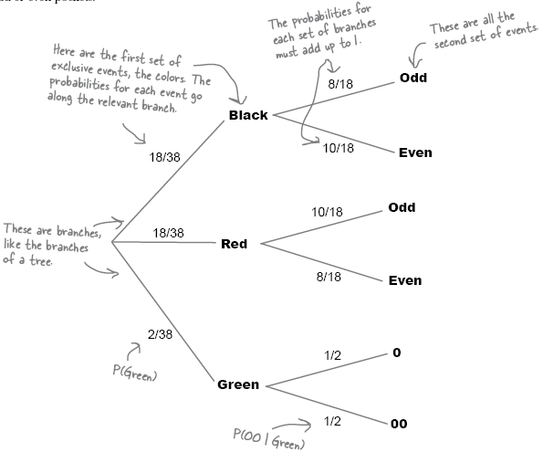

## Basics
	- Event - An outcome or occurrence that has a probability assigned to it
	- Probability = (# of ways of winning) / (# of possible outcomes)
	  
	  $$P(A) = n(A) / n(S)$$
	- where
		- $P(A)$ - probability of event A occurring
		- $n(A)$ - number of ways of getting an event A
		- $n(S)$ - number of possible outcomes
		- $S$ - **possibility space** or **sample space**
	- ## Complementary event
	- $A^I$ is the complementary event of $A$. It is the probability that event $A$ does not occur.
	  
	  $$P(A) + P(A^I) = 1$$
	- Use Venn Diagram to easily visualize the probabilities 
	  
	  
	- Adding probabilities - e.g., what is the probability of getting an even number in a dice throw.
	  
	  $$
	  \begin{split}
	  P(even) = P(2) + P(4) + P(6) \\
	        = 1/6 + 1/6 + 1/6 \\
	        = 3/6 = 0.5
	  \end{split}
	  $$
- ## Exclusive events
	- If two events are mutually exclusive, only one of the two can occur. e.g., head and tail in a coin toss
- ## Intersection events
	- If two events intersect, it’s possible they can occur simultaneously. e.g., black and even number in roulette
	- I$\bigcap$tersection
		- $A \bigcap B$ refers to intersection between event A and B.
		- Think of this symbol as **and**
	- $\bigcup$nion
		- $A \bigcup B$ refers to union of A and B. It includes all of the elements in A and B.
		- Think of this symbol as **or**
		  * If $A \bigcup B = 1$, then A and B are said to be **exhaustive**. Between them, they make up the whole of S.
		  
		  $$ P(A \bigcup B) = P(A) + P(B) + P(A \bigcap B) $$
		  
		  where
		  $$ 
		  P(A \bigcup B) = P(A or B) \\
		  P(A \bigcap B) = P(A and B)
		  $$
	- Mutually exclusive events have no elements in common with each other, so $$P(A \bigcap B) = 0$$
- ## Conditional probabilities
	- 
	- measures the probability of an event occurring relative to another occurring.
	- it is represented by pipe symbol. e.g., $$P(A|B)$$ is read as the probability of A given that wek now B has happened.
	- conditional probabilities are best visualized using probability tree.
	  
	  $$P(A | B) = \frac {P(A \bigcap B)} {P(B)}$$
	  
	  which means
	  
	  $$P(A \bigcap B) = P(A | B) \times P(B) $$