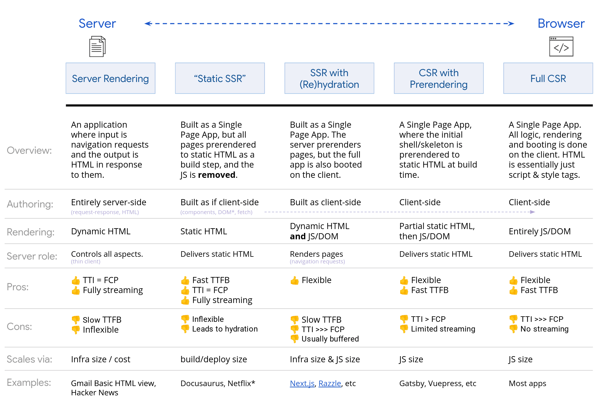

# React
background-color:: yellow
	- ## Basics
	  background-color:: red
		- React caching - https://freecontent.manning.com/caching-in-react
		- https://web.dev/explore/learn-core-web-vitals
		- https://web.dev/articles/user-centric-performance-metrics
		- https://www.patterns.dev/react
		- ### Diff b/w Module Dependency Tree and Render Tree?
		- ### Diff b/w CSR, SSR, SSG
		  background-color:: pink
			- **SSG (Static Site Generation):** React code is run when you build your application, and the generated output is static.
			- **SSR (Server-Side Rendering):** React code runs at the time it is requested. The result may be cached for future requests.
			- **CSR (Client-Side Rendering):** React code is delivered to the browser, which generates content that is inserted into the DOM.
		- ### Rendering Options and Tradeoffs
		  background-color:: pink
			- 
- # Next.js
  background-color:: yellow
	- > Next.js version 15 used at the time of this writing
	- > **Bookmarks**
	  https://app-router.vercel.app/
	- ## Basics
	  background-color:: red
		- Next uses **file-system routing** - meaning you can use the folders and files to defines routes
		- Next comes with built-in support for TypeScript and ESLint
		- **Module Path Aliases** (e.g., `import {Button} from '@/components/button'`) are replaced by **Absolute Paths** (e.g., `import {Button} from '../../../components/button'`)
		- `<Image>` optimizations - Auto-resize on viewport, Blur-up placeholders and async fetching, CLS (Cumulative Layout Shift)
		- `<Link>` provides client-side navigation and prefetching. `<Link>` is faster than `<a>` tag
		- ### App Routing
		  background-color:: pink
		  collapsed:: true
			- https://nextjs.org/docs/app/getting-started/project-structure#organizing-your-project
			- Root level directory `app` is called the **App Router**
				- Nested folders under it define the route structure. e.g., directory `/src/app/navigation/header` is routed to path `/navigation/header`
				- A route is made publicly accessible only if the files `page.tsx` or `route.tsx` are added to the route segment (i.e., the directory).
				- Even when new routes are added, only the contents returned by `page.tsx` or `route.tsx` are sent to client.
		- ### React Server Components
		  background-color:: pink
			- **React Server Components (RSC)** is a new paradigm
				- > **Bookmarks**
				  https://joshwcomeau.com/react/server-components
				  Demystifying React Server Components - https://demystifying-rsc.vercel.app
				  Rendering on the Web - https://web.dev/articles/rendering-on-the-web
				  Understanding React Server Components - https://vercel.com/blog/understanding-react-server-components
				  RSC Parser/Visualizer - https://rsc-parser.vercel.app
				  Creating devtools for React Server Components - https://alvar.dev/blog/creating-devtools-for-react-server-components
				- Next.js implements this RSC paradigm. However, RSC is framework-independent concept.
			- #### Client Components
			  background-color:: green
				- In this new paradigm, the "*standard*" React components are rebranded as **Client Components**.
				- Use this only when you want to use *state variables* or *effects*
				- can only import other client components (because when the state changes, the component needs to re-rendered.
				- are rendered both on the client and server side.
					- By default client components will pre-render on the server at the time of request.
					- Client component is rendered on the server, and the output is delivered as HTML along with the JS code in the JS bundle. In the browser side, the JS component code is re-rendered and the virtual DOM is updated. This process is called **hydration**.
				- `use client`
					- `use client` directive is used to mark a component as a client component
					- it tells the bundler to output this code as a separate JS file with its own url so it can be lazily loaded in the browser
					- it tells RSC that the Virtual DOM it generates should contain a placeholder reference to this Client Component, rather than the component's html output.
					- `use client` does NOT disable SSR. Component is still rendered in the server and re-rendered in the browser.
					- To disable SSR on a client component, wrap it using `next/dynamic` (which is a combination of `React.lazy()` and `Suspense`)
						- ```js
						  import dynamic from 'next/dynamic'
						  const ClientComponent = dynamic(() => import('./ClientComponent'), {
						    ssr: false
						  })
						  export const ClientComponentNoSSR = ()=><ClientComponent/>
						  ```
					- Once a 'use client' directive is found in a Component, every one of its imported Components and all their imported Components will all be treated as Client Components.
				- **Importing Server Components into Client Components**
					- > Okay, pay attention. This is where people get confused.
					  https://demystifying-rsc.vercel.app/client-components/server-import/
					- Client Components can import "Server Components" as long as they can **also** run in the browser (i.e., they don't use Server-Only features like connecting to a DB, accessing file system, etc.).
					- Client Components **cannot** import "Server Components" that use Server-Only features.
					- This is because **any Component imported into a Client Component is forced to be treated as a Client Component.**
				- *When to use*: For interactive elements like forms, user interface updates, when state variables are needed or effects.
			- #### Server Components
			  background-color:: green
				- This new paradigm introduces a new type of component called Server components. These components render exclusively on the server - which allows us to do things like write DB queries right inside our React components.
				- Server component code isn't included in the JS bundle, and so they never hydrate or re-render.
				- Server components are never re-rendered since there is no state in them).
				- In this paradigm, *all components are assumed to be Server Components by default*.
				- RSC is compatible with both SSR (Server-side rendering) and SSG (Static Site Generation) strategies (these are dynamic and static variants of SSR). Using the RSC don't require a server to run/host.
				- *When to use*: For content that is primarily static or requires data fetching on the server before rendering, especially when aiming for faster initial page load times.
				- Here is an example of a simple RSC
				- ```jsx
				  function Homepage() {
				    return (
				      <p>Hello world!</p>
				    );
				  }
				  ```
				- When we visit this app in the browser, we'll receive an HTML document which looks something like this:
					- Line 6 is the JS bundle that includes dependencies like React, client components, 3rd party dependencies, etc.
					- Line 8-12 is the server-rendered version of the above RSC component.
				- ```html
				  <!DOCTYPE html>
				  <html>
				    <body>
				      <p>Hello world!</p>
				  
				      <script src="/static/js/bundle.js"></script>
				      <script>
				        self.__next['$Homepage-1'] = {
				          type: 'p',
				          props: null,
				          children: "Hello world!",
				        };
				      </script>
				    </body>
				  </html>
				  ```
				-
		- ### Data Fetcing
		  background-color:: pink
			- **Type of data fetching**
				- **Server-side**
					- Use `fetch` api
				- **Client-side**
					- React's `use` hook
					  logseq.order-list-type:: number
					- React Query
					  logseq.order-list-type:: number
					- Vercel's SWR
					  logseq.order-list-type:: number
				- **Streaming**
					- Previously, everything we've rendered on the server was blocking the initial page load. But now, the server can stream rendered content to client as it becomes ready.
					- `loading.js` - content of this file is shown until the contents of the page is fully available. Use this only for route segments (at route level)
					  logseq.order-list-type:: number
					- React's `<Suspense>` component
					  logseq.order-list-type:: number
						- developers can define areas in their sites where content may take longer to load. While its loading, a fallback can be shown. These areas are called `<Suspense>` boundaries.
						- Any content wrapped in a `<Suspense>` boundary will be streamed. Use this for nested component level.
			- **Sequential vs. Parallel Data Fetching**
				- To fetch data in parallel, you can eagerly initiate requests by defining them outside the components that use the data.
	- ## Next.js Directory Structure
	  background-color:: red
		- App Root directory
			- `app` - App Router: files here are rendered when use visits the route `/`.
				- `page.tsx` - A **page** is UI that is rendered on a specific route. Contents of this file is returned when the route path `/` is accessed. To make a route publicly accessible, a `page` file is needed in the dir.
				- `layout.tsx` - A layout is UI that is **shared** between multiple pages.
				- `_folder` - indicates a private folder. Not to be included in the routing.
				- `(folder)` - route group - only for organizational purposes. Not to be included in the routing.
				- `[folder]` - using square brackets create a '*dynamic route segment*' like slug to create multiple pages based on dynamic data. e.g., Blog posts, product pages, etc. `/blog/3/comments/`
			- `public` - optional directory for images, fonts, etc.
			- `eslint.config.mjs` - ESLint configuration file
			- `next-env.d.ts` - TS declaration file for Next.js
			- `tsconfig.json` - TS configuration file
- # References
  background-color:: yellow
	-