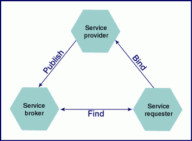

# Concepts
	- ## What is SOA?
		- SOA is a software system structuring principle based on the idea of self-describing service providers.
		- a service is a function (usually a business function) that is accomplished by the interchange of messages between two entities: a service provider, and a service consumer.
		- SOA is just a methodology, an architectural design choice. It has nothing to do with a particular technology
		- It is a type of distributed computing
		- Web services is a realization of SOA
	- ## Why SOA?
		- Reduces coupling between the consumer and provider. This permits controlled changes to the provider, that will not have unforeseen effects on the consumer. It also allows the consumer to switch providers easily, provided only that a compatible service interface is provided. Decoupling allows changes to occur incrementally.
		- Increases inter-operability across different systems, technologies and languages like Java, .Net, etc.
		- Since heavy monolithic systems are divided into discrete services, development, upgrade, etc. can happen independently.
		- Reusability of services
		- Predecessors of SOA : CORBA, DCOM, EJB (all 3 are RPC based), SOAP based Web services
		- Downside of the SOA predecessors
		- Interoperability across systems and technologies proved to be nettlesome. EJB & DCOM are tied to specific platforms
		- For data exchange, proprietary, binary-based technologies were used unlike XML in SOA
		- Downsides of RPC based solutions
		- tight coupling between server and client
		- repeated RPC calls increases network load
		- data type support between 2 incompatible languages, such as C++ and Java is complicated and challenging.
		- When should SOA be used and should NOT be used?
	- ## SOA Operations
		- 
		- 1. Publish
		- 2. Find
		- 3. Bind
	- ## Characteristics of contemporary SOA
	  collapsed:: true
		- 1. QoS (Quality of Service) - security, reliability (in message delivery or notification), transactional capabilities (to protect the integrity of the business tasks)
		- Autonomous - services should be independent and self-contained
		- Based on Open Standards - Data exchange is governed by open standards like SOAP, WSDL, XML, etc.
		- Promotes Discovery
		- Interoperability - disparate technologies should not prevent service-oriented solutions from interoperating
		- Composability - composing 1 or more fine-grained services to form a coarse-grained service. Different solutions can be composed of different extensions and can continue to interoperate as long as they support the common extensions required
		- Reusability of services
		- Extensibility of services
		- Layers of abstraction - encapsulates application logic and technology resources
		- Promotes loose-coupling - separation of concerns
		- Stateless
		- Location-, Language- & Protocol-independent
	- ## Message Exchange Patterns (MEP)
	  collapsed:: true
		- An MEP is a generic interaction pattern that defines the message exchange between two services
		- MEPs can composed to support the creation of large, more complex patterns.
		- ### Primitive MEPs
			- 1. Request-response
			- this could be synchronous or asynchronous
			- typically a "correlation" is used to associate a response with the request
			- 2. Fire-and-forget
			- This simple asynchronous pattern is based on a *unidirectional* transmission of messages from a source to one or more destinations.
			- There are few variations in this MEP.
				- *single-destination* pattern - a source sends a message to one destination only
				- *multi-cast* pattern - a source sends messages to a predefined set of destinations
				- *broadcast* pattern - same as multi-cast pattern, except that the message is sent out to a broader range of recipient destinations
		- ### Complex MEPs
			- Example of a complex MEP is **Publish-and-subscribe** model
		- ### MEPs and WSDL
			- #### WSDL 1.1 Spec
				- 1. **Request-response operation** - upon receiving a message, the service must response with a standard message or a fault message
				- 2. **Solicit-response operation** - upon submitting a message to a service requestor, the service expects a standard response message or a fault message
				- 3. **One-way operation** - the service expects a single message and is not obligated to respond.
				- 4. **Notification operation** - The service sends a message and expects no response.
			- #### WSDL 2.0 Spec
				- 1. **in-out** pattern - equivalent to WSDL 1.1 request-response
				- 2. **out-in** pattern - equivalent to WSDL 1.1 solicit-response
				- 3. **in-only** pattern - equivalent to WSDL 1.1 one-way
				- 4. **out-only** pattern - equivalent to WSDL 1.1 notification
				- 5. **robust in-only** pattern - a variation of the in-only pattern that provides the option of launching a fault response message as a result of a transmission or processing error
				- 6. **robust out-only** pattern - like out-only pattern, has an outbound message initiating the transmission. the difference here is that a fault message can be issued in response to the receipt of this message
				- 7. **in-optional-out** pattern - similar to in-out with an exception. This variation introduces a rule stating that the delivery of a response message is optional and should therefore not be expected by the service requetor that originated the communication. This pattern also supports the generation of a fault message.
				- 8. **out-optional-in** pattern - reverse of the in-optional-out, where the incoming message is optional. Fault message generation is also supported.
	- ## Primitive SOA / First Generation Web-services Framework
	  collapsed:: true
		- ### Service Roles
		  collapsed:: true
			- __Service Provider__ - who creates a service description and deploys it. (server side)
			- __Service Requestor / Service Consumer__ - who consumes the service
			- service provider entity - the organization providing the WS.
			- service provider agent - the web service itself.
			- __Service Registry__ - who publishes the service description. match maker between provider and requestor.
			-
			- __Intermediary service (routing service)__
				- 1. __Passive Intermediary service__ - It is typically responsible for routing messages to a subsequent location. It may use information in the SOAP message header to determine the routing path, or it may employ native routing logic to achieve some level of load balancing. Either way, what makes this type of intermediary passive is that it does not modify the message.
				- 2. __Active intermediaries__ - also route messages to a forwarding destination. Prior to transmitting a message, however, these services actively process and alter the message contents. Typically, active intermediaries will look for particular SOAP header blocks and perform some action in response to the information they find there. They almost always alter data in header blocks and may insert or even delete header blocks entirely.
			-
			- __Initial sender and ultimate receiver__ - Initial senders are simply service requestors that initiate the transmission of a message. Therefore, the initial sender is always the first Web service in a message path. The counterpart to this role is the ultimate receiver. This label identifies service providers that exist as the last Web service along a message's path
			- __Service Composition / Service Assemblies__ - A service can invoke one or more other services to complete a task. Each service participating in such composition is called as 'service composition member'. Service composition is frequently governed by WS-* composition extensions, such as WS-BPEL and WS-CDL, which introduce the related concepts of orchestration and choreography.
		- ### Service Models
		  collapsed:: true
			- **Business service model**
			- **Utility service model** - a generic webservice designed for re-use and non-application specific in nature
			- **Controller service model** - Service compositions are comprised of a set of independent services that each contribute to the execution of the overall business task. The assembly and coordination of these services is often a task in itself and one that can be assigned as the primary function of a dedicated service or as the secondary function of a service that is fully capable of executing a business task independently. The controller service fulfills this role, acting as the parent service to service composition members.
		- ### Service Endpoint or Service Description (WSDL)
		  collapsed:: true
			- Service Endpoint - A WSDL describes the point of contact for a service provider, also known as the service endpoint or just endpoint. It provides a formal definition of the endpoint interface and also establishes the physical location (address) of the service.
			- 2 categories of WSDL Description
			- 1. **Abstract description**
				- Describes the interface characteristics of the Web service without any reference to the technology used to host.
				- It contains `portType` (or `interface` from WSDL 2.0), `operation` and `message`
				- **WSDL Abstract description**
					- ``` xml
					  <portType name="glossaryTerms">
					    <operation name="setTerm">
					      <input name="newTerm" message="newTermValues"/>
					    </operation>
					  </portType >
					  ```
			- 2. **Concrete description** - contains
				- Describes the concrete technology used for physical transport.
				- It contains
					- binding -  represents the transport technology the service can use to communicate. Typically it is SOAP. A binding can apply to a particular operation or all operations.
					- port (or endpoint from WSDL 2.0) - represents the physical address at which a service can be accessed with a specific protocol.
					- service
				- ```xml
				  <binding type="glossaryTerms" name="b1">
				     <soap:binding style="document"
				     transport="http://schemas.xmlsoap.org/soap/http" />
				     <operation>
				       <soap:operation soapAction="http://example.com/getTerm"/>
				       <input><soap:body use="literal"/></input>
				       <output><soap:body use="literal"/></output>
				    </operation>
				  </binding>
				  ```
		- ### Service Contract or Service Metadata
			- A service contract is comprised of the following documents:
				- WSDL definition
				- XSD schema
				- Policy document - provides rules, preferences, and processing details above and beyond what is expressed in WSDL & XSD.
				- Other legal documents
- # Bibliography
	- Books
		- Service Oriented Architecture - Concepts, Technology and Design - Thomas Erl (2005)
		- SOA - Principles of Service Design - Thomas Erl
	- Sites
		- http://www.service-architecture.com/articles/web-services/index.html
		- [servicetechbooks.com](http://www.servicetechbooks.com/)
		- [servicetechspecs.com](http://www.servicetechspecs.com)
		- [serviceorientation.com](http://www.serviceorientation.com)
		- [soaglossary.com](http://www.soaglossary.com)
		- [whatisrest.com](http://www.whatisrest.com)
		- [servicetechmag.com](http://www.servicetechmag.com)