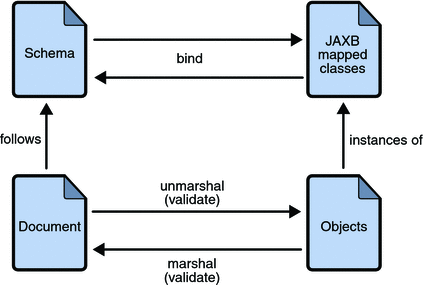

# Concepts
	- 2 ways of developing SOAP web services:
	- **1. Contract-first approach** - the web service definition or the WSDL is created initially and the service implementation is done after that.
	- **2. Code-first approach** - the service implementation classes are developed at the beginning and usually the WSDL is automatically generated by the service container in which the web service is deployed.
	- ## Downsides of SOAP services
		- Performance degradation due to heavy XML processing
		- Complexities associated with the usage of various WS-- specifications are two of the most common disadvantages of the SOAP messaging model.
	- ## Difference between REST and SOAP
		- SOAP is a messaging protocol in which the messages are XML documents, whereas REST is a style of software architecture for distributed hypermedia systems, or systems in which text, graphics, audio, and other media are stored across a network and interconnected through hyperlinks.
		- In the Web, HTTP is both a transport protocol and a messaging system because HTTP requests and responses are messages. The payloads of HTTP messages can be typed using the MIME (Multipurpose Internet Mail Extension) type system. MIME has types such as `text/html`, `application/octet-stream`, and `audio/mpeg3`.
		- A RESTful request targets a resource, but the resource itself typically is created on the service machine and remains there. A resource may be persisted in a data store such as a database system.
- # WSDL
	- stands for Web Service Description Language
	- WSDL documents can describe either category of web service, SOAP-based or REST-style, but there seems to be little interest in WSDLs and WSDL-based tools for RESTful services.
- # Data Binding Tools
  collapsed:: true
	- ## JAX-B
	  collapsed:: true
		- 
		- Java Architecture for XML Binding (JAXB) provides a way to bind XML schemas and Java representations, making it easy to incorporate XML data and processing functions in Java applications. e.g., `java.lang.String` is translated to an XML Schema type (or equivalent) `xsd:string`
		- JAXB provides methods for unmarshalling (reading) XML instance documents into Java content trees, and then marshalling (writing) Java content trees back into XML instance documents.
		- JAXB also provides a way to generate XML schema from Java objects.
		- A JAXB implementation consists of the following architectural components:
		- **Schema compiler**:
			- Binds a source XML schema to Java classes. The binding is described by an XML-based binding language.
			- `xjc` is another core JDK utility, that works in the other direction. Given an XML Schema, xjc can generate Java classes to represent the XML types in the schema.
		- **Schema generator**:
			- Maps a set of existing Java classes to a derived schema. The mapping is described by program annotations.
			- `schemagen` is a core Java JDK utility that generates an XML schema from a POJO source file. The utility can be invoked from the command: `$schemagen Test.java`
		- **Binding runtime framework**: Provides unmarshalling (reading) and marshalling (writing) operations for accessing, manipulating, and validating XML content using either schema-derived or existing program elements.
			- **Unmarshalling** - to convert XML data into JAXB-derived Java objects.
			- **Marshalling** - to convert a JAXB-derived Java object tree into XML data.
		- How to do in-memory transformations from Object to XML and vice versa
		- ### JAXB data binding process
		  collapsed:: true
			- The general steps in the JAXB data binding process are:
			- 
			- 1. *Generate classes*: An XML schema is used as input to the JAXB binding compiler to generate JAXB classes based on that schema.
			  2. *Compile classes*: All of the generated classes, source files, and application code must be compiled.
			  3. *Unmarshal*: XML documents written according to the constraints in the source schema are unmarshalled by the JAXB binding framework. Note that JAXB also supports unmarshalling XML data from sources other than files and documents, such as DOM nodes, string buffers, SAX sources, and so forth.
			  4. *Generate content tree*: The unmarshalling process generates a content tree of data objects instantiated from the generated JAXB classes; this content tree represents the structure and content of the source XML documents.
			  5. *Validate (optional)*: The unmarshalling process involves validation of the source XML documents before generating the content tree. Note that if you modify the content tree in Step 6, you can also use the JAXB Validate operation to validate the changes before marshalling the content back to an XML document.
			  6. *Process content*: The client application can modify the XML data represented by the Java content tree by using interfaces generated by the binding compiler.
			  7. *Marshal*: The processed content tree is marshalled out to one or more XML output documents. The content may be validated before marshalling.
	- ## Jackson
	  collapsed:: true
		- Created by FasterXML.
		- Jackson is an XML/json parser and data binder.
		- Jackson is a:
			- FAST (measured to be faster than any other Java json parser and data binder)
			- Streaming (reading, writing)
			- Zero-dependency (does not rely on other packages beyond JDK)
			- Powerful (full data binding for common JDK classes as well as any Java bean class, Collection, Map or Enum), Configurable
			- Open Source (Apache License – or, until 2.1, alternatively LGPL)
			- JSON processor. It provides JSON parser/JSON generator as foundational building block; and adds a powerful Databinder (JSON<->POJO) and Tree Model as optional add-on blocks.
			- This means that you can read and write JSON either as stream of tokens (Streaming API), as Plain Old Java Objects (POJOs, databind) or as Trees (Tree Model).
	- ## GSON
		- Created by Google
	- ## JSON
	  collapsed:: true
		- http://json-schema.org/
		- JSON-P format - P stands for with padding.
		- JSONP originally signified a way to work around the traditional same domain policy that prevents a page downloaded from a domain such as server.foo.org from communicating with a domain other than foo.org; JSONP still serves this purpose. The JSONP workaround involves script elements in a page, as these elements allow code to be downloaded from anywhere; the downloaded code can then perform arbitrary processing, which includes communicating with servers in arbitrary domains. JSONP works nicely with web services.
		- JSONP brings an event-driven API to client-side processing. Using JSONP, the programmer can do the following:
			- Provide a URL to a data source.
			- Specify a callback function to be executed, in browser context, once the data from the specified source arrives.
	- ## XStream
	  collapsed:: true
		- Created by ThoughtWorks
		- XStream includes a persistence API and has extensions in support of the Hibernate ORM (Object Relation Mapper). Among the more interesting features of XStream is that its API does not center on the get/set methods that define Java properties. XStream can serialize into XML an instance of a Java class that has nothing but private fields.
		- XStream also supports selective or fine-grained serialization and deserialization.
		- The core XStream library also supports the conversion of Java objects to and from JSON. There are various JSON drivers available in this library, the simplest of which is the JsonHierarchicalStreamDriver. This driver supports the serialization of Java objects to JSON but not the inverse operation. If deserialization from JSON to Java is needed, then a driver such as Jettison is a good choice because it interoperates cleanly with XStream.
		- XStream supports customized JSON serialization.
		- The XStream API is remarkably low fuss but likewise powerful. This API has gained steadily in popularity among Java developers who are looking for quick and easy ways to convert between Java objects on the one side and either XML or JSON documents on the other side.
- # References
	- Books
		- Building Web Services with Java (2E)
		- Java Web Services - Up & Running - O'Reilly 2013
		- Web Services Testing with soapUI (2012)