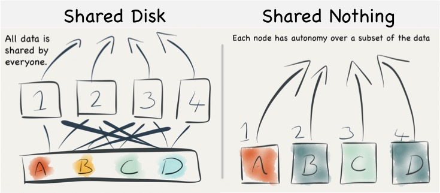
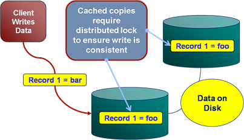

# Basics
background-color:: yellow
collapsed:: true
	- 
	  collapsed:: true
	  {{renderer :mermaid_zcvped}}
		- ```mermaid
		  flowchart LR
		     A[Scaling]-.->B1[Scalability Types];
		     A -.-> B2[Scaling Types];
		     B1 -.-> C1[Size scalability];
		     B1 -.-> C2[Geographic scalability];
		     B1 -.-> C3[Administrative scalability];
		     
		     B2 -.-> D1[Scaling up / Vertical Scaling];
		     B2 -.-> D2[Scaling out / Horizontal Scaling];
		  
		     D1 -.-> E1[Shared Memory Architecture];
		     D1 -.-> E2[Shared Disk Architecture]
		     D2 -.-> E3[Shared Nothing Architecture]
		  ```
	- ## Types of Scalability
	  background-color:: pink
		- **Size scalability**: adding more nodes should make the system linearly faster; growing the dataset should not increase latency
		  logseq.order-list-type:: number
		- **Geographic scalability**: it should be possible to use multiple data centers to reduce the time it takes to respond to user queries, while dealing with cross-data center latency in some sensible manner.
		  logseq.order-list-type:: number
		- **Administrative scalability**: adding more nodes should not increase the administrative costs of the system (e.g. the administrators-to-machines ratio).
		  logseq.order-list-type:: number
	- ## Scaling Types
	  background-color:: pink
		- 
		- ### Scaling Up or Vertical Scaling or Shared Memory/Disk Architecture
		  background-color:: blue
			- When volume of data increases, add computing power to a single server or move to a bigger server.
			- **Shared Memory architecture**
				- Many CPUs, many RAM chips, and many disks can be joined together under one operating system, and a fast interconnect allows any CPU to access any part of the memory or disk. In this kind of architecture, all the components can be treated as a single machine.
				- **Cons**
					- Cost grows faster than linearly; a machine with twice as many CPUs, twice as much RAM, and twice as much disk capacity as another typically costs significantly more than twice as much
					- A machine twice the size cannot handle twice the load
					- Limited fault tolerance - limited to single geographic location
			- **Shared Disk architecture**
				- uses several machines with independent CPUs and RAM, but stores data on an array of disks that is shared between the machines, which are connected via a fast network.
				- This architecture is used for some data warehousing workloads
				- **Cons**
					- contention and the overhead of locking limit the scalability
					- 
				- **Pros**: no change in architecture needed.
		- ### Scaling Out or Horizontal Scaling or Shared Nothing Architecture
		  background-color:: blue
			- Processing is handled by more than 1 server. When data volume increases, add more servers to the farm.
			- **Pros**
				- Cheaper purchase costs than scale up
				- Increased availability and fault tolerance by distributing across geographic locations
				- Reduce latency by distributing data closer to the users
			- **Cons**: complex data processing stratagies involved.
			- Features: *smart-software-dumb-hardware*, *move-processing-not-data*.
			- Challenges: Bottlenecks, increased risk of failure
			- **Shared Nothing architecture**
				- each machine or virtual machine running the database software is called a *node*. Each node uses its CPUs, RAM, and disks independently. Any coordination between nodes is done at the software level, using a conventional network.
				- No special hardware is required by a shared-nothing system, so you can use whatever machines have the best price/performance ratio
		- > [Horizontal and Vertical Scaling Strategies for Batch applications](http://www.ontheserverside.com/blog/2014/07/23/horizontal-and-vertical-scaling-strategies-for-batch-applications)
	- ## Scalability Factors
	  background-color:: pink
	  collapsed:: true
		- There are 2 aspects to look at in scalability
		- **Performance (or latency)**
			- Depending on the context, this may involve achieving one or more of the following:
				- Short response time/low latency for a given piece of work
				- High throughput (rate of processing work)
				- Low utilization of computing resource(s)
		- **Availability (and Fault Tolerance)**
			- Distributed systems can take a bunch of unreliable components, and build a reliable system on top of them.
			- Systems that have no redundancy can only be as available as their underlying components. Systems built with redundancy can be tolerant of partial failures and thus be more available.
			- $$Availability = \frac{uptime}{(uptime + downtime)}$$
			- For example,
				- less than 4 days downtime per year  = 99% availability
				- less than 9 hours downtime per year = 99.9% availability
				- less than 1 hour downtime per year  = 99.99% availability
			- Availability is in some sense a much wider concept than uptime, since the availability of a service can also be affected by, say, a network outage or the company owning the service going out of business (which would be a factor which is not really relevant to fault tolerance but would still influence the availability of the system). But without knowing every single specific aspect of the system, the best we can do is design for fault tolerance.
	- ## Options for increasing the DB performance
	  background-color:: pink
	  collapsed:: true
		- ### 1. Vertical Scaling
			- **CPU Upgrades**
				- typically this is due to slow read queries. Optimizing those offensive queries can most of the times solve the issue.
				- If the CPU is high due to too many users, then typically scaling out is the only option.
				- If the memory is low, CPU usage can be high due to *disk swapping*.
			- **Memory Upgrades**
				- Memory is heavily used for caching results, index caching, sorting, aggregation, etc.
				- If the memory runs low, CPU automatically swaps the contents to disk which is typically 100 times slower. Adding more memory generally solves the problem, but there is a limit.
				- Highly inefficient queries also sometimes contribute to high memory usage.
			- **Disk Upgrades**
				- Full table scan queries or high user/transaction volume lead to high disk usage.
				- Using RAID subsystems or Solid State Drives (SSD) sometimes solve the issue. But upgrading disks rarely solve performance issues.
		- ### 2. Read Scaling
			- Read scaling is a simple technique of creating read-only replicas of the monolithic DB server to reduce the read-only queries on a single DB.
		- ### 3. Horizontal Scaling
			- When your application involves heavy data reads/writes and heavy transactional volumes, and if none of the above techniques work, then scaling horizontally is the only option.
			- Partitioning/Sharding data across multiple nodes/servers in a cluster also introduces multiple failure points. DB cluster must be *highly available* to ensure the interim server failures do not interrupt the live operations.
- # References
  background-color:: yellow
	- Understanding Big Data Scalability - Cory Isaacson