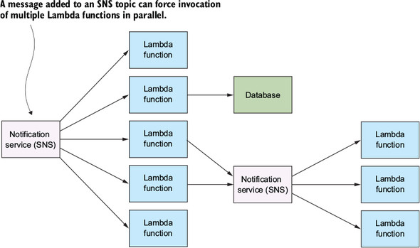

# Serverless Architecture
collapsed:: true
	- Microservices and serverless architectures are spiritual descendants of service--oriented architecture. They retain many of the aforementioned principles and ideas while attempting to address the complexity of old-fashioned service-oriented architectures.
	- Serverless architectures give you the freedom to apply as few or as many microservice principles as you would like without forcing you down a single path
	- ## Principles of Serverless Architecture
	  collapsed:: true
		- Use a compute service to execute code on demand (no servers).
		- Write single-purpose stateless functions.
		- Design push-based, event-driven pipelines.
		- Create thicker, more powerful front ends.
		- Embrace third-party services.
		- __Pricing__: Lambda pricing is based on the number of requests, the duration of execution, and the amount of allocated memory.
		- __Security__: Digitally signed tokens can allow front ends to talk to disparate services, including databases, in a secure manner. This is in contrast to traditional systems where all communication flows through the back-end server.
		- __Consistency__: The other important point to consider is consistency. If the front end is responsible for writing to multiple services and fails midway through, it can leave the system in an inconsistent state. In this scenario, a Lambda function should be used because it can be designed to gracefully handle errors and retry failed operations.
	- ## IaaS, PaaS, CaaS, BaaS, FaaS
	  collapsed:: true
		- All three of these ideas — IaaS, PaaS, and CaaS — can be grouped as compute as a service; in other words, they are different types of generic environments that we can run our own specialized software in.
		- PaaS and CasS differ from IaaS by raising the level of abstraction further, allowing us to hand off more of our “heavy lifting” to others.
		- Serverless is the next evolution of cloud computing and can be divided into two ideas:
			- Backend as a service, and
			- Functions as a service.
		- **FaaS**
		  collapsed:: true
			- The other half of serverless is functions as a service (FaaS). FaaS, like IaaS, PaaS, and CaaS, is another form of _compute as a service_—a generic environment within which we can run our own software. Some people like to use the term _serverless compute_ instead of FaaS.
			- In FaaS, we have no concern for the runtime management of our code, unlike any other style of compute platform.
			- we have no concern for hosts or processes, and scaling and resource management are handled on our behalf.
			  
			  
			  | **Traditional Software Deployment** | **Function as a Service** |
			  |  |  |
			- Both the host instance and the application process are stripped away in the FaaS model. Instead, we focus on just the individual operations or functions that express our application’s logic.
	- ## 5 key criterias of serverless
	  collapsed:: true
		- There are five key criteria that differentiate serverless services—both BaaS and FaaS—that allow us to approach architecting applications in a new way. These criteria are as follows:
			- 1. Does not require managing a long-lived host or application instance
			- 2. Self auto-scales and auto-provisions, dependent on load
			- 3. Has costs that are based on precise usage, up from and down to zero usage
			- 4. Has performance capabilities defined in terms other than host size/count
			- 5. Has implicit high availability
		- Downsides of serverless
			- may not be appropriate for latency-sensitive applications or software with specific service-level agreements (SLA).
			- Vendor lock-in
	- ## Usecases
	  collapsed:: true
		- Application backend
		- Data processing and manipulation
			- A common use for serverless technologies is data processing, conversion, manipulation, and transcoding.
			- Lambda and AWS services are well suited for building event-driven pipelines for data-processing tasks.
			- we find data processing to be an excellent use case for serverless technologies, especially when we use a Lambda function in concert with other services.
		- Realtime analytics
			- Lambda functions can react to new records in a stream, and can process, save, or discard data quickly. A Lambda function can be configured to run when a specific number (batch size) of records is available for processing, so that it doesn’t have to execute for every individual record added to the stream.
			- When it comes to Kinesis, the number of functions spawned to process messages off a stream is the same as the number of shards (therefore, there’s one Lambda function per shard). Furthermore, if a Lambda function fails to process a batch, it will retry. This can keep going for up to 24 hours (which is how long Kinesis will keep data around before it expires) if processing fails each time
		- Legacy API Proxy
			- developers use API Gateway and Lambda to create a new API layer over legacy APIs and services to make them easier to use.
		- Scheduled Services
			- We’ve seen developers use Lambda functions on a schedule to periodically ping their websites to see if they’re online and send an email or a text message if they’re not.
	- ## Architectures
	  collapsed:: true
		- The two overarching architectures are
			- _compute as back end_ (that is, back ends for web and mobile applications)
			- and _compute as glue_ (pipelines built to carry out workflows).
		- ### Compute as backend
		  collapsed:: true
			- Good serverless systems try to minimize the scope and the footprint of Lambda functions so that these functions do only the bare minimum (call them _nano functions_, if you will) and primarily focus on the tasks that must not be done in the front end because of privacy or security concerns.
			- 
		- ### Compute as glue
		  collapsed:: true
			- With this style of architecture, the focus of the developer is on the design of their pipeline, coordination, and flow of data. The parallelism of serverless compute services like Lambda helps to make these architectures appealing.
			- With Kinesis Streams you can accomplish the following:
				- Control how much data is passed into a Kinesis stream before a Lambda function is invoked and how data gets to Kinesis in the first place
				- Put a Kinesis stream behind an API Gateway
				- Push data to the stream directly from a client or have a Lambda function add records to it
				- 
- # Patterns
  collapsed:: true
	- ## Command pattern
	  collapsed:: true
		- 
		- You can design a system in which a specific Lambda function controls and invokes other functions. You can connect it to an API Gateway or invoke it manually and pass messages to it to invoke other Lambda functions.
		- In practice, this pattern can simplify the API Gateway implementation, because you may not want or need to create a RESTful URI for every type of request. It can also make versioning simpler. The command Lambda function could work with different versions of your clients and invoke the right Lambda function that’s needed by the client.
		- **When to use**
			- This pattern is useful if you want to decouple the caller and the receiver. Having a way to pass arguments as an object, and allowing clients to be parametrized with different requests, can reduce coupling between components and help make the system more extensible. Be aware of using this approach if you need to return a response to the API Gateway. Adding another function will increase latency.
	- ## Messaging pattern
	  collapsed:: true
		- 
		- The reliability comes from the fact that if the consuming service goes offline, messages are retained in the queue and can still be processed at a later time.
		- Unfortunately, at the moment Lambda doesn’t integrate directly with SQS, so one approach to addressing this problem is to run a Lambda function on a schedule and let it check the queue every so often.
		- Kinesis Streams is an alternative to SQS, although it doesn’t have some features, such as dead lettering of messages ( http://amzn.to/2a3HJzH ). Kinesis Streams integrates with Lambda, provides an ordered sequence of records, and supports multiple consumers.
		- **When to use**
			- This is a popular pattern used to handle workloads and data processing. The queue serves as a buffer, so if the consuming service crashes, data isn’t lost. It remains in the queue until the service can restart and begin processing it again. A message queue can make future changes easier, too, because there’s less coupling between functions. In an environment that has a lot of data processing, messages, and requests, try to minimize the number of functions that are directly dependent on other functions and use the messaging pattern instead.
	- ## Fanout pattern
	  collapsed:: true
		- 
		- The fan-out pattern is useful because many AWS services (such as S3) can’t invoke more than one Lambda function when an event takes place.
		- SNS topics are communications/messaging channels that can have multiple publishers and subscribers (including Lambda functions). When a new message is added to a topic, it forces invocation of all subscribers in parallel, thus causing the event to fan out.
		- **When to use**
			- This pattern is useful if you need to invoke multiple Lambda functions at the same time. An SNS topic will try and retry to invoke your Lambda functions if it fails to deliver the message or if the function fails to execute.
	- ## Pipes and Filters pattern
	  collapsed:: true
		- 
		- The purpose of the pipes and filters pattern is to decompose a complex processing task into a series of manageable, discrete services organized in a pipeline. Components designed to transform data are traditionally referred to as filters, whereas connectors that pass data from one component to the next component are referred to as pipes. Serverless architecture lends itself well to this kind of pattern. This is useful for all kinds of tasks where multiple steps are required to achieve a result
- # AWS Lambda
  collapsed:: true
	- The important thing to know is that you must define a function handler, which will be invoked by the Lambda runtime. The handler takes three `parameters—event`, `context`, and `callback` — and is defined as follows:
	- ```js
	  exports.handler = function(event, context, callback){}
	  ```
	- **Lambda local testing**
		- You can run Lambda functions locally using an npm module called `run-local-lambda`. To install this module, execute the following command from a terminal window (make sure you’re in the function’s directory): `npm install run-local-lambda save-dev`.
		- This module allows you to invoke your Lambda function but it doesn’t emulate Lambda’s environment. It doesn’t respect memory size or the CPU, ephemeral local disk storage, or the operating system of real Lambda in AWS.
		- Modify `package.json`, as in the next listing, to change the test script. The test script will invoke the function and pass the contents of event.json, a file you’re about to create, as the event object.
		- This file must contain the specification of the event object that run-local-lambda will pass in to the Lambda function.
	- **Lambda Limitations**
		- __Disk limitation__ : Lambda has a maximum disk capacity of 512 MB, so this function won’t work if your videos are larger.
		- __Time limitation__ : At the time of writing, Lambda also requires that the function completes processing of the event within 15 minutes; otherwise, the execution is aborted.
	- **Why Lambda?**
		- the key benefit from our perspective is how quickly you can build applications with Lambda when combined with other AWS services
- # References
- Books
	- Serverless Architecture on AWS - Manning Publications
	- Programming AWS Lambda - O'Reilly