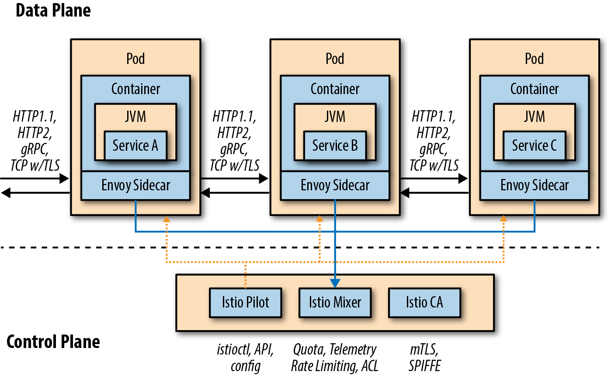
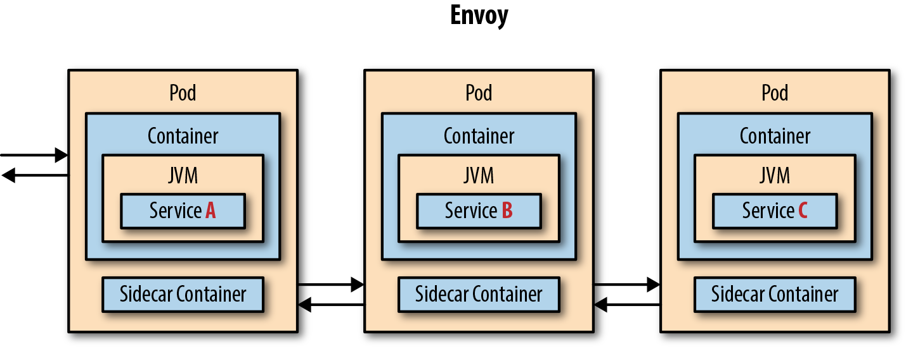

# Introduction
background-color:: yellow
collapsed:: true
	- Service Mesh’s mission is to enable cross-cutting concerns across a series of microservices that make up the overall application, ensuring some level of consistency across all these independent services.
	- A service mesh is the connective tissue between your services that adds additional capabilities like traffic control, service discovery, load balancing, resilience, observability, security, and so on.
	- Istio provides developers and architects with vastly richer and declarative service discovery and routing capabilities. Where Kubernetes/OpenShift itself gives you default round-robin load balancing behind its service construct, Istio allows you to introduce unique and finely grained routing rules among all services within the mesh.
	- With the sidecar istio-proxy in place, you are applying these capabilities at the network level between the services that comprise the application.
		- 
		-
	- ## Data Plane
		- The data plane is implemented in such a way that it intercepts all inbound (ingress) and outbound (egress) network traffic. Your business logic, your app, your microservice is blissfully unaware of this fact.
		- 
	- ## Service Proxy
	  collapsed:: true
		- A service proxy augments an application service. The application service calls through the service proxy any time it needs to communicate over the network. The service proxy acts as an intermediary or interceptor that can add capabilities like automatic retries, circuit breaker, service discovery, security, and more. The default service proxy for Istio is based on Envoy proxy.
		- Envoy proxy is a layer 7 (L7) proxy (OSI Network Layer).
		- It provides features like load balancing for HTTP1.1, HTTP2, and gRPC. It has the ability to collect request-level metrics, trace spans, provide for service discovery, inject faults, and much more. You might notice that some of the capabilities of Istio overlap with Envoy. This fact is simply explained as Istio uses Envoy for its implementation of these capabilities.
		- Istio brings the service proxy capabilities as close as possible to the application code through a deployment technique known as the sidecar.
	- ## Sidecar
	  collapsed:: true
		- With Istio, a second Linux container called “istio-proxy” (aka the Envoy service proxy) is manually or automatically injected into the pod that houses your application or microservice. This sidecar is responsible for intercepting all inbound (ingress) and outbound (egress) network traffic from your business logic container, which means new policies can be applied that reroute the traffic (in or out), perhaps apply policies such as access control lists (ACLs) or rate limits, also snatch monitoring and tracing data (Mixer), and even introduce a little chaos such as network delays or HTTP errors.
	- ## Control Plane
	  collapsed:: true
		- The control plane is responsible for being the authoritative source for configuration and policy and making the data plane usable in a cluster potentially consisting of hundreds of pods scattered across a number of nodes. Istio’s control plane comprises three primary Istio services: Pilot, Mixer, and Citadel.
		- ### PILOT
			- The Pilot is responsible for managing the overall fleet—all of your microservices’ sidecars running across your Kubernetes/OpenShift cluster.
			- The Istio Pilot ensures that each of the independent microservices, wrapped as individual Linux containers and running inside their pods, has the current view of the overall topology and an up-to-date “routing table.”
			- Pilot provides capabilities like service discovery as well as support for VirtualService. The VirtualService is what gives you fine-grained request distribution, retries, timeouts, etc.
		- ### MIXER
			- is the Istio service that brings things together.
			- Each of the distributed istio proxies delivers its telemetry back to Mixer. Mixer maintains the canonical model of the usage and access policies for the overall suite of microservices.
			- With Mixer, you can create policies, apply rate-limiting rules, and even capture custom metrics.
		- ### CITADEL
			- The Istio Citadel component, formerly known as Istio CA or Auth, is responsible for certificate signing, certificate issuance, and revocation/rotation.
			- Istio issues X.509 certificates to all your microservices, allowing for mutual Transport Layer Security (mTLS) between those services, encrypting all their traffic transparently. It uses identity built into the underlying deployment platform and builds that into the certificates. This identity allows you to enforce policy.
- # Traffic Control
  background-color:: yellow
  collapsed:: true
	- Each application instance has its own dedicated proxy through which all network traffic travels before it gets to the application. These sidecar proxies can be individually configured to route, filter, and augment network traffic as needed.
	- With Istio, you can specify routing rules that control the traffic to a set of pods. Specifically, Istio uses `DestinationRule` and `VirtualService` resources to describe these rules.
	- The routing behavior just described is not just for ingress traffic; that is, traffic coming into the mesh. This is for all inter-service communication within the mesh. If you have a service deployed to Kubernetes that’s not part of the service mesh, it will not see these rules and will adhere to the default Kubernetes load-balancing rules.
	- ```yaml Destination Rule
	  apiVersion: networking.istio.io/v1alpha3
	  kind: DestinationRule
	  metadata:
	  name: recommendation
	  namespace: tutorial
	  spec:
	  host: recommendation
	  subsets:
	  - labels:
	      version: v1
	    name: version-v1
	  - labels:
	      version: v2
	    name: version-v2
	  ```
	- ```yaml Virtual Service
	  apiVersion: networking.istio.io/v1alpha3
	  kind: VirtualService
	  metadata:
	  name: recommendation
	  namespace: tutorial
	  spec:
	  hosts:
	  - recommendation
	  http:
	  - route:
	    - destination:
	        host: recommendation
	        subset: version-v1
	      weight: 100
	  ```
	- ## Routing Based on Headers
	  collapsed:: true
		- You also can use Istio to do routing based on request-level metadata. For example, you can use matching predicates to set up specific route rules based on requests that match a specified set of criteria. For example, you might want to split traffic to a particular service based on geography, mobile device, or browser. Let’s see how to do that with Istio.
		- ```yaml
		  apiVersion: networking.istio.io/v1alpha3
		  kind: VirtualService
		  metadata:
		  creationTimestamp: null
		  name: recommendation
		  namespace: tutorial
		  spec:
		  hosts:
		  - recommendation
		  http:
		  - match:
		    - headers:
		        baggage-user-agent:
		          regex: .*Safari.*
		    route:
		    - destination:
		        host: recommendation
		        subset: version-v2
		  - route:
		    - destination:
		        host: recommendation
		        subset: version-v1
		  ```
	- ## Canary Releases
	  collapsed:: true
		- ```yaml Canary
		  apiVersion: networking.istio.io/v1alpha3
		  kind: VirtualService
		  metadata:
		  name: recommendation
		  namespace: tutorial
		  spec:
		  hosts:
		  - recommendation
		  http:
		  - route:
		    - destination:
		        host: recommendation
		        subset: version-v1
		      weight: 90
		    - destination:
		        host: recommendation
		        subset: version-v2
		      weight: 10
		  ```
	- ## Dark Launch
	  collapsed:: true
		- You can use Istio to mirror traffic that goes to v1 into the v2 pod. When Istio mirrors traffic, it does so in a fire-and-forget manner. In other words, Istio will do the mirroring asynchronously from the critical path of the live traffic, send the mirrored request to the test pod, and not worry about or care about a response.
		- Mirrored traffic can be used for powerful pre-release testing, but it does come with challenges. For example, a new version of a service might still need to communicate with a database or other collaborator services.
		- [Advanced Traffic-shadowing Patterns for Microservices With Istio Service Mesh](https://blog.christianposta.com/microservices/advanced-traffic-shadowing-patterns-for-microservices-with-istio-service-mesh/)
		- ```yaml
		  apiVersion: networking.istio.io/v1alpha3
		  kind: VirtualService
		  metadata:
		  name: recommendation
		  namespace: tutorial
		  spec:
		  hosts:
		  - recommendation
		  http:
		  - route:
		    - destination:
		        host: recommendation
		        subset: version-v1
		    mirror:
		      host: recommendation
		      subset: version-v2
		  ```
	- ## Egress
	  collapsed:: true
		- By default, Istio directs all traffic originating in a service through the Istio proxy that’s deployed alongside the service. This proxy evaluates its routing rules and decides how best to deliver the request.
		- One nice thing about the Istio service mesh is that by default it blocks all outbound (outside of the cluster) traffic unless you specifically and explicitly create rules to allow traffic out. From a security standpoint, this is crucial. You can use Istio in both zero-trust networking architectures as well as traditional perimeter-based security.
		- In both cases, Istio helps protect against a nefarious agent gaining access to a single service and calling back out to a command-and-control system, thus allowing an attacker full access to the network. By blocking any outgoing access by default and allowing routing rules to control not only internal traffic but any and all outgoing traffic, you can make your security posture more resilient to outside attacks irrespective of where they originate.
		- To address this issue you need to make egress to httpbin.org accessible with a `ServiceEntry`.
		- ```yaml Service Entry
		  apiVersion: networking.istio.io/v1alpha3
		  kind: ServiceEntry
		  metadata:
		  name: httpbin-egress-rule
		  namespace: tutorial
		  spec:
		  hosts:
		  - now.httpbin.org
		  ports:
		  - name: http-80
		    number: 80
		    protocol: http
		  ```
- # Service Resiliency
  background-color:: yellow
  collapsed:: true
	- > “A common mistake that people make when trying to design something completely foolproof is to underestimate the ingenuity of complete fools” - Douglas Adams, author of The Hitchhiker’s Guide to the Galaxy
	- > Netflix Resiliency Libraries: Eureka (service discovery), Ribbon (load balancing), and Hystrix (circuit breaker and bulkhead)
	- __Client-side load balancing__ - Istio augments Kubernetes out-of-the-box load balancing.
	- __Timeout__ - Wait only N seconds for a response and then give up.
	- __Retry__ - If one pod returns an error (e.g., 503), retry for another pod.
	- __Simple circuit breaker__ - Instead of overwhelming the degraded service, open the circuit and reject further requests.
	- __Pool ejection__ - This provides auto removal of error-prone pods from the load-balancing pool.
	- ## Load Balancing
	  collapsed:: true
		- A core capability for increasing throughput and lowering latency is load balancing.
		- __Centralized load balancer__
			- A straightforward way to implement this is to have a centralized load balancer with which all clients communicate and that knows how to distribute load to any backend systems. This is a great approach, but it can become both a bottleneck as well as a single point of failure.
		- __Client-side load balancer__
			- Load-balancing capabilities can be distributed to clients with client-side load balancers.
			- These client load balancers can use sophisticated, cluster-specific, load-balancing algorithms to increase availability, lower latency, and increase overall throughput.
		- The Istio proxy has the capabilities to provide client-side load balancing through the following configurable algorithms:
			- `ROUND_ROBIN` - This algorithm evenly distributes the load, in order, across the endpoints in the load-balancing pool
			- `RANDOM` - This evenly distributes the load across the endpoints in the load-balancing pool but without any order.
			- `LEAST_CONN` - This algorithm picks two random hosts from the load-balancing pool and determines which host has fewer outstanding requests (of the two) and sends to that endpoint. This is an implementation of weighted least request load balancing.
			  
			  ```yaml
			  apiVersion: networking.istio.io/v1alpha3
			  kind: DestinationRule
			  metadata:
			  name: recommendation
			  namespace: tutorial
			  spec:
			  host: recommendation
			  trafficPolicy:
			  loadBalancer:
			  simple: RANDOM
			  ```
	- ## Timeout
	  collapsed:: true
		- Timeouts are a crucial component for making systems resilient and available.
		- Calls to services over a network can result in lots of unpredictable behavior, but the worst behavior is latency.
			- Did the service fail?
			- Is it just slow?
			- Is it not even available?
		- Unbounded latency means any of those things could have happened. But what does your service do? Just sit around and wait?
		- Waiting is not a good solution if there is a customer on the other end of the request.
		- Waiting also uses resources, causes other systems to potentially wait, and is usually a significant contributor to cascading failures.
		- Your network traffic should always have timeouts in place, and you can use Istio service mesh to do this.
		  
		  ```yaml Timeout
		  apiVersion: networking.istio.io/v1alpha3
		  kind: VirtualService
		  metadata:
		  creationTimestamp: null
		  name: recommendation
		  namespace: tutorial
		  spec:
		  hosts:
		  - recommendation
		  http:
		  - route:
		  - destination:
		      host: recommendation
		  timeout: 1.000s
		  ```
	- ## Retry
	  collapsed:: true
		- ```yaml Retry
		  apiVersion: networking.istio.io/v1alpha3
		  kind: VirtualService
		  metadata:
		  name: recommendation
		  namespace: tutorial
		  spec:
		  hosts:
		  - recommendation
		  http:
		  - route:
		    - destination:
		        host: recommendation
		    retries:
		      attempts: 3
		      perTryTimeout: 2s
		  ```
	- ## Circuit Breaker
	  collapsed:: true
		- The goal of the circuit breaker is to fail fast.
		- Istio implements circuit breaking
			- at the connection-pool level
			- and at the load-balancing host level.
		- Suppose that in a production system a 3-second delay was caused by too many concurrent requests to the same instance or pod. You don’t want multiple requests getting queued or making that instance or pod even slower. So, we’ll add a circuit breaker that will open whenever you have more than one request being handled by any instance or pod.
		- ### Connection-pool level circuit breaker
		  collapsed:: true
			- To create circuit breaker functionality for our services, we use an Istio DestinationRule that looks like this:
			- Here, we’re configuring the circuit breaker for any client calling into v2 of the _recommendation_ service. We are limiting the number of connections and number of pending requests to one.
			- The circuit breaker will short circuit any pending requests or connections that exceed the specified threshold (in this case, an artificially low number, 1, to demonstrate these capabilities). The goal of the circuit breaker is to fail fast.
			- ```yaml Circuit Breaker - Connection-pool level
			  apiVersion: networking.istio.io/v1alpha3
			  kind: DestinationRule
			  metadata:
			  creationTimestamp: null
			  name: recommendation
			  namespace: tutorial
			  spec:
			  host: recommendation
			  subsets:
			  - name: version-v1
			    labels:
			      version: v1
			  - name: version-v2
			    labels:
			      version: v2
			    trafficPolicy:
			      connectionPool:
			        http:
			          http1MaxPendingRequests: 1
			          maxRequestsPerConnection: 1
			        tcp:
			          maxConnections: 1
			      outlierDetection:
			        baseEjectionTime: 120.000s
			        consecutiveErrors: 1
			        interval: 1.000s
			        maxEjectionPercent: 100
			  ```
	- ## Pool Ejection
	  collapsed:: true
		- _Pool Ejection_ is identifying badly behaving cluster hosts and not sending any more traffic to them for a cool-off period (essentially kicking the bad-behaving pod out of the load-balancing pool). (Envoy calls this implementation _outlier detection_).
		- Pool ejection or outlier detection is a resilience strategy that is valuable whenever you have a group of pods (multiple replicas) to serve a client request. If the request is forwarded to a certain instance and it fails (e.g., returns a 50x error code), Istio will eject this instance from the pool for a certain sleep window.
		- This increases the overall availability by making sure that only healthy pods participate in the pool of instances.
		- In the below example, we’re configuring Istio to check every 5 seconds for misbehaving pods and to remove those pods from the load-balancing pool after one consecutive error (artificially low for this example) and keep it out for 15 seconds.  This pod wouldn't receive more requests until the sleep window expires, which takes at least 15 seconds.
		- ```yaml Pool Ejection
		  apiVersion: networking.istio.io/v1alpha3
		  kind: DestinationRule
		  metadata:
		  creationTimestamp: null
		  name: recommendation
		  namespace: tutorial
		  spec:
		  host: recommendation
		  subsets:
		  - labels:
		    version: v1
		  name: version-v1
		  trafficPolicy:
		    connectionPool:
		      http: {}
		      tcp: {}
		    loadBalancer:
		      simple: RANDOM
		    outlierDetection:
		      baseEjectionTime: 15.000s
		      consecutiveErrors: 1
		      interval: 5.000s
		      maxEjectionPercent: 100
		  - labels:
		    version: v2
		  name: version-v2
		  trafficPolicy:
		    connectionPool:
		      http: {}
		      tcp: {}
		    loadBalancer:
		      simple: RANDOM
		    outlierDetection:
		      baseEjectionTime: 15.000s
		      consecutiveErrors: 1
		      interval: 5.000s
		      maxEjectionPercent: 100
		  ```
	- ## Circuit Breaker + Pool Ejection + Retry
	  collapsed:: true
		- You can combine multiple Istio capabilities to achieve the ultimate backend resilience:
		- Circuit breaker, to avoid multiple concurrent requests to an instance
		- Pool ejection, to remove failing instances from the pool of responding instances
		- Retries, to forward the request to another instance just in case you get an open circuit breaker or pool ejection
		- > By simply adding a retry configuration to our current VirtualService, we are able to completely get rid of our 503 responses. This means that whenever you receive a failed request from an ejected instance, Istio will forward the request to another healthy instance:
- # Chaos Testing
  background-color:: yellow
  collapsed:: true
	- [Principles of Chaos Engineering](http://principlesofchaos.org/)
	- With Istio, this is a relatively simple matter because the istio-proxy is intercepting all network traffic; therefore, it can alter the responses including the time it takes to respond. Two interesting faults that Istio makes easy to inject are HTTP error codes and network delays.
	- ## HTTP Errors__
	  collapsed:: true
		- ```yaml HTTP Errors
		  apiVersion: networking.istio.io/v1alpha3
		  kind: VirtualService
		  metadata:
		  name: recommendation
		  namespace: tutorial
		  spec:
		  hosts:
		  - recommendation
		  http:
		  - fault:
		      abort:
		        httpStatus: 503
		        percent: 50
		    route:
		    - destination:
		        host: recommendation
		        subset: app-recommendation
		  ```
	- ## Delays
	  collapsed:: true
		- The most insidious of possible distributed computing faults is not a “dead” service but a service that is responding slowly, potentially causing a cascading failure in your network of services.
		- ```yaml Delays
		  apiVersion: networking.istio.io/v1alpha3
		  kind: VirtualService
		  metadata:
		  creationTimestamp: null
		  name: recommendation
		  namespace: tutorial
		  spec:
		  hosts:
		  - recommendation
		  http:
		  - fault:
		      delay:
		        fixedDelay: 7.000s
		        percent: 50
		    route:
		    - destination:
		        host: recommendation
		        subset: app-recommendation
		  ```
- # Observability
  background-color:: yellow
  collapsed:: true
	- Tools
		- Tracing via Jaeger,
		- Metrics via Grafana and Prometheus,
		- Service graphing via Kiali.
	- `istio-policy` and `istio-telemetry` are the services that make up Istio’s Mixer functionality.
	- ## Tracing
	  collapsed:: true
		- Istio’s Mixer comes “out of the box” with the ability to pull tracing spans from your distributed microservices. This means that tracing is programming-language agnostic so that you can use this capability in a polyglot world where different teams, each with its own microservice, can be using different programming languages and frameworks.
		- Although Istio supports both Zipkin and Jaeger, for our purposes we focus on Jaeger, which implements OpenTracing, a vendor-neutral tracing API. Jaeger was originally open sourced by the Uber Technologies team and is a distributed tracing system specifically focused on microservices architecture.
		- An important term to understand here is span, which Jaeger defines as “a logical unit of work in the system that has an operation name, the start time of the operation, and the duration. Spans can be nested and ordered to model causal relationships. An RPC call is an example of a span.”
		- Another important term is trace, which Jaeger defines as “a data/execution path through the system, and can be thought of as a directed acyclic graph of spans.”
		- It’s important to remember that your programming logic must forward the OpenTracing headers from your inbound call to every outbound call:
		- ```
		  x-request-id
		  x-b3-traceid
		  x-b3-spanid
		  x-b3-parentspanid
		  x-b3-sampled
		  x-b3-flags
		  x-ot-span-context
		  ```
- # Security
  background-color:: yellow
  collapsed:: true
	- ## mTLS
	  collapsed:: true
		- mTLS (Mutual Transport Layer Security) provides encryption between sidecar-injected, istio-enabled services.
		- By default, traffic among our three services of customer, preference, and recommendation is in “clear text” as they just use HTTP. This means that another team, with access to your cluster, could deploy their own service and attempt to sniff the traffic flowing through the system.
		- Enabling mTLS in Istio uses the combination of Policy and DestinationRule objects. The Policy declaration is as follows:
		  
		  ```yaml Policy
		  apiVersion: "authentication.istio.io/v1alpha1"
		  kind: "Policy"
		  metadata:
		  name: "default"
		  namespace: "tutorial"
		  spec:
		  peers:
		  - mtls: {}
		  ```
		  
		  ```yaml
		  apiVersion: "networking.istio.io/v1alpha3"
		  kind: "DestinationRule"
		  metadata:
		  name: "default"
		  namespace: "tutorial"
		  spec:
		  host: "*.tutorial.svc.cluster.local"
		  trafficPolicy:
		  tls:
		    mode: ISTIO_MUTUAL
		  ```
		- Once mTLS is enabled, you need to leverage a gateway to achieve end-to-end encryption. Istio has its own ingress gateway, aptly named __Istio Gateway__, a solution that exposes a URL external to the cluster and supports Istio features such as monitoring, traffic management, and policy.
		- On minishift or minikube, the Istio Gateway service exposes a NodePort to make it visible outside the cluster. 
		  
		  ```yaml
		  apiVersion: networking.istio.io/v1alpha3
		  kind: Gateway
		  metadata:
		  name: customer-gateway
		  namespace: tutorial
		  spec:
		  selector:
		  istio: ingressgateway # use istio default controller
		  servers:
		  - port:
		    number: 80
		    name: http
		    protocol: HTTP
		  hosts:
		  - "*"
		  ---
		  apiVersion: networking.istio.io/v1alpha3
		  kind: VirtualService
		  metadata:
		  name: customer
		  namespace: tutorial
		  spec:
		  hosts:
		  - "*"
		  gateways:
		  - customer-gateway
		  http:
		  - match:
		  - uri:
		      exact: /
		  route:
		  - destination:
		      host: customer
		      port:
		        number: 8080
		  ```
	- ## Mixer Policy
	- ## RBAC
- # References
  background-color:: yellow
	- O'Reilly Introducing Istio Service Mesh for Microservices, 2nd Edition