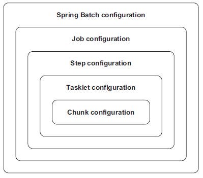
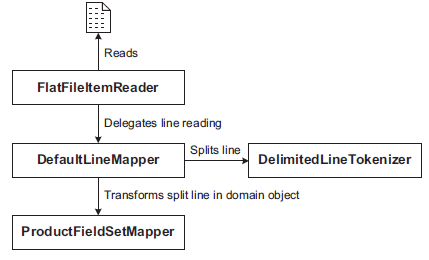

- [Horizontal and Vertical Scaling Strategies for Batch applications](http://www.ontheserverside.com/blog/2014/07/23/horizontal-and-vertical-scaling-strategies-for-batch-applications)
- # Chunk Processing
	- [Excellent article - Horizontal and Vertical Scaling Strategies for Batch Applications](http://www.ontheserverside.com/blog/2014/07/23/horizontal-and-vertical-scaling-strategies-for-batch-applications)
	- Spring Batch includes a batch-oriented algorithm to handle the execution flow called
	- *chunk processing*.
	- Spring Batch processes items in chunks. A job reads and writes items in small chunks. Chunk processing allows streaming data instead of loading all the data in memory. By default, chunk processing is single threaded and usually performs well, but has an option to distribute processing on multiple threads or physical nodes as well.
	- Spring Batch collects items one at a time from the `ItemReader` into a configurable-sized chunk.
	- Spring Batch then sends the chunk to the `ItemWriter` and goes back to using the `ItemReader` to create another chunk, and so on, until the input is exhausted.
	- Spring Batch provides an optional processing where a job can process (transform) items before sending them to `ItemWriter`. It is called `ItemProcessor`.
	- Spring Batch also handles transactions and errors around read and write operations
	- Chunk size and commit-interval are the same thing
	- ```xml Application configuration template
	  <beans>
	  <job>
	  <step>
	  	<tasklet>
	  		<chunk reader="" writer="" commit-interval="" skip-limit=""/>
	  	</tasklet>
	  </step>
	  </job>
	  </beans>
	  ```
	- Spring Batch needs two infrastructure components:
		- *Job repository* — To store the state of jobs (finished / failed / currently running)
		- *Job launcher* — To create the state of a job before launching it
- # Configuration
	- 
	- ```xml Sample Job Configuration
	  <batch:job id="importProductsJob">
	    <batch:step id="readWriteStep">
	      <batch:tasklet transaction-manager="transactionManager">
	        <batch:chunk 
	            reader="productItemReader"
	            processor="productItemProcessor"
	            writer="productItemWriter"
	            commit-interval="100"/>
	      </batch:tasklet>
	    </batch:step>
	  </batch:job>
	  ```
	- ```xml Sample batch "infrastructure configuration"
	  <?xml version="1.0" encoding="UTF-8"?>
	  <beans  ...>
	  <bean id="dataSource">...</bean>
	  
	  <bean id="transactionManager"  class="org.springframework.jdbc.datasource.DataSourceTransactionManager">
	  	<property name="dataSource" ref="dataSource" />
	  </bean>
	  
	  <bean id="jobRepository" class="org.springframework.batch.core.repository.support.MapJobRepositoryFactoryBean">
	  	<property name="transactionManager"	ref="transactionManager" />
	  </bean>
	  
	  <bean id="jobLauncher" class="org.springframework.batch.core.launch.support.SimpleJobLauncher">
	  	<property name="jobRepository" ref="jobRepository" />
	  </bean>
	  
	  <bean class="org.springframework.jdbc.core.JdbcTemplate">
	  <constructor-arg ref="dataSource" />
	  </bean>
	  </beans>
	  ```
		- > *SPLITTING INFRASTRUCTURE AND APPLICATION CONFIGURATION FILES* - Always split infrastructure and application configuration files, so that it allows to swap out the infrastructure for different environments (test, development, staging, production) and still reuse the application configuration files.
	- ## Job Attributes
	  collapsed:: true
		- `id` - Identifies the job.
		- `restartable`
		- Specifies whether Spring Batch can restart the job. The default is `true`.
		- If `false`, Spring Batch can’t start the job more than once; if you try, Spring Batch throws the exception `JobRestartException`.
		- `incrementer`
		- Refers to an entity used to set job parameter values. This entity is required when trying to launch a batch job through the startNextInstance method of the `JobOperator` interface.
		- The `incrementer` attribute provides a convenient way to create new job parameter values. Note that the JobLauncher doesn’t need this feature because you must provide all parameter values explicitly. When the startNextInstance method of the `JobOperator` class launches a job, though, the method needs to determine new parameter values and use an instance of the JobParametersIncrementer interface:
		- ```java
		  public interface JobParametersIncrementer {
		  	JobParameters getNext(JobParameters parameters);
		  }
		  ```
		- `abstract`
		- Specifies whether the job definition is abstract. If true, this job is a parent job configuration for other jobs. It doesn’t correspond to a concrete job configuration
		- parent
		- Defines the parent of this job.
		- `job-repository`
		- Specifies the job repository bean used for the job. Defaults to a `jobRepository`bean if none specified.
- # Components & Interfaces
  collapsed:: true
	- ## Job
	- ## Tasklet
	  collapsed:: true
		- ```java
		  public interface Tasklet{
		  RepeatStatus execute(StepContribution contribution, ChunkContext chunkContext);
		  }
		  ```
	- ## ItemReader
	  collapsed:: true
		- ### FlatFileItemReader
			- Spring Batch provides this class to read records from a flat file.
			- `FlatFileItemReader` delegates the mapping between an input line from file and a domain object to `LineMapper` interface
		- ```java
		  package org.springframework.batch.item;
		  public interface ItemReader<T> {
		  T read() throws Exception, UnexpectedInputException, ParseException, NonTransientResourceException;
		  }
		  ```
	- ## Skipping
	  collapsed:: true
		- ```xml Line Skipping Example
		  <job id="importProducts">
		  <step id="decompress" next="readWriteProducts">
		  <tasklet ref="decompressTasklet" />
		  </step>
		  
		  <step id="readWriteProducts">
		  <tasklet>
		  	<chunk reader="reader" writer="writer" commit-interval="100" skip-limit="5">
		  		<skippable-exception-classes>
		  			<include class="org.springframework.batch.item.file.FlatFileParseException" />
		  		</skippable-exception-classes>
		  	</chunk>
		  </tasklet>
		  </step>
		  </job>
		  ```
	- ## LineMapper
	  collapsed:: true
		- ### DefaultLineMapper
		  collapsed:: true
			- 
			- Spring Batch provides a handy `LineMapper` implementation called `DefaultLineMapper`, which delegates the mapping to other strategy interfaces.
			- It needs
				- a `LineTokenizer` to split a line into fields
				- a `FieldSetMapper` to transform the split line into a domain object.
				- The `FieldSet` parameter comes from the `LineTokenizer`. Think of it as an equivalentto the JDBC ResultSet
			- ```java
			  public interface FieldSetMapper<T> {
			  T mapFieldSet(FieldSet fieldSet) throws BindException;
			  }
			  ```
			- ```java Example FieldSetMapper
			  public class ProductFieldSetMapper implements FieldSetMapper<Product> {
			  public Product mapFieldSet(FieldSet fieldSet) throws BindException {
			  Product product = new Product();
			  product.setId(fieldSet.readString("PRODUCT_ID"));
			  product.setName(fieldSet.readString("NAME"));
			  product.setDescription(fieldSet.readString("DESCRIPTION"));
			  product.setPrice(fieldSet.readBigDecimal("PRICE"));
			  return product;
			  }
			  }
			  ```
	- ## ItemProcessor
	  collapsed:: true
		- ```java
		  public interface ItemProcessor<I, O> {
		  O process(I item) throws Exception;
		  }
		  ```
	- ## ItemWriter
	  collapsed:: true
		- ```java
		  public interface ItemWriter<T> {
		  void write(List<? extends T> items) throws Exception;
		  }
		  ```
	- ## Filtering
	  collapsed:: true
		- TBD
- # Job Flow
	- ## Job Parameters
		- TBD
- # Error Handling
  collapsed:: true
	- TBD
- # Transaction Management
  collapsed:: true
	- TBD
- # Testing
  collapsed:: true
	- TBD
- # References
	- collapsed:: true
	  * Books
		- Spring Batch in Action
		- Pro Spring Batch