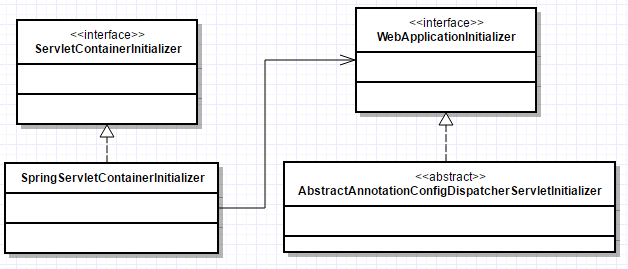
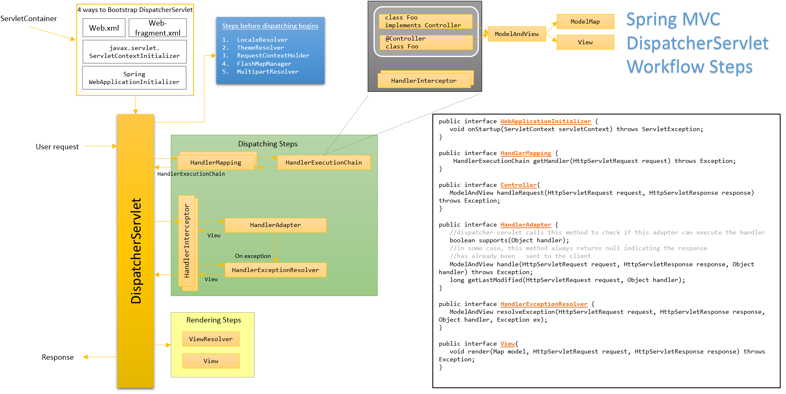

- 
- # Request Lifecycle
  collapsed:: true
	- 1. HTTP Request reaches Spring's `DispatcherServlet`.
	- 2. `DispatcherServlet` uses one or more handler mappings to figure out the controller to the handle the request
	- 3. Controller calls the service classes to perform a business function. Optionally returns a business *model* class.
	- 4. Controller returns a logical *view* name
	- 5. `DispatcherServlet` consults a view resolver to map the logical view name to a specific view implementation, which couild be JSP, Apache Tiles, Thymeleaf, etc.
	- 6. View uses the model data to render the output.
	- 7. `DispatcherServlet` sends the output as HTTP response back to client.
- # Components
	- ## 2 ways to enable Spring MVC
		- 1. Add `<mvc:annotation-driven>` element in XML (*which XML*)
		- 2. Add `@EnableWebMvc` annotation in configuration class
			- ```java
			  @Configuration
			  @EnableWebMvc
			  @ComponentScan("com.test.web") // automatically scans controllers from this package
			  public class WebConfig {
			  
			  }
			  ```
	- ## Application Contexts
		- Spring web applications have 2 application contexts.
		- `DispatcherServlet` loads beans containing web components such as controllers, view resolvers, handler mappings, etc.
		- `ContextLoaderListener` loads the other beans in the application that are typically used by service and data access layers.
	- ## DispatcherServlet
		- `DispatcherServlet` is the `Front Controller` for Spring MVC. This is the single servlet that delegates responsibility to other *controllers* to perform the actual processing.
		- When `DispatcherServlet` starts up, it creates a Spring application context and loads it with beans declared in
			- the configuration file or
			- the classes given via `getServletConfigClasses()` method in `AbstractAnnotationConfigDispatcherServletInitializer`
		- ### 4 ways to configure `DispatcherServlet`
			- #### 1) Via `web.xml` with XML-based context files
			  collapsed:: true
				- ```xml Setting up Spring MVC in web.xml
				  <?xml version="1.0" encoding="UTF-8"?>
				  <web-app version="2.5"
				  xmlns="http://java.sun.com/xml/ns/javaee"
				  xmlns:xsi="http://www.w3.org/2001/XMLSchema-instance"
				  xsi:schemaLocation="http://java.sun.com/xml/ns/javaee
				  http://java.sun.com/xml/ns/javaee/web-app_2_5.xsd">
				  <!-- location of the file that defines the root application context loaded by ContextLoaderListener -->
				  <context-param>
				  <param-name>contextConfigLocation</param-name>
				  <param-value>/WEB-INF/spring/root-context.xml</param-value>
				  </context-param>
				  - <listener>
				  <listener-class>org.springframework.web.context.ContextLoaderListener</listener-class>
				  </listener>
				  <!-- DispatcherServlet loads its application context with beans defined in a file whose name is based on servlet name. E.g., if servlet name is 'blah', then an XML file /WEB-INF/blah-context.xml -->
				  <servlet>
				  <servlet-name>appServlet</servlet-name>
				  <servlet-class>org.springframework.web.servlet.DispatcherServlet</servlet-class>
				  <load-on-startup>1</load-on-startup>
				  </servlet>
				  - <servlet-mapping>
				  <servlet-name>appServlet</servlet-name>
				  <url-pattern>/</url-pattern>
				  </servlet-mapping>
				  </web-app>
				  ```
				- If you’d rather specify the location of the `DispatcherServlet` configuration file, you can set a `contextConfigLocation` initialization parameter on the servlet as follows.
				- ```xml
				  <servlet>
				    <servlet-name>appServlet</servlet-name>
				    <servlet-class>org.springframework.web.servlet.DispatcherServlet</servlet-class>
				    <init-param>
				      <param-name>contextConfigLocation</param-name>
				      <param-value>/WEB-INF/spring/appServlet/servlet-context.xml</param-value>
				    </init-param>
				    <load-on-startup>1</load-on-startup>
				  </servlet>
				  ```
			- #### 2) Via `web.xml` with Java-based context classes annotated with `@Configuration`
			  collapsed:: true
				- ```xml
				  <?xml version="1.0" encoding="UTF-8"?>
				  <web-app version="2.5"
				  xmlns="http://java.sun.com/xml/ns/javaee"
				  xmlns:xsi="http://www.w3.org/2001/XMLSchema-instance"
				  xsi:schemaLocation="http://java.sun.com/xml/ns/javaee
				  http://java.sun.com/xml/ns/javaee/web-app_2_5.xsd">
				    <context-param>
				      <param-name>contextClass</param-name>
				      <param-value>	org.springframework.web.context.support.AnnotationConfigWebApplicationContext</	param-value>
				    </context-param>
				    <context-param>
				      <param-name>contextConfigLocation</param-name>
				      <param-value>com.habuma.spitter.config.RootConfig</param-value>
				    </context-param>
				    <listener>
				    	<listener-class>org.springframework.web.context.ContextLoaderListener</listener-class>
				    </listener>
				    <servlet>
				      <servlet-name>appServlet</servlet-name>
				      <servlet-class>org.springframework.web.servlet.DispatcherServlet</servlet-class>
				      <init-param>
				        <param-name>contextClass</param-name>
				        <param-value>.springframework.web.context.support.AnnotationConfigWebApplicationContext</param-value>
				      </init-param>
				      <init-param>
				        <param-name>contextConfigLocation</param-name>
				        <param-value>com.habuma.spitter.config.WebConfigConfig</param-value>
				      </init-param>
				      <load-on-startup>1</load-on-startup>
				    </servlet>
				    <servlet-mapping>
				      <servlet-name>appServlet</servlet-name>
				      <url-pattern>/</url-pattern>
				    </servlet-mapping>
				  </web-app>
				  ```
				- 
			- #### 3) Implement `WebApplicationInitializer`
				- (From Spring 3.0, container automatically detects an implementation of this interface)
				- Manually registering DispatcherServlet
				- ```java 
				  public class MyServletInitializer implements WebApplicationInitializer {
				    @Override
				    public void onStartup(ServletContext servletContext) throws ServletException {
				      Dynamic myServlet = servletContext.addServlet("myServlet", MyServlet.class);
				      myServlet.addMapping("/custom/**");
				  
				      ServletRegistration.Dynamic dispatcher = servletContext.addServlet("dispatcher", new DispatcherServlet());
				      dispatcher.addMapping("/");
				      dispatcher.setLoadOnStartup(1);
				    }
				  }
				  ```
			- #### 4) Extend abstract class `AbstractAnnotationConfigDispatcherServletInitializer`
			  collapsed:: true
				- (which implements `WebApplicationInitializer` and invoked by `SpringServletContainerInitializer`). It creates both a `DispatcherServlet` and a `ContextLoaderListener`. (*works only in containers supporting Servlet 3.0*)
				- ```java Example 1 - Sample WebAppInitializer
				  package spittr.config;
				  import org.springframework.web.servlet.support.AbstractAnnotationConfigDispatcherServletInitializer;
				  
				  public class SpittrWebAppInitializer extends AbstractAnnotationConfigDispatcherServletInitializer {
				    @Override
				    protected String[] getServletMappings() {
				    	return new String[] { "/" };
				    }
				  
				    // Returns @Configuration beans to load into the DispatcherServletContext
				    @Override
				    protected Class<?>[] getServletConfigClasses() {
				  	  return new Class<?>[] { WebConfig.class };
				    }
				  
				    // Returns @Configuration beans to load into the ContextLoaderListener
				    @Override
				    protected Class<?>[] getRootConfigClasses() {
				  	  return new Class<?>[] { RootConfig.class };
				    }
				  }
				  ```
	- ## ContextLoaderListener
	  collapsed:: true
		- Spring web applications have 2 application contexts.
		- `DispatcherServlet` loads beans containing web components such as controllers, view resolvers, handler mappings, etc.
		- `ContextLoaderListener` loads the other beans in the application that are typically used by service and data access layers.
		- loads the beans for the application (not web related beans)
	- ## Controller
	  collapsed:: true
		- Just classes annotated with `@Controller` and methods annotated with `@RequestMapping`
		- Handles requests for / and renders the home page
			- ```java 
			  @Controller
			  public class HomeController {
			    @RequestMapping(value="/", method=GET)
			    public String home() {
			  	  return "home";
			    }
			  }
			  ```
		- Various input types to request handler method in controller
			- No input parameter
			- `Model`
			- `java.util.Map`
			- Parameters annotated with `@RequestParam`
			- Parameters annotated with `@PathVariable`
			- POJO populated with form parameters
			- `Errors` - used for form validation
		- Various output/return types from request handler method in controller
			- `void`
			- `String`
				- logical view name ("car")
				- physical view name (`/WEB-INF/jsp/car.jsp`)
				- special view names (`redirect:/cars/7`)
				- ModelAndView
			- `Model`
			- `Map`
			- `ModelMap`
			- `View`
			- `@ResponseBody`
			- `@ModelAttribute`
		-
		- **2 ways to configure a `Controller`**
			- Add `@Component` to a class
			- Add `@Controller` to a class. This is just a stereotype annotation and serves only for component-scanning.
	- ## Request Mapping
	  collapsed:: true
		- `@RequestMapping` can be applied at class-level and method-level.
		- `@RequestMapping` takes an array paths as input as well.
		- At class-level and method-level
			- ```java 
			  @Controller
			  @RequestMapping({"/"})
			  public class HomeController {
			  @RequestMapping(method=GET)
			  public String home() {
			  return "home";
			  }
			  }
			  ```
		- Multiple Paths
			- ```java multiple paths
			  @Controller
			  @RequestMapping({"/", "/homepage"})
			  public class HomeController {
			  ...
			  }
			  ```
	- ## User input
	  collapsed:: true
		- There are 3 ways to get user input into a controller's handler method:
		- ### 1) Query parameters
		  collapsed:: true
			- Access query/request parameters
			- ```java 
			  @RequestMapping(method=RequestMethod.GET)
			  public List<Spittle> spittles(
			  @RequestParam("max") long max, 
			  @RequestParam("count", defaultValue="0") int count
			  ) {
			  return spittleRepository.findSpittles(max, count);
			  }
			  ```
		- ### 2) Path variables
			- Accessing path variables
			- ```java 
			  @RequestMapping(value="/{spittleId}", method=RequestMethod.GET)
			  public String spittle(@PathVariable("spittleId") long spittleId, Model model) {
			  model.addAttribute(spittleRepository.findOne(spittleId));
			  return "spittle";
			  }
			  ```
		- ### 3) Form parameters
			- Spring MVC binds the form parameters to the fields in the POJO by field name.
			- Access form parameters
			- ```java
			  @RequestMapping(value="/register", method=POST)
			  public String processRegistration(Spitter spitter) {
			  	spitterRepository.save(spitter);
			  	return "redirect:/spitter/" + spitter.getUsername();
			  }
			  ```
			  
			  > ℹ️ When handling a `POST` request, it’s usually a good idea to send a redirect after the`POST` has completed processing so that a browser refresh won’t accidentally submit the form a second time
	- ## Model
	  collapsed:: true
		- `org.springframework.ui.Model` is nothing but a Map implementation
		- ```java
		  @RequestMapping(method=RequestMethod.GET)
		  public String spittles(Model model) {
		    List<Spittle> list = dao.findSpittles();
		    model.addAttribute("spittleList", list);
		    return "spittles";
		  }
		  ```
	- ## View Resolver
	  collapsed:: true
		- Presenting here some of the commonly used view resolvers
		- Default view resolver is `BeanNameViewResolver`
		- ```java
		  public interface ViewResolver {
		  	View resolveViewName(String viewName, Locale locale) throws Exception;
		  }
		  ```
		- ### BeanNameViewResolver
		  collapsed:: true
			- Resolves views as beans in the Spring application context whose ID is the same as the view name. The bean has to implement `View` interface.
		- ### InternalResourceViewResolver
		  collapsed:: true
			- In the below example, when controller a string say "blah", the below resolver will resolve it to `/WEB-INF/views/blah.jsp`
			- ```java InternalResourceViewResolver example
			  @Bean
			  public ViewResolver viewResolver() {
			  InternalResourceViewResolver resolver = new InternalResourceViewResolver();
			  resolver.setPrefix("/WEB-INF/views/");
			  resolver.setSuffix(".jsp");
			  resolver.setExposeContextBeansAsAttributes(true);
			  return resolver;
			  }
			  ```
			- `InternalResourceViewResolver` also recognizes the following special prefixes
				- `redirect:` - e.g., `return "redirect:/spitter/" + spitter.getUsername();`
				- `forward:` - e.g., `return "forward:/spitter/" + spitter.getUsername();`
	- ## View
	  collapsed:: true
		- ```java
		  public interface View {
		  String getContentType();
		  void render(Map<String, ?> model, HttpServletRequest request, HttpServletResponse response) throws Exception;
		  }
		  ```
- # Web MVC Application Layer
  collapsed:: true
	- Layering leads to separation of concerns, easy testability, clean architecture.
	- ## User Interface (Presentation)
	  collapsed:: true
		- presents the application to the user rendering the response as requested by the client. e.g., HTML, XML, PDF, etc.
		- In Spring it is represented by a generic interface 'View' and it has no dependencies on a particular view technology like JSP, Velocity, Tiles, etc.
	- ## Web (Presentation)
	  collapsed:: true
		- Thin layer; no business logic;
		- In Spring it is represented by 'Controller' interface or classes with @Controller annotation.
		- Responsible for (1) page navigation logic via Spring Web Flow, etc. (2) integrating service layer and HTTP.
		- Converts HTTP request into service layer calls, and then transforms result from server into response for the user interface.
		- Contains cookies, HTTP headers, HTTP sessions; responsible to manage these consistently and transparently.
		- ## 2 types of web layer implementations:
		  collapsed:: true
			- (a) **request-repsonse frameworks**. e.g., Struts and Spring MVC. They operate on ServletRequest and ServletResponse objects and is not hiddent from the users.
			- (b) **component-based frameworks**. e.g., JSF, Tapestry. Hides the Servlet API from the user and offers a component-based programming model.
	- ## Service layer
	  collapsed:: true
		- only business logic (transactional boundary, security, etc.).
		- No persistence or presentation logic.
		- Coarse-API layer - funciton should represent a single unit of work that either succeeds of fails. User can user different clients (web, web service, desktop app, JMS) but the business logic is same.
		- Services should be stateless and a good practice to keep it Singleton.
		- Keeping the service layer clean also allows us to reuse the same services for different channels. For example, it enables us to add a web service or JMS-driven solution
	- ## Data Access
	  collapsed:: true
		- Interface-based layer abstracts persistence framework (JDO, JDBC, JPA, etc.) No business logic.
	- ## Domain
	  collapsed:: true
		- (cuts across all layers) - Domain class names are nouns. Contains both state and behavior. In anemic domain model, it holds only state and no behavior.
		- Communication should be top-to-bottom except Domain layer. Data access shouldn't access Service layer. Circular dependencies is a sign of bad design. A rule of thumb is that, if a layer has too many dependencies with other layers, we might want to introduce another layer that incorporates all the dependencies. On the other hand, if we see a single layer throughout different layers, we might want to reconsider this layer and make it an aspect of the application (Spring AOP).
- # Concepts
  collapsed:: true
	- ## ModelMap
	- ## View
	  collapsed:: true
		- Out-of-the-box - JSP, JSTL, Tiles, Velocity, FreeMaker, etc.
		- Special - redirect: and forward:
	- ## ModelAndView
	  collapsed:: true
		- An aggregator/container class which holds both a ModelMap and a View instance.
	- ## Controller
	  collapsed:: true
		- RequestMapping is defined both at class-level and method-level
		- ###  Types of mapping requests
		  collapsed:: true
			- by path - `@RequestMapping("/welcome")`
			- by HTTP method - `@RequestMapping("/welcome", method=RequestMethod.GET)`
			- by presence/value of query parameter - `@RequestMapping("find=ByMake", "form")`
			- by presence/value of request header  - `@RequestMapping("/welcome", header="accept=text/*")`
		- ### Types of controller method return types
		  collapsed:: true
			- ( http://docs.spring.io/spring/docs/3.0.x/spring-framework-reference/html/mvc.html )
			- void
			- String
			- logical view name ("car")
			- physical view name (`/WEB-INF/jsp/car.jsp`)
			- special view names (`redirect:/cars/7`)
			- ModelAndView
			- Model / Map / ModelMap
			- View
			- `@ResponseBody` / `@ModelAttribute`
		- Sample Controller
			- ``` java Sample Controller 
			  public class ItemController implements Controller {
			  ...
			  }
			  ```
		- Sample Controller - Declarative Style
			- ``` java
			  @Controller
			  public class ItemController {
			  
			     @RequestMapping(value="viewItem.htm", method=RequestMethod.GET)
			     public Item viewItem(@RequestParam Long id){
			         return itemservice.get(id);
			     }   
			  }
			  ```
		- ###  Additional annotations at controller level
		  collapsed:: true
			- `@ModelAttribute`
				- method parameter level - maps a model attribute to the specific method parameter
				- method level - provides the reference data to the model
			- `@SessionAttributes` - class level: list the names or types of model attributes which should be stroed in the session.
			- `@RequestHeader` - method parameter level - maps request header parameters to method parameters
			- `@CookieValue` - method parameter level - gets the JSESSIONID of the cookie
			- `@RequestBody` / `@ResponseBody`
		- ### FormController
		  collapsed:: true
			- Override onSubmit() method to provide custom handling function
			- Override formBackingObject() method to provide default values when the form is first rendered.
			- ``` xml 
			  <bean name="/foo.htm" class="com.FooFormController">
			    <property name="commandName" value="..."/>
			    <property name="commandClass" value="..."/>
			    <property name="validator" value="com.FooValidator"/>
			    <property name="successView" value="baz.html"/>
			  </bean>
			  ```
			- ``` java Form Controller
			  class FooFormController extends SimpleFormController{
			    void onSubmit(Object obj){
			        return new ModelAndView(new RedirectView(getSuccessView())));
			    }
			  }
			  
			  class FooValidator implements Validator{
			  }
			  ```
		- ### MultiActionController
		  collapsed:: true
			- allows multiple request types to be handled by the same class. For example, when mapped `*Foo.htm` to `FooController` which extends `MultiActionController`.
			- Based on the request type, different methods on implementing class will be invoked; which method to invoke is decided by `MethodNameResolver` implementation which can be injected.
			- `InternalPathMethodNameResolver` - maps file name in url to method name. e.g, requesting addFoo.htm and deleteFoo.htm would invoke methods *addFoo()* and *deleteFoo()* respectively.
			- `PropertiesMethodNameResolver` - maps url to method name based on a pre-configured map as follows.
			- ``` xml PropertiesMethodNameResolver 
			  <bean class="org.springframework.web.servlet.mvc.multiaction.PropertiesMethodNameResolver">
			   <property name="mappings">
			      <value>
			         /multiaction/add.dev=add
			         /multiaction/remove.dev=remove
			         /multiaction/listAll.dev=listAll
			      </value>
			   </property>
			  </bean>
			  ```
			- `ParameterNameMethodNameResolver` - maps a request parameter value to method name. e.g., `/Foo.html?action=add` invokes method add() after configuring 'action' as the parameter to look for.
			  
			  ``` xml ParameterNameMethodNameResolver
			  <bean class="org.springframework.web.servlet.mvc.multiaction.ParameterMethodNameResolver">
			   <property name="paramName" value="action" />
			  </bean>
			  ```
	- ## HandlerMapping
	  collapsed:: true
		- Maps incoming request to a handler/controller
		- Default mapping classes
		- `BeanNameUrlHandlerMapping` - maps url to bean name in app context xml.
		- `DefaultAnnotationHandlerMapping` - maps url to classes with `@Controller` and `@RequestMapping` annotations.
		- `SimpleUrlHandlerMapping` - maps url to a bean name in the app context.
	- ## HandlerInterceptor
	  collapsed:: true
		- intercepting requests before handed over to handlers to implement special functions like security, monitoring, etc.
		- This interface defines three methods:
		- `preHandle()` is called before the actual handler is executed;
		- `postHandle()` - is called after the handler is executed;
		- `afterProcessing()` - is called after the complete request has finished.
	- ## HandlerExecutionChain
	  collapsed:: true
		- TBD.
	- ## HandlerAdapter
	  collapsed:: true
		- is the glue between the dispatcher servlet and the handler. It removes the actual execution logic from the dispatcher servlet, which makes the dispatcher servlet infinitely extensible. It executes the `Handler` identified from the `HandlerMapping`. It takes a Handler as input and returns `ModelAndView`.
		- If there is no view in the returned `ModelAndView`, `RequestToViewNameTranslator` is consulted to generate a view name based on the incoming request.
	- ## Resolvers
	  collapsed:: true
		- ### ViewResolver
		  collapsed:: true
			- UrlBasedViewResolver - controller returns "cars", resolver resolves it to "/WEB-INF/jsp/cars.jsp"
				- ``` xml UrlBasedViewResolver
				  <bean id="viewResolver" class="org.springframework....UrlBasedViewResolver">
				   <property name="viewClass" value="org.springframework...JstlView"/>
				   <property name="prefix" value="/WEB-INF/jsp"/>
				   <property name="suffix" value=".jsp"/>
				  </bean>
				  ```
		- ### HandlerExceptionResolver
- # DispatcherServlet Bootstrapping
  collapsed:: true
	- 4 ways to bootstrap a DispatcherServlet in a ServletContainer like Tomcat
	  collapsed:: true
		- 1. `web.xml`
		- 2. `web-fragment.xml` (since Servlet 3.0 spec)
		- 3. `javax.servlet.ServletContextInitializer` (since Servlet 3.0 spec)
			- ``` java ServletContainerInitializer 
			  public class BookstoreServletContainerInitializer implements ServletContainerInitializer {
			   @Override
			   public void onStartup(Set<Class<?>> classes, ServletContext servletContext) throws ServletException {
			      ServletRegistration.Dynamic registration = servletContext.addServlet("dispatcher", DispatcherServlet.class);
			      registration.setLoadOnStartup(1);
			      registration.addMapping("/*");
			   }
			  }
			  ```
		- 4. **Spring's WebApplicationInitializer**
			- Spring has an in-built implementation of ServletContextInitializer which scans classpath for WebApplicationInitializer implementations and invokes `onStartup()` on them.
			- ``` java WebApplicationInitializer
			  public class BookstoreWebApplicationInitializer implements WebApplicationInitializer {}
			   @Override
			   public void onStartup(ServletContext servletContext) throws ServletException {
			      ServletRegistration.Dynamic registration = servletContext.addServlet("dispatcher", DispatcherServlet.class);
			      registration.addMapping("/*");
			      registration.setLoadOnStartup(1);
			   }
			  }
			  ```
			- By default, the dispatcher servlet loads a file named `[servletname]-servlet.xml` from the WEB-INF directory.
	- ## How to configure DispatcherServlet and ContextLoaderListener in Java?
	  collapsed:: true
		- In web, DispatcherServlet and ContextLoaderListener components bootstrap and configure an application context.
		- Steps to create `DispatcherServlet` in Java
			- Spring 3.0 container automatically detects a FooWebAppInitializer class that extends WebApplicationInitializer.
			- FooWebAppInitializer overrides onStartUp(ServletContext) method.
			- Create new WebApplicationContext - new AnnotationConfigWebApplicationContext();
			- Create new DispatcherServlet - new DispatcherServlet(webappContext);
			- Add dispatcher servlet to ServletContext - servletContext.addServlet("dispatcher", dispatcherServlet);
		- Steps to create `ContextLoaderListener` in Java
			- Spring 3.0 container automatically detects a FooWebAppInitializer class that extends WebApplicationInitializer.
			- FooWebAppInitializer overrides onStartUp(ServletContext) method.
			- Create new WebApplicationContext - new AnnotationConfigWebApplicationContext();
			- Create new ContextLoaderListener - new ContextLoaderListener(webappContext);
			- Add listener to ServletContext - servletContext.addListener(contextLoaderListener);
	- ## DispatcherServlet Request Processing Flow
	  collapsed:: true
		- 
		- DispatcherServlet receives request.
		- Before dispatching
		- Determines and exposes java.util.Locale of the current request using LocaleResolver.
		- Prepares and exposes current request in RequestContextHolder.
		- Constructs FlashMap using FlashMapManager. Map contains attributes from previous request when a redirect is made.
		- Request is checked if it is a multipart HTTP request. If so, request is wrapped in MultipartHttpServletRequest via MultipartResolver.
		- Dispatching
		- DispatcherServlet consults 1 or more HandlerMapping implementations to determine the handler to handle the request.
		- Check HandlerMapping
			- If found, HandlerMapping returns an HandlerExecutionChain which holds references to Handler and HandlerInterceptor[](optional).
			- If no handler found, http 404 response is sent.
		- Check HandlerApapter
			- Servlet tries to find a HandlerAdapter,
			- If not found, ServletException is thrown.
			- If found and if 1 or more HandlerInterceptor are defined, preHandle and postHandle methods in the interceptor are executed before and after the Handler execution.
			- If a view is selected, DispatcherServlet checks if the view reference is a String or View.
				- If a String is found, ViewResolvers are consulted to resolve it to a View implementation.
				- If not resolved, ServletException is thrown.
		- Handling Exceptions
			- If an exception is thrown during request handling, DispatcherServlet consults HandlerExceptionResolver to handle thrown exceptions.
			- It resolves an exception to a view to show to the user.
			- If an exception is unresolved, it is rethrown and handled by the servlet container which throws HTTP 500 error.
		- After dispatching
		- DispatcherServlet uses the event mechanism in the Spring Framework to fire a RequestHandledEvent. ApplicationListener can be to receive and log these events.
- # Bibliography
  collapsed:: true
	- Pro Spring MVC with WebFlows
	- Spring in Action