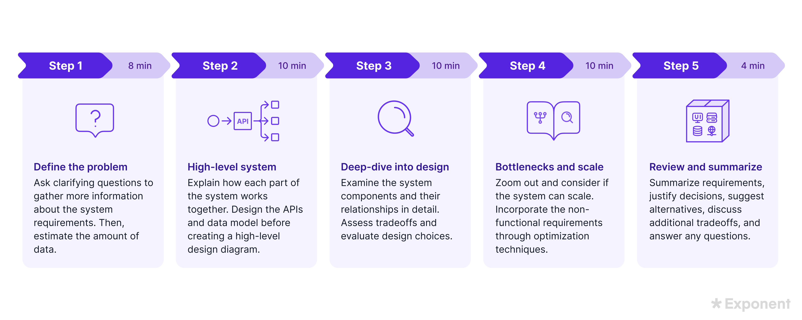

-
- ## Framework for System Design Interview
	- Understand the problem (`Time: 3-10 mins`)
	  logseq.order-list-type:: number
		- Ask questions to clarify requirements - both functional and non-functional requirements
			- **Func reqs**: features needed, # of users, traffic pattern,
			- **NFRs**: expected peak traffic, queries per second, scale up period in 3/6/9 months, availability, performance SLA, throughput, eventual consistency, are most cases read-only? etc.
			- Estimate the amount of data
		- Write down assumptions
	- Design the system at a high level (`Time: 10 mins`)
	  logseq.order-list-type:: number
		- Draw high level diagram and get the buy in
	- Design Deep Dive (`Time: 10-15 mins`)
	  logseq.order-list-type:: number
		- Deep dive into each component and explain
	- Identify bottlenecks and scaling opportunities  (`Time: 10 mins`)
	  logseq.order-list-type:: number
		- Zoom out and consider if the system can scale. Incorporate the non-functional requirements through optimization techniques.
	- Wrap up (`Time: 5 mins`)
	  logseq.order-list-type:: number
		- Think of opportunities to improve the design
		- Talk about the error cases (server failure, network failure, etc.)
		- Discuss about monitoring and rollout strategy
	- 
- # References
	- Books
		- System Design Interview - by Alex Xu
	- https://bytebytego.com/
	- https://newsletter.systemdesign.one/
	- https://www.geeksforgeeks.org/important-key-concepts-and-terminologies-learn-system-design/?ref=ghm
	- https://www.youtube.com/channel/UCZgt6AzoyjslHTC9dz0UoTw