# Overview
background-color:: yellow
collapsed:: true
	- ## Java Transaction APIs
		- ### JTA (Java Transaction API)
			- is a high-level, implementation-independent, protocol-independent API that allows applications and application servers to access transactions.
			- is an API, just like JDBC, implemented by vendors - typically by commercial servers or by open source txn managers such as JBoss Txn Service or JOTM.
		- ### JTS (Java Transaction Services)
			- specifies the implementation of a Transaction Manager which supports JTA and implements the Java mapping of the OMG Object Transaction Service (OTS) 1.1 specification at the level below the API.
			- JTS propagates transactions using the Internet Inter-ORB Protocol (IIOP).
		- ### JTA interfaces
			- `UserTransaction` Interface
			- `javax.transaction.UserTransaction` - allows to programmatically begin, commit or rollback txns, or get status.
			- `TransactionManager` Interface
			- primarily used within the Declarative Txn Model.
- # ACID & BASE
  background-color:: yellow
  collapsed:: true
	- ## ACID property
	  background-color:: pink
		- **Atomicity**  - means a txn must either be a commit or rollback all updates as a single unit of work.
		- **Consistency**  - means during the course of the txn, the resource (db or EMS) will not be left in an inconsistent state.
		- **Isolation**  - During the course of the txn, intermittent status of various participants is not visible to the external world.
		- **Durability**  - means when the txn is committed, then it is guaranteed that the txn is complete and the db or JMS updates are permanent.
		-
		- ACID mean that once a transaction is complete, its data is consistent (*tech lingo: write consistency*) and stable on disk, which may involve multiple distinct memory locations.
		- Write consistency can be a wonderful thing for application developers, but it also requires sophisticated locking which is typically a heavyweight pattern for most use cases.
	- ## BASE property
	  background-color:: pink
		- **Basic Availability**  - The database appears to work most of the time.
		- **Soft-state**  - Stores don’t have to be write-consistent, nor do different replicas have to be mutually consistent all the time.
		- **Eventual consistency**  - Stores exhibit consistency at some later point (e.g., lazily at read time).
		-
		- A BASE datastore values availability (since that’s important for scale), but it doesn’t offer guaranteed consistency of replicated data at write time. Overall, the BASE consistency model provides a less strict assurance than ACID: data will be consistent in the future, either at read time (e.g., Riak) or it will always be consistent, but only for certain processed past snapshots (e.g., Datomic).
- # Concurrency Control
  background-color:: yellow
  collapsed:: true
	- If someone is reading from a DB at the same time as someone else is writing to it, it is possible that the reader will see a half-written or inconsistent piece of data. There are several ways of solving this problem, known as **concurrency control methods**. The simplest way is to make all readers wait until the writer is done, which is known as a *lock*.
	- ## Concurrency Issues
	  background-color:: pink
	  collapsed:: true
		- ### Lost Updates
			- A *lost update* occurs when the following events occur, in the order presented here:
				- 1. A transaction in Session1 retrieves (queries) a row of data into local memory and displays it to an end user, User1.
				- 2. Another transaction in Session2 retrieves that same row, but displays the data to a different end user, User2.
				- 3. User1, using the application, modifies that row and has the application update the database and commit. Session1’s transaction is now complete.
				- 4. User2 modifies that row also, and has the application update the database and commit. Session2’s transaction is now complete.
		- ### Blocking
			- Blocking occurs when one session holds a lock on a resource that another session is requesting. As a result, the requesting session will be blocked—it will hang until the holding session gives up the locked resource.
			- The five common DML statements that will block in the database are `INSERT`, `UPDATE`, `DELETE`, `MERGE`, and `SELECT FOR UPDATE`
			- **Blocked Selects**
				- Can be awaited with `NOWAIT` - like `SELECT ... WHERE ... FOR UPDATE NOWAIT`
			- **Blocked Inserts**
				- Blocked inserts typically happen when 2 users try to insert same value into a table that contains a primary key/unique column.
				- It can be easily avoided by using a sequence or SYS_GUID() function
				- If the above solution doesn't work, then a manual lock can be used. In Oracle, `DBMS_LOCK.REQUEST(id)` will request an explicit lock. If 2 users request the lock with the same id, latter request will fail.
		- ### Deadlocks
			- TBD
	- ## Lock Strategies
	  background-color:: pink
	  collapsed:: true
		- ### Pessimistic Locking
		  background-color:: green
		  collapsed:: true
			- Block an operation of a transaction (using locks), if it may cause violation of the rules, until the possibility of violation disappears. Blocking operations is typically involved with performance reduction.
			- Most non-optimistic mechanisms (with blocking) are prone to deadlocks which are resolved by an intentional abort of a stalled transaction (which releases the other transactions in that deadlock), and its immediate restart and re-execution.
			- Using `FOR UPDATE WAIT` to *pessimistically- lock rows
			  
			  ```sql
			  select empno, ename, sal from emp where empno = 123
			  for update nowait --pessimistically locks the rows selected
			  ```
		- ### Optimistic Locking
		  background-color:: green
		  collapsed:: true
			- #### Optimistic Concurrency Control (OCC)
			  collapsed:: true
				- OCC delay the checking of whether a transaction meets the isolation and other integrity rules (e.g., serializability and recoverability) until its end, without blocking any of its (read, write) operations ("...and be optimistic about the rules being met..."), and then abort a transaction to prevent the violation, if the desired rules are to be violated upon its commit. An aborted transaction is immediately restarted and re-executed, which incurs an obvious overhead (versus executing it to the end only once). If not too many transactions are aborted, then being optimistic is usually a good strategy.
				- OCC assumes that multiple transactions can frequently complete without interfering with each other. While running, transactions use data resources without acquiring locks on those resources. Before committing, each transaction verifies that no other transaction has modified the data it has read. If the check reveals conflicting modifications, the committing transaction rolls back and can be restarted.
				- OCC is generally used in environments with low data contention. When conflicts are rare, transactions can complete without the expense of managing locks and without having transactions wait for other transactions' locks to clear, leading to higher throughput than other concurrency control methods. However, if contention for data resources is frequent, the cost of repeatedly restarting transactions hurts performance significantly; it is commonly thought that other concurrency control methods have better performance under these conditions.
				- However, **locking-based ("pessimistic")** methods also can deliver poor performance because locking can drastically limit effective concurrency even when deadlocks are avoided.
			- #### OCC in Databases
			  collapsed:: true
				- **Optimistic locking using a Version Column**
					- Add column `version` of type `TIMESTAMP` in a table
					- When inserting a new record, update `version` with current timestamp
					- When updating an existing row, check the value `version` before and after. If they are different, then it means the row values have changed in between.
				- **Optimistic locking using a Checksum**
					- Add column `hash` of type `VARCHAR` in a table
					- When inserting a new record, calculate the hash value of the entire row and update it in `hash` column
					- When updating an existing row, check the value `hash` before and after. If they are different, then it means the row values have changed in between.
			- **Usage**
			  collapsed:: true
				- HTTP does provide a form of built-in OCC: The GET method returns an ETag for a resource and subsequent PUTs use the ETag value in the If-Match headers; while the first PUT will succeed, the second will not, as the value in If-Match is based on the first version of the resource
				- MediaWiki's edit pages use OCC
				- Most implementations of software transactional memory use optimistic locking
				- Java Collections - *Compare-and-Swap(CAS)* based thread-safe collections like `ConcurrentLinkedQueue` and `ConcurrentSkipListMap`
		- ### Semi-optimistic Locking
		  background-color:: green
		  collapsed:: true
			- Block operations in some situations, if they may cause violation of some rules, and do not block in other situations while delaying rules checking (if needed) to transaction's end, as done with optimistic.
	- ## Concurrency Methods
	  background-color:: pink
	  collapsed:: true
		- ### Locking
		  background-color:: green
		  collapsed:: true
			- (e.g., Two-phase locking - 2PL) - Controlling access to data by locks assigned to the data. Access of a transaction to a data item (DB object) locked by another transaction may be blocked (depending on lock type and access operation type) until lock release.
			- #### Two-phase Locking (2PL)
				- In databases and transaction processing, two-phase locking (2PL) is a concurrency control method that guarantees serializability.
				- In 2PL protocol locks are applied and removed in two phases:
					- **Expanding phase**: locks are acquired and no locks are released.
					- **Shrinking phase**: locks are released and no locks are acquired.
				- Two types of locks are utilized by the basic protocol:
					- **Shared** lock and
					- **Exclusive** locks.
				- Refinements of the basic protocol may utilize more lock types.
				- Using locks that block processes, 2PL may be subject to deadlocks that result from the mutual blocking of two or more transactions.
			- #### Strong Strict Two-phase Locking (SS2PL)
				- Also named *rigourousness*
		- ### MVCC
		  background-color:: green
		  collapsed:: true
			- Locking mechanism is slow. So MVCC takes a different approach each user connected to the DB sees a snapshot of the DB at a particular instant in time. Any changes made by a writer will not be seen by other users of the DB until the changes have been completed (or, in DB terms: until the transaction has been committed.)
			- When an MVCC DB needs to update an item of data, it will not overwrite the old data with new data, but instead mark the old data as obsolete and add the newer version elsewhere. Thus there are multiple versions stored, but only one is the latest. This allows readers to access the data that was there when they began reading, even if it was modified or deleted part way through by someone else.
			- Requires (generally) the system to periodically sweep through and delete the old, obsolete data objects.
			- For a document-oriented DB it also allows the system to optimize documents by writing entire documents onto contiguous sections of disk—when updated, the entire document can be re-written rather than bits and pieces cut out or maintained in a linked, non-contiguous DB structure.
			- MVCC provides point ***in time consistent views***. Read transactions under MVCC typically use a timestamp or transaction ID to determine what state of the DB to read, and read these versions of the data. Read and write transactions are thus isolated from each other without any need for locking. Writes create a newer version, while concurrent reads access the older version.
			- MVCC is a concurrency control method commonly used
				- by DB management systems to provide concurrent access to the DB,
				- by source code version control systems like SVN, Git
				- and in programming languages to implement transactional memory.[1]
		- ### Timestamp ordering (TO)
		  background-color:: green
		  collapsed:: true
			- Assigning timestamps to transactions, and controlling or checking access to data by timestamp order.
			- a timestamp-based concurrency control algorithm is a **non-lock concurrency control method**. It is used in some databases to safely handle transactions, using timestamps.
			- HBase does this type of implementation
			- **Assumptions**
				- Every timestamp value is unique and accurately represents an instant in time.
				- No two timestamps can be the same.
				- A higher-valued timestamp occurs later in time than a lower-valued timestamp.
			- **Issues**
				- **Timestamp Resolution** - If the resolution of the timestamp is too large (coarse), the possibility of two or more timestamps being equal is increased and thus enabling some transactions to commit out of correct order.
				- This won't work in a distributed database where different servers could potentially have incorrect time settings
		- ### Serialization graph checking
		  background-color:: green
		  collapsed:: true
			- (also called Serializability, or Conflict, or Precedence graph checking) - Checking for cycles in the schedule's graph and breaking them by aborts.
		- ### Commit ordering (CO)
		  background-color:: green
		  collapsed:: true
			- Controlling or checking transactions' chronological order of commit events to be compatible with their respective precedence order.
			- Commit ordering is a general serializability technique that achieves distributed serializability effectively on a large scale
		- ### Index concurrency control
		  background-color:: green
		  collapsed:: true
			- Synchronizing access operations to indexes, rather than to user data. Specialized methods provide substantial performance gains.
		- ### Private workspace model
		  background-color:: green
		  collapsed:: true
			- (Deferred update) - Each transaction maintains a private workspace for its accessed data, and its changed data become visible outside the transaction only upon its commit (e.g., Weikum and Vossen 2001). This model provides a different concurrency control behavior with benefits in many cases.
- # Transaction Types
  background-color:: yellow
  collapsed:: true
	- ## Flat Transactions
	  background-color:: pink
		- A flat transaction is the simplest form of a transaction. It comprises a collection of operations that are bounded by a begin statement and an end statement.
		- > Either all of the operations in the bounded collection are executed (committed) or none are (aborted).
		- A transaction may be aborted either by the program executing it or because of an external failure, such as a system crash.
	- ## Flat Transactions with Savepoints
	  background-color:: pink
		- There are cases in which flat transactions are too simple a model to be effective. Consider a travel agent attempting to book a complex itinerary. She may have booked airlines and hotels for several legs but then finds that a booking attempt for the next leg fails. She either must abort the entire transaction and try again or put in a compensating transaction to back out the failed operations. Neither is desirable.
		- It would be much better if she could simply return the current transaction to some previous transaction state that is consistent. This is what **savepoints** are all about. A *save work* command saves the current state of the transaction. At any later time, the application can roll back the transaction to any of the transaction savepoints that have been established.
	- ## Chained Transactions
	  background-color:: pink
		- Chained transactions are a variant of savepoints. However, rather than simply marking a point of consistency to which the transaction can return, the **chain work command** actually commits the work so far. Therefore, there is no opportunity to roll back any of the previous work. However, the transaction itself survives. Any locks held by the transaction continue to be held as further work is done. Only when the full transaction is committed are its locks released.
	- ## Nested Transactions
	  background-color:: pink
		- A nested transaction comprises a tree of transactions. The root transaction can spawn sub-transactions which themselves can spawn additional **subtransactions**. The leaves of the transaction tree are flat transactions.
		- A parent transaction can pass its locks to a child subtransaction.
		- A subtransaction can commit or abort at any time.
		- In this case, any locks owned by the subtransaction are counter-inherited by the parent. Only when the root transaction commits are all locks released.
	- ## Distributed Transactions
	  background-color:: pink
		- Distributed transactions are those that must execute across a network of databases. They are similar to nested transactions. However, the transaction tree for a nested transaction is application-dependent, whereas the tree for a distributed transaction is data-dependent.
		- Distributed transactions are basically flat transactions. However, if data held by a remote database must be updated, a subtransaction is started on that database. The scope of the sub-transaction is the set of operations on the database. At commit time, the parent transaction queries all of its subtransactions to ensure that all of them are prepared to commit before issuing a commit command. If one or more subtransactions cannot commit, the transaction is aborted.
		- Today’s distributed transaction standard for heterogeneous systems is XA from [The Open Group](http://www.opengroup.org/bookstore/catalog/c193.htm).
	- ## Long-Lived Transactions
	  background-color:: pink
		- Batch transactions are an example of long-lived transactions which can contain millions of updates and last for hours. This can be an intolerable situation.
		- One solution is to break the batch job into mini-batches operating on data with a common attribute, such as a range of keys. This is not a perfect solution since the atomicity of the entire transaction cannot be maintained.
- # Transaction Models
  background-color:: yellow
  collapsed:: true
	- ## Local transactions
	  background-color:: pink
	  collapsed:: true
		- Txn is not managed by the framework, but by the local resource manager like db or messaging provider.
		- Developer manages connection, not the txn.
		- **Pros**
			- Code is simple code. All you have to do is to turn off auto commit on Connection, and commit/rollback when needed.
			- Works well for simple applications
		- **Cons/limitations**
			- Error-prone. Plenty of room for developers to make mistakes which could be disastrous.
			- Works only on a single resource. Cannot co-ordinate a txn across global resources like Db and EMS.
			- Say if the txn code is split between different DAOs, the connection needs to be explicitly passed (called as ***connection passing strategy***) which is typically error-prone.
	- ## Global Transactions
	  background-color:: pink
	  collapsed:: true
		- 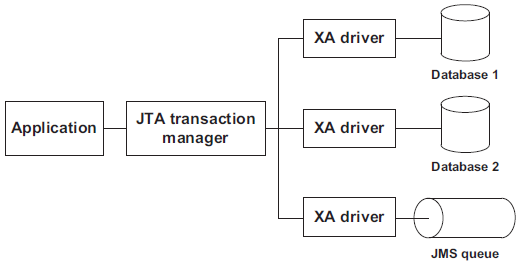
		- For any transaction that spans across multiple resources, an application relies on a dedicated component called *transaction manager*. This component implements a special protocol called **XA**.
		- In this case, a third-party component handles the transactions, so we call such transactions ***managed transactions***.
		- In Java, to perform global transactions using the XA protocol, we need the following:
			- ***A JTA transaction manager***  —It implements the Java Transaction API (JTA) specification,
			  which requires the implementation of the XA protocol. Such a transaction
			  manager is included in a Java EE application server or is available as a
			  standalone component.
			- ***XA-aware drivers***—The resources must provide XA-compliant drivers so the transaction
			  manager can communicate with the resources using the XA protocol. Practically
			  speaking, this implies the drivers provide implementations of interfaces like
			  `javax.sql.XAConnection`. Thanks to these interfaces, the JTA transaction manager
			  can enlist the resources in distributed transactions, as shown in the picture above.
		- All Java EE application servers include a JTA transaction manager (Glassfish, JBoss,
		  WebSphere, and so on).
		- Standalone JTA transaction managers: Atomikos, Java Open Transaction Manager (JOTM), and the Bitronix Transaction Manager
		  
		  > Warning: Spring doesn’t provide a JTA transaction manager. The Spring `JtaTransactionManager` class is only a bridge between Spring’s transaction management support and a full-blown JTA transaction manager.
	- ## Programmatic transactions
	  background-color:: pink
	  collapsed:: true
		- Leverages JTA API implementation
		- Developer manages txn rather than the connection, using `javax.transaction.UserTransaction`
		- EJB Example
		  collapsed:: true
			- ``` java EJB Example
			  UserTransaction txn = sessionCtx.getUserTransaction();
			  txn.begin();
			  try{
			    myDAO.updateOne(...);
			    myDAO.updateTwo(...);
			    txn.commit();
			  } catch(...){
			  	txn.rollback();
			  throw e;
			  }
			  ```
		- Spring Example
		  collapsed:: true
			- ``` java 
			  import org.springframework.transaction.support.*;
			  
			  TransactionTemplate transactionTemplate = new TransactionTemplate();
			  
			  transactionTemplate.execute(new TransactionCallback(){
			  public Object doInTransaction(TransactionStatus status){
			    try{
			        myDAO.updateOne();
			    }catch(...){
			        status.setRollbackOnly();
			        throw e;
			    }
			  }
			  }
			  );
			  ```
		- In the above EJB example, txn context is propagated to the DAO. Unlike the local txn model, DAO need not manage connections/txns. All it needs to do is get connections from a pool.
		- In the above Spring example, there is no need to explicitly invoke begin() or commit(). Also, the rollback is hinted via the txn status, and not on txn itself.
		- Typically an instance of `UserTransaction` is obtained via JNDI look up. 
		  
		  ``` java
		  UserTransaction txn = (UserTransaction)new InitialContext()
		    .lookup("javax.transaction.UserTransaction");
		  ```
		  
		  However, the look up string name could be different for app servers. To run the code outside of a container like for unit test cases, TransactionManager interface is used as below.
		  
		  ``` java Load the txn manager factory class
		  //Websphere EJB txn manager example
		  Class txnClass = Class.forName("com.ibm.ejs.jts.jta.TransactionManagerFactory"); 
		  
		  TransactionManager mgr = (TransactionManager)txnClass
		  	.getMethod("getTransactionManager", null)
		      .invoke(null, null);
		  
		  //Start the txn via txn manager
		  mgr.begin();
		  ```
		- When to use?
			- client-initiated transactions
			- Localized JTA transactions - If the process has multiple steps and if a txn is required only during a particular phase, then the only way to achieve this localized JTA txn is via programmatic model.
			- For performance reasons.
		- Cons
			- Error-prone - since developer is handling txns, if exceptions are not handled properly in the code, it could be disastrous.
			- Transaction Context Problem: A txn context cannot be passed from a DAO that implements programmatic txn model into another DAO implementing the same txn model. Because, when one of them invoke the other, both will try to begin a new txn on separate threads. This violates the ACID principle since failure in other thread won't be visible to the other.
	- ## Declarative transactions
	  background-color:: pink
	  collapsed:: true
		- Framework or container manages the txn (which is why it is also called Container Managed Transactions or CMT)
		- Txns are configured through configuration parameters. e.g., XML descriptors in EJB or bean definition file `ApplicationContext.xml` in Spring.
		- Developer only says when to rollback. In Spring, rollback rules are specified via `TransactionAttributeSource` interceptor.
		- ``` java EJB Example
		  @Stateless
		  @TransactionManagement(TransactionManagementType.CONTAINER)
		  public class MyDAO{
		    @TransactionAttribute(TransactionAttributeType.REQUIRED) 
		    public void update(){
		      try{
		          myDAO.updateOne(...);
		          myDAO.updateTwo(...);
		      }catch(...){
		          sessionCtx.setRollbackOnly();
		          throw e;
		      }
		    }
		  }
		  ```
		- As in the above EJB example, developer invokes only the `setRollbackOnly()` method. At class level, we specify that it uses declarative transaction through the annotation.
		- In Spring, developer need not call the method explicitly. Instead the rollback rules of when to rollback is specified in the `TransactionAttributeSource` interceptor. We specify that it uses declarative transaction through `TransactionProxyFactoryBean` proxy - the txn bean is wrapped with a proxy.
		- ### Transaction Attributes
		  background-color:: green
		  collapsed:: true
			- In declarative txn, we must tell the container when to begin a txn, which methods should participate in a txn, etc. There are 6 transaction attributes (shown in table below)
			- Transaction Attributes
				- can be specified at method-level and bean-level.
				- bean-level setting applies for all the methods in the class, which can be overridden.
				- even if not specified, default attribute is applied to all the methods.
			- Spring interface `Synchronization` provides callback methods for the `afterBegin()`, `beforeCompletion()`, and `afterCompletion()` of a JTA transaction.
			- | Attribute Value (For Spring prefix PROPAGATION_ ) | Txn is needed to execute the method?| What if a txn is already open?| What if no txn open?| When to use? | 
			  | -- | -- | -- | -- | -- |
			  | REQUIRED | Yes | Use it | Start a new one |    |
			  | MANDATORY | Yes | An open txn must always exist before invoking the method | Throws exception. Never starts a new one. |   |
			  | REQUIRESNEW | Yes. Always start a new txn. | Suspend existing txn, start new one and resume the previous one after completing the new one. | Start a new one | When an activity needs to be committed regardless of the surrounding txn. E.g. audit logging during trading operation |
			  | SUPPORTS | No | Use it. In fact, any uncommitted change made by the surrounding txn is also visible. | It works as it and doesn’t start a new txn. |   |
			  | NOTSUPPORTED | No | Suspend existing txn, complete the method invocation and resume the txn. |  | For example, invoking a stored proc containing a DDL within the context of an XA txn will throw exception. This attribute is useful in such cases. |
			  | NEVER | No. Never start a txn. | Throws exception | N/A | |
- # Transaction Isolation Level
  background-color:: yellow
  collapsed:: true
	- Transaction isolation is a function of db concurrency and db consistency. As we increase the level of txn isolation, we in effect lower the db concurrency but increase the db consistency. (Isolation­­­ & Consistency are inversely proportional to concurrency )
	-
	- **Data concurrency**  means that many users can access data at the same time.
	- **Data consistency**  means that each user sees a consistent view of the data, including visible changes made by the user's own transactions and transactions of other users.
	- ## Isolation Levels
	  background-color:: pink
		- | Dirty Read / Uncommitted Read | Read Committed | Repeatable Read | Serializable | 
		  | ----------------------------- | -------------- | --------------- | ------------ | 
		  | 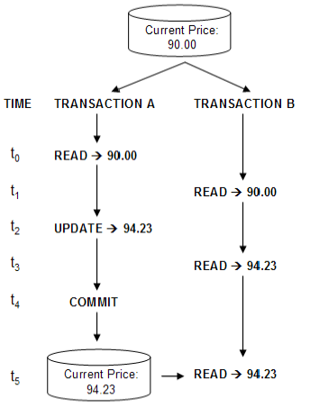 | 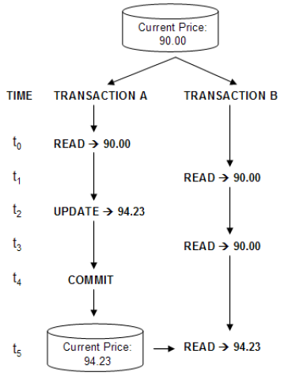 | 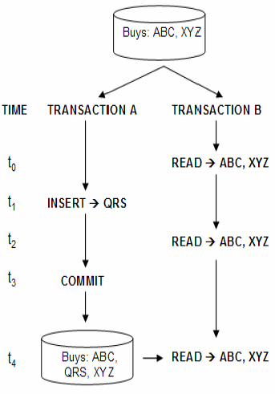 | 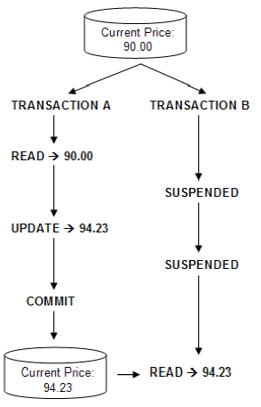 |
		- ### 1. Read Uncommitted
		  background-color:: green
			- Allows transactions to read non-committed updates (dirty reads) made by other transactions.
			- Lowest level of isolation supported by EJB & Spring.
		- ### 2. Read Committed
		  background-color:: green
			- Allows multiple transactions to access the same data, hiding the non-committed updates from other transactions until they are committed.
			- This is the default isolation setting for most of the databases.
		- ### 3. Repeatable Read
		  background-color:: green
			- Repeatable read is a higher isolation level, that in addition to the guarantees of the read committed level, it also guarantees that any data read cannot change, if the transaction reads the same data again, it will find the previously read data in place, unchanged, and available to read.
			- Ensures that once a set of values are read from the db for a particular txn, that same set of values will be read every time the select statement is executed, unless the txn holding the read and write locks modifies the data.
		- ### 4. Serializable
		  background-color:: green
			- serializable makes an even stronger guarantee: in addition to everything repeatable read guarantees, it also guarantees that no new data can be seen by a subsequent read
			- Interleaving txns are stacked up so that only one txn is allowed access to data at a time.
			- The serializable mode of transaction behavior tries to ensure that transactions run in such a way that they appear to be executed one at a time, or serially, rather than concurrently.
			- Lowest level of isolation supported by Java.
			- ```sql
			  BEGIN TRANSACTION;
			  SELECT - FROM T;
			  WAITFOR DELAY '00:01:00'
			  SELECT - FROM T;
			  COMMIT;
			  ```
			- That is a simple task that issue two reads from table T, with a delay of 1 minute between them.
			- under READ COMITTED, the second SELECT may return ***any data***. A concurrent transaction may update the record, delete it, insert new records. The second select will always see the ***new data***.
			- under REPEATABLE READ, the second SELECT is guaranteed to see the rows that has seen at first select ***unchanged***. New rows may be added by a concurrent transaction in that one minute, but the existing rows cannot be deleted nor changed.
			- under SERIALIZABLE, the second select is guaranteed to see ***exactly***  the same rows as the first. No row can change, nor deleted, nor new rows could be inserted by a concurrent transaction.
		- ### 5. Snapshot
		  background-color:: green
			- And finally, there is also the SNAPSHOT isolation level. SNAPSHOT isolation level makes the same guarantees as serializable, but not by requiring that no concurrent transaction can modify the data, but by making every reader see it's own version of the world (it's own 'snapshot'). This makes it very easy to program against, very scalable as it does not block concurrent updates, but of course it has a price, and the price is extra server resource consumption.
- # Transaction Read Phenomena
  background-color:: yellow
  collapsed:: true
	- [Oracle Guide - Data Concurrency and Consistency](http://docs.oracle.com/cd/B28359_01/server.111/b28318/consist.htm)
	- The ANSI/ISO SQL standard (SQL92) defines 4 levels of transaction isolation with differing degrees of impact on transaction processing throughput. These isolation levels are defined in terms of 3 phenomena that must be prevented between concurrently executing transactions.
	- The three preventable phenomena are:
	- ## 1. Dirty Read / Uncommitted Read
	  background-color:: pink
		- One process (P1) modifies a row, and another process (P2) then reads that row before it is committed by P1. If P1 then rolls back the change, P2 will have read a row that was never committed and that may thus be considered to have never existed.
		- Isolation Level: `READ UNCOMMITTED`
	- ## 2. Non-Repeatable Read
	  background-color:: pink
		- Process P1 reads a row. Process P2 then modifies or deletes that rows and commits the change. If P1 re-reads the row it receives the modified value or discovers the row has been deleted.
		- Isolation Level: `READ COMMITTED`
	- ## 3. Phantom Read
	  background-color:: pink
		- Process P1 reads the set of rows N that satisfy some search condition. Process P2 then executes statements that generate one or more rows that satisfy the search condition. If P1 repeats the query it obtains a different collection of rows.
		- Phantom Vs. Non-repeatable
		- The Non-Repeatable Read is a phenomena specific to a read of a single record. When data has changed in this record, and the record is read again, the changed data is returned. This is a non-repeatable read.
		- The Phantom Read is a phenomenon that deals with queries that return sets. The thing that’s changing in a phantom read is not the data in the records; it’s the set membership that has changed.
		- For records that have been deleted, if a transaction reads them (or rather fails to read them) it would seem that this is both a non-repeatable read and a phantom read. But for the purposes of the ISO/ANSI standard it is in fact considered a non-repeatable read.
		  
		  | **Isolation Level**| **Dirty Read**  | **Nonrepeatable Read**  | **Phantom Read**  |
		  | **Read Uncommitted**| Possible| Possible|Possible |
		  | **Read Committed**| Not Possible | Possible| Possible|
		  | **Repeatable Read**| Not Possible | Not Possible | Possible|
		  | **Serializable**| Not Possible | Not Possible | Not Possible |
- # Distributed Transaction Processing
  background-color:: yellow
  collapsed:: true
	- Distributed txn is a txn that spans over 1 or more resources. It could be between 2 different dbs, or 2 different messaging channels, or db and a messaging queue/topic.
	- ## XA Transaction Processing
	  background-color:: pink
	  collapsed:: true
		- 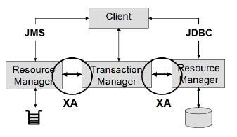
		- The X/Open XA Interface is a bi-directional system-level interface that forms the communication bridge between a transaction manager and 1 or more resource managers.
		- The Transaction Manager manages the lifecycle of a txn, and co-ordinates resources. In JTA, txn manager is abstracted through the `javax.transaction.TransactionManager` interface and implemented through the underlying transaction service.
		- The Resource Manager controls and manages the actual resource participating in the txn like db or JMS queue.
		- XA txn should only be used when a transaction needs to be coordinated between multiple resources, i.e., databases, queues or topics.
		- ### XA Resource
		  background-color:: green
			- Without XA, messages sent to a topic/queue are typically read by receivers immediately. With XA, the message in the queue would not be released until the txn is committed.
			- To perform a XA txn between multiple resources, each participating resource should be an XA resource. (Some vendors support a feature where 1 resource could be a non-XA resource. )
	- ## 2-phase commit protocol
	  background-color:: pink
	  collapsed:: true
		- Mechanism used by XA to coordinate multiple resources during a global transaction.
		- A txn manager coordinates txns between resource managers using a two-phase commit protocol.
		- The two-phase commit protocol provides the ACID properties of transactions across multiple resources.
		- In phase 1,
			- the transaction manager tells each resource to "prepare" to commit; that is, to perform all operations for a commit and be ready either to make the changes permanent or to undo all changes.
			- Each resource manager responds back with READY, READ_ONLY or NOT_READY.
		- In phase 2,
			- if all resource managers respond back with READY, the transaction manager tells all resource managers to commit their changes; otherwise, it tells them all to roll back and indicates transaction failure to the application.
			- Participants that respond with a READ_ONLY are removed from the 2nd phase.
		- 2-phase commit is possible due to the bi-directional communication capabilities of the XA interface.
		- **Last Participant Support**  / **Last Resource Commit**
			- Some commercial containers allow this feature where an non-XA resource to participate in a global txn. The non-XA resource participates only in the phase 1 of the txn.
			- | 2PC Commit Scenario | 2PC Rollback Scenario |
			  | ------------------- | --------------------- |
			  | 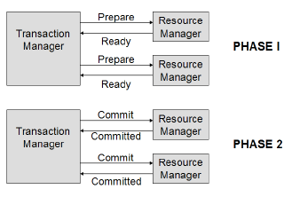 | 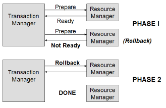 |
	- ## Heuristic Exceptions
	  background-color:: pink
	  collapsed:: true
		- During the 2-phase commit process a Resource Manager may use heuristic decision making and either commit or rollback its work independent of the Txn Mgr. Heuristic decision making is a process that involves making intelligent choices based on various internal and external factors. When a Resource Manager does this it is reported back to the client through Heuristic Exception.
		- They only occur under XA during the 2-phase commit process, specifically after a participant has responded in phase 1. The most common reason for this is a timeout condition between phase 1 and 2. When communication is lost or delayed, the resource managers might make a decision to commit or rollback its work in order to free up resources.
		- ### Heuristic Exception Types
		  background-color:: green
			- The 3 JTA Heuristic exceptions in JTA are
				- `HeuristicRollbackException` - between phase 1 and 2, if *all the resource mgrs- decides to rollback the txn, then upon entering phase 2 of the commit request this exception is thrown back to the caller.
				- `HeuristicMixedException` - same as above, but this is thrown if *one of the resource mgrs- decides to rollback.
				- `HeuristicCommitException`
- # Transaction Strategies
  background-color:: yellow
  collapsed:: true
	- Two golden rules apply to all of the transaction strategies :
		- The method that starts the transaction is designated as the transaction owner
		- Only the transaction owner can roll back the transaction
	- ## 1. API Layer Strategy
	  background-color:: pink
	  collapsed:: true
		- 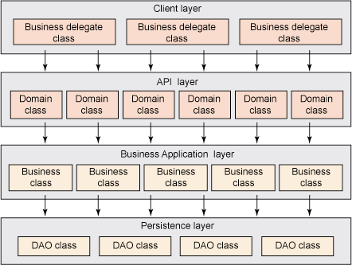
		- **Transaction Owner**: API Layer - this is where the begin, commit and rollback of a txn occurs
		- **When to apply this?**
			- apps with coarse-grained API layer
			- apps with multiple client channels like webservice client, desktop client, web client, etc.
		- **Rules for implementing this strategy**
			- only public methods in the API layer should have txn logic
			- all public write methods are marked with REQUIRED txn attribute
			- all public read method are marked with SUPPORTS
			- all public write methods should handle checked exceptions with a rollback logic
		- **Limitations/Restrictions**
			- When a public write method calls another public write method in a txn, and if an exception occurs, the rollback logic could potentially be handled by the 2nd method instead of the txn owner.
			- Clients cannot make a multiple calls to API layer as a single unit of work.
			- Extra attention needed if the same public method is called by clients that act as a txn owner and clients does not start a txn. (see [IBM article](http://www.ibm.com/developerworks/java/library/j-ts3/index.html#restrictions) for more details)
	- ## 2. Client Orchestration Strategy
	  background-color:: pink
	  collapsed:: true
		- **Transaction Owner**: Client Layer. Though both client & API layer contains the txn logic, only the client layer begins, commits and rolls back the txn. API layer has only  txn attributes marked on the methods.
		- **When to apply this?**
			- apps with complex and fine-grained API layer
			- cannot use with clients that cannot propagate txn to API layer, e.g., JMS clients, web service clients, etc.
		- **Rules for implementing this strategy**
			- only client & API layer contains the txn logic. Client layer is the txn owner
			- typically with this strategy, programmatic model is used in client. The exception to this rule is if the client business delegate in the client layer controlling the transaction scope is managed as a Spring bean by the Spring Framework. In this case, you can use the declarative transaction model provided by Spring.
			- all public write methods in API layer are marked as MANDATORY - no rollback logic in them
			- all public read methods in API layer are marked as SUPPORT.
			- If the client layer is making remote calls to the API layer, the client layer must use a protocol and transaction manager that supports the propagation of a transaction context (such as RMI-IIOP).
		- **Limitations/Restrictions**
			- Client layer must be able to start a txn and propagate it to the API layer. This is not possible with JMS client or web service client
	- ## 3. High Concurrency Strategy
	  background-color:: pink
		- ...
	- ## 4. High Performance Strategy
	  background-color:: pink
		- ...
- # Transaction Patterns
  background-color:: yellow
  collapsed:: true
	- ## 2 Phase Commit Protocol or Pattern
	  background-color:: pink
	  collapsed:: true
		- > Check above for explanation
		- Global transactions are tricky. They are
			- difficult to configure
			- some implementations of transaction managers and XA drivers remain bugy.
			- XA is inherently slower than local transactions because the strong transactional guarantees it provides imply some overhead (the transaction manager and the resources need to maintain precise logs of what they’re doing, for instance)
		- Depending on the context and resources involved, other techniques are viable alternatives to XA; they involve coding and usually perform better than XA.
	- ## Shared Resource Transaction Pattern
	  background-color:: pink
	  collapsed:: true
		- 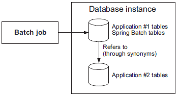
		- This pattern works only when two databases are involved
		- Sometimes, the same physical resource backs multiple logical resources. For example, two JDBC `DataSource`s can point to the same database instance. Using Oracle terminology, we say that you refer to schema B from schema A by using the same connection. You also need to define synonyms in schema A for schema B’s tables. This enables real global transactions using the same mechanism as for local transactions.
		- The overhead is a little more than for true local transactions but less than with XA.
		- Diagram here showsUse the shared resource transaction pattern when a common resource hosts the transactional resources. In this example, two Oracle database schemas exist in the same database instance. The first schema refers to the second schema’s tables using synonyms. This allows the application to use local transactions.
		- ***Spring Batch use-case***  - Here’s an example of the shared resource transaction pattern applied to Spring Batch. People are sometimes reluctant to host the batch execution metadata in the same database as the business data (they don’t want to mix infrastructure and business concerns, which makes sense). Therefore, Spring Batch must span transactions over two databases for the execution metadata and the business data to ensure proper counts of skipped items, retries, and so on. You can use the shared resource transaction pattern to host batch execution metadata and business data in different databases. The pattern keeps your batch metadata and business data separate and properly synchronized, and you can stick to local transactions.
	- ## Best Effort Pattern
	  background-color:: pink
		- 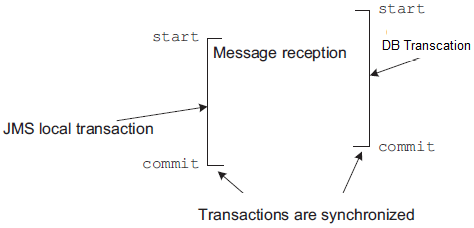
		- This pattern works only when a 2 databases or a database and a JMS queue are involved
		- This pattern requires two resources—a JMS queue and a database—and must be transactional. What can go wrong? Let’s look at the two cases:
			- **Losing the message** — The application receives a message, acknowledges it, but fails to process it. The message is no longer on the queue, and there’s been no processing in the database: the message is lost.
			- **Receiving and processing the same message twice** —The application receives a message and processes it, but the acknowledgment fails. The JMS broker delivers the message again, and the application processes it again. We call this a *duplicate message*.
		- **Avoid losing messgae with Transcation Synchronization**
			- To avoid losing messages, Spring synchronizes the local JMS transaction with the database transaction. Spring commits the JMS transaction immediately after the commit of the database transaction. We call this the *best effort pattern*.
		- **Avoid duplicate messages**
			- To avoid duplicate messages, the application must programmatically check before processing a message from the JMS queue
		- **Handling duplicate messages with Idempotency**
			- Idempotency is an interesting property for message processing. It means that we don’t care about duplicate messages! Always think about idempotency when designing a system: idempotent operations can make a system much simpler and more robust. (In Maths, n x 0 = 0)
- # Bibliography
	- Books
		- Java Transaction Design Strategies - Mark Richards
		- Java Transaction Processing: Design and Implementation - Mark Little, Jon Maron, Greg Pavlik
		- Principles of Transaction Processing - Philip A. Bernstein, Eric Newcomer
	- Websites
		- [IBM - Txn Mgmt Series - Mark Richards](http://www.ibm.com/developerworks/views/java/libraryview.jsp?site_id=1&contentarea_by=Java&sort_by=Date&sort_order=1&start=1&end=6&topic_by=&product_by=&type_by=All%20Types&show_abstract=true&search_by=transaction%20strategies:&industry_by=&series_title_by=)
		- [Spring Txn Mgmt](http://static.springsource.org/spring/docs/3.0.x/reference/transaction.html)
		- http://www.jboss.org/jbosstm/resources/fundamentals.html
		- http://www.pjug.org/jta-j2ee-pjug-2003-07-22.ppt
		- [Nuts And Bolts Of TP](http://www.subbu.org/articles/transactions/NutsAndBoltsOfTP.html)
		- [Distributed transactions in Spring, with and without XA](http://www.javaworld.com/article/2077963/open-source-tools/distributed-transactions-in-spring--with-and-without-xa.html)