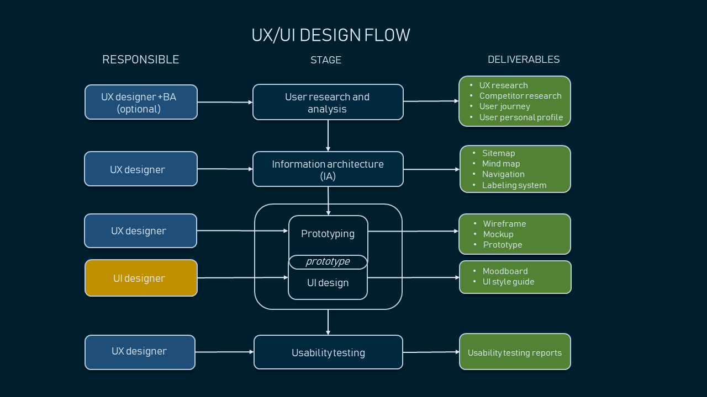
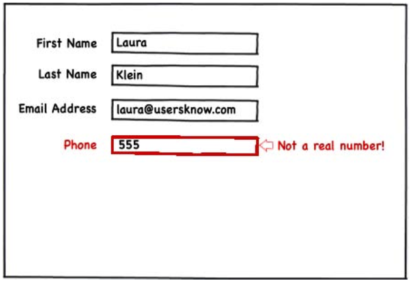
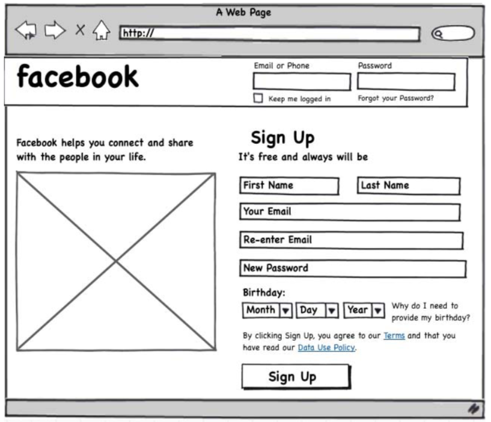

- > The biggest lie in software is Phase 2
- # Lean UX
	- ## Why Lean UX?
		- they help remove waste from UX design process
		- they drive us to harmonize our “system” of designers, developers, product managers, quality assurance engineers, marketers, and others in a transparent, cross-functional collaboration that brings non-designers into our design process
		- the mindset shift we gain from adopting a model based on experimentation. Instead of relying on a hero designer to divine the best solution from a single point of view, we use rapid experimentation and measurement to learn quickly how well (or not) our ideas meet our goals.
		- In all of this, the designer’s role begins to evolve toward design facilitation, and with that we take on a new set of responsibilities.
		- Lean UX not only brings software designers to the table but also brings our partners in business and technology to the whiteboard to work with us on the best solutions in an ongoing way.
		- building a pixel-perfect spec might be a route to raking in six-figure consulting fees, but it’s not a way to make a meaningful difference to a real product that is crucial to real users. It’s also not the reason that any designer got into the product design business. We got in to build valuable products and services, not to write specs.
		- to overcome the feeling that I was showing work that was “ugly”, “unfinished”, or “not ready.” Working this way requires the support of a high-functioning team. You need to know—as a team—that you’re not going to get it right the first time and that you’re all working together to iterate your way forward.
		- _Shared Understanding_
			- Lean UX is deeply collaborative and cross-functional, because we no longer have the luxury of working in isolation from the rest of the product team. We can’t continue to ask our teams to wait for us to figure it all out. We need daily, continuous engagement with our teams if we are going to be effective. This continuous engagement allows us to strip away heavy deliverables in favor of techniques that allow us to build shared understanding with our teammates.
	- ## 3 Foundations of Lean UX
		- ### Design Thinking
		- ###  Agile software development
			- Individuals and interactions over process and tools
			- Working software over comprehensive documentation
			- Customer collaboration over contract negotiation
				- Collaborating with your teammates and customers builds a shared understanding of the problem space and proposed solutions. It creates consensus behind decisions. The result? Faster iterations, real involvement in product making, and team investment in validated learning.
				- It also lessens dependency on heavy documentation, as everyone on the team has already participated in making the decisions that were used to require written communication and defense.
			- Responding to change over following a plan
				- The assumption in Lean UX is that the initial product designs will be wrong, so the goal should be to find out what’s wrong with them as soon as possible.
		- * Lean Startup method
			- Lean Startup uses a feedback loop called **build-measure-learn** to minimize project risk and gets teams building quickly and learning quickly.
			- Teams build Minimum Viable Products (MVPs) and ship them quickly to begin the process of learning as early as possible.
- ## Principles of Lean UX
  collapsed:: true
	- ### Cross-functional teams
		- are made up of various disciplines involved in creating your product.
		- Software engineering, product management, interaction design, visual design, content strategy, marketing, and quality assurance (QA) should all be included in a Lean UX team.
		- Lean UX demands a high level of collaboration between these disciplines. Their involvement must be continuous, from day one of the project until the end of the engagement.
		- __Why?__
			- collapses the gated-handoff process known as _waterfall_.
			- Insight on each idea is brought in from all relevant disciplines earlier in the process.
			- Conversation is encouraged across functional silos, which drives greater team efficiency.
	- ### Small, Dedicated, Colocated
		- Keep your teams small—no more than 10 total core people.
		- Dedicate them to one project and staff it all out of the same location.
		- __Why?__
			- Small teams improves 3 things: communication, focus, and camaraderie.
			- Smaller teams are easier to keep current on project status, changes, and new learning.
			- Dedicating your team to one project keeps everyone on the team focused on the same priorities all the time.
			- Having the team all in one place allows relationships to grow between colleagues.
	- ### Progress = outcomes, not output
		- Features and services are outputs.
		- The business goals they are meant to achieve are outcomes.
		- Lean UX measures progress in terms of explicitly defined business outcomes.
		- __Why?__
			- When we attempt to predict which features will achieve specific outcomes, we are mostly engaging in speculation. Although it’s easier to manage toward the launch of specific feature sets, we don’t know in any meaningful way whether a feature is effective until it’s in the market.
			- By managing to outcomes (and the progress made toward them), we gain insight into the efficacy of the features we are building. If a feature is not performing well, we can make an objective decision as to whether it should be kept, changed, or replaced.
	- ### Problem-Focused teams
		- A team that has been assigned a business problem to solve, as opposed to a set of features to implement. This is the logical extension of the focus on outcomes.
		- __Why?__
			- Assigning teams problems to solve shows trust in those teams.
			- It allows them to come up with their own solutions and drives a deeper sense of pride and ownership in the solutions the team implements.
	- ### Removing Waste
		- One of the core tenets in Lean manufacturing is the removal of anything that doesn’t lead to the ultimate goal.
		- the ultimate goal is improved outcomes; hence, anything that doesn’t contribute to that is considered waste and should be removed from the team’s process.
		- __Why?__
			- Team resources are limited. The more waste the team can eliminate, the faster they can move. Teams want to work on the right challenges. They want to be effective. A discipline of waste removal can help teams keep their laser focus where it belongs.
	- ### Small Batch Size
		- Lean manufacturing uses this notion to keep inventory low and quality high.
		- In Lean UX, this means creating only the design that is necessary to move the team forward and avoiding a big “inventory” of untested and unimplemented design ideas.
		- __Why?__
			- Large-batch design makes the team less efficient. It forces the team to wait for big design deliverables. It keeps the team from learning whether their ideas are valid.
			- It keeps some teammates idle and inevitably results in design assets that go unused. This approach is wasteful and doesn’t maximize the full learning potential of the team.
	- ### Continuous Discovery
		- is the ongoing process of engaging the customer during the design and development process. This engagement is done through regularly scheduled activities, using both _quantitative_ and _qualitative_ methods.
		- The goal is to understand what the users are doing with your products and why they are doing it.
		- Research is done on frequent and regular schedules.
		- Research involves the entire team.
		- __Why?__
			- Regular customer conversations provide frequent opportunities for validating new product ideas.
			- By bringing the entire team into the research cycle, the team will develop empathy for users and the problems they face.
			- Finally, as the team learns together, you reduce the need for future debrief conversations and documentation.
	- ### GOOB: The New User-Centricity
		- GOOB (getting out of the building) is the realization that meeting-room debates about user needs won’t be settled conclusively within your office. Instead, the answers lie out in the marketplace, outside of your building.
		- Give potential customers a chance to provide feedback on your ideas sooner than you would have in the past. Much sooner. Test your ideas with a strong dose of reality while they’re still young. Better to find out that your ideas are missing the mark before you’ve spent time and resources building a product that no one wants.
		- __Why?__
			- Ultimately, the success or failure of your product isn’t the team’s decision - it’s the customers’. They will have to click that “Buy Now” button you designed. The sooner you give them a voice, the sooner you’ll learn whether you’ve got an idea that’s ready to be built.
	- ### Shared Understanding
		- is the collective knowledge of the team that builds up over time as the team works together. It’s a rich understanding of the space, the product, and the customers.
		- __Why?__
			- Shared understanding is the currency of Lean UX. The more a team collectively understands what it’s doing and why, the less it has to depend on secondhand reports and detailed documents to continue its work.
	- ### Anti-Pattern: Rockstars, gurus, and ninjas
		- Lean UX advocates a team-based mentality.
		- Rockstars, gurus, ninjas, and other elite experts of their craft break down team cohesion and eschew collaboration.
		- __Why?__
			- Rockstars don’t share—neither their ideas nor the spotlight.
			- Team cohesion breaks down when you add individuals with large egos who are determined to stand out and be stars. When collaboration breaks down, you lose the environment you need to create the shared understanding that allows you [to avoid repetition] to move forward effectively.
	- ### Externalizing Your Work
		- Externalizing means getting your work out of your head and out of your computer and into public view.
		- Teams use whiteboards, foam-core boards, artifact walls, printouts, and sticky notes to expose their work in progress to their teammates, colleagues, and customers.
		- __Why?__
			- Externalizing gets ideas out of teammates’ heads and on to the wall, allowing everyone to see where the team stands.
			- It creates a passive, ambient flow of information across the team. It inspires new ideas that build off the ones that have already been shared.
			- It allows all the members of the team—even the quiet ones—to participate in information-sharing activities. Their sticky notes or whiteboard sketches are equally as loud as those of the most prominent person on the team.
	- ### Making over Analysis
		- Lean UX values making over analysis.
		- There is more value in creating the first version of an idea than spending half a day debating its merits in a conference room.
		- __Why?__
			- The answer to most difficult questions the team will face will not be answered in a conference room. Instead, they will be answered by customers in the field.
			- In order to get those answers, you need to make the ideas concrete—you need to make something for people to respond to.
			- Debating ideas is waste. Instead of analyzing potential scenarios, make something and get out of the building with it.
	- ### Learning over growth
		- Lean UX favors a focus on learning first and scaling second.
		- Figuring out the right thing to build and scaling a business around that thing at the same time are contradictory activities.
		- __Why?__
			- Scaling an idea that is unproven is risky. It might work. And it might not. If it doesn’t work and you’ve scaled it out to your entire user base, your team has wasted valuable time and resources.
			- Ensuring that an idea is right before scaling it out mitigates the risk inherent in broad feature deployment.
	- ### Permission to Fail
		- Permission to fail means that the team has a safe environment in which to experiment.
		- In order to find the best solution to business problems, Lean UX teams need to experiment with ideas. Most of these ideas will fail. The team must be safe to fail if they are to be successful.
		- That philosophy applies to both the technical environment (they can push out ideas in a safe way) and the cultural environment (they won’t be penalized for trying ideas that don’t succeed).
		- __Why?__
			- Permission to fail breeds a culture of experimentation. Experimentation breeds creativity. Creativity, in turn, yields innovative solutions.
			- When teams don’t fear for their jobs if they get something wrong, they’re more apt to take risks. It is from those risks that big ideas ultimately come.
			- Finally, as the following anecdote illustrates so beautifully, frequent failures lead to increased mastery of skills.
			- [Why you need to fail? by Derek Sivers](https://www.youtube.com/watch?v=HhxcFGuKOys_)
	- ### Getting out of the Deliverables Business
		- Lean UX refocuses the design process away from the documents the team is creating to the outcomes the team is achieving.
		- With increased cross-functional collaboration, stakeholder conversation becomes less about what artifact is being created and more about which outcome is being achieved.
		- __Why?__
			- Documents don’t solve customer problems—good products do.
			- The team’s focus should be on learning which features have the biggest impact on the their customers.
			- The artifacts the team uses to gain that knowledge are irrelevant. All that matters is the quality of the product, as measured by the market’s reaction to it.
- ## UX vs. UI
  collapsed:: true
	- 
- # Design Artifacts
  collapsed:: true
	- a “design” is going to be represented by some artifact that fulfills one of several very different types of functions.
		- A diagram
		- A sketch
		- A set of wireframes
		- An interactive prototype
		- A visual design
	- They are all at very different levels of fidelity, and they’re all used for very different functions in design.
	- No single tool is important on its own. All of these tools can help you flesh out your designs and explain your ideas to your coworkers or users. They’re all helpful at different points in the process.
	- ## Diagram
		- **Good**: Use a flow diagram or a site map when you’re trying to figure out how users will move around your product and complete common tasks. It can also be extremely helpful for estimating how much time something will take to build and for communicating the design to engineers.
		- __Bad__: It’s not particularly good for validating a hypothesis or for testing for usability, since these are not artifacts that are meant to be shown to users.
		- __Tools__: Visio, OmniGraffle, etc.
	- ## Sketch
		- Sketching is the first time that you start to visualize your product or feature. You stop thinking of it as “User needs to log in” and start thinking of it as a group of elements that a user would need to log in. You also start to think of where those elements go in relation to one another.
		- You do it in a sketch because sketches are quick and disposable. You can throw a bunch of elements onto a page and move them around and toss some and add some new ones in a matter of minutes. You can make a half-dozen sketches, each of which presents different elements, or groups information differently. You can experiment easily.
		- Sometimes a good sketch is all needed for an engineering team to build a version of the feature.
		- __Bad__: Sketches are less good for getting feedback from users. While you can get some overall information from them by showing a sketch, too often you’re simply asking them to fill in information on their own. People who are unfamiliar with your product are not going to be able to form much of an opinion when faced with a static sketch.
		- __Tools__: Balsamiq, OmniGraffle, MockFlow, MockingBird, etc.
		- 
	- ## Wireframe
		- A wireframe is somewhere between a rough sketch and an interactive prototype.
		- A useful wireframe needs to include all the copy, buttons, calls-to-action, and navigation elements of a real product. It doesn’t have any visual design yet.
		- Content is critical to wireframes, because without it, you don’t actually know how much space to leave for it. This is where you’re figuring out if everything you want really does fit together on a screen, and you can’t do that if you don’t know whether you’re going to need a line of text or a novel. You don’t just scribble in a little drop-down menu with the words, “some sort of filter” like you might in a sketch.
		- It’s where you decide how much content you need in order to describe the feature and where it should go contextually on the screen.
		- If you can hook multiple wireframes together, you can even create a very simple version of an interactive prototype, since it gives you 80% of the benefits of a fully interactive prototype with far less work.
		- Usability feedback: They look enough like a real product that users can react to them and tell you things like what they think a screen does or how they would accomplish a task by using them.
		- They’re also pretty much a good replacement for multi-page design specs. Instead of giving out a giant written document, show them a working screen. Want to know what’s in a drop- down list? Click on it! Want to know where the error messages go and what they say?
		- __Tools__: HTML, CSS, JS, Axure, OmniGraffle, Mockingbird, JustInMind, etc.
		- 
	- ## Interactive Prototype
		- You never have to make a fully interactive prototype. Except for when you do. Because sometimes it’s really the only way that you’re going to avoid a huge amount of rework later.
		- **When to create**
			- The stupid reason for making one is that you are going to use it to sell an idea to an investor or somebody higher up in your organization.
			- to figure out all the things that are wrong with your design before you spend a lot of time and money building your real product.
			- If you have a very complicated product or feature that would take a very long time to build, or if you have a product that, for some reason, you won’t be able to easily and quickly fix, it is worth making an interactive prototype.
			- use interactive prototypes when they will save time and money by allowing to test something that is very close to a real product without having to bother to build the whole thing.
			- If you have a question about two very different approaches to an interactive feature, you might want to prototype both of them and test them against each other.
			- they’re great for testing your product with real users when building different variations of a feature would simply take too long in production or be extremely hard to fix later.
		- The trick is to acknowledge that this is a disposable item, so you should build it in a way that isn’t going to break your heart when you toss it all and build it from scratch the right way.
		- __Tools__: HTML, CSS, JS, Flash, Silverlight
		- If you trust your engineering team to make some interaction design decisions, then you can present them with lower fidelity mocks and work through things like corner cases with them as they build.
		- Let’s face it, most features you’re adding to an existing product aren’t huge. Spending time doing diagrams, sketches, wireframes, and prototypes can be a giant waste of time if you’re adding comments to a product page.
		- make it clean. Make it clear. Make it obvious. Do not obsess over fonts or gradients or colors. Spending time making things pretty at this stage is just a colossal waste of time, largely because you’re going to have to change bunches of it after you run your user tests and figure out all the stuff you screwed up.
		- The other, less obvious, problem with making gorgeous prototypes, is that user-test subjects are less likely to give you critical feedback on usability. A strong visual design can be very distracting, and test participants will tend to focus on the visual aspects of the design, no matter how many times you tell them they shouldn’t.
- # References
	- Books
		- Lean UX
		- UX for Lean Start Ups