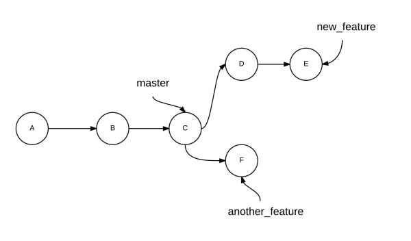
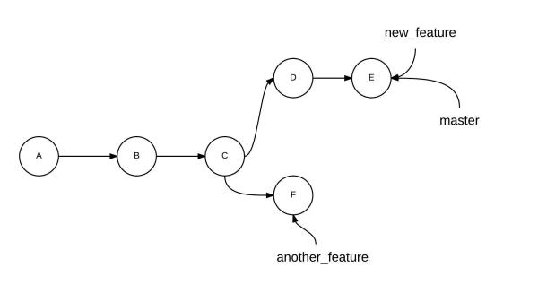
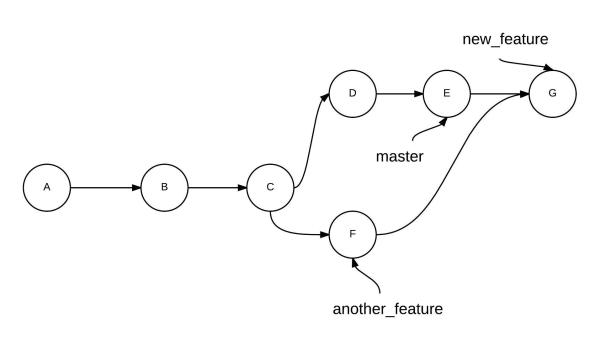
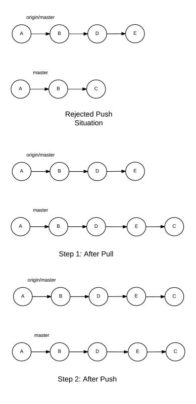
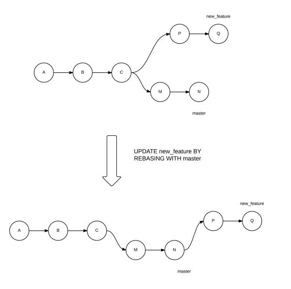
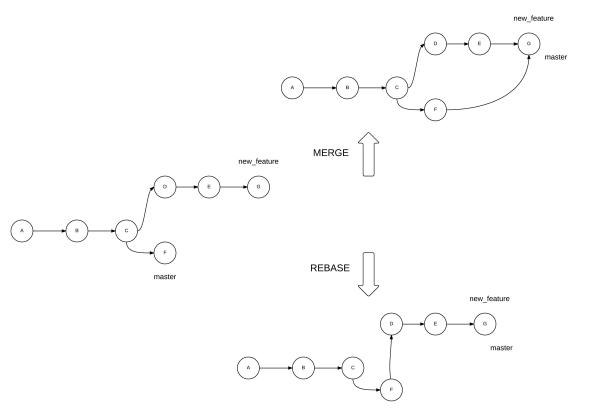

# Overview
	- Difference between VCS and DVCS.
	- What is the advantage of having a distributed VCS?
	- no single point of failure in the event of a crash or corruption
	- Principles and best practices when it comes to branching
- # Git
	- ## How Git works?
		- 
	- ## Workflow models
		- **SVN-style centralized workflow**
			- A very common Git workflow, especially from people transitioning from a centralized system. Git will not allow you to push if someone has pushed since the last time you fetched, so a centralized model where all developers push to the same server works just fine.
		- **Integration Workflow / The open-source Workflow / Fork & Pull Requests**
			- a single person who commits to the 'blessed' repository, and then a number of developers who clone from that repository, push to their own independent repositories and ask the integrator to pull in their changes. This is the type of development model you often see with open source or GitHub repositories.
		- **Dictator and Lieutenants Workflow**
			- For more massive projects, you can setup your developers similar to the way the Linux kernel is run, where people are in charge of a specific subsystem of the project ('lieutenants') and merge in all changes that have to do with that subsystem. Then another integrator (the 'dictator') can pull changes from only his/her lieutenants and push those to the 'blessed' repository that everyone then clones from again.
		- | Centralized workflow | Integration Workflow |
		  | -------------------- | -------------------- |
		  |  |  |
	- ## Advantages
		- Distributed, not centralized:
		- With Git, you have a local copy/clone of the entire repository which could be used offline. Due to this, there is no single point of failure in case of a crash or corruption. Every developer has his own copy of the repository.
		- Smaller & Faster - To save space and transfer time, the data is stored after applying compression.
		- Branching and merging is easier
		- Atomic transactions: Like SVN, transactions are atomic - ensures that the version control database is not left in a partially changed or corrupted state while an update or commit of number of unrelated changes is happening.
		- Content-Addressable file store - SHA1 hash value is generated out of the file contents to identify a file.
	- ## Basic concepts
		- Checkout vs clone, Commit Vs Push
		- Branching vs Forking
		- Branches are light-weight and merging is easy.
		- In SVN, each file & folder can come from a different revision or branch. This leads to confusion in case of a failure.
		- Workflows
		- Unlike other VCS systems, Git does not impose any particular workflow.
		- Well-suited for open source community development.
		- Git-SVN Bridge - The central repository is a Subversion repo, but developers locally work with Git and the bridge then pushes their changes to SVN.
		- Unlike SVN which creates .svn directories in every single folder, Git only creates a single .git folder.
		- Sparse checkouts.
		- Git tracks content rather than file - renaming a file, moving it to a different location
		- version control outside of source code
		- https://git.wiki.kernel.org/index.php/GitSvnComparsion
	- ## Concepts
		- *HEAD**
			- In Git,the HEAD points to the latest commit in a branch
		- *Base Commit**
			- In Git, the last common commit between two branches is called 'base commit'
		- *Conflicts**
			- When Git merges the two branches, it looks at the changes in each branch since the base commit. When there are unambiguous differences—like changes to different files, and sometimes different parts of the same file—the changes are applied. However, if there are changes to the same parts of the same file, and Git can’t determine which changes to keep, it raises a conflict.
		- *Branching**
			- When we merge branches and there are no conflicts, such as above, only the branch pathway is changed and the HEAD of the branch is updated. This is called the **fast forward type** of merge.
			- ```bash
			  git checkout master
			  git merge new_feature
			  ```
			  
			  The alternate way of merging branches is the no fast forward merge, by postfixing `--no-ff` to the merge command. In this way, a new commit is created on the base branch with the changes from the other branch.
			  
			  ```
			  git merge --no-ff new_feature
			  ```
	- ## Git Command Reference
		- `gitk` - build-in git GUI
		- `git add`
		- `git add <file_name>` - tells Git start tracking a new file or it could mean to stage the changes in an existing file
		- `git add .` - tells Git to start tracking current directory and sub-directories
		- `git ls-files --deleted | xargs git rm` - stage locally deleted files for committing
		- `git bisect` - performs a binary search through commits
		- `git blame <file_name>` - gives detailed information about each line in the file.
		- `git branch`
		- `git branch` - lists only local branch names
		- `git branch -a` - lists all branch names, both local and remote
		- `git branch -r` - lists only remote branch names
		- `git branch <branch_name>` - Creates a branch off of latest commit, but doesn't switch the local to it
		- `git branch -b <branch_name>` - Creates a branch off of latest commit and switches to it
		- `git branch -b <branch_name> <commit_id>` - Creates a branch off of given commit id
		- `git branch -m <branch_name>` - Rename current branch
		- `git branch -D <branch_name>` - deletes the branch without warning of any uncommitted files
		- `git branch -d <branch_name>` - deletes the branch with warning of any uncommitted files. To delete the remote branch, `git push <remote_name> <branch_name>`
		- `git checkout`
		- `git checkout` - change the status of files to a different branch
		- `git checkout <filename>` - revert the given file to the state during the last commit.
		- `git checkout -b <branch_name>` - create a new branch named  and switch to it
		- `git checkout -b <branch_name> upstream/<branch_name>` - create a new branch \<branch_name\> and associates it with `upstream/branch_name`.
		- `git checkout <branch_name>` - switch to a given branch
		- `git checkout -` - takes back to the previous branch (like `cd -`)
		- `git checkout -- <filename>` - replace changes in your working tree with the latest content in HEAD
		- `git checkout -b <branch_name> <tag_name>` - create a branch locally and checkout to a given tag
		- `git clone`
		- If you clone a repository, the source from which you cloned from is designated as the `origin` remote by default. You may modify the remote using the *git remote* command.
		- `git commit`
		- `git commit --amend -m 'new message'` - change the commit message of the last commit
		- `git config`
		- `git config --list --show-origin` - lists configurations and their origin files
		- `git describe`
		- `git describe --tags --abbrev=0`
		- `git describe --tags --abbrev=0 --match="beta2_ddl_*"`
		- `git diff`
		- `git diff <source_branch> <target_branch>`
		- `git fetch`
		- `git fetch` - updates the branches of the local repository from the remote *origin*. Fast-forwarding by default
		- `git fetch <remote_name>` - updates the branches of the local repository from remote.  (Following a fetch, to update your local branch you need to merge it with appropriate branch from the remote. E.g., `git merge <remote_name>/<branch_name>`)
		- `git fetch upstream refs/pull/<pull#>head:pull_<pull#>` - https://coderwall.com/p/z5rkga/github-checkout-a-pull-request-as-a-branch
		- `git fsck`
		- `git fsck --lost-found` - search for commits that aren't part of any branch
		- `git log`
		- `git log`
		- `git log -n 2` or `git log -2` - view last 2 commits only
		- `git log --all` - view commits in all branches
		- `git log --all --decorate --oneline` - decorate and one liner logs
		- `git log --all --decorate --oneline --graph` - graphical view
		- `git log --tags --simplify-by-decoration --pretty="format:%ci %d" -n5` - displays the last 5 tags created
		- `git log --after='2015-3-1' --before='2015-5-1'`
		- `git log --follow <file_name>` - trace changes in a single file.  `blame` enables you to check only the current contents of a file. The `log --follow` command, on the other hand, lists the changes the file has gone through since Git started tracking the file.
		- `git log --author='fizal'`
		- `git log --grep='search_text'` - search commit messages
		- `git merge`
		- `git merge <remote_name>/<branch_name>` - Following a fetch, to update your local branch you need to merge it with appropriate branch from the remote. This is basically merging the branch \<remote_name\>/\<branch_name\> with your current active branch.
		- `git merge --abort` - after initiating a merge that's resulted in conflicts, if you're overwhelmed and want to go back to the pre-merge state
		- `git merge --rebase master`
		- `git push`
		- `git push`
			- pushes the code in the current branch to the `origin` remote branch of the same name.
			- A branch is created if the branch with the same name as the current local branch doesn’t exist on the origin.
			- Push is rejected with an error *it is non-fast-forward* if the remote branch has been updated since your last synchronization.
		- `git push <remote_branch>` - pushes the code in the current branch to the *remote_branch*. A branch is created if the branch with the same name as the current local branch doesn't exist on the remote.
		- `git push <remote_name> <branch_name>` - remote_name* is origin/upstream
		- `git push -f origin <branch_name>` - forcefully pushes. Typically you need this after changes like squash
		- `git push <remote_name> --tags` - push by default doesn't push the tags to the remote. Adding `--tags` does that.
		- `git push <remote_name> <tag_name>` - to specifically push a tag to a remote
		- `git pull`
		- `git pull` = `git fetch + git merge`. Downloads the code from the *master* branch of the *origin* remote branch and then merges the code with the current active branch. Pulls are fast-forwarding by default.
		- `git pull <remote_name> <branch_name>` -
		- `git pull --rebase <remote_name> <branch_name>`
		- `git rebase` - merging mechanism that avoids loops in the project history.
		- `git rebase -i` - lists down all the local commits and gives you the option to *pick/reword/edit/squash/fixup/exec/drop* a commit
		- `git rebase master` - If you’re rebasing a *master* into *new_feature*, the new commits in *master* are put before the new commits in *new_feature* that are not common to *master*. Run this command from *new_feature* branch.
		- `git rebase --abort`
		- `git reflog` - log of refs
		- A **ref**, short for a reference, is a way of referencing a commit. In other words, the hash is a name, whereas a ref is a pointer.
		- Special refs - `HEAD`, `ORIG_HEAD`, `MERGE_HEAD`, `FETCH_HEAD`
		- The *reflog* command stores the records for each action you perform in your repository. When you push the changes, this data isn’t synced with the server. Using the *reflog* command is necessary if you want to review changes to your local repository. It could also be used to recover lost commits.
		- If you make a hard reset and lose a commit or two, you can safely go back to any commit you made earlier. For instance, you can run the *reflog* command, which would have a record corresponding to the time when the commit was created, mentioning the commit hash. When you know the hash, you can start a new branch based on that commit to go back to the state of that commit.
		- `git reflog expire --expire=never` - The reflog command only tracks back changes for a certain amount of time. Git is responsible for cleaning up the reflog data periodically, which by default is 90 days. This command sets the reflog to never expire.
		- `git remote`
		- `git remote -v` - List the current configured remote repository for your fork.
		- `git remote add upstream`
			- https://help.github.com/articles/configuring-a-remote-for-a-fork/
			- http://www.eqqon.com/index.php/Collaborative_Github_Workflow
			- http://blog.scottlowe.org/2015/01/27/using-fork-branch-git-workflow/
		- `git reset`
		- `git reset HEAD <file_name>` - unstage changes and reset a file to the state where the HEAD points to
		- `git reset --soft HEAD~1` - to rollback a commit
		- `git reset --hard <remote_name>/<branch_name>` - Throws away local changes and makes the working tree and index same as the remote version
		- `git rev-parse HEAD`
		- `git rm`
		- `git rm --cached <file_name>` - untracks a file without deleting from local file system
		- `git rm --cached -f <file_name>` - untracks a file and forcefully deletes from local file system
		- `git shortlog` - shows the authors who have contributed to the repository and their commits
		- `git show`
		- `git show <commit_id>` - shows information about a commit. Even partial commit ids are accepted
		- `git show 'git describe' --pretty=fuller`
		- `git stash`
		- `git stash` - to stash uncommitted changes
		- `git stash list` - list out the stashes in the local repository
		- `git stash apply` - to apply the changes that were stored in the last stash
		- `git stash apply stash@{1}` - to restore an old stash
		- `git status`
		- `git tag`
		- `git tag` - lists all the tags. There are two types of tags—*lightweight* and *annotated*. *Lightweight tags* contain only the tag name and point to a commit. *Annotated tags* contain the tag name, information about the tagger, and a message associated with the tag.
		- `git tag <tag_name>` - create lightweight tag associated with the latest commit
		- `git tag -a <tag_name> -m <commit_message>` - create annotated tag
		- `git tag 1.0.0 1b2e1d63ff` - the 1b2e1d63ff stands for the first 10 characters of the commit id you want to reference with your tag
	- ## Frequent actions
		- *Undo tracking operation*
			- Below command asks Git to untrack the file, but let it remain in the file system. Same command can be used to remove a file from the repository, but a commit is needed after this to take effect.
			- ```bash
			  git rm --cached <file_name>
			  ```
		- *Undo stage operation*
			- You make changes to a tracked file and then run `git add` to stage it for commit. To unstage the changes, run below command to reset a file to the state where the HEAD or the last commit points to.
			- ```bash
			  git reset HEAD <file_name>
			  ```
		- *Revert back to an older commit*
			- To revert back local changes and go back to the state during the last commit.
			- ```bash
			  git checkout <file_name>
			  ```
		- *Undo commit operation*
			- To rollback a commit. The `--soft` option undoes a commit, but lets the changes you made in that commit remain staged for you to review. The `HEAD~1` means that you want to go back one commit from where your current `HEAD` points.
			- ```bash
			  git reset --soft HEAD~1
			  ```
			- The process of committing involves three steps:
			  collapsed:: true
				- making changes in a file,
				- staging it for a commit, and
				- performing a commit operation.
			- The `--soft` option takes us back to just before the commit, when the changes are staged.
			- The `--mixed` option takes us back to just before the staging of the files, where the files have just been changed.
			- The `--hard` option takes us to a state even before you changed the files.
			- The `reset` command changes the history of the project, but `revert` undoes the changes made by the faulty commit by creating a new commit that reverses the changes.
		- *Undo push operation*
			- To revert the changes pushed to the central repository
			- ```bash
			  git revert HEAD~1
			  git push origin master
			  ```
			- However, if you also want the other commit(s) to vanish from the remote repository, you first need to go for a `reset` command—deleting the unwanted commit—and then push the changes to the remote. If you perform a normal `git push`, the push will be rejected—because the origin HEAD is at a more advanced position than your local branch. Therefore, you need to force the change with a postfix, `-f`, which forces the push on the remote origin:
			- ```bash
			  git reset --hard HEAD~2
			  git push -f origin master
			  ```
		- *Merging Branches*
			- To merge branch `new_feature` with branch `master`
			- | |  |
			- ```bash
			  git checkout master
			  git merge new_feature
			  ```
			- To merge branch `another_feature` with branch `new_feature`
			- ```bash
			  git checkout new_feature
			  git merge another_feature
			  ```
			- | Merge  | Rebase |
			- |  |  |
		- *Hard fetch*
			- To drop all your local changes and commits, fetch the latest history from the server and point your local master branch at it like this
			- ```bash
			  git fetch origin
			  git reset --hard <branch>
			  ```
		- *Rebase*
			- `git rebase master` - If you’re rebasing a *master* into *new_feature*, the new commits in *master* are put before the new commits in *new_feature* that are not common to master. To do so, run the following command from the *new_feature* branch
			- `git merge --rebase master` - If you’re working in a team, you should first checkout to *master*, pull from the upstream branch to update your *master* with the latest commits, and then switch back to *new_feature* before running the above command.
			-
			- 
			- 
			- `git pull --rebase origin master` - When you’re pulling changes, you can use rebase too. It essentially puts the new commits in the master of the remote in your history, and then superimposes your commits on them.
			- `git rebase -i` or `git rebase --interactive`
			- A squash operation changes the history of your branch. If you need to push your changes after a squash operation, you need to use the -f option, or your push will be rejected.
			- When you have multiple commits in your PR, run rebase so that the change is merged as a single commit.
			- Here are the steps to do it:
			- ```bash
			  git commit -m "commmit 1"
			  git commit -m "commmit 2"
			  git commit -m "commmit 3"
			  git push origin develop
			  git fetch upstream develop # fetch the latest changes from upstream
			   in editor, mark 1st commit as 'pick' and rest as 'squash'. This squashes all the above commits into a single commit
			  git rebase -i upstream/develop
			  git push origin develop -f
			  ```
			- To cancel a rebase in progress before pushing: `git rebase abort`
		- *Cherry picking**
			- create a branch based off of a commit
			- ```bash
			  git fetch upstream
			  git log
			  git checkout -b <new_branch_name> <remote_branch_name>
			  git cherry-pick <commit_id>
			  ```
		- *Diff**
			- Show unpushed commits: `git log origin/develop..HEAD`
			- To list the files modified between 'origin/develop' and my current branch: `git log --stat origin/develop..HEAD`
			- To list the files modified between 2 branches: `git log --stat origin/develop..origin/feature/JIRA-123`
	- ## Advanced Concepts
		- ### Content-Addressable Names
			- The Git object store is organized and implemented as a content-addressable storage system. Specifically, each object in the object store has a unique name produced by applying SHA1 to the contents of the object, yielding an SHA1 hash value. Because the complete contents of an object contribute to the hash value and the hash value is believed to be effectively unique to that particular content, the SHA1 hash is a sufficient index or name for that object in the object database. Any tiny change to a file causes the SHA1 hash to change, causing the new version of the file to be indexed separately. SHA1 values are 160-bit values that are usually represented as a 40-digit hexadecimal number, such as `9da581d910c9c4ac93557ca4859e767f5caf5169`. Sometimes, during display, SHA1 values are abbreviated to a smaller, unique prefix. Git users speak of SHA1, hash code, and sometimes object ID interchangeably.
			- An important characteristic of the SHA1 hash computation is that it always computes the same ID for identical content, regardless of where that content is. In other words, the same file content in different directories and even on different machines yields the exact same SHA1 hash ID. Thus, the SHA1 hash ID of a file is an effective globally unique identifier. A powerful corollary is that files or blobs of arbitrary size can be compared for equality across the Internet by merely comparing their SHA1 identifiers.
		- ### Pack files
			- Efficient file storage mechanism. If you were to just change or add one line to a file, Git might store the complete, newer version and then take note of the one line change as a delta and store that in the pack too.
			- The main points I like about DVCS are those :
			  collapsed:: true
				- You can commit broken things. It doesn't matter because other peoples won't see them until you publish. Publish time is different of commit time.
				- Because of this you can commit more often.
				- You can merge complete functionality. This functionality will have its own branch. All commits of this branch will be related to this functionality. You can do it with a CVCS however with DVCS its the default.
				- You can search your history (find when a function changed )
				- You can undo a pull if someone screw up the main repository, you don't need to fix the errors. Just clear the merge.
				- When you need a source control in any directory do : `git init` . and you can commit, undoing changes, etc...
				- It's fast (even on Windows )