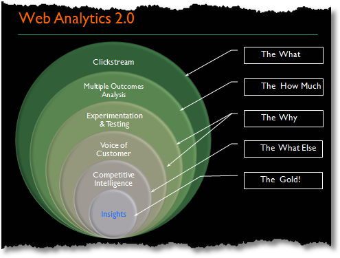
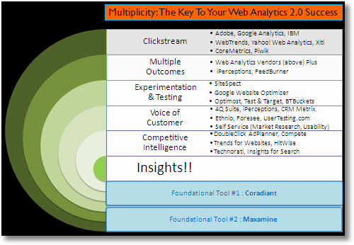

# Concepts
background-color:: yellow
collapsed:: true
	- __What is a Web Tag?__
		- A web tag is a `1x1` pixel-sized image beacon or JavaScript snippet that is embedded into the code of a web page to capture and report data. A web tag is triggered whenever a predetermined action occurs on a specified platform in the web. It captures the data and sends the information back to your preferred data collection system.
		- A web tag is usually implemented to: track online user behavior for marketing analytics, instruct web browsers and implemented technologies to collect data, to set cookies and to integrate third-party content.
- # Web Analytics 1.0
  background-color:: yellow
  collapsed:: true
	- Web analytics evolution
		- Web server logs parsing -> WebTrends
		- Javascript Tags
		- Site overlay or Click Density
			- display where visitors clicked
			- segments based on where users came from
	- __Traditional Analytics KPI Metrics__
		- Page views
			- frustrating navigation means more page view, but no buy
			- better naviation means faster decision, and yet no buy
		- Hits
			- Pages with images & media has more hits to the server
			- With CDNs, servers receive lesser hits
			- `more hits != more visitors`
		- Top Exit Pages
			- Top Exit Pages does not mean pages are suboptimal or product is bad
			- Exit rates doesn't tell content is good or bad
		- Website Engagement
			- `Engagement = # of sessions / # of visitors`
			- Repeated visitors means they can't find what they want or the site is good?
		- Visitor screen resolution
			- Seldom this data changes. Instead of wasting time and money capturing this, use Forrestor Research/Gartner data
	- Traditional KPI can't accommodate for strategic business goals. We now have __KIA__ (_Key Insight Analysis_)
	- __KIA__ (_Key Insight Analysis_)
		- Click Density Analysis
			- using the site overlay feature, it helps you walk in the shoes of your customer
			- segment your traffic and personalize content differently for visitors from Google vs. Facebook, increasing the customer engagement
		- Visitor Primary Purpose
			- ask customers why they are visiting your site
			- run a survey, do phone interviews, etc.
		- Task Completion Rates
			- Page views != users found what they were looking for
			- Do survey, lab usability, create tests, ...
		- Segmented Visitor Trends
			- old world embedded attributes in JS tags
			- new tools = Click Tracks, Visual Sciences
			- Reports on "Average time on site", "Top search keywords", "popular content"- based on real segmentation of data.
		- Multichannel Impact Analysis
			- Measuring the impact of non-web channels (like TV, newspaper) on your website
			- e.g. how many people use your site but buy your product via retail or phone channel?
- # Web Analytics 2.0
  background-color:: yellow
  collapsed:: true
	- | Web Analytics 2.0 | Multiplicity |
	  | -- | -- | 
	  |  |  |
	- Quantitative, Qualitative, Competetive analytics
	- Paradox of Data
		- Lack of data -> cannot make complete decisions
		- Lots of data -> less insights
	- __Multiplicity__
		- one tool from each layer/pillar for better insights
		- 1. Clickstream data (WHAT)
			- click-level data
			- visits, visitors, source, time on site, page views, etc.
			- great at answering "WHAT", but not "WHY"
			- e.g, tools like WebTrends, Google Analytics
		- 2. Multiple Outcome Analysis (HOW MUCH)
			- measuring outcome means connecting customer behavior to the bottom line of the company
			- outcome types of a webiste
				- increased revenue
				- reduced cost
				- improve customer satisfaction/loyalty
		- 3. Experimentation and Testing (WHY)
			- Launch fast, fail/succeed fast `Experiment or Die`
			- A/B and multivariate testing
			- Tools: Google Website Optimizer, Adobe Analytics Target
		- 4. Voice of Customer (WHY)
			- What customers wanted, but did not find
			- e.g., surveys, lab usability testing, remote usability testing, card sorts, etc.
		- 5. Competitive Intelligence (WHAT ELSE)
			- compare your performance with your competitors
			- gether info on your direct and indirect competitors
		- > Knowing how you are performing is good; Knowing how your competitors are performing is priceless.
		- Maxamine/ObservePoint
			- missing JavaScript tags, duplicative content, security & privacy compliance, black holes not crawled by search engine, broken links/forms.
		- Coradiant
			- Why conversion rates are low? Pages are slow or missing?
- # Tag Management Overview
  background-color:: yellow
  collapsed:: true
	- > Source: https://www.semrush.com/blog/beginners-guide-to-google-tag-manager/
	- ==Tag Manager== is a tool that enables to create, store and manage marketing tags. e.g., [Google Tag Manager (GTM)](https://tagmanager.google.com/#/home), Ensighten, Adobe Launch, Tealium, etc.
	- ==Marketing Tags== are small snippets of code that track user actions and collect data. Marketing and Support Platforms use them to integrate with sites and apps.
		- A tag is triggered by a user event. (e.g., by clicking a link or loading a page)
		- Few tag examples:
			- *Google Analytics* tag is used to collect data on website visitors. In this case, Google tag allows to send data from your site to Google Analytics.
			- Google Ads Conversion scripts
			- Meta pixel
			- Pinterest tag
			- Salesforce
			- Custom events and tracking
	- ==Why Tag Manager?==
	  background-color:: purple
	  collapsed:: true
		- 1) Without a Tag Manager like GTM, app developers need to specifically code to integrate their website with each Marketing tool like Facebook, Instagram, Google Analytics, etc.
		- 2) With every addition and code change, you risk forgetting about, losing, or breaking tags (or other website elements). Tag Managers mitigate these issues by allowing you to install, manage, and deploy marketing tags from within its software instead of in your website code.
		- 3) Tag manager injects code snippets and marketing tags into your website code only when necessary.
		- Here is an example to explicit add Google tag
		- 
	- ==Events==
	  collapsed:: true
		- Tag Manager allows you to to track almost any kind of event or user behavior you can think of.
		- Few popular events
			- Link clicks
			- Button clicks
			- Form submissions
			- Conversions
			- Shopping cart abandonment
			- Adding items to cart
			- Removing items from cart
			- File downloads
			- Scroll behavior
			- Video views
			- Call to action (CTA) performance
			- Table of contents (TOC) clicks
			- Custom events
	- ==How Tag Manager works?==
		- Tag Manager works by using a single JavaScript code snippet (e.g., *`bootstrap.js` with Ensighten)* that you add to your site as a container for all the tags you want to manage.
		- When a user triggers a tag (e.g., by clicking a link or loading a page), TM retrieves it and injects it into your website code.
		- Then, TM executes the tag. In other words, TM only injects and executes a tag when a user triggers one. This reduces the overall amount of code on a website and minimizes the risk of implementation errors.
		- Tags work with other components called **triggers** and **variables** to determine when to execute code snippets.
		- 
		  collapsed:: true
		  {{renderer :mermaid_wvntxaduk}}
			- ```mermaid
			  sequenceDiagram
			      Browser->>+AppServer: load my website
			      AppServer->>-Browser: response with tracking script (bootstrap.js)
			      Browser->>+TagManager: user event triggers a tag
			      TagManager->>-Browser: injects a snippet of code and executes it
			      Browser-->>+AnalyticsTools: receives user data
			  ```
	- ==Triggers==
	  collapsed:: true
		- Triggers are instructions for when tags should fire. You need to assign a trigger to every tag so Tag Manager knows under what circumstances to fire the tag.
		- When each tag’s specified event occurs, its trigger tells the tag to fire. Otherwise, that tag will not fire. And TM won’t execute the code snippet.
		- Examples
			- **Page view**: To track the analytics from every page a user visits, Analytics platforms like Google Analytics typically use page views as a trigger.
			- **Add to cart**: User placing an item in their cart might trigger a *conversion tracking tag*.
			- Form submissions
			- Link clicks
			- Button clicks
			- Form submissions
			- Scroll depth
			- Time spent on page
			- Custom event
		- Trigger Filters
			- You can also add filters to triggers to specify when you want tags to fire.
			- e.g., you may only want your support chat to fire on pages in the checkout funnel. In this case, you could add a filter that tells the tag to only fire on page views of pages with `/checkout/` in the URL.
	- ==Variables==
	  collapsed:: true
		- Variables are additional pieces of information that GTM may need to fire a tag or trigger. They help define precisely what the tag or trigger is supposed to do.
		- e.g., “[Constant](https://www.simoahava.com/analytics/variable-guide-google-tag-manager/#:~:text=The%20Constant%20variable%20returns%20the,type%20in%20the%20Value%20field.&text=The%20obvious%20use%20case%20is,create%20a%20new%20GA%20tag.)” and “Google Analytics Settings” are common variables. They are both typically used to define Google Analytics account IDs.
		- Every time you create a Google Analytics tag, you need to enter your tracking ID. This can get tedious, as most of us don’t memorize these IDs. Instead, you can create a variable that simply stores your ID. Then, whenever you create a new tag that requires this information, you simply attach the variable you created.
		- Few examples
			- Constant
			- Google Analytics Settings
			- Click URL
			- Click ID
			- Click Class
			- Page URL
			- Form ID
			- Scroll depth threshold
	- ==Data Layer==
		- A data layer is a JavaScript variable or object that holds all the information you want to collect in some other tool, like a web analytics tool. e.g., `digitalData` in case of Ensighten (W3C standard)
		- Say *Acme Ltd.* wants to integrate with Google Analytics, Facebook and Bing. It doesn’t integrate with them directly but integrates with a Tag Management System that handles the integration with these systems
		- [What is a data layer and what is a tag management system](https://medium.com/analytics-and-data/what-is-a-data-layer-what-is-a-tag-management-system-f717dacb1216)
		- 
		- **Types of Data Layer**
			- ==Customer Experience Digital Data Layer (CEDDL)==
				- (*aforementioned `digitalData`*)
				- CEDDL Spec - [W3C Customer Experience Digital Data Layer 1.0 Specification](https://www.w3.org/2013/12/ceddl-201312.pdf)
			- ==Event Driven Data Layer (EDDL)==
				- a data layer that is constructed and transmitted to your TMS by events
				- https://www.pedromonjo.com/2022/07/eddl.html
				- [Jim Gordon's Event driven data layer](https://jimalytics.com/tag-management/the-event-driven-data-layer/)
	- ## Types of Tagging
	  background-color:: pink
		- ### Client-side Tagging
		  background-color:: pink
			- {:height 40, :width 587}
			- Example
				- ```html
				  <head>
				    	<script type="text/javascript" src="https://www.tiaa.org/public/js/tms/V2Prod-Tiaa/Bootstrap.js"></script>
				  	<script>
				  		(function () {
				  			var userInfo = {
				  				loggedInUser: {userId: '100010176494', userType: 'PARTICIPANT', clientId: ''},
				  				effectiveUser: {userId: '', userType: ''},
				  				impersonatingUser: {userId: '', userType: ''}
				  			};
				  			var profile = [{
				  				profileInfo: {userInfo: userInfo, address: {}, social: {}, attributes: {}}
				  			}];
				  			digitalData.user.push({profile: profile});
				  			digitalData.page.attributes.p13n = {georegion : "275",country_code : "US",region_code : "NC",city : "CHARLOTTE",dma : "517",msa : "1520",areacode : "704+910",county : "MECKLENBURG",fips : "37119",lat : "35.2287",long : "-80.8458",timezone : "EST",zip : "28201-28224+28226-28237+28241-28244+28246-28247+28250+28253-28256+28258+28260+28262-28263+28265-28266+28269-28275+28277-28278+28280-28282+28284-28285+28287-28290+28296-28297+28299",continent : "NA",throughput : "vhigh",bw : "5000",asnum : "2923",location_id : "0"};
				  		})();
				  	</script>
				  </head>
				  ```
		- ### Server-side Tagging
		  background-color:: pink
			- > Source: https://developers.google.com/tag-platform/tag-manager/server-side/intro
			  {:height 365, :width 746}
- # Ensighten
  background-color:: yellow
  collapsed:: true
	- Ensighten overview - https://confluence.techopscloud.com/display/IDAE/Ensighten+Overview
		- https://confluence.techopscloud.com/display/IDAE/Account+Home-+Retirement+Account+user+type-Identification
	- ==Bootstrap.js==
		- This is a sample bootstrap.js loaded in Account Home page https://www.tiaa.org/public/js/tms/V2Prod-Tiaa/Bootstrap.js
		- > Due to the size of the JS content, only a portion of it is shown here
		- ```js
		      var ensightenOptions = {
		          client: "tiaa-cref",
		          clientId: 157,
		          publishPath: "V2Prod-Tiaa",
		          isPublic: 0,
		          serverComponentLocation: "nexus.ensighten.tiaa.org/tiaa-cref/V2Prod-Tiaa/serverComponent.php",
		          staticJavascriptPath: "nexus.ensighten.tiaa.org/tiaa-cref/V2Prod-Tiaa/code/",
		          ns: 'Bootstrapper',
		          nexus: "nexus.ensighten.tiaa.org",
		          scUseCacheBuster: "true",
		          enableTagAuditBeacon: "false",
		          enablePagePerfBeacon: "false",
		          registryNs: "ensBootstraps",
		          generatedOn: "Sun Jul 16 02:31:17 GMT 2023",
		          beaconSamplingSeedValue: 11
		      };
		  ```
	- Digital Data
		- This is a sample `digitalData` from `<head>` section of Account Home page
		- ```html
		  <script>
		  		digitalData={
		  			applicationName: "",
		  			application: {
		  				name: "",
		  				type: "mpa"
		  			},
		  			pageInstanceID:'',
		  			session:{sessionId:''},
		  			view: [],
		  			event: [],
		  			error: [],
		  			page:{
		  				pageInfo:{},
		  				category:{},
		  				attributes:{
		  					tags: {},
		  					startTime:new Date().getTime(),
		  					paths: {
		  						rootUrl: '/private/accounthome',
		  						sharedComponentsUrl: 'https://www.tiaa.org/public/ui/scv2',
		  						generateMODkeyUrl: 'https://shared.tiaa.org/private/partaccounts/utils/getmodkey'
		  					}
		  				}
		  			},
		  			user:[],
		  			component:[
		  				{componentInfo:{componentID:'Ensighten'}},
		  				{componentInfo:{
		  					componentID:'PDS',
		  					activate:true,
		  					channel:'sandbox',
		  					action:'POST',
		  					url:{domain:'https://shared.tiaa.org/private/myt-api/ext-personalization-data-store-rs-v1/',path:'track'}}},
		  				{componentInfo: {
		  					componentID:'F2',
		  					libraryURL:'/private/accounthome/assets/js/f2.js',
		  					domainURL:'/private/accounthome'}}]
		  		};
		  		(function () {
		  			var sessionId = "";
		  			digitalData.session.sessionId = sessionId ? sessionId : "";
		  		})();
		  	</script>
		  ```
- # Open questions
  background-color:: yellow
  collapsed:: true
	- Can I get access to Ensighten for learning purposes?
	- Are we considering SST?
	- Check access to Adobe Analytics and Google Analytics ([link to request accces](https://confluence.techopscloud.com/display/IDAE/Job+Aids))
	- Meeting
		- Who injects the tracking script and how?
		- CEDDL polling frequency?
		- Calling custom API via EEDL
		- Passing additional attributes
		- RAS on GTM or Ensighten?
- # References
  
  * Books
    * Web Analytics - An hour a day - Avinash Kaushik
    * Web Analytics 2.0 - Avinash Kaushik
	- Event Data Layer https://www.pedromonjo.com/2022/07/eddl.html - explains why CEDDL isn't good especially for SPAs