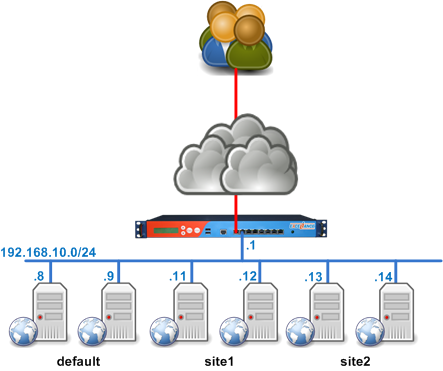

# Load Balancers
collapsed:: true
	- 
	- ## Overview
		- From a physical point of view, it can be plugged anywhere in the architecture:
			- in a DMZ
			- in the server LAN
			- as front of the servers, acting as the default gateway
			- far away in an other separated datacenter
	- ## Why load balancers?
	  collapsed:: true
		- HTTP is not a connected protocol and is stateless
		- When there are multiple app servers, the user may potentially hit a different server for every request and a different session on every server.
		- Possible solutions are
			- 1. Use a ***clustered web application server*** where the session are available for all the servers
				- Pros
				- Cons
					- Only certain products like Weblogic, Tomcat, JBoss, allow to create a cluster
					- very complex to set up and maintain
			- 2. ***Sharing user’s session information*** in a database or a file system on application servers
				- Pros
					- simple to share session via DB or shared file system
				- Cons
			- 3. Use IP level information to maintain ***affinity*** between a user and a server
				- An easy way to maintain affinity between a user and a server is to use user’s IP address: this is called ***Source IP affinity***.
				- Pros
				- Cons
					- works only if a user use a single IP address or never change his IP address during the session.
					- wouldn't work for multiple users who are behind a single proxy
			- 4. Use application layer information to maintain ***persistance*** between a user and a server
				-  Store the user information details in a _Session Cookie_, either set by the load-balancer itself or using one set up by the application server.
				- Pros
				- Cons
	- ## Affinity vs. Persistence
	  collapsed:: true
		- __Affinity__: this is when we use an information from a layer below the application layer to maintain a client request to a single server
		- __Persistence__: this is when we use Application layer information to stick a client to a single server
		- sticky session: a ___sticky session___ is a session maintained by persistence
		- The main advantage of the persistence over affinity is that it’s much more accurate, but sometimes, persistence is not doable, so we must rely on affinity.
		- Using persistence, we mean that we’re 100% sure that a user will get redirected to a single server.
		- Using affinity, we mean that the user may be redirected to the same server
	- ## Load Balancer Types
	  collapsed:: true
		- ### 1. Hardware load balancer (Level 4 load-balancers)
			- Layer 4 (transport level). e.g.,: TCP and UDP protocols are transport level.
			- A layer 4 load-balancer takes routing decision based on IPs and TCP or UDP ports.
			- It has a packet view of the traffic exchanged between the client and a server which means it takes decisions packet by packet.
			- The layer 4 connection is established between the client and the server.
			- It is really fast but can’t perform any action on the protocol above layer 4.
			- The fastest layer4 load-balancers uses an ASIC to take routing decision.
			- Example: F5 BIG-IP, Citrix Netscaler, etc.
			- Expensive
		- ### 2. Software load balancer (Level 7 load-balancers)
			- Layer 7 (application level) e.g.,: HTTP, FTP, SMTP, DNS protocols are application level.
			- A layer 7 load-balancer takes routing decision based on IPs, TCP or UDP ports or any information it can get from the application protocol (mainly HTTP).
			- The layer 7 load-balancer acts as a proxy, which means it maintains two TCP connections: one with the client and one with the server.
			- The packets are re-assembled then the load-balancer can take a routing decision based on information it can find in the application requests or responses.
			- Even if this kind of processing seems slow, it is not that much: less than the millisecond.
			- Cheaper
	- ## Hardware load balancer architectures
	  collapsed:: true
		- ### 1. NAT or routed mode
		- ### 2. Direct server return or Gateway mode
		- ### 3. IP Tunnel mode
	- ## Software load balancer architectures
	  collapsed:: true
		- ### 1. Proxy mode
		- ### 2. Transport proxy mode
- # References
	- haproxy.com/blog