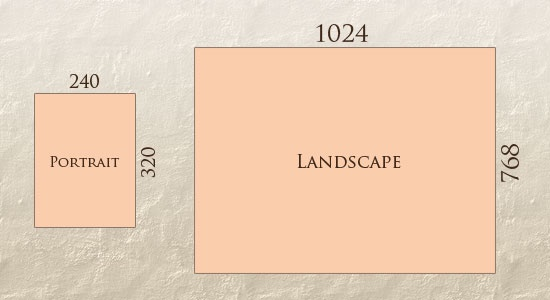

# Architecture Styles
background-color:: yellow
collapsed:: true
	- ## Micro Frontends
	  background-color:: pink
	  collapsed:: true
		- [[Micro Frontend]]
	- ## Single Page App (SPA)
	  background-color:: pink
	  collapsed:: true
		- Single-page applications (SPAs) consist of a single or a few JavaScript files that encapsulate the entire frontend application, usually downloaded up front. When the web servers or the content delivery network (CDN) serves the HTML index page, the SPA loads the JavaScript, CSS, and any additional files needed for displaying any part of our application.
		- Pros
			- client downloads the application code just once, at the beginning of its life cycle, and the entire application logic is then available up front for the entire user’s session.
		- Cons
			- Downloading all the app logic in one-go
				- First time load time could be longer
				- potential memory leaks when not implemented properly
				- failures in low end devices like smart TV or set-top-box
			- SEO - web crawlers won’t have an easy job indexing all the contents served by an SPA unless we prepare alternative ways for fetching it. Usually, when we want to provide better indexing for an SPA, we tend to create a custom experience strictly for the crawler. For instance, Netflix lowers its geofencing mechanism when the user-agent requesting its web application is identified as a crawler rather than serving content similar to what a user would watch based on the country specified in the URL.
	- ## Progressive Web App (PWA)
	  background-color:: pink
	  collapsed:: true
		- **Service workers**
			- ==Cache First/Offline First Pattern==
				- Using service workers, we can now create our caching strategy for a web application, with native APIs available inside the browsers. This pattern is called **offline first**, or **cache first**,
				- If a resource is cached and available offline, return it first before trying to download it from the server.
				- If it isn’t in the cache already, download it and cache it for future usage.
	- ## Isomorphic applications
	  background-color:: pink
	  collapsed:: true
		- Isomorphic or universal applications are web applications where the code between server and client is shared and can run in both contexts. It is particularly beneficial for the time to interaction, A/B testing, and SEO.
		- These web applications share code between server and client, allowing the server, for instance, to render the page requested by the browser, retrieve the data to display from the database or from a microservice, aggregate it, and then prerender it with the template system used for generating the view in order to serve to the client a page that doesn’t need additional round trips for requesting data to display.
		- Because the page requested is prerendered on the server side and is partially or fully interpreted on the backend, the time to interaction is enhanced. This avoids a lot of round trips on the frontend, so we won’t need to load additional resources (vendors, application code, etc.), and the browser can interpret a static page with almost everything inside.
		- Pros
			- improved SEO since the page is rendered in the server
			- A/B testing - because you can prerender on the server the specific experiment you want to serve to a specific user.
		- Cons
			- for high traffic apps, scalability could be an issue. If the responses are highly cacheable, then using CDN could help avoid hitting the server for each request.
	- ## Jamstack (JS, APIs, Markup)
	  background-color:: pink
		- Jamstack is intended to be a modern architecture to help create fast and secure sites and dynamic apps with JavaScript/APIs and prerendered markup, served without web servers.
		- The artifact can be served directly by a CDN since the application doesn’t require any server-side technology to work.
		- One of the simplest ways for serving a Jamstack application is using [GitHub pages](https://pages.github.com/) for hosting the final result.
		- In this category, we can find popular solutions like [Gatsby.js](https://www.gatsbyjs.org/), [Next.js](https://nextjs.org/), or [Nuxt.js](https://nuxtjs.org/).
	- ## Backend For Frontend (BFF)
	  background-color:: pink
		- TBD
- ## Angular vs. React
  background-color:: yellow
  collapsed:: true
	- | **Factors** | Angular | React | 
	  | --- | ---| --- |
	  | Type | Framework | Library |
	  | MVC | Supports M, V, C | Supports only V |
	  | State Management | Built-in | Redux library needed. Global state for all components |
	  | Routing | Built-in | React Router library |
	  | API calls | Built-in | Helmet library |
	  | Form validation | Built-in | Not supported |
	  | Dependency Injection | Built-in | Not supported |
	  | Data Binding | Bi-directional. Many watchers are created automatically by Ng | Unidirectional. No watchers |
	  | Language | TS or JS | JSX |
	  | Change Rendering | Real DOM | Virtual DOM |
	  | Design System | Built-in Material Design toolset | Material-UI library needed. |
	  | Server side rendering | Angular Universal | Next.js |
	  | Mobile development | React Native / Cordova / Flutter | Ionic / NativeScript |
- ## Responsive Web Design
  background-color:: yellow
  collapsed:: true
	- https://www.smashingmagazine.com/2011/01/guidelines-for-responsive-web-design/
	- **Why?**
		- Avoid web designing for each device separately. More devices are coming out every year in different sizes and resolutions. It is not practical to design for each one of them separately. The same device can switch from portrait to landscape mode.
	- **What?**
		- Achieving adjustable screen resolutions, adjustable screen sizes by using practices like
			- flexible grids and layouts,
			- flexible images
				- The **maximum width** of the image is set to 100% of the screen or browser width, so when that 100% becomes narrower, so does the image.
				- ```css
				  img { max-width: 100%; }
				  ```
			- intelligent use of CSS media queries, etc.
		- | {:height 308, :width 550} |  |
	- Viewport
		- The viewport is the user's visible area of a web page.
		- HTML 5 introduced `<meta>` tag to control the viewport
			- ```html
			  <meta name="viewport" content="width=device-width, initial-scale=1.0">
			  ```