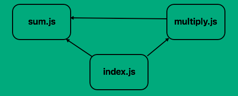
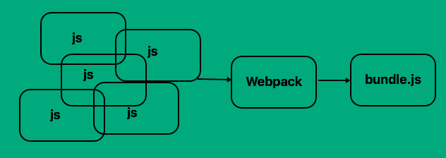

# Concepts
background-color:: yellow
collapsed:: true
	- ==Polyfills/shims vs. Transpiling==
		- Transpiling
			- Transpiling = Transformation + Compiling
			- Newer features that cannot be polyfilled will fail in the old JS engines. Transpiler transforms code with newer syntax into older code equivalents.
			- Transpiler operates at the build phase of the development before it reaches the runtime interpreter
			- Why transpile
				- write more readable code in latest syntax
				- transpiling only to older browsers, while serving the newer syntax to latest browsers
			- Well-known transpilers: [Babel](https://babeljs.io/), [Traceur](https://github.com/google/traceur-compiler)
			- Example
			  collapsed:: true
				- ES2015 added a new syntactical feature of default parameter value
				- ```js
				  function myFunc(a = 5){
				      console.log(a);
				  }
				    
				  myFunc(96); // Logs 96.
				  myFunc();  // Logs 5 as default.
				  ```
				- But this syntax will not get recognized in pre-ES2015 engines. Thus after transpiling, we will get the older equivalent as the following:
				- ```js
				  function myFunc()
				  {
				      // Using Ternary Operator to assign default 5 if undefined.
				      var a = (arguments[0] !== undefined) ? arguments[0] : 5;
				      console.log(a);
				  }
				    
				  myFunc(96); // Logs 96.
				  myFunc(); // Logs 5 as default.
				  ```
		- Polyfills
			- A polyfill/shim is a technique to bring newer features of JS to the older browsers that don't support them directly.
			- Polyfill operates at runtime in the interpreter, such as the user browser or on the server.
			- Instead of creating a custom polyfill, developers use the ones already available. e.g., [ES5 Shim](https://github.com/es-shims/es5-shim), [ES6 Shim](https://github.com/es-shims/es6-shim)
			- Example for polyfill
			  collapsed:: true
				- ```js Example
				  if (!Number.isNaN) { // if isNaN() is not found
				      // Define explicitly for older browsers.
				      Number.isNaN = function isNaN(x) {
				          return x !== x;
				      };
				  }
				  ```
	- ==Web Components==
	  background-color:: blue
		- creating framework-agnostic web components using standard HTML via custom elements [link](https://laurence-do.medium.com/web-components-and-stencil-js-b8e7dbf4dce0)
		- The web components specification offers a way to create reusable custom HTML elements with three inbuilt technologies. These are 3 standards to build web components:
			- Custom elements
			- Shadow DOM
			- and HTML templates
		- Custom Elements
			- for creating custom tags like `<card>`, `<blah>`, etc.
			- Resources: [link1](https://web.dev/custom-elements-v1/)
		- Shadow DOMs
			- Shadow DOM allows you to create an isolated custom element that doesn’t clash with the other parts of the webpage. For example, `document.querySelector()` won’t return nodes defined in a shadow DOM.
			- the most useful feature of shadow DOM is "*scoped CSS*":
				- CSS selectors from the outer page don't apply inside your component.
				- Styles defined inside don't bleed out. They're scoped to the host element.
			- *CSS selectors used inside shadow DOM apply locally to your component*. In practice, this means we can use common id/class names again, without worrying about conflicts elsewhere on the page. Simpler CSS selectors are a best practice inside Shadow DOM. They're also good for performance.
			- Resources: [link1](https://web.dev/shadowdom-v1/), [link2](https://glazkov.com/2011/01/14/what-the-heck-is-shadow-dom/)
		- HTML Templates
			- to define an HTML template where the dynamic values are injected
		- Web Component Lifecycle Methods
			- `constructor()` - called when a custom element is created
			- `connectedCallback()` - called when an element is added to the DOM
			- `disconnectedCallback()` - called when an element is removed from the DOM
			- `attributeChanged()` - called when an attributed is added/removed/modified
		- Source code examples
			- https://codepen.io/shalithasuranga/pen/XWPpNbx
		- Resources
			- [WebComponents.org](https://www.webcomponents.org/)
			- [Web Components vs. React Components](https://blog.logrocket.com/web-components-vs-react)
			- Libraries to build web components easily
				- Framework-agnostic: [Lit.dev](https://lit.dev/), [StencilJS](https://stenciljs.com/), [Polymer](https://www.polymer-project.org/), etc.
				- Framework-centric
					- React: [Material UI](https://mui.com), [React Bootstrap](https://react-bootstrap.github.io/components/alerts/)
					- Angular: ???
			- Google's [Material Design](https://m3.material.io/get-started) is a design system. [Material Web](https://m3.material.io/develop/web) is the web component library implementing this design. There are other component libs for Flutter and Android mobile UIs as well.
	- ==JS libraries==
		- [StencilJS](https://stenciljs.com/): compiles Typescript and JSX to HTML web components
		- [Emotions.sh](https://emotion.sh/docs/introduction): to write CSS inside JS in a framework-agnostic way
		- [JSX](https://www.w3schools.com/react/react_jsx.asp): Stands for JavaScript XML. allows to write HTML elements inside JS and place them in DOM without `createElement()` and/or `appendChild()`
			- Without JSX
				- ```
				  const myElement = React.createElement('h1', {}, 'I do not use JSX!');
				  ```
			- With JSX
				- ```
				  const myElement = <h1>I Love JSX!</h1>;
				  ```
	- ==DOM==
		- How DOM works
			- DOM APIs allow very fast DOM operations. However, when the app data changes and triggers an update, re-rendering can be expensive.
			- When an element in the real DOM is changed, the DOM will re-render the element and all of its children. When it comes to building complex web applications with a lot of interactivity and state changes, this approach is slow and inefficient.
		- Shadow DOM vs. Virtual DOM
			- Shadow DOMs
				- Shadow DOM is a tool for implementing Web Components. It provides a way to isolate components, including styles from the actual DOM. Therefore, it does not show up in the global DOM.
				- allows scoping of CSS, where styles are created within a shadow DOM element and stay within the scope of the shadow DOM.
				- increases application performance, since DOM manipulation does not need to render the entire DOM but only the shadow DOM. This reduces the time required to render.
			- [Virtual DOMs](https://blog.logrocket.com/virtual-dom-react)
				- Virtual DOM is a concept used by JS libraries like React and Vue.js
				- In Virtual DOM, React takes a copy of the real DOM in memory. When the virtual DOM is updated, it compares the pre-change snapshot of the vDOM with the post-change version. Determines what element was changed, and then updates only that element in the real DOM. This is one method the virtual DOM employs to optimize performance.
				- The virtual DOM abstracts manual DOM manipulations away from the developer, helping us to write more predictable and unruffled code so that we can focus on creating components.
		- ==Web Storages==
			-
	- ==Storages==
		- Client-side Storages
			- Links
				- [How Web Storage Works](https://www.freecodecamp.org/news/how-web-storage-works/)
				- [Chrome Web Storage and Quota concepts](https://docs.google.com/document/d/19QemRTdIxYaJ4gkHYf2WWBNPbpuZQDNMpUVf8dQxj4U/preview#heading=h.qw95tbh7r3a3)
			- Web Storage
				- Local storage
					- Key-value pairs - limited to only strings
					- Max memory = 5 MB
					- Retained after browser restart
					- not accessible from web workers or service workers
					- synchronous and will block the main thread - can potential cause performance issues
					- ```js
					  const scores = [10, 8, 6, 3, 9] 
					  localStorage.setItem('scores', scores) 
					  localStorage // output >> {scores: '10, 8, 6, 3, 9', length: 1}
					  ```
				- Session storage
					- Key-value pairs - limited to only strings
					- Max memory = 5 MB
					- Lost after browser restart - scoped to the lifetime of the tab -
					- not accessible from web workers or service workers
					- suited for storing sensitive details like authentication info
					- synchronous and will block the main thread - can potential cause performance issues
					- ```js
					  sessionStorage // access the session storage 
					  sessionStorage.setItem('name', 'John') // add name to session storage with value john 
					  sessionStorage.getItem('name') // get the name item from session storage sessionStorage.removeItem('name') // remove name item from the session storage sessionStorage.clear() // clear the session storage
					  ```
			- Cookies
				- Limited to only strings
				- not accessible from web workers or service workers
				- Cookies are sent with every HTTP request
			- File System API
				- The File System API and FileWriter API provide methods for reading and writing files to a sandboxed file system. While it is asynchronous, it is not recommended because it is only available in Chromium-based browsers.
			- File System Access API
				- allows creating/editing files on local system, if the user provides permission.
			- WebSQL
				- should NOT be used. Migrate to IndexedDB
			- Application Cache
				- should NOT be used. Migrate to service workers and Cache API
			- IndexedDB Storage ([link](https://www.codemag.com/article/1411041/Introduction-to-IndexedDB-The-In-Browser-Database), [Working with IndexedDB](https://web.dev/indexeddb/))
				- NoSQL db - supports transactions, indexes, cursors - can store files/blobs also
				- Each DB is unique to an origin - it cannot access or accessed by other origin
				- ```js
				  const dbPromise = indexedDB.open('test-db-1', 1);
				  ```
				- [browser-level](https://github.com/Level/browser-level) is a database backed by IndexedDB
			- Cached Storage API
		- Server-side Storages
		  collapsed:: true
			- LevelDB ([link](https://shangzeyuan.com/blog/system_overview_leveldb/))
				- on-disk, fast key-value store from Google - based on the implementation of BigTable
				- keys and values can be any byte-array, not just strings
					- supports atomic operations
				- does not support SQL and indexes
			- PouchDB ([link](https://pouchdb.com/))
				- JS implementation of CouchDB - created to emulate CouchDB while running in the browser or in Node.JS
				- PouchDB and CouchDB share the same *sync protocol* hence can sync data.
				-
	- ==Package/Module Bundlers==
		- Webpack
			- [Webpack Tutorial](https://blog.ag-grid.com/webpack-tutorial-understanding-how-it-works/), [Module Bundlers Explained - YouTube](https://www.youtube.com/watch?v=5IG4UmULyoA&t=382s&ab_channel=Fireship)
			- Why Webpack?
				- Problem statement
					- HTML imports JS files using 1 or more `<script>` tags. When multiple JS files are imported, the order of import is important if they depend on each other. For instance, like this example below. When the app grows, managing these dependencies manually is hard.
						- 
					- Download multiple JS files is also I/O intensive and cause latencies in page loading.
					- Also, to allow a function in a JS file to be used by another JS file, it is generally scoped as 'global' which isn't secure. To avoid this modules were invented.
				- Modularization
					- Webpack convert JS dependencies into modules (which has a much tighter scope) and manage dependencies automatically
					- Webpack pulls in the dependent modules at the right time, in the correct scope
					- *CommonJS* construct `module.exports` is used to export functions or variables to other code. Exported values are imported in other JS files using `require`.
				- Bundling
					- Webpack can bundle all our dependencies into a single file so that it can be efficiently downloaded.
					- 
			- Configuration options (`webpack.common.js`)
				- **Exports** / `module.exports`
					- Defines the `entry` (first TS or JS file to execute), `output` (bundle output dir and file name)
				- **Loaders**
					- Loaders process files that aren't JavaScript. They can be TypeScript files, CSS, SCSS, etc.
					- Webpack understands only JS ES5. To make it understand ES2016/ES6, we need to configure loaders to pre-process these languages/versions into ES5. Here are few examples:
						- babel-loader: converts ES2015 syntax JS files to ES5
						- css-loader: takes a CSS file and loads the file content
						- style-loader: takes CSS data from imports and adds them to HTML document.
				- **Plugins**
					- Loaders are used for pre-processing data before it’s output into our bundle. Plugins however can keep output from appearing in our bundle.
			- Popular webpack features
				- **Code splitting**
					- allows you to split your code into various bundles which can then be loaded on demand or in parallel. resulting in smaller initial bundle sizes and faster load times.
				- **Tree shaking**
					- a term commonly used in the JavaScript context for dead-code elimination. Determine which exports of a dynamically imported module is used, and tree shake the unused exports from that module.
				- **Shared bundles/Deduplication**
					- When multiple parts of the application depend on the same common modules, they are automatically deduplicated into a separate bundle. This allows commonly used dependencies to be loaded in parallel with your application code and cached separately by the browser. For example, if your application has multiple pages with `<script>` tags that depend on the same common modules, those modules will be split out into a "shared bundle”. This way, if a user navigates from one page to another, they only need to download the new code for that page, and not the common dependencies between the pages.
				- **Cache busting** [[link](https://javascript.plainenglish.io/what-is-cache-busting-55366b3ac022)]
					- Server resources (js, css, images) are loaded in browser and cached for performance reasons. However, when the server content changes, it is hard to refresh the cached version in the browser.
					- Webpack provides a method of templating the filenames using bracketed strings called **substitutions**. The `[contenthash]` substitution will add a unique hash based on the content of an asset. When the asset's content changes, `[contenthash]` will change as well. e.g., `main.7e2c49a622975ebd9b7e.js` - as you can see the bundle's name now reflects its content (via the hash).
				- Chunk loading
				- Prefetching
					- Following code embedded in the `<head>` will instruct the browser to prefetch the JS file in *idle time* expecting this resource to be used in the future
					- ```html
					  <link rel="prefetch" href="login-modal-chunk.js">
					  ```
				-
		- Parcel
		- Rollup
- # Node.js
  background-color:: yellow
  collapsed:: true
	- Node.js has 2 module systems
		- [Modules](https://www.freecodecamp.org/news/modules-in-javascript/)
		- CommonJS modules (`.cjs` file extension)
			- CommonJS is JS module specification. It is a project with the goal to establish conventions on the module ecosystem for JavaScript outside of the web browser.
			- widely used in server-side programming with Node.js. It is also used in browser-side JS, but the code must be packaged with a transpiler since the browsers don't support CommonJS.
			- ```js
			  // two.cjs
			  function addTwo(num){
			    return num + 2;
			  }
			  module.exports = { addTwo };
			  ```
			- ```js app.cjs
			  // app.cjs
			  const a = require("./two.cjs");
			  
			  console.log(a.addTwo(4));
			  ```
		- ECMAScript modules (`.mjs` file extension)
			- ECMAScript modules (ES6 modules aka ES2015 modules) is another JS module specification.
			- ```js
			  // two.mjs
			  function addTwo(num) {
			    return num + 2;
			  }
			  
			  export { addTwo };
			  ```
			- ```js
			  // app.mjs
			  import { addTwo } from './two.mjs';
			  
			  console.log(addTwo(4));
			  ```
- # References
  background-color:: yellow
  collapsed:: true
	- Best JS learning sites
		- https://javascript.info/
		- https://frontendmasters.com/
	- Best UI related Blogs
		- https://blog.logrocket.com
		- https://www.angulararchitects.io/en/blog/
		- [A List Apart](https://alistapart.com/topics/)
		- [State of JS](https://stateofjs.com/en-us/)
		- [JavaScript Weekly Newsletter](https://javascriptweekly.com/)
		- [Smashing Magazine](https://www.smashingmagazine.com/)
	- Online code editors
		- https://codepen.io/
		- https://codesandbox.io/
		-